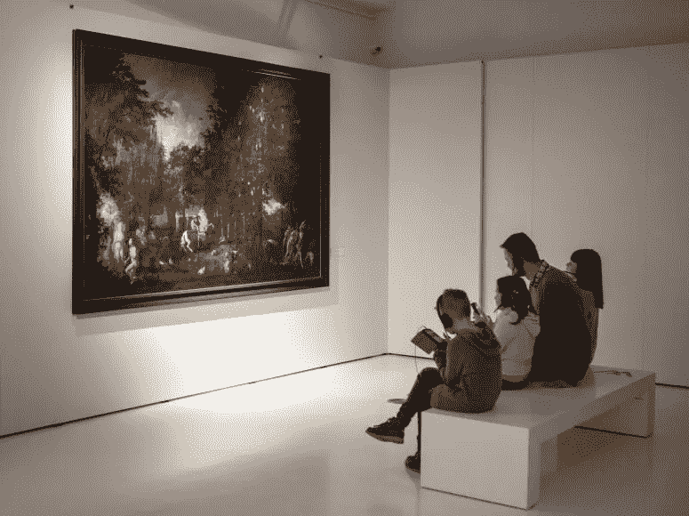
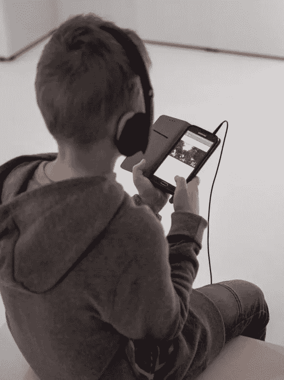

# 应用人工智能在博物馆提供互动体验

> 原文：<https://pub.towardsai.net/using-ai-to-deliver-an-interactive-experience-at-the-museum-79d925f71def?source=collection_archive---------1----------------------->

照片:Magdalena wyupek/弗罗茨瓦夫国家博物馆

## [新闻](https://towardsai.net/p/category/news)，[科技](https://towardsai.net/p/category/technology)

## 波兰弗罗茨瓦夫的一家博物馆如何利用 IBM Watson 的力量理解参观者提出的问题，并用波兰语提供相关答案。

IBM 和波兰弗罗茨瓦夫国家博物馆[刚刚宣布启动一项合作，使用 IBM Watson 使参观者能够与迈克尔威尔曼的画作“天堂”互动，该画作是临时展览“威尔曼”的一部分。一百多件艺术作品](https://mnwr.pl/en/category/branches/the-four-domes-pavilion/)

照片:Magdalena wyupek/弗罗茨瓦夫国家博物馆

多亏了一个人工智能应用程序，参观[博物馆](https://mnwr.pl/en/category/branches/the-four-domes-pavilion/)的游客可以直接询问关于图像的问题，并通过耳机立即获得完美的答案。

这种观众与杰作之间的创新互动形式代表了世界上其他几个博物馆已经探索过的趋势。

弗罗茨瓦夫博物馆只是世界上几个使用 IBM Watson 的人工智能增强博物馆用户体验的博物馆之一。

博物馆和 IBM 之间这种互动的最初想法诞生于 2017 年 4 月的巴西，当时 IBM 在圣保罗 Pinacoteca 开展了由 Ogilvy Brasil 创建的项目' [A Voz da Arte](https://mnwr.pl/en/category/branches/the-four-domes-pavilion/) '，该项目应用了认知计算，使博物馆的参观更加互动和个性化。

当时，IBM 创造了一个认知助手，它可以回答游客关于 Pinacoteca 收藏的七件艺术品的问题。IBM Watson 技术的导览对公众开放。

这一举措的波兰版本是 IBM 专家和弗罗茨瓦夫国家博物馆艺术史学家与弗罗茨瓦夫美术学院的讲师和学生之间三年多合作的结晶。

人工智能代表了一种享受博物馆、与艺术品互动以及实时了解博物馆的新方式。

最终的目标是让游客在结束参观时，对特定的艺术品有更多的了解，有了这种体验，博物馆会变得有趣。

人工智能已经应用于我们生活的每个领域和这样一个技术世界。博物馆不能被抛在后面，尤其是在像弗罗茨瓦夫这样一个创新和开放的城市，我从 2016 年起就快乐地生活在这里。

几年前，当我在 IBM工作的时候，我有机会在这个项目的最开始做出我的一点贡献，我对此感到非常自豪……当然，我也很高兴参观博览会的人们将最终享受到以人为中心的人工智能所能提供的创新用户体验，即使是在博物馆。