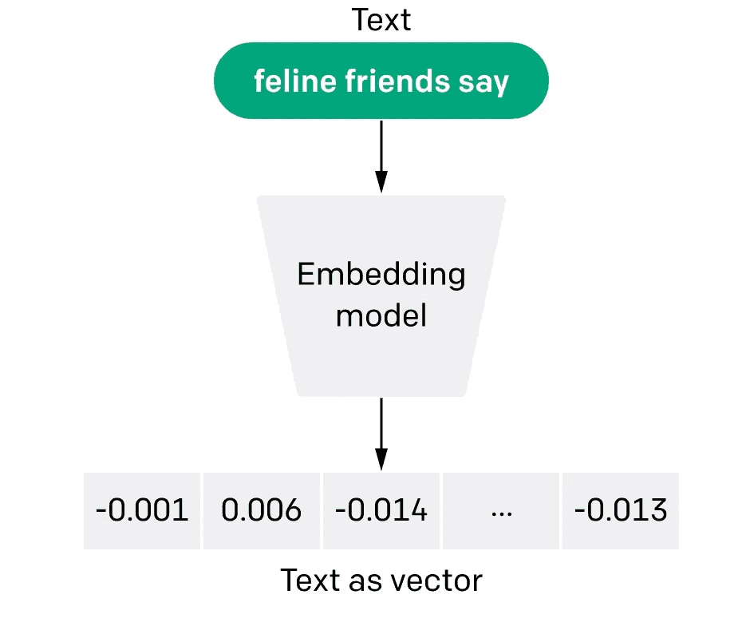
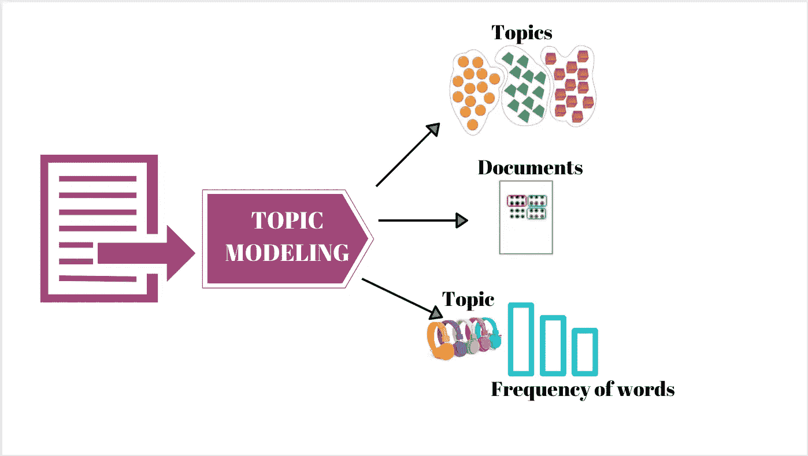
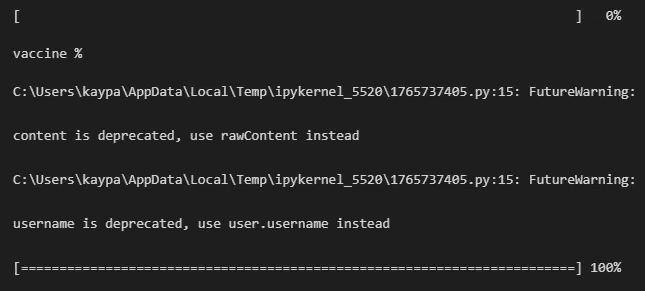
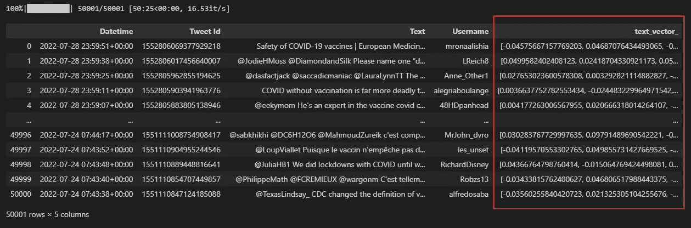
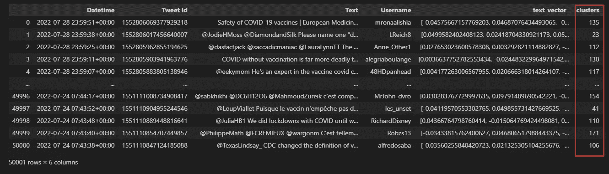

# 用人工智能实现基于向量的主题建模技术

> 原文：<https://pub.towardsai.net/using-ai-to-implement-vector-based-technology-in-topic-modeling-9bed21ed3432?source=collection_archive---------1----------------------->

# 介绍

在这篇文章中，我们将分析我们从 Twitter 上搜集的 5 万条与 Covid 相关的推文，使用 AI 提取世界各地人们争论的主要话题。

对于如此大量的非结构化数据，我们需要数周时间来读取和分类您的数据。然而，如果我们正确地知道如何使用最先进的 NLP 模型，这个庞大的任务可能是小菜一碟。

为了完成这项任务，我们将使用称为**编码器**的模型，以及一种允许我们以自动方式将相似主题分组在一起的方法，称为**主题建模**。

# **文本编码**

在开始直接处理我们的代码之前，我们将首先解释它背后的逻辑。我们将要用来执行这项任务的主要技术叫做编码，或者矢量化。通过使用称为嵌入的模型，我们能够将纯文本转换为属于高维空间(数百维)的几何坐标。

此图片检索自:[https://open ai . com/blog/introducing-text-and-code-embedding/](https://openai.com/blog/introducing-text-and-code-embeddings/)

空间中的每个点代表一段文字。编码器的价值在于它可以将具有相似含义的文本放置在更近的空间中。有了这个独特的工具，我们就可以应用机器学习技术将数据分组为共同的趋势。

# **什么是主题建模，为什么重要？**

主题建模是一种算法，当应用于纯文本时，能够提取语料库中讨论的主要主题。一旦我们对所有的推文进行了矢量化，并且在我们的高维笛卡尔平面中有 50.000 个点，我们就可以使用聚类技术对它们进行分组。

每组点都有相似的含义，因此有相似的主题。我们可以将 50，000 个样本分成几百个独立的组。通过从每个组中提取最常见的关键字，我们将能够用相应的主题来标记每个单独的组。

此图片来自:[https://nkoenig06.github.io/gd-tm-lda.html](https://nkoenig06.github.io/gd-tm-lda.html)

# **手头上！**在这个项目中，我们要涵盖 4 个部分:

1.  **网页抓取:**

我们将首先在 6 个月内收集 5 万条关于新冠肺炎疫苗接种的推文作为样本语料。我们将使用的 Python 库叫做`snscrape`。

仅供参考:[https://github.com/JustAnotherArchivist/snscrape](https://github.com/JustAnotherArchivist/snscrape)

scraper.py 的输出

在这个样本语料库中，我们只保存了两条信息:发布推文的时间和推文的文本。

**2。编码:**

现在我们继续这个项目的亮点！我们也可以称这部分为编码，因为我们将文本数据转换为数字数据。我们将使用的 Python 库叫做`SentenceTransformer`，它可以帮助我们实现几个预先训练好的编码模型。我们使用的来自`SentenceTransformer`的预训练模型是`all-MiniLM-L6-v2`，它将为每条推文创建 768 个维度。这个模型是健壮和快速的。要查看关于`SentenceTransformer`预训练模型的更多详情，请查看[https://www.sbert.net/docs/pretrained_models.html](https://www.sbert.net/docs/pretrained_models.html)了解更多信息。

注意:不要忘记添加一个额外的列来存储数据集的文本向量。

encoder.py 的输出

**3。聚类:**

您可能已经熟悉了集群。我们将从 scikit-learn Python 库中导入`KMeans`。然后我们可以定义我们的语料库需要多少个聚类。根据经验，在超过 10，000 个样本的情况下，我们将把数据分成 200 个组。

clustering.py 的输出

**4。可视化:**

一旦我们完成了数据聚类。我们希望将结果可视化，并看看我们的聚类模型如何将推文分组到不同的主题中。然而，我们必须将可视化之前的维度从 768 维减少到 2 维，这样我们就可以理解我们作为人类 **s** 的聚类的可视化。我们用于降维的降维算法是`umap`。

仅供参考:[https://umap-learn.readthedocs.io/en/latest/](https://umap-learn.readthedocs.io/en/latest/)

下面是我们如何通过使用`matplotlib.plotly` **生成一个二维彩色图来可视化我们的聚类。**

参考消息:[https://www . active state . com/blog/plotting-data-in-python-matplotlib-vs-plotly/](https://www.activestate.com/blog/plotting-data-in-python-matplotlib-vs-plotly/)

visualization.py 的输出

正如你在我们漂亮的图表中看到的，我们的 5 万条推文在一个二维平面上用 200 种颜色分成 200 组。该图将使用相同的颜色表示同一主题下的推文。

# **结论**

由于我们通过扫描文本中的相似性、词的频率和模式对语料库进行了聚类，因此我们可以很容易地理解当人们讨论新冠肺炎疫苗接种时最流行的趋势是什么。使用该算法可以提取的见解将证明对公共卫生行业和需要持续监控数据的政府是有价值的。