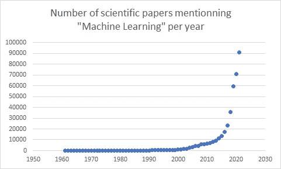
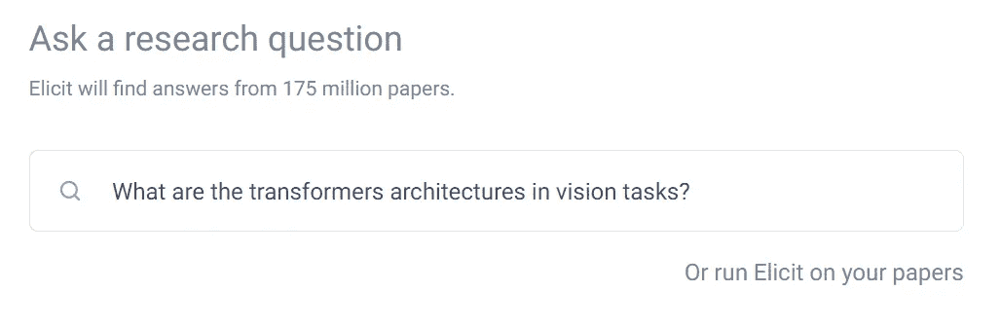
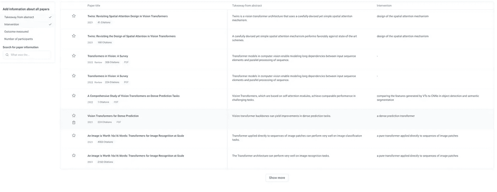
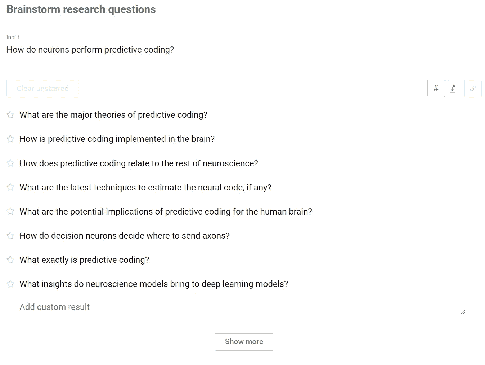
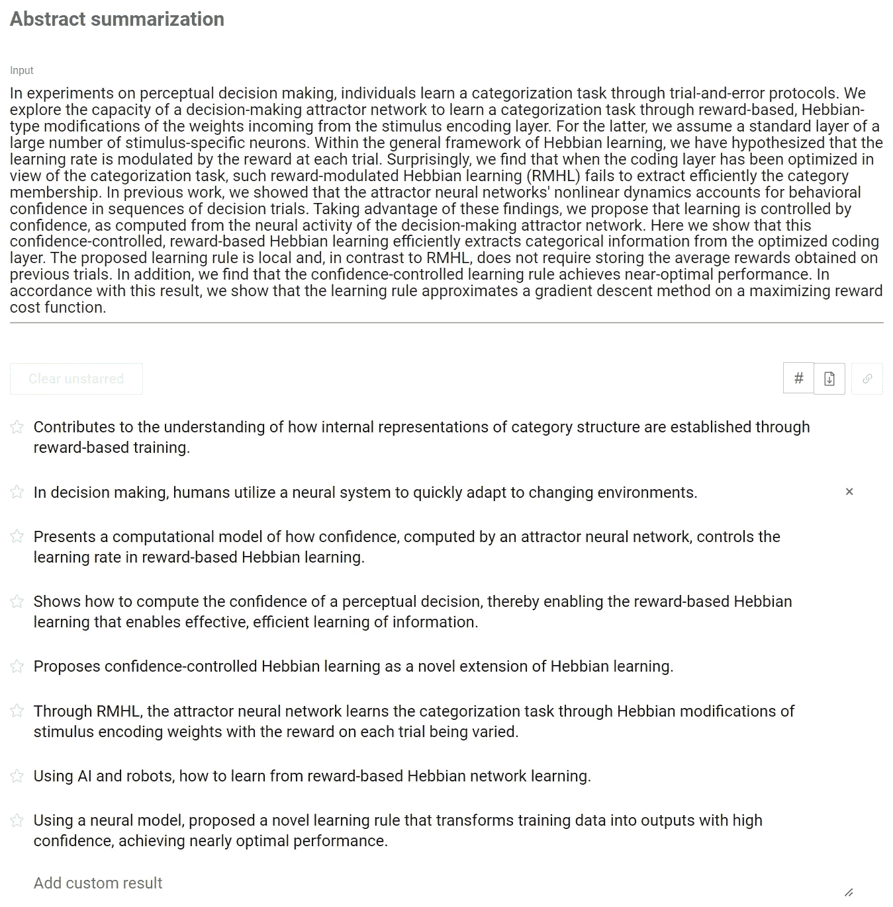

# 利用人工智能提高你的文献综述

> 原文：<https://pub.towardsai.net/using-ai-to-improve-your-literature-review-bb2d53348778?source=collection_archive---------0----------------------->

图片由 [Unsplash](https://unsplash.com/photos/HH4WBGNyltc) 上的 [Jaredd Craig](https://unsplash.com/@jareddc) 拍摄

在过去的二十年里，发表的科学论文数量呈指数级增长。仅 2021 年，提及“机器学习”的论文就大于 9000 篇。对于学术研究人员、行业专家，甚至数据科学爱好者来说，跟踪相关出版物或投入到一个新主题中是一个真正的挑战。

多年来提及“机器学习”的科学论文数量

几个月前，一个非盈利研究实验室，[应该](https://ought.org/)，发布了自由软件，他们称之为在 https://elicit.org/**[的**研究助手**。该算法建立在语言模型上，如 GPT-3，并显示与您编写的查询相关的论文。它已经针对研究问题和学术论文进行了调整，以增加结果的相关性。几个月来，我一直在我的日常学术研究中使用它，该团队一直在定期改进其功能。我将描述一般的工作流程以及如何有效地使用一些功能。](https://elicit.org/)**

# **引出的一般工作流程**

**第一步是问一个像这样的研究问题:**

****

**关于[https://elicit.org/](https://elicit.org/)的查询示例**

**该查询将导致根据语言模型显示前 8 个最相关的论文。GPT-3 模型的一个有趣的特点是，即使相关论文与关键词不匹配，它也会找到，因为它使用了单词之间的相似性度量。一旦论文被选中，exocate 将会提供更多关于它们的信息:摘要的摘要，研究类型的描述，PDF，等等。对于结果中的每一篇论文，摘要都要根据你的提示进行总结。因此，根据你的问题，你可以对论文的相关性有一个简单的概述。**

****

**前一个查询的前 8 个结果**

**最后，打开报纸会让你深入了解可能的评论、外卖和出版物…所有这些信息都是使用 GPT-3 类似的模型生成的，这些模型经过微调，并根据特定的指令进行提示。**

# **充分利用引出**

## **获得文献的简要概述**

**使用语言模型来生成关于论文的信息使 exit 能够在大量领域中筛选结果:**

*   **随机对照试验**
*   **荟萃分析**
*   **不同类型的评论**

**因此，结果表给你一个直接的概述，哪些论文与你的想法相关，而不必在文本中寻找信息。**

# **社区任务**

**到目前为止，我已经描述了“文献综述”任务下的引出工作流。该模型的目标是为论文中的研究问题提供答案。除了这个预定义的任务之外，用户还可以创建可供所有人使用的任务。这扩大了使用 exocate 可以回答的研究问题的范围，使其成为文献综述的必要工具。这里有几个我最喜欢的任务，可以用来帮助你找到相关的科学论文:**

****头脑风暴任务****

**比方说，你心中有一个主题或研究方向。如何找到正确的问题以获得相关的结果并不总是一件容易的事情。*头脑风暴任务*帮助你解决这个问题，因为你提供一个话题或一个研究问题，引出将返回相关的问题或一种新的方式来阐述这个问题，如下例所示。**

****

**https://elicit.org/[上的头脑风暴任务](https://elicit.org/)**

****摘要摘要****

**搜索文献综述时提供摘要的模型可用于执行*摘要任务*。当提供科学摘要时，它将返回一组总结摘要的句子(见下文)。**

****

**[https://elicit.org/](https://elicit.org/)上的摘要汇总任务**

**我喜欢这个任务有两个主要原因:**

*   **你可以用它来确保你的摘要传达了你想要的论点。**
*   **只要把摘要复制到模型中，你就可以得到任何论文的简要概述。**

# **最后的想法**

**总之，exocate 是一个人工智能支持的研究助手，它将扫描科学文献来回答你的问题。从一个很窄的问题到一个笼统的话题，总会得到相关的结果。到目前为止，摘要的摘要是我最喜欢的功能，因为它可以有效地过滤相关和不相关的科学论文。如果你找不到你想要的具体任务，总有可能自己设计！**