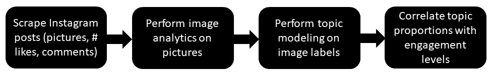
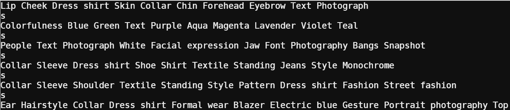
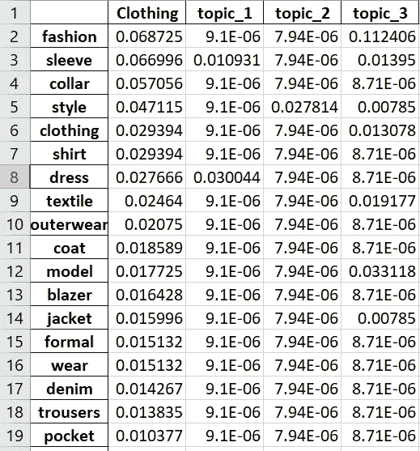
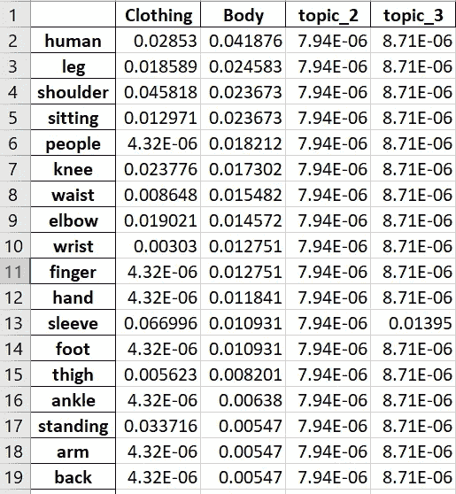
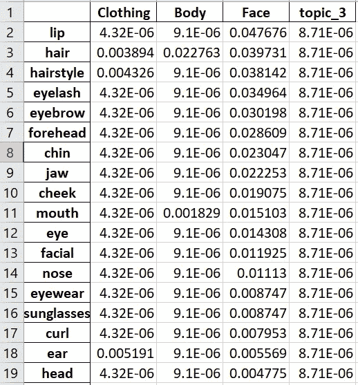
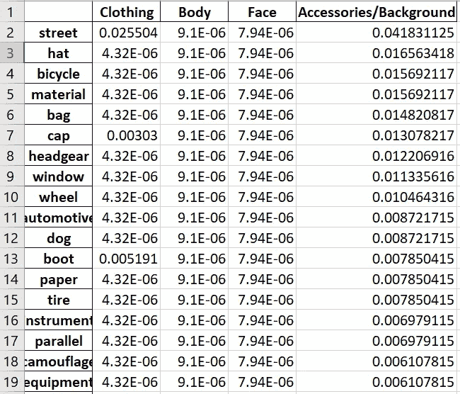
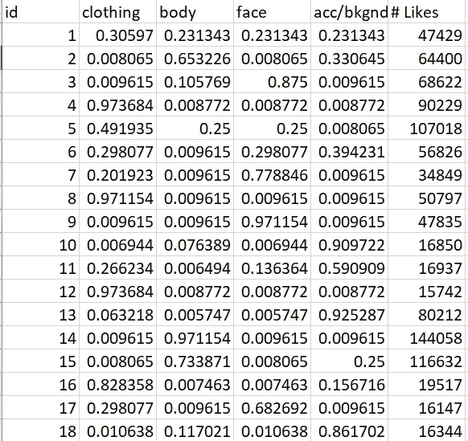
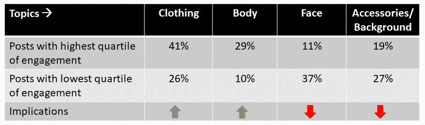

# 使用计算机视觉和主题建模增加 Instagram 上的品牌参与度

> 原文：<https://pub.towardsai.net/using-computer-vision-and-topic-modeling-to-increase-brand-engagement-on-instagram-the-case-of-ff40a891b659?source=collection_archive---------3----------------------->

## [计算机视觉](https://towardsai.net/p/category/computer-vision)，[编程](https://towardsai.net/p/category/programming)


照片由[乔治·帕甘三世](https://unsplash.com/@gpthree?utm_source=medium&utm_medium=referral)在 [Unsplash](https://unsplash.com?utm_source=medium&utm_medium=referral) 拍摄

由德克萨斯州奥斯汀西湖高中的 Aadit Barua[和 Josh Barua](https://medium.com/u/ad2f68e48b8f?source=post_page-----ff40a891b659--------------------------------)[撰写。](https://medium.com/u/d86df2a42e5a?source=post_page-----ff40a891b659--------------------------------)

参与度是一种稀缺商品，每个品牌都在 Instagram 这样的在线平台上争夺。我们如何利用机器学习来帮助一个品牌提高其在 Instagram 上的参与度？什么类型的图片会吸引注意力和参与度？为了回答这个问题，我们使用计算机视觉(又名图像分析)和主题建模来确定哪些主题或话题与吸引注意力的图片相关联。我们研究 Zara，一个销售流行服装和配饰的著名西班牙时尚品牌，作为我们分析的用例。我们问一个简单但重要的问题:Zara 的 Instagram 帖子中的哪些话题增加或减少了参与度？

我们的分析流程图如图 1 所示。首先，我们收集 Instagram 帖子，包括帖子中图片的 URL 以及赞和评论的数量，这可以作为参与度的代表。然后我们用谷歌计算机视觉获取描述每张图片内容的标签。随后，我们在标签上执行主题建模，以识别每个帖子中的主要主题及其比例。最后，我们分析了高参与度和低参与度帖子中主题比例的差异。



图 1:我们方法的流程图

**刮 Instagram 帖子**

我们用的 Instagram 刮刀如下图。我们很难一次收到 500 多个帖子。此外，虽然出于情感分析的目的获得实际评论很好，但当我们试图获取评论时，却被 Instagram 阻止了。也许可以使用带有动态 IP 地址的 VPN 来解决这个问题，但是我们继续使用赞数作为参与度的代理。在我们的数据集中，一个帖子的平均点赞数、最小点赞数和最大点赞数分别为 65k、15k 和 293k。标准偏差为 45k。

```
#!/usr/bin/python3.6
import instaloader
import  time
import  pandas as pd
from datetime import datetime
from itertools import dropwhile, takewhileL = instaloader.Instaloader()
df=pd.DataFrame()
posts = instaloader.Profile.from_username(L.context, 'zara').get_posts()
i=0
for post in posts:
    df = df.append({'Caption': post.caption, 'Likes': post.likes, 'URL': post.url  }, ignore_index=True)
    df.to_excel("zara.xlsx",index=False)
    i = i+1
    if i>500:
        break
print("Written to zara.xlsx file")
```

**计算机视觉拯救人类**

使用卷积神经网络的计算机视觉使我们能够自动计算出图片的内容。访问谷歌云计算机视觉服务的代码如下所示。请注意，您需要使用 Google cloud 创建一个帐户，并获取您的凭据文件，我们在下面的代码中将其留空。

```
#!/usr/bin/python3.6
# pip3.6 install --user google-cloud
# pip3.6 install --user google-cloud-vision
# conda install -c conda-forge google-cloud-visionimport xlrd
from google.cloud import vision
import os
import pandas as pdApplication_Credentials = "insert your own credentials file from google vision"
os.environ["GOOGLE_APPLICATION_CREDENTIALS"] = Application_Credentials
client = vision.ImageAnnotatorClient()
image = vision.types.Image()loc = ("insert path to excel file w/ photo links")
wb = xlrd.open_workbook(loc)
sheet = wb.sheet_by_index(0)
sheet.cell_value(0, 0)
df = pd.DataFrame()
# loop through every url, retreive the image and send to google vision
for i in range(sheet.nrows):
    image_src_temp = sheet.cell_value(i, 0)
    image.source.image_uri = image_src_temp
    response = client.label_detection(image=image)
    labels = response.label_annotations
    l = []
    for label in labels:
        l.append(label.description)
    s = ' '.join(l)
    print("--")
    print(s)
    df = df.append({'URL': image_src_temp, 'Labels': s}, ignore_index=True)
df.to_excel("insert path to save location",index=False)
```

表 1 显示了 Zara insta gram 帖子的 Google cloud vision 服务的示例输出。每一行都显示了谷歌为我们从 Zara 的 Instagram 页面抓取的图片 URL 创建的标签。



表 1:谷歌计算机视觉的样本输出

**个别词语还是话题？**

我们可以直接使用来自 vision analytics 的单词(标签)来找出哪些单词与高参与度和低参与度相关联。为此，我们将简单地计算帖子中每个词的 tf-idf 得分，并检查与高参与度和低参与度帖子相关联的高值。但是处理单个单词会适得其反，因为它们不能给我们提供一个高层次的视角来判断什么有用，什么没用。因此，我们求助于主题建模来找出 Zara 发布的图片中的主导主题。我们使用了潜在的狄利克雷分配(LDA)方法。LDA 代码如下所示。

```
#!/usr/bin/python3.6
#pip3.6 install --user lda
import os, csv, nltk, lda
import pandas as pd
import numpy as np
from nltk.tokenize import PunktSentenceTokenizer, RegexpTokenizer
from nltk.corpus import stopwords
from nltk.stem import WordNetLemmatizer
from scipy import sparse
from sklearn.feature_extraction.text import TfidfVectorizer
from sklearn.metrics.pairwise import cosine_similarity
from sklearn.feature_extraction.text import CountVectorizerfrom nltk.tokenize import PunktSentenceTokenizer,RegexpTokenizer
from nltk.corpus import stopwords
from nltk.stem import WordNetLemmatizer
import time        
start_time = time.time()nltk.download('stopwords')
nltk.download('punkt')
nltk.download('wordnet')
reviews_df=pd.read_excel("zara_labels.xlsx",encoding='utf8', errors='ignore')#checking for nulls if present any
print("Number of rows with any of the empty columns:")
print(reviews_df.isnull().sum().sum())
reviews_df=reviews_df.dropna()id_name = input('column name for id: ')
text_review = input('column name for text: ')
ntopics= input('number of latent topics: ');word_tokenizer=RegexpTokenizer(r'\w+')
wordnet_lemmatizer = WordNetLemmatizer()
stopwords_nltk=set(stopwords.words('english'))def tokenize_text(version_desc):
    lowercase=version_desc.lower()
    text = wordnet_lemmatizer.lemmatize(lowercase)
    tokens = word_tokenizer.tokenize(text)
    return tokensvec_words = CountVectorizer(tokenizer=tokenize_text,stop_words=stopwords_nltk,decode_error='ignore')
total_features_words = vec_words.fit_transform(reviews_df[text_review])print(total_features_words.shape)model = lda.LDA(n_topics=int(ntopics), n_iter=1000, random_state=1)
model.fit(total_features_words)topic_word = model.topic_word_
doc_topic=model.doc_topic_
doc_topic=pd.DataFrame(doc_topic)
reviews_df=reviews_df.join(doc_topic)
document_topic_dist=pd.DataFrame()for i in range(int(ntopics)):
    topic="topic_"+str(i)
    document_topic_dist[topic]=reviews_df.groupby([id_name])[i].mean()document_topic_dist=document_topic_dist.reset_index()
topics=pd.DataFrame(topic_word)
topics.columns=vec_words.get_feature_names()
topics1=topics.transpose()
topics1.to_excel("topic_word_dist.xlsx")
document_topic_dist.to_excel("document_topic_dist.xlsx",index=False)
```

最初，我们选择了五个主题，但最终确定了四个，如表 2、3、4 和 5 所示。



表 2:属于第一个话题(服装)的单词



表 3:属于第二主题(正文)的单词



表 4:属于第三个话题(脸)的词



表 5:属于第四主题的单词(附件/背景)

请注意，前三个主题非常好。第一个话题是*服装*，第二个和第三个话题分别涉及*身材*和*脸型*。第四个有点乱，因为主题建模无法明确区分*配件*(如包、帽子等。)和*背景*(例如汽车、窗户等。).当我们最初尝试五个主题时，第四个主题仍然有点复杂，但是*主体*主题被分成两个相似的词，这是没有用的。结果，我们最终使用了四个主题。

一旦我们为每个主题选择了名称，我们就分析了帖子中主题的比例以及帖子收到的赞数，如表 6 所示。每一行的比例加起来是 1。我们小心翼翼地确保帖子在 Instagram 上发布了相当长的时间，尽管在预测参与度的统计模型中，我们可以使用帖子的持续时间作为控制变量。在我们的数据中，帖子 id(帖子年表的代理)和赞数之间没有显著的相关性。



表 6:帖子中的主题比例和点赞数

**将话题与互动联系起来**

我们想分析高参与度和低参与度帖子中主题比例的差异。我们计算了参与度最高和最低四分位数的帖子的平均主题比例，如表 7 所示。对于额外的分析，我们还可以建立一个简单的预测模型，以敬业度为因变量，主题为自变量。



表 7:参与度最高和最低四分位数中的平均主题比例

虽然我们没有分享来自 Instagram 的实际图片以避免版权问题，但从表 7 中，我们可以看到高参与度的帖子在图片中具有更高比例的服装和身体相关主题，而较少出现面部和配饰/背景。当然，我们并不是说无脸或无头的身体会增加参与度！一些最高参与度的帖子展示了一个人的全貌，但通常不会只关注面部。事实上，我们发现放大人脸的帖子往往参与度较低。类似地，包含背景，如汽车、房间和乐器，往往与较低的参与度相关。配饰是一个有趣的项目，因为孤立地展示一个配饰，比如一个包，似乎不会吸引观众；和人一起展示的话可能会有更好的机会。

**最终想法**

通过使用计算机视觉和主题建模，我们提出了一种方法来分析 Instagram 帖子中的哪些主题与较高或较低的参与度相关联。图像分析组件的一个限制是，谷歌云 convnets 是在大量通用图片上训练的。使用包括特定时尚图片的大型训练数据集将增加图像分析的准确性。使用 LDA 的传统主题建模结果相当不错，但不是 100%令我们满意。也许使用单词嵌入(word2Topic)的更高级的主题建模技术将在主题之间提供更清晰的分离。最后，拥有真实的评论将使得进行情感分析成为可能，从情感分析中，我们可以知道哪些主题导致了具有更积极情感的评论。我们希望您能尝试我们方法的更高级版本。玩得开心！