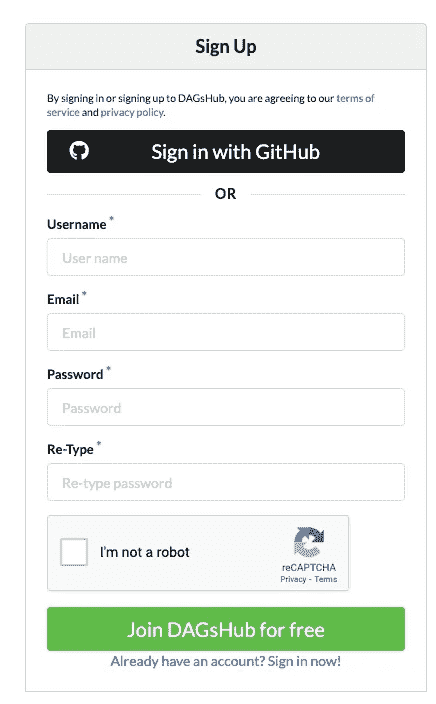
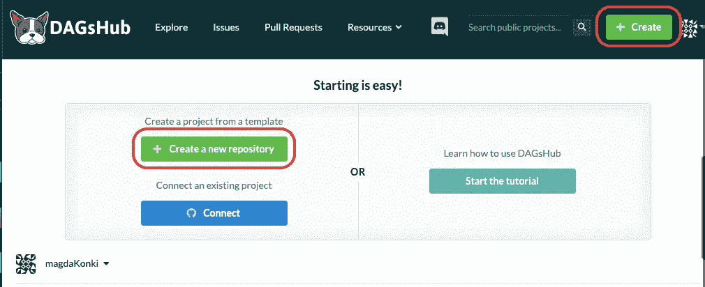
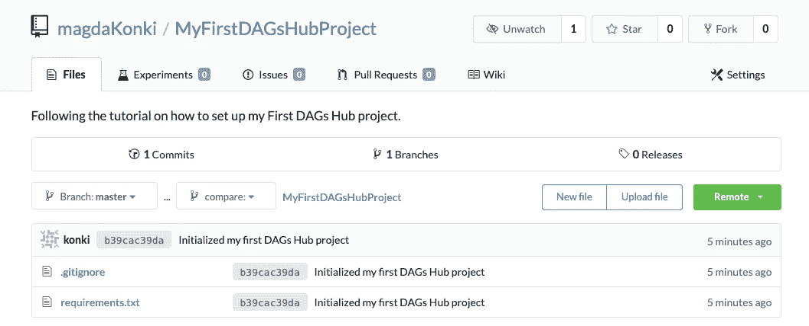
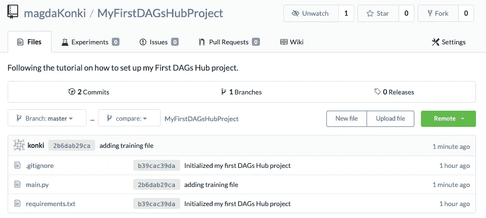
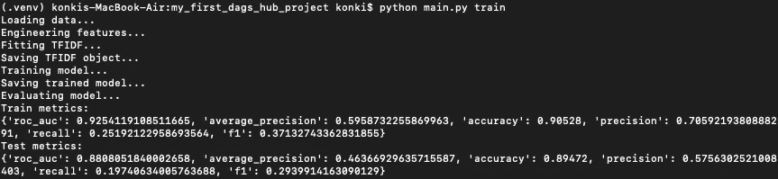
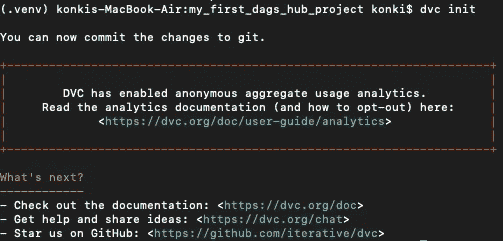
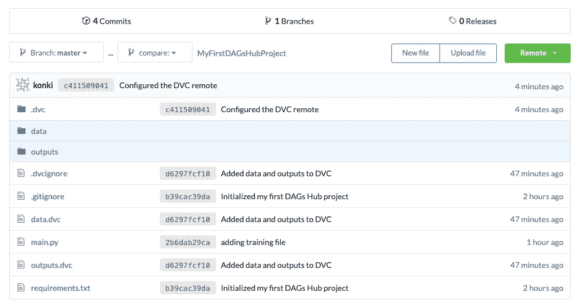
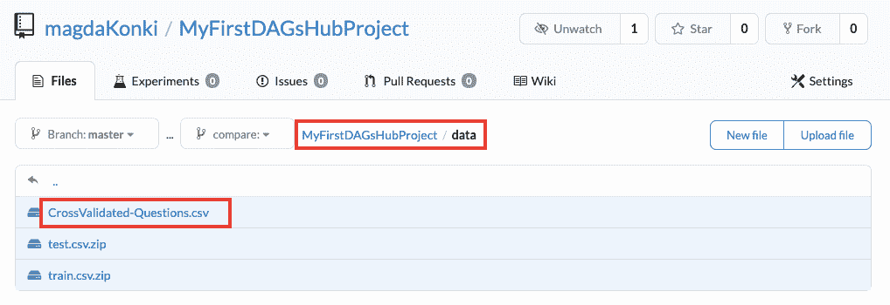
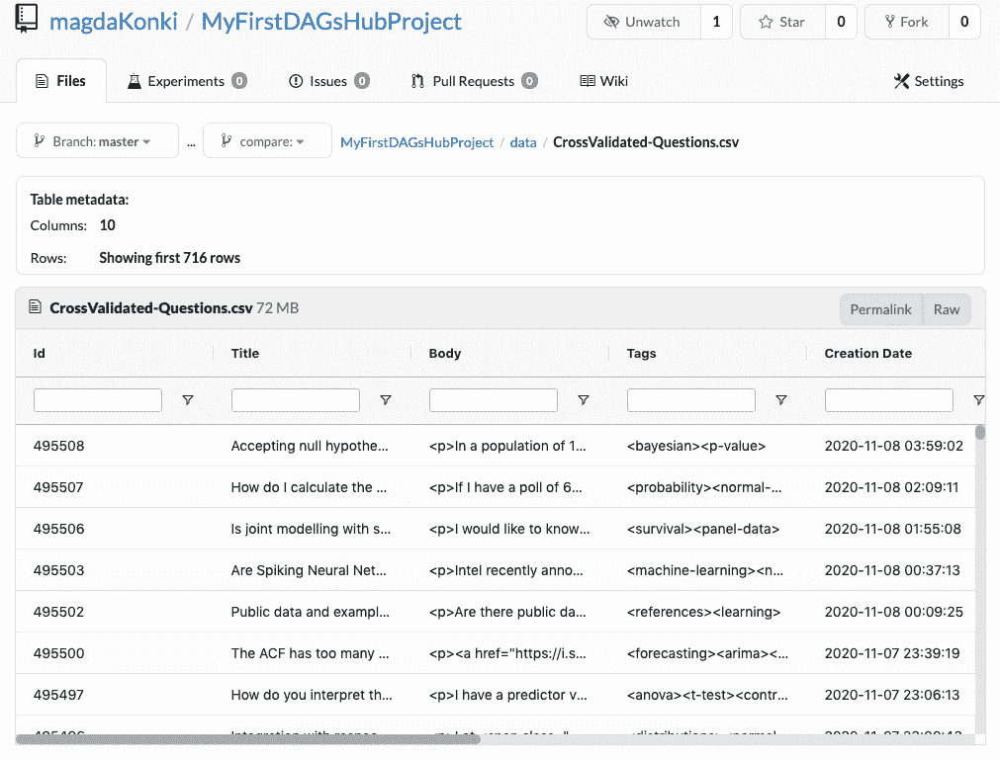

# 使用 DAGsHub 建立机器学习项目

> 原文：<https://pub.towardsai.net/using-dagshub-to-set-up-a-machine-learning-project-5ef9f1b5082e?source=collection_archive---------4----------------------->

## [机器学习](https://towardsai.net/p/category/machine-learning)


图片由 [Gerd Altmann](https://pixabay.com/users/geralt-9301/?utm_source=link-attribution&utm_medium=referral&utm_campaign=image&utm_content=5972687) 从 [Pixabay](https://pixabay.com/?utm_source=link-attribution&utm_medium=referral&utm_campaign=image&utm_content=5972687) 拍摄

**简介**

本文将教您如何使用 DagsHub 建立机器学习项目:Dag shub 是一种新工具，旨在简化需要数据版本控制和模型构建的数据科学项目的协作。

今天，我们将讨论:

*   机器学习项目的传统 Git 和 DVC 设置的问题，以及为什么这种方法不能完全工作。
*   DAGsHub 是什么，它是如何解决上面提到的问题的？
*   最后，我们将学习如何使用 DAGsHub 和 DAGsHub 存储来设置您的第一个项目。

**传统 Git 和 DVC 设置的问题**

机器学习项目上的大部分协作都是通过 Git 完成的。这是从软件工程项目继承下来的传统设置。

但是，软件工程和机器学习项目有很大的区别。后者通常涉及经常需要更新的海量数据文件。Git 不能很好地处理这个问题。即使许多机器学习工程师最初强迫它工作，它也从来不是最佳解决方案。

机器学习工程师已经开始使用 DVC(数据版本控制工具)。这种方法仍然使用 Git，但数据文件存储在远程云系统中，如 S3、GDrive、Azure 等。

这是在大数据项目上实现更轻松协作的一步，但仍然需要非常复杂的初始设置，您需要配置外部存储以与 DVC 配合工作。


图片由[穆罕默德·哈桑](https://pixabay.com/users/mohamed_hassan-5229782/?utm_source=link-attribution&utm_medium=referral&utm_campaign=image&utm_content=5972046)拍摄，来自[皮克斯拜](https://pixabay.com/?utm_source=link-attribution&utm_medium=referral&utm_campaign=image&utm_content=5972046)

**什么是 DAGsHub 和 DAGsHub 存储？**

DAGsHub 是一个免费使用的机器学习项目工具，可以避免上述问题。它建立在 Git 和 DVC 之上，允许轻松地对数据、模型进行版本控制，并允许跟踪实验。他们最近发布了一个新产品， [DAGsHub Storage](https://dagshub.com/blog/dagshub-storage-zero-configuration-dataset-model-hosting/) ，它允许更容易地设置机器学习项目，消除了对重型配置的需求。

这意味着不再需要购买 AWS、GCS、Azure 或 GDrive 等云存储来托管大型机器学习数据集。没有更复杂的设置来配置这些工作与 DVC。借助 DAGsHub 存储，您可以从同一个位置轻松访问所有代码、数据、模型和实验。

听起来很有趣，不是吗？在下一节中，我将带您通过几个简单的步骤，了解如何使用 DAGsHub 和 DAGsHub 存储来设置机器学习项目。

**使用 DagsHub** 建立你的第一个项目

设置过程的第一步是创建 DagsHub 帐户。您可以使用这个[链接](https://dagshub.com/user/sign_up)来完成此操作。



你可以看到你可以注册一个 GitHub 账户，我也注册了。一旦您创建了您的帐户，您将进入您自己的 DAGsHub 空间，在那里您将创建一个新的存储库。



您将填写有关回购的信息。只需添加名称和简短描述。您可以将其余设置保留为默认值。一旦创建了 repo，就可以从命令行创建并初始化项目:

```
mkdir my_first_dags_hub_project
cd my_first_dags_hub_project
git init
git remote add origin https://dagshub.com/<username>/<repo-name>.git
```

该项目还没有任何结构。让我们为您的第一个项目添加一些数据和设置文件。

我们将首先通过命令行创建空文件夹来存储数据和输出。

```
mkdir data
mkdir outputs
```

我们将使用来自官方 DAGsHub [教程](https://dagshub.com/docs/experiment-tutorial/overview/)中一个机器学习项目示例的数据。这意味着您需要从 [requirements.txt](https://dagshub.com/DAGsHub-Official/DAGsHub-Tutorial/raw/89f0c1163ad16a086c7a0106f8cbe4e2ed4c75fa/requirements.txt) 下载项目需求，并将它们添加到您的主目录中。

完成后，只需使用以下命令初始化一个新的虚拟环境:

```
python3 -m venv .venv 
echo .venv/ >> .gitignore 
echo __pycache__/ >> .gitignore
source .venv/bin/activate
```

现在，您可以在新的虚拟环境中安装所有要求。

```
pip install -r requirements.txt
```

最后，您可以将训练数据添加到之前准备好的数据文件夹中。

```
echo /data/ >> .gitignore echo /outputs/ >> .gitignorewget [https://dagshub-public.s3.us-east-2.amazonaws.com/tutorials/stackexchange/CrossValidated-Questions-Nov-2020.csv](https://dagshub-public.s3.us-east-2.amazonaws.com/tutorials/stackexchange/CrossValidated-Questions-Nov-2020.csv) -O data/CrossValidated-Questions.csv
```

上面的命令将为您的项目下载数据，并确保您不会向 Git()添加数据或输出文件。gitignore 零件)。

初始设置的最后一部分是将所有更改提交给 Git。

```
git add . 
git commit -m "Initialized my first DAGs Hub project" 
git push -u origin master
```

现在，您的回购应该如下所示:



请注意，我们只有。git 忽略文件和要求。太好了！

我们将使用 DVC 来处理数据文件夹。我们将首先添加一个简单的文件，用于训练我们的数据。复制这个文件( [main.py](https://dagshub.com/DAGsHub-Official/DAGsHub-Tutorial/raw/3d56f5ad4202e6d96a01a33dec2b380f387342dd/main.py) )并将其添加到您的项目目录中。也将其添加到远程存储库中。

```
git add [main.py](http://main.py/)
git commit -m "adding training file"
git push -u origin master
```

您的项目现在应该是这样的。



这个 [main.py](https://dagshub.com/DAGsHub-Official/DAGsHub-Tutorial/raw/b5fd2a63674aba1d156511509c1572c8cddbfdb5/main.py) 文件既可以将数据拆分成训练和测试，也可以训练机器学习模型。让我们首先拆分数据(确保您激活了一个虚拟环境)。

```
python main.py split
```

然后我们来训练一个模型。

```
python main.py train
```

您应该会看到类似的输出:



分割数据的结果是，data 文件夹中应该有一些新的 zip 文件，培训的结果是，您应该得到。输出文件夹中的 joblib 文件。

所有这些都需要添加到 DVC。让我们运行以下命令来设置它:

```
dvc init
```



现在，您可以向 DVC 追踪添加数据和输出。

```
dvc add data 
dvc add outputs
```

然后将相应的信息添加到 Git 中。

```
git add .dvc data.dvc outputs.dvc 
git commit -m "Added data and outputs to DVC"
```

现在，我们需要将 DAGsHub 存储设置为我们的 DVC 远程设备。您可以将以下代码用于您的凭据。

```
dvc remote add origin "https://dagshub.com/<DAGsHub_username>/<repo_name>.dvc"dvc remote default origin --localdvc remote modify origin --local user <DAGsHub_username>dvc remote modify origin --local auth basicdvc remote modify origin --local password <DAGsHub_password>
```

现在我们需要将设置更改添加到 Git 中。

```
git add .dvc/config 
git commit -m "Configured the DVC remote"
```

让我们将所有这些都推到远程回购上。

```
git push -u origin master 
dvc push --all-commits
```

这应该会导致所有文件现在都被推送到 DAGsHub 存储中。



正如您所看到的，所有的组件、代码、数据文件和模型都在一个地方被版本化、存储和访问。

您刚刚使用 DAGsHub 和 DAGsHub 存储建立了您的第一个数据科学项目！

您可能想知道:等一下，设置 DAGsHub 存储的步骤在哪里？实际上不需要任何步骤来配置任何类型的存储，我们只需编写几行代码。DAGsHub Storage 会自动存储您的数据和模型，无需任何配置。这就是为什么它比亚马逊和谷歌的其他服务更受欢迎。

此外，DAGsHub 存储中存储的数据易于查看和搜索。为了查看这个特性，请转到 DAGsHub 存储项目视图中的 data 文件夹，并检查 CrossValidated-Questions.csv 文件。



CrossValidated-Questions.csv 是我们在前面的步骤中用来训练机器学习算法的文件。一旦通过 DAGsHub 存储打开文件，您会发现可以非常容易地检查整个文件。它实际上看起来像一个可搜索的熊猫数据框架。



DAGsHub 存储有许多这里没有提到的高效和有用的特性。他们可以把你的机器学习项目提升到下一个层次。它也是一个很好的协作工具，因此您的整个团队可以无缝地一起工作。

**总结**

在本文中，您已经学习了如何使用 DAGsHub 和 DAGsHub 存储来设置您的第一个项目，这允许轻松设置机器学习项目。这是一个新的解决方案，与使用 Git、DVC 和其他远程存储提供商的传统设置相比，它提供了更简单的协作。

我希望你喜欢它，并快乐编码！

*PS:我正在 Medium 和*[](https://www.aboutdatablog.com/)**上撰写深入浅出地解释基本数据科学概念的文章。你可以订阅我的* [***邮件列表***](https://medium.com/subscribe/@konkiewicz.m) *每次我写新文章都会收到通知。如果你还不是中等会员，你可以在这里加入**[***。***](https://medium.com/@konkiewicz.m/membership)**

**下面是一些你可能会喜欢的帖子**

**[](https://towardsdatascience.com/top-9-jupyter-notebook-extensions-7a5d30269bc8) [## 9 大 Jupyter 笔记本扩展

### 改进笔记本电脑功能，提高您的工作效率

towardsdatascience.com](https://towardsdatascience.com/top-9-jupyter-notebook-extensions-7a5d30269bc8) [](https://towardsdatascience.com/introduction-to-f-strings-3822ed8683cc) [## python f 字符串简介

### 以及为什么您应该开始使用它们…

towardsdatascience.com](https://towardsdatascience.com/introduction-to-f-strings-3822ed8683cc) [](https://towardsdatascience.com/top-8-magic-commands-in-jupyter-notebook-c1582e813560) [## Jupyter 笔记本中的 8 大魔法命令

### 通过学习最有用的命令来提高您的生产力

towardsdatascience.com](https://towardsdatascience.com/top-8-magic-commands-in-jupyter-notebook-c1582e813560)**