# 使用深度学习进行航空图像中的目标检测

> 原文：<https://pub.towardsai.net/using-deep-learning-for-object-detection-in-aerial-images-b255c276e17?source=collection_archive---------1----------------------->

## [深度学习](https://towardsai.net/p/category/machine-learning/deep-learning)

## 分享我第一次动手做 ML 项目的经验，以及我学到的东西

机器学习、深度学习、数据科学……这些术语我们已经听了好几年了，它们似乎不会很快消失。我第一次听到“机器学习”这个词是在 2018 年，当时我 14 岁。

一年后，我使用 TensorFlow 和 Keras 实现了一个基本图像分类的神经网络，作为我高中机器学习课的一部分。

快进 2 年多学习机器学习理论和动手实践，我高中毕业软件工程专业，重点是深度学习。我的最终项目的主题是“利用航拍图像中的物体检测处理非法建筑的系统”。

# 背景

一些土木工程师的工作是帮助处理非法建筑。他们通过拍摄特定区域的航空图像并手动标记图像中的每座建筑物来实现这一点。他们用几年后拍摄的同一地点的航拍图像重复这一过程。然后，他们将两者进行比较，找出发生了什么变化(增加了新的建筑，某栋建筑增加了新的楼层，等等。)，并检查该地区建筑物的许可证，以确定是否存在违法建筑的情况。手动标记建筑物的问题是这个过程缓慢、困难且耗时。然而，如果这个过程是自动完成的，它将变得快速和容易，并将为许多工程师节省大量时间，最重要的是，将对打击非法建筑有很大帮助。

# 系统结构

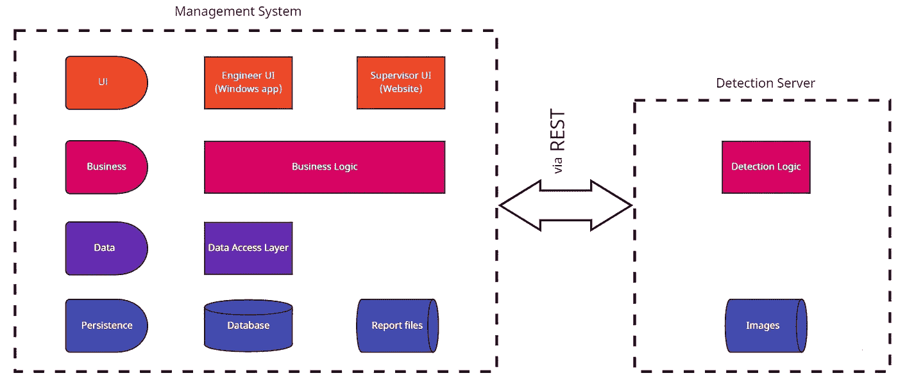

系统的架构图。我的图像

该系统有几个层次:

*   持久层—包含存储在系统中的所有数据，由以下组件组成:
    —存储业务数据的数据库
    —存储管理系统和检测服务器映像的文件存储。
*   数据访问层—处理存储在数据库中的数据的代码。
*   业务层—该层由以下几部分组成:
    —业务逻辑—包含 UI 所需的功能以及与检测逻辑组件的集成。这种集成是使用 REST APIs 实现的。
    –检测逻辑—该组件被实现为 WEB 服务，为 REST 请求提供服务。该服务的功能包括处理图像、检测图像上的建筑物、在建筑物周围绘制边界框，以及通过 REST API 提供处理后的图像。
*   UI 层—这一层由工程师 UI(一个桌面应用程序)和主管 UI(一个网站)组成。关于 UI 的更全面的解释将在本文后面给出。

# 研究

今天，有各种各样的机器学习算法，用于不同的用例，所以，要为我的项目选择正确的算法，我必须做一些研究。

我考虑了几种算法。其中包括 SVM 和 RNN。

SVM 是一种用于分类和回归问题的算法，它通过绘制决策边界/超平面来解决这些问题，这意味着该算法不是我们的任务(即图像中的对象检测)所需的算法。

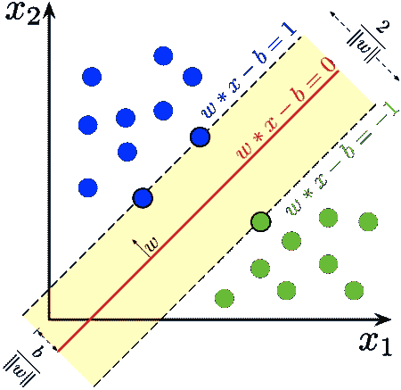

使用 SVM 算法的最大边缘超平面。图片来自维基百科

在快速检查了 SVM 之后，我决定看看是否有一种神经网络可以派上用场。有许多类型的神经网络，如 RNN(递归神经网络)，可以使用其内部存储器来处理各种长度的输入序列，以解决与时间序列数据、文本数据和视频数据相关的问题，如情感分类、语言翻译、关联手写识别等。同样，这不是我这个项目所需要的，所以 rnn 不是很有用。

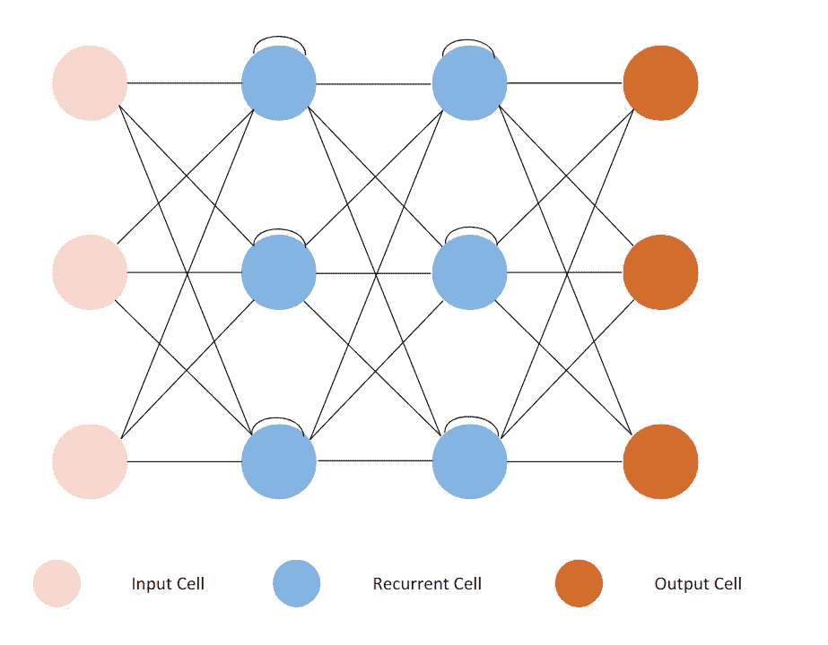

基本 RNN 架构图。图片来自 edrawsoft 的免费递归神经网络模板

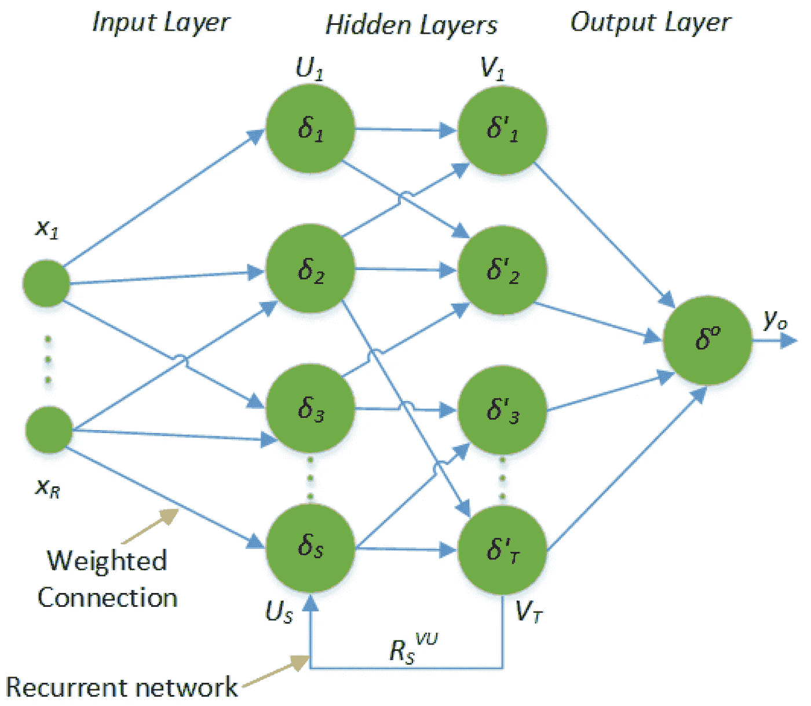

递归神经网络的基本结构。图片来自“[基于 LSTM 神经网络的巴基斯坦小麦产量预测模型](https://www.mdpi.com/2073-4395/9/2/72/htm)

在回顾了各种神经网络之后，我终于发现了可能适合我的项目的神经网络类型——CNN。

## 卷积神经网络

CNN 是一种使用过滤器从图像中提取特征的神经网络。它主要用于分析视觉意象。

典型的 CNN 架构。图片来自维基百科

“但是什么是卷积呢？”你可能会问。卷积是应用于矩阵的数学运算，通常，图像以像素或数字的形式表示。在此操作期间，在过滤器(也称为“内核”)值和内核悬停在其上的图像值之间执行点积，直到内核完成在表示图像的矩阵中的每个值上的悬停。这个过程的目标是从输入图像中提取特征。

卷积过程图解。来自维基百科的 Gif

另一个重要的层是池层，它负责减小卷积要素的空间大小，从而降低处理数据所需的计算能力。有两种类型的池:最大池和平均池。最大池返回内核覆盖的图像部分的最大值。平均池返回内核覆盖的图像部分的所有值的平均值。

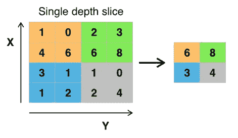

最大池插图。图片来自维基百科

## 视网膜网

在我的研究中，我检查了许多 CNN 架构，如 RCNN、Yolo 等。关于这些和其他的更多信息可以在[这里](https://towardsdatascience.com/r-cnn-fast-r-cnn-faster-r-cnn-yolo-object-detection-algorithms-36d53571365e)找到。我在这个项目上工作的时间有限，除了 ML 部分之外，我还必须处理它的其他组件，所以我必须找到一个已经实现了对象检测算法的库，它可以让我训练、预测和绘制检测到的对象周围的边界框。在网上广泛搜索后，我遇到了 RetinaNet。

RetinaNet 是一个复合网络，包括:

*   称为特征金字塔(FPN)网络的主干网络以完全卷积的方式构建在 ResNet 之上，用于计算输入图像的特征映射。
*   对象分类子网。
*   包围盒回归子网络。

对象分类子网络和包围盒回归子网络建立在每个 FPN 层上，它们使用主干的输出。

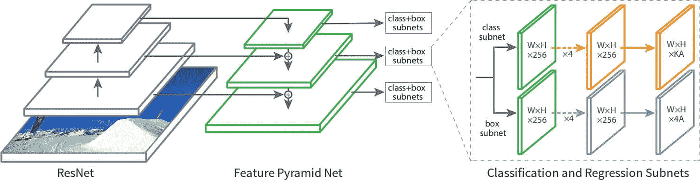

RetinaNet 的建筑可视化。图像来自“[密集物体探测的焦损失](https://arxiv.org/abs/1708.02002)

FPN 的结构由两条横向连接的通路组成。

第一种是自下而上的途径。在这个路径中，产生了输入图像的特征图。由输出相同比例的要素地图的每组连续图层生成的最后一个要素地图稍后将用作要素金字塔的基础。

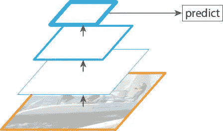

自下而上的路径可视化。图片来自“[用于目标检测的特征金字塔网络](https://arxiv.org/abs/1612.03144)

第二个是自上而下的途径。在该路径中，自下而上路径的最后一个特征地图被扩展到与倒数第二个特征地图相同的比例。然后将两者合并，并将新的特征图提供给两个子网络。重复该过程，直到来自自底向上路径的每个特征地图具有与横向连接相连接的对应的新特征地图。

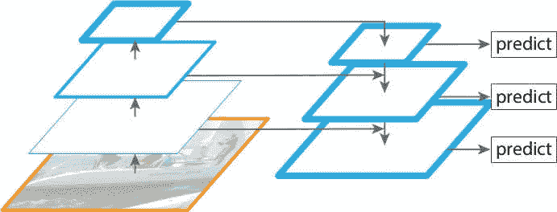

可视化自上而下的路径。图像来自“[用于对象检测的特征金字塔网络](https://arxiv.org/abs/1612.03144)

在我的项目中，我使用 Keras-retina net(retina net 的 Keras 实现)来训练、预测和绘制航空图像中检测到的建筑物周围的边界框。

# 创建数据集

在我找到执行所需任务的正确模块之后(在这个项目中，它是航空图像中的对象检测)，我需要用于模型训练和预测的数据。在搜索数据集时，我试图找到一个包含建筑物和元数据 XML 文件的图像，这些元数据 XML 文件在每个图像中存储建筑物的位置(每个图像一个 XML 文件)。不幸的是，我没有找到一个，但我确实找到了一个可能有用的数据集。这个数据集是[游泳池和汽车检测](https://www.kaggle.com/kbhartiya83/swimming-pool-and-car-detection)数据集，它包含汽车和游泳池的图像，以及存储这些图像中游泳池和汽车位置的 XML 文件。你可能想知道我为什么选择这个数据集。原因很简单。在有汽车和游泳池的相同图片中，也有建筑物，因此我可以使用数据集的图像进行训练和预测。

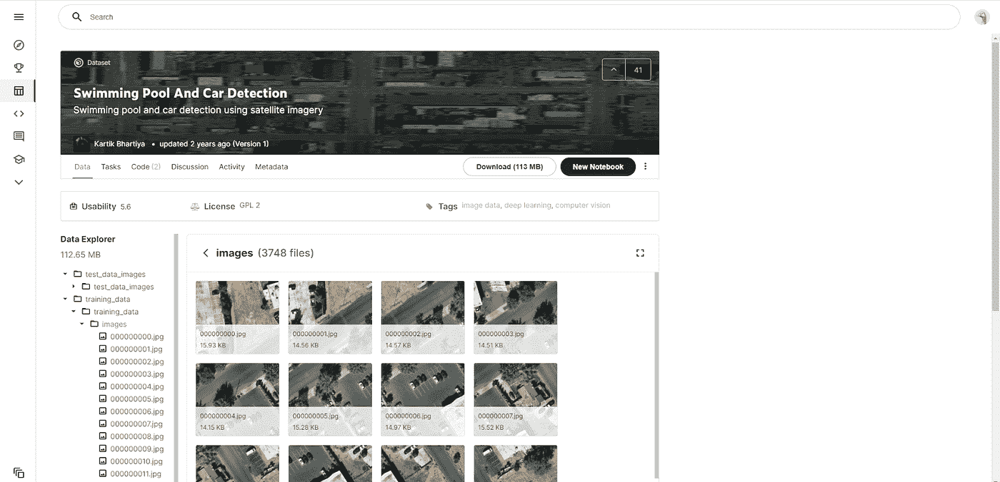

游泳池和汽车检测数据集。截图来自 kaggle.com 的我

创建存储图像中对象位置的 XML 文件。我使用了 [CVAT](/cvat.org) ，一个计算机视觉注释工具，它让我在图像中的物体周围画出边界框，然后生成我训练所需的 XML 文件。在我拥有的大约 1000 张图片中，我为 600 张图片创建了 XML 文件，每张 224X224 像素。

现在我已经有了所有的图像和它们对应的 XML 文件，我可以开始训练模型了。

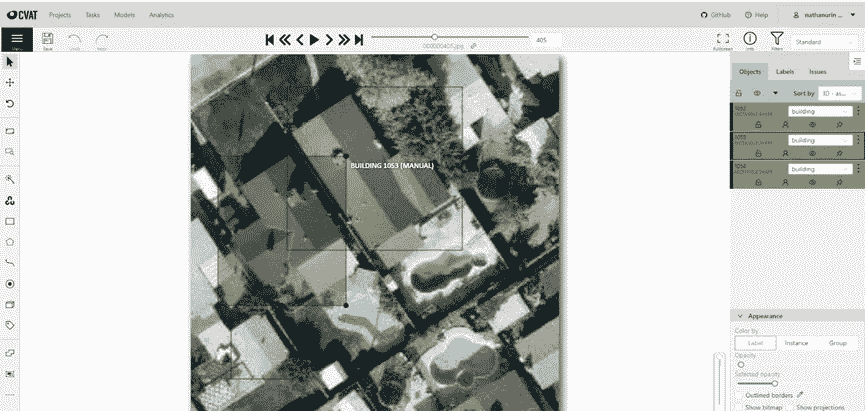

使用 CVAT 注释图像。截图来自 cvat.org 的我

# 训练和预测

现在，我剩下的就是训练模型，并使用项目中稍后生成的一个经过训练的模型文件。因为训练模型的代码是在 Google Colab 上运行的，所以我首先必须安装我的 Google Drive。然后，我导入所有我需要的模块。之后，我从 XML 文件中提取注释，并将它们存储在训练所需的 CSV 文件中。最后一步是训练本身，这是我不得不重复几次的一步。这样做的原因是，我必须找到一定数量的时段(所有训练数据的一轮训练)、步骤(一定数量的数据被馈送到网络的时段的一部分)，这将给我最佳结果。

我决定用不同数量的时期、步骤和批量大小尝试几次，看看哪一个能给我更好的结果。下表总结了我在寻找这些参数的更好组合方面的一些尝试。

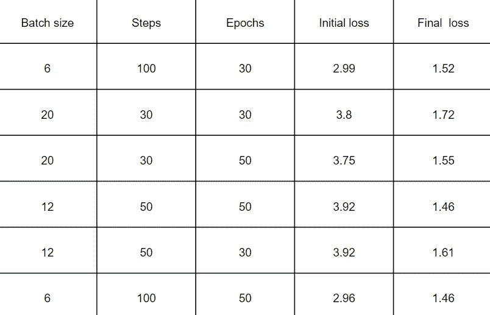

从该表中可以看出，越多的时期和越多的步骤(=越小的批量)给了我们越好的结果，因为具有最多时期和步骤的训练尝试给出了最低的初始损失(2.96)和最低的最终损失(1.46)。

每当一个时期结束时，就会为我们生成一个新的训练模型文件，该文件可用于预测。

对于预测，我使用了之前生成的一个训练模型文件，以及 keras_retinanet 的预测模块和边界框模块。我必须关注的一件事是绘制边界框所需的模型的置信度阈值。我开始使用不同的图像测试模型是如何完成的，根据模型的性能，我改变了置信度阈值，以便它不会太低(这可能导致在不是建筑物的对象周围绘制边界框)，也不会太高(这可能导致即使对象是建筑物也不会在对象周围绘制边界框)。

有用！我们的模型在建筑物周围绘制边界框方面做得非常好，并且具有非常高的置信度(不幸的是，由于某种原因，右上角检测到的建筑物的置信度在图像中看不到)。

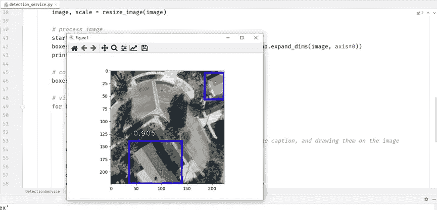

检测到的建筑物周围绘制有边界框的航拍图像。我截图

现在我需要做的就是构建 UI，这样用户就可以使用我的项目，并找到一种方法让我的 python 代码在一个主要用 C#编写的项目中工作。

# 将我的项目带入生活

能够在航拍图像上执行对象检测是很酷的事情，但是如果不能在易于使用的 UI 中使用它，它还有什么价值呢？

这个项目中有两个用户，这意味着有两个 UI 环境。第一类用户是工程师。工程师的 UI 环境将主要用于检测新增和现有地址的航空图像中的建筑物，查看过去检测到的图像，并向主管发送报告。第二类用户是主管。主管负责查看工程师发送的报告，查看和添加建筑许可，并确定是否存在非法建筑的情况。

幸运的是，我身边有 windows 窗体，它可以让我构建桌面应用程序，这就是将要使用对象检测的地方。

工程师可以在新添加的地址中拍摄的图像中检测建筑物

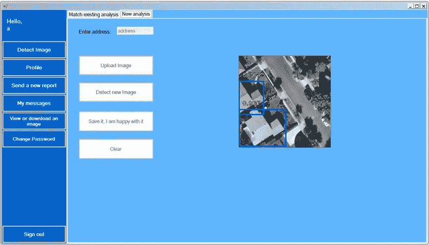

在新地址的航拍图像中检测建筑物。我截图

或者检测在系统中已经存在的地址中拍摄的图像中的建筑物，并将其与之前的图像进行比较。

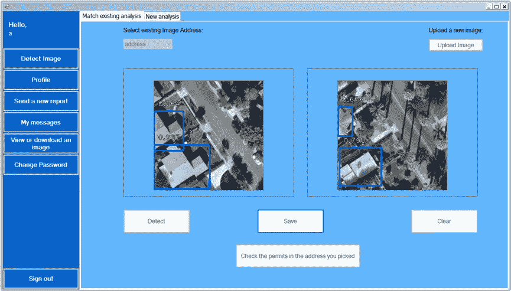

在现有地址的航拍图像中检测建筑物，并与之前的进行比较。我截图

工程师还可以从不同的地址和时间查看带有边框的所有图像。

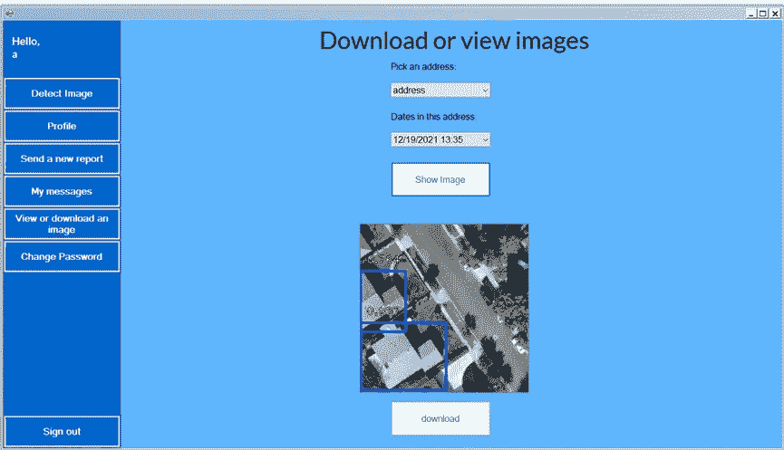

使用边界框查看图像。我截图

甚至向他们的主管发送报告。

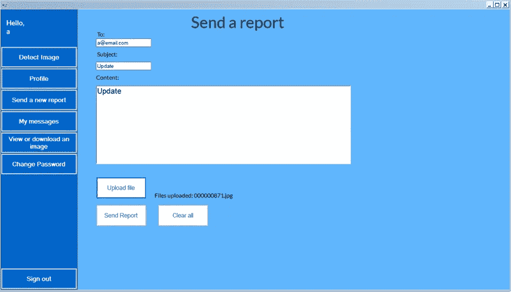

发送报告。我截图

说到主管，他们也有自己的 UI，一个网站，用 aspx 搭建的。

在他们的 UI 环境中，主管可以查看所有建筑许可。

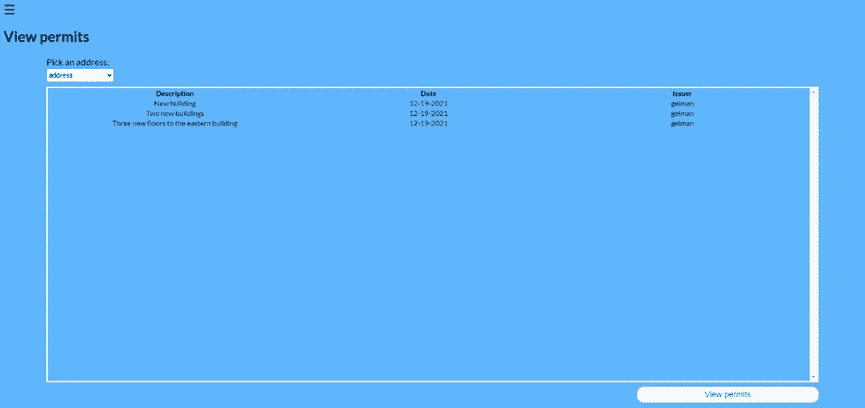

查看建筑许可。我截图

添加新的建筑许可证。

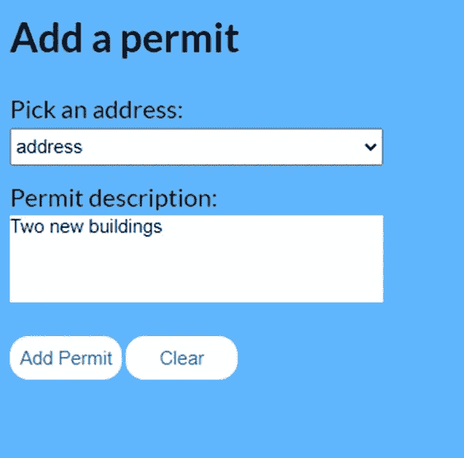

添加新许可证。我截图

并查看发送给他们的报告。

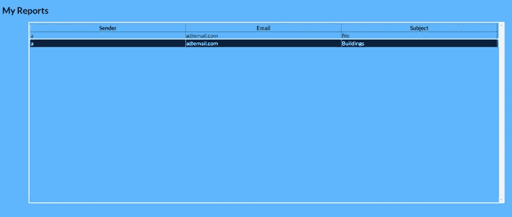

查看报告。我截图

我用相似的色调设计了两个环境，只是为了给人一种它们都是同一个系统的一部分的感觉。

现在你可以看到我在一个主要是 C#的项目中使用了 python，让我们看看我是如何做到这一点的。

# 在主要是 C#的项目中使用 python

Python 代码不能就这样在 C#中运行，必须完成一些额外的步骤才能实现。将 python 文件转换成. EXE 文件并使用 C#代码运行它是可能的，但是我做了一些不同的事情。我已经用 [Flask](https://flask.palletsprojects.com/en/1.1.x/patterns/fileuploads/) 建立了一个 web 服务器，它处理来自管理系统的请求。

管理系统向服务器发送 POST 请求，并在检测完成后接收表示包含边界框的图像的资源的 URL。

服务器接收图像，对其执行检测，并将表示包含边界框的图像的资源的 URL 返回给管理系统。

然后，管理系统显示带有边框的图像，而不是没有边框的图像，如您之前所见。

# 我学到了什么

在这个过程中，我学到了一些技术知识，比如:

1.用 Flask 设置 web 服务器。

2.使用数据库。

3.CNN 架构。

4.使用 keras_retinanet 执行对象检测。

5.REST API。

但除了那些，我还学到了另一个教训，比如:

1.知识差距应该首先得到解决。

2.事情会变得艰难，但这不是放弃的理由。

3.如果你需要帮助，你应该寻求帮助。

*差不多就是这样！非常感谢您阅读这篇文章。你也可以访问我的 Github 页面* [*这里*](https://github.com/NathanUrinovsky) *！*

# 来源

[1] T. Bandara，[让我们为现代云](https://towardsdatascience.com/lets-build-a-simple-distributed-computing-system-for-modern-cloud-part-one-e2b745126211) (2021)构建一个简单的分布式计算系统，走向数据科学

[2] R. Ghandi， [R-CNN，Fast R-CNN，Fast R-CNN，YOLO——对象检测算法](https://towardsdatascience.com/r-cnn-fast-r-cnn-faster-r-cnn-yolo-object-detection-algorithms-36d53571365e) (2018)，走向数据科学

[3] N. Kumar，[递归神经网络(RNN)解释了通向数据科学的 ELI5 方式](https://towardsdatascience.com/recurrent-neural-networks-rnn-explained-the-eli5-way-3956887e8b75) (2019)

[4] T. Lin，P. Dollár，R. Girshick，K. He，B. Hariharan 和 S. Belongie，[用于物体检测的特征金字塔网络](https://arxiv.org/abs/1612.03144) (2016)，arXiv

[5] T. Lin，P. Goyal，R. Girshick，K. He 和 P. Dollár，[密集物体探测的焦点损失](http://arxiv.org/abs/1708.02002) (2017)，arXiv

[6] A. Pai，[CNN vs . RNN vs . ANN——分析深度学习中的 3 种神经网络](https://www.analyticsvidhya.com/blog/2020/02/cnn-vs-rnn-vs-mlp-analyzing-3-types-of-neural-networks-in-deep-learning/#h2_6) (2020)，Analytics Vidhya

[7] R. Pupale，[支持向量机(SVM)——概述](https://towardsdatascience.com/https-medium-com-pupalerushikesh-svm-f4b42800e989) (2018)，走向数据科学

[8] S. Saha，[《卷积神经网络综合指南 ELI5 之路](https://towardsdatascience.com/a-comprehensive-guide-to-convolutional-neural-networks-the-eli5-way-3bd2b1164a53) (2018)，走向数据科学》

[9] A. Tch，(2017)向数据科学解释的最完整的神经网络图表

[10] N .曾， [RetinaNet 解释与去神秘化](https://blog.zenggyu.com/en/post/2018-12-05/retinanet-explained-and-demystified/) (2018)，