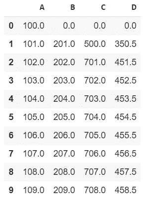
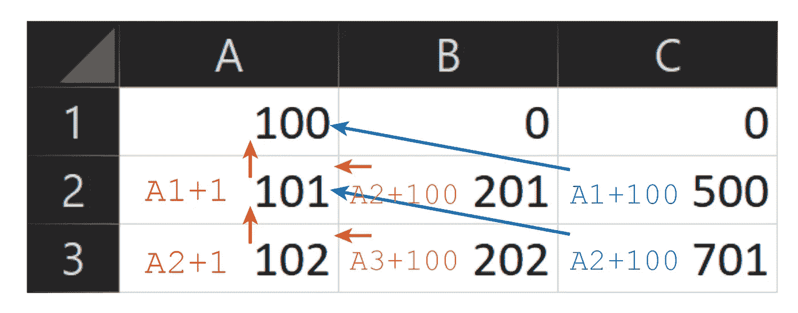
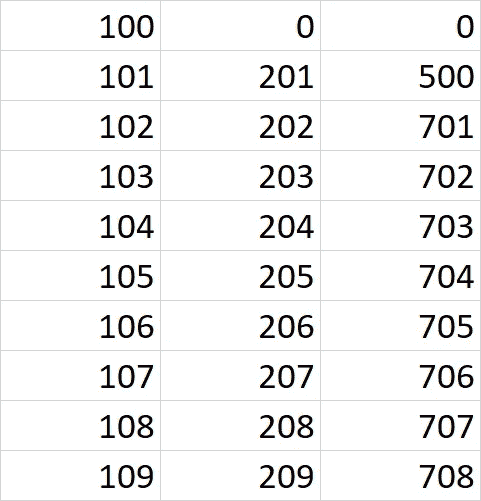
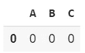
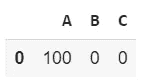
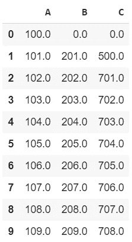
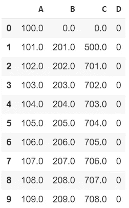

# 在 Pandas 中使用 Excel 引用函数

> 原文：<https://pub.towardsai.net/using-excel-reference-functions-in-pandas-5b9192b1cadd?source=collection_archive---------5----------------------->

## [编程](https://towardsai.net/p/category/programming)

## 在我的 Github 库有完整的代码[。](https://github.com/arditoibryan/Projects/tree/master/20200730_Pandas_Excel_Functions)

在本文中，我将使用 Pandas 从头创建一个数据集，但是在填充数据集时会引用其他单元格的值。



我用熊猫从头开始创建了这个数据集

Pandas 缺少的一个功能是创建类似 Excel 的功能。当我们必须手动处理数量有限的信息时，Excel 是一个很好的工具。这个电子表格最直观的特征之一是函数。


熊猫/Excel 混合徽标的外观

关于熊猫，人们从一开始就很难欣赏它的最令人不安的原因之一是编辑数据集中的数据真的很有挑战性。如果我想从头创建一个数据集，并且需要使用从以前的行和列中获取信息的函数，该怎么办？

# Excel 版本



使用 Excel 公式

我们获得以下数据集:



数据集的 10 行

# 熊猫版

我们可以将该文件保存为. csv 文件，但是，本文的目的是用 pandas 复制相同的过程。我将使用这些相关函数从头开始创建一个数据集。

## 创建第一行

我将在语句中使用来创建其余的行。像在 Excel 中一样，第一行不应该包含任何函数，而只能包含数据。我将创建一个空行来设置数据集的列。

```
import pandas as pd
df = [0, 0, 0]
df = pd.DataFrame(df).transpose()
df.columns = ['A', 'B', 'C']
df
```



空数据集

## 设置值

我以前可以这样做，但我更喜欢一步一步来。

```
df['A'][0] = 100
df['B'][0] = 0
df['C'][0] = 0
df
```



第一值

## 使用函数

现在我终于可以设置函数了。它们肯定不如 excel 直观，但是，这也能解决问题。要指定以前的单元格，我必须在 for 语句中使用 _ 作为引用。例如，如果我在列 A 中，并且我希望该单元格获取同一列的上一个单元格的值:

```
df.loc[_, 'A'] = df.loc[_-1, 'A']+1
```

含义:在 A 列中，仍然从 A 列(' A ')中获取前一个单元格的值(_-1)。然后将检索到的值加 1。

为了使用这种方法创建整个数据集，我将使用以下算法:

```
for _ in range(1, 10):
  df.loc[_, 'A'] = df.loc[_-1, 'A']+1
  df.loc[_, 'B'] = df.loc[_, 'A']+100
  df.loc[_, 'C'] = df.loc[_-1, 'B']+500
df
```



仅用熊猫创建的数据集

# 在 Excel 中可以使用其他函数吗？

您不能使用与 Excel 完全相同的功能。例如，不能以同样的方式使用=AVERAGE(B1，C1)。Python 有自己的内置函数或额外的库，您可以下载。在这种特殊情况下，我会这样做:

```
df['D'] = 0
```

这将创建一个附加列。



增加 D 柱

```
import statistics
for _ in range(1, 10):
  df.loc[_, 'A'] = df.loc[_-1, 'A']+1
  df.loc[_, 'B'] = df.loc[_, 'A']+100
  df.loc[_, 'C'] = df.loc[_-1, 'B']+500
  df.loc[_, 'D'] = statistics.mean([df.loc[_, 'B'], df.loc[_, 'C']])
df
```


最终数据集

从 for 语句的最后一个函数可以看出，我一直在用 python 版的 mean 计算同一行的 B 和 C 的平均值。