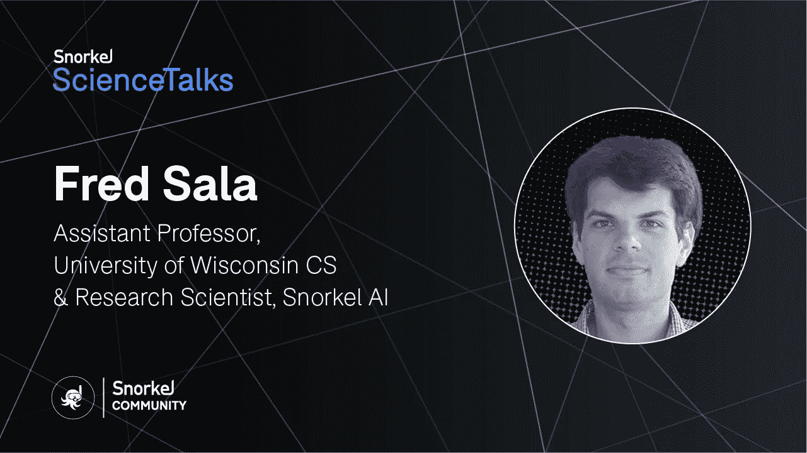
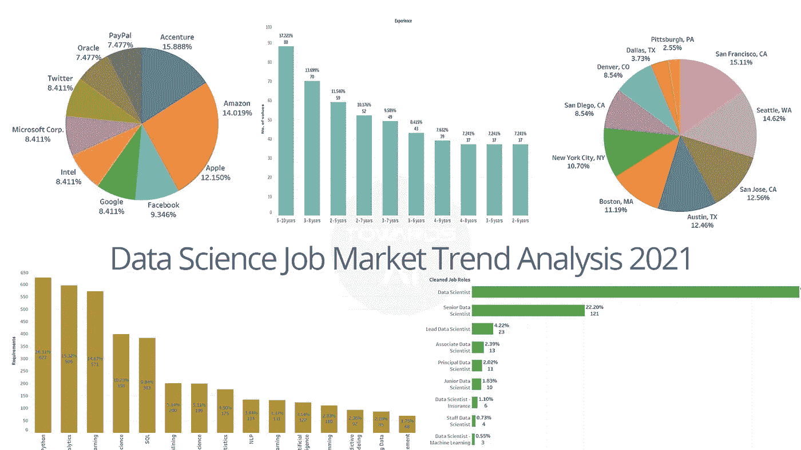
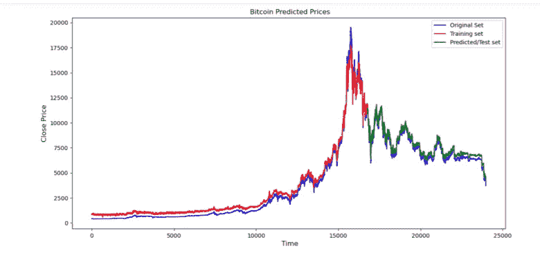
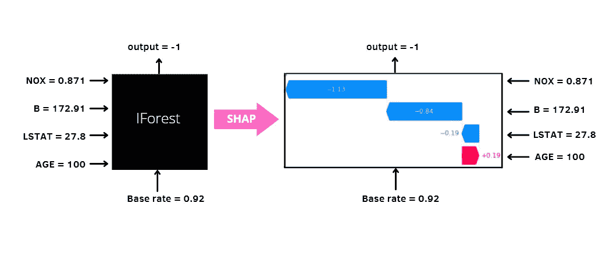
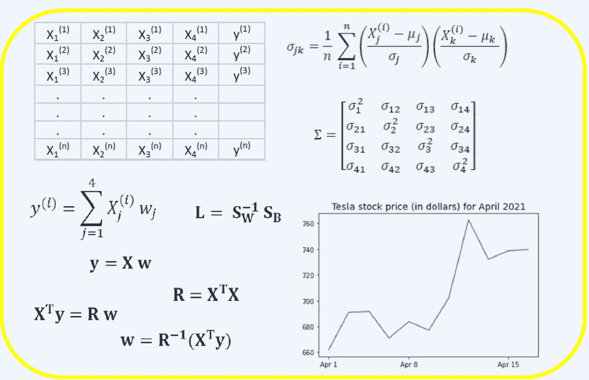
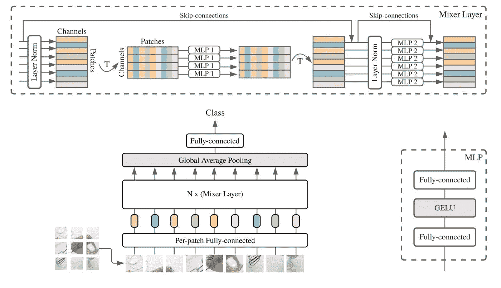
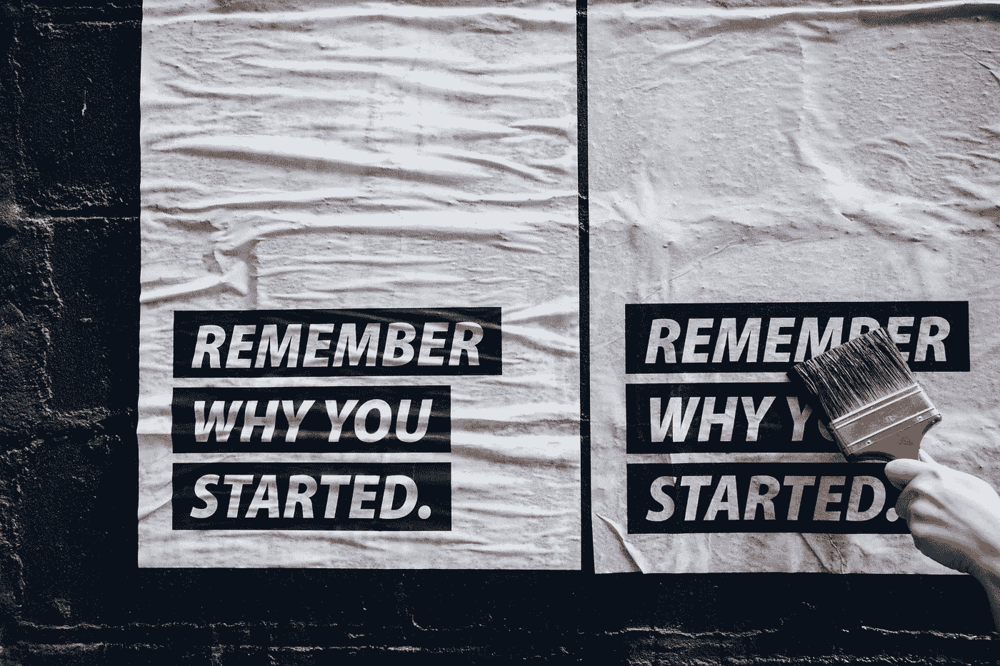
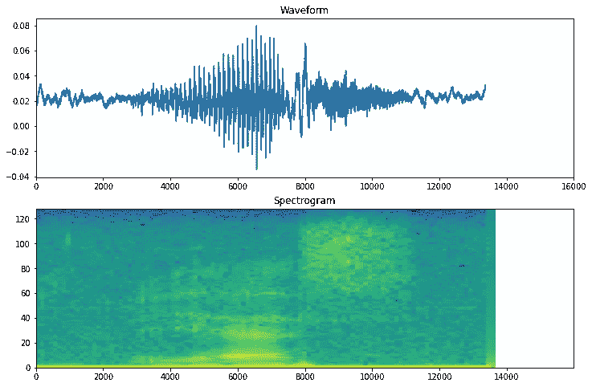

# 用博弈论重新定义 PCA，用深度学习推测比特币价格

> 原文：<https://pub.towardsai.net/using-game-theory-to-redefine-pca-to-speculating-bitcoin-price-with-deep-learning-5ff3e4e6d36b?source=collection_archive---------0----------------------->

## [新闻](https://towardsai.net/p/category/news)，[快讯](https://towardsai.net/p/category/newsletter)

## 人工智能新闻、研究、更新、激动人心的[免费参加的人工智能峰会](http://ws.towardsai.net/ng2)，以及我们每月的编辑精选！

***如果你阅读这封邮件有困难，请在*** [***网络浏览器***](https://ws.towardsai.net/j21) ***上查看。***

ame 理论是一种模仿游戏平衡和结构的数学方法。它用于创建多方之间的互动，以帮助他们在不极端妥协或偏离常态的情况下实现最佳结果。它帮助谷歌创造了一个在短短四个小时内学会如何掌握星际争霸 2 的人工智能，它对风险、战略和其他关键变量的理解使它成为一个宝贵的工具，可以教会人工智能系统成为灵活和适应性强的思想家。在深入研究博弈论如何被用来重新定义 PCA 之前，先来看看这个激动人心的免费活动，由 **Anyscale** 举办:

[【免费】Ray Summit 月 22 日–24 日:面向所有人的可扩展 Python&ML](http://ws.towardsai.net/ng2)

了解开源 Python 框架 Ray 如何用于构建分布式应用和库，包括后端基础设施和 ML 平台。Ray 发展很快，由于它的灵活性、可伸缩性和高效性，现在已经有数百家公司在使用它。[**参加 Ray Summit**](http://ws.towardsai.net/ng2) 通过 livestream 或访问会话点播，全部完全免费——[**在此注册**](http://ws.towardsai.net/ng2) **。**

我们的第一篇社论提供了 DeepMind 使用博弈论重新想象 [**PCA**](https://news.towardsai.net/pca) 的方法的高级描述。如果你想深入研究 DeepMind 的 ICLR 获奖论文“EigenGame: PCA 作为纳什均衡”，你可以在 [**OpenReview**](https://openreview.net/forum?id=NzTU59SYbNq) 上找到它。

现在，让我们面对现实吧。人工智能系统通常是不透明的，奇怪的，难以使用。在 [**机器学习**](https://mld.ai/mldcmu) 领域，更是如此。如果我们想制造人们能够理解并更有效地互动的智能系统，解决方案的一个关键部分就是建立一个社区，让人们能够聚集在一起，分享想法并相互学习。这就是为什么我们在 Discord 上创建了我们的 [**人工智能社区——与其他数据专家和爱好者联系和学习。**](https://members.towardsai.net/)

如果你对**高科技和新颖的机器学习工作**。我们推荐你去看看由斯鲁普的研究科学家、威斯康星大学助理教授弗雷德·萨拉主持的关于“将信息论应用于人工智能”的讲座****。****

****神经信息处理系统(NeurIPS)会议加倍努力实现完全远程化，并提出了今年的 2021 Meetup，要了解更多信息，请访问关于 [**如何举办 NeurIPS 2021 Meetup**](https://mktg.best/g4lap) 的帖子。****

****如果你还没有查看，我们最近用 Python 在 [**上推出了我们的**](https://gumroad.com/l/descriptive-statistics) **[**书**](https://news.towardsai.net/descriptive-statistics) 。这篇 [**文章**](https://news.towardsai.net/descriptive-statistics-book-sample) 或者这篇 [**PDF**](https://github.com/towardsai/tutorials/blob/master/descriptive-statistics/descriptive-statistics-pdf-book-sample.pdf) 提供了本书前 36 页的样本。请不要忘记，成为**会员，你就可以接触到这部作品、更多的书籍和其他好东西。********

****分享是关怀。请随时与您的朋友、同事和熟人分享我们的 [**简讯**](http://ws.towardsai.net/j21) 或 [**订阅链接**](https://ws.towardsai.net/subscribe) 。每月一封电子邮件；随时退订！**如果您对我们如何改进有任何反馈，请随时通过** [**告诉我们**](https://app.joinpalette.com/t/amas/n1PYGbcbPthObD71gGCq) **。******

****现在开始每月精选！我们根据读者、粉丝和某篇文章的浏览量来挑选这些文章。我们希望你和我们一样喜欢阅读它们。此外，我们开始做一些新的东西！我们将选出我们表现最好的文章，我们的编辑将选择几篇表现不突出的文章，但由于它们的质量，它们进入了本月的名单。****

# ****📚编辑选择每月精选文章↓📚****

********

## ****[DeepMind 想要重新想象机器学习](https://mktg.best/8w4gv)中最重要的算法之一 [Jesus Rodriguez](https://medium.com/u/46674a2c9422?source=post_page-----5ff3e4e6d36b--------------------------------)****

******主成分分析(PCA)是任何机器学习课程的一部分的关键算法之一。PCA 最初创建于 20 世纪初，是理解高维空间数据的基本算法，在深度学习问题中很常见…******

********[**阅读更多**](https://mktg.best/8w4gv)********

************

## ******[数据科学 2021 年就业市场趋势分析](http://news.towardsai.net/dsm)由[走向 AI 团队](https://medium.com/u/aea8a19ea239?source=post_page-----5ff3e4e6d36b--------------------------------)******

******你在准备 2021 年的数据科学工作面试吗？我们分析了几个在线职业门户网站上超过 3000 个数据科学职位的招聘趋势。希望这些见解能帮助你通过分析雇主的期望和整体市场需求为面试做好准备…******

********[**阅读更多**](http://news.towardsai.net/dsm)********

************

## ******[预测电影对白的类型](https://mktg.best/21lto)哈利·罗珀******

******任何对电影稍有兴趣的人都有可能识别出产生上述台词的电影，尤其是推断出它的类型。这就是一句好名言的力量。但是电影对白的威严是否也能在机器的耳朵里产生共鸣呢？本文旨在利用自然语言处理(NLP)的特性建立一个分类模型，根据电影对白的交流来预测电影的类型。******

********[**阅读更多**](https://mktg.best/21lto)********

************

## ******[用 Python 对 RNN 和 LSTM 的比特币价格进行预测](https://mktg.best/g3tk5)作者 [Amit Chauhan](https://medium.com/u/502d63083812?source=post_page-----5ff3e4e6d36b--------------------------------)******

******在本文中，我们将讨论一个与比特币价格预测相关的程序。我们还将讨论这里使用的图形表示的库。******

********[**阅读更多**](https://mktg.best/g3tk5)********

************

## ******[解读](https://mktg.best/25wlf)[尤金妮亚·阿内洛](https://medium.com/u/86fdc517c278?source=post_page-----5ff3e4e6d36b--------------------------------)与 SHAP 的隔离带******

******隔离林是检测数据异常最常用的技术之一。它基于树的“森林”,其中每个隔离树将异常观察与其余数据点隔离开来。尽管它简单、快速、直观，但也有一个缺点。缺乏解释。为什么特定的观察被算法认为是异常的？如何解释输出？******

********[**阅读更多**](https://mktg.best/25wlf)********

************

## ******[数据科学和机器学习的基本线性代数](https://mktg.best/41wyb)作者 [Benjamin Obi Tayo 博士](https://medium.com/u/3a025d440e6b?source=post_page-----5ff3e4e6d36b--------------------------------)******

******线性代数是数学的一个分支，在数据科学和机器学习中非常有用。线性代数是机器学习中最重要的数学技能。大多数机器学习模型都可以用矩阵形式表示。数据集本身通常表示为矩阵。******

********[**阅读更多**](https://mktg.best/41wyb)********

************

## ******[一种有用的新图像分类方法，既不使用 CNN 也不使用注意力](https://mktg.best/idu8p)作者 [Makoto TAKAMATSU](https://medium.com/u/454c9743a412?source=post_page-----5ff3e4e6d36b--------------------------------)******

******在这篇文章中，我想介绍一下 MLP 混合器，它是由谷歌研究大脑团队(与视觉变形金刚(ViT)是同一团队)在 2021 年 5 月提出的。有趣的是，基于 ViT 的 MLP 混合器可以在大数据集上训练，速度几乎是最先进模型(ViT 和 BiT)的三倍，并获得类似的结果。******

********[**阅读更多**](https://mktg.best/idu8p)********

************

## ******[为什么离群点检测很难](https://mktg.best/veayy)作者[亚历山德拉·阿米登](https://medium.com/u/4ae76d513ea6?source=post_page-----5ff3e4e6d36b--------------------------------)******

******离群点检测是一项机器学习任务，旨在识别偏离给定数据的“正常”或一般分布的罕见项目、事件或观察值。******

********[**阅读更多**](https://mktg.best/veayy)********

************

## ******[约翰·比卡](https://mktg.best/5n60n)[的网络刮擦](https://medium.com/u/2e36f6a6040c?source=post_page-----5ff3e4e6d36b--------------------------------)的 5 W 和 H******

******网络抓取本质上是一个简单的概念。大量的文章和教程涵盖了如何在 5 个简单的步骤或 8 分钟的时间内构建自己的 web scraper。然而，虽然抓取行为确实很容易做到和掌握，但现实是大多数定制的 web 抓取项目并不适合千篇一律的模式，因为许多网站结构可能很复杂，很难导航。******

********[**阅读更多**](https://mktg.best/5n60n)********

************

## ******[用逼真的灯光改变你的肖像背景](https://mktg.best/afsmi)******

******你是否曾经想改变一张图片的背景，但却让它看起来很真实？如果你已经尝试过，你就会知道这并不简单。你不能在家里给自己拍张照片，然后给海滩换个背景。只是看起来很糟糕，不现实。任何人都会一秒说“那是 PS 的”。对于电影和专业视频，你需要完美的灯光和艺术家来再现高质量的图像，而这是超级昂贵的。你不可能用自己的照片做到这一点。还是可以？******

********[**阅读更多**](https://mktg.best/afsmi)********

************

## ******[Ahmed Hashesh](https://mktg.best/eqhhc)撰写的《变形金刚综合指南******

******你有一张写有文字的纸，你想建立一个模型，可以把这些文字翻译成另一种语言。你如何处理这个问题？第一个问题是文本的可变大小。没有线性代数模型可以处理不同维数的向量。******

********[**阅读更多**](https://mktg.best/eqhhc)********

************

## ******[Dimitre Oliveira](https://mktg.best/nn589)[用 Tensorflow](https://medium.com/u/c00ad499bcc1?source=post_page-----5ff3e4e6d36b--------------------------------) 对音频分类的温和介绍******

******我们已经看到了许多与**视觉**和**语言**领域相关的深度学习的最新进展，并且直观地理解了为什么 CNN 在图像上表现得非常好，具有 pixel 的**局部相关性**，以及像 RNNs 或 transformers 这样的序列模型如何也在语言上表现得非常好，具有其**序列**性质，但音频呢？当我们处理音频数据时，使用什么类型的模型和过程？******

******[**阅读更多**](https://mktg.best/nn589)******

************

## ******[如何在 Linux 上用实时声音克隆工具箱创建声音克隆](https://mktg.best/0qry8)作者[大卫·利特尔菲尔德](https://medium.com/u/b07fc33d437e?source=post_page-----5ff3e4e6d36b--------------------------------)******

******实时声音克隆工具箱是一个使用迁移学习来创建声音克隆的存储库。它可以用五秒钟的音频克隆某人的声音。它还可以从现有的数据集中加载音频文件，在计算机上加载音频文件，或者用计算机上的麦克风录制新文件。******

********[**阅读更多**](https://mktg.best/0qry8)********

****** [## 赞助商|了解如何成为面向人工智能的赞助商

### 无论你是想以一种吸引读者的方式突出你的产品，吸引高度相关的利基受众，还是…

sponsors.towardsai.net](https://sponsors.towardsai.net/)  [## 走向人工智能

### 发布最好的技术、科学和工程|社论→https://towardsai.net/p/editorial |订阅→…

ws.towardsai.net](https://ws.towardsai.net/shop)  [## 加入我们吧↓ |面向人工智能成员|数据驱动的社区

### 向着 AI 加入。通过成为会员，你不仅将支持人工智能，但你将有机会…

members.towardsai.net](https://members.towardsai.net/) 

**🙏感谢您成为** [**订阅者**](https://ws.towardsai.net/subscribe) **与** [**同向艾**](https://towardsai.net/) **！🙏**

*关注我们↓*

*****】|***[***推特***](https://twitter.com/towards_ai?lang=en)***|***[***insta gram***](https://www.instagram.com/towards_ai/)***|***********