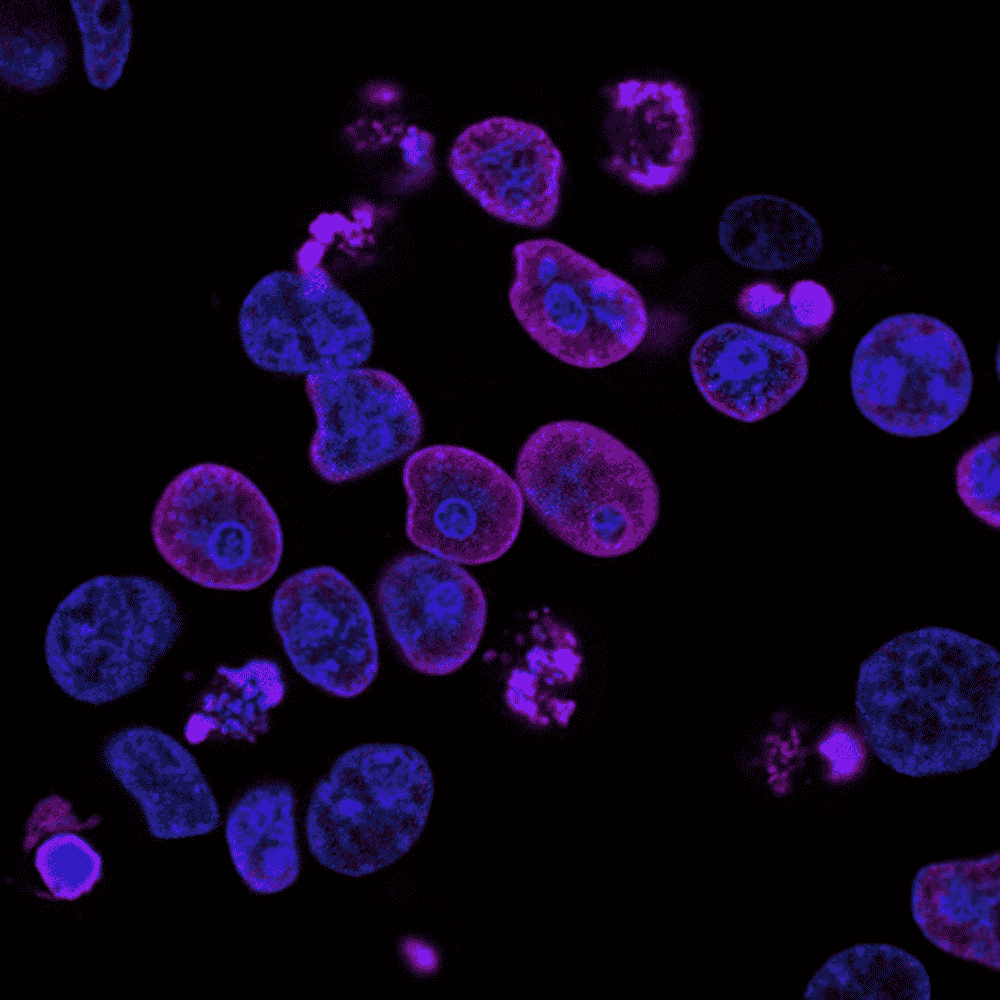
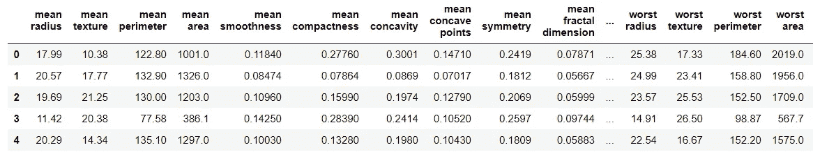

# 利用 Gridsearchcv 建立乳腺癌数据集的 SVM 模型

> 原文：<https://pub.towardsai.net/using-gridsearchcv-to-build-svm-model-for-breast-cancer-dataset-7ca8e5cd6273?source=collection_archive---------2----------------------->

## [计算机视觉](https://towardsai.net/p/category/computer-vision)

## Python 中理解和实现支持向量机的指南。



[国立癌症研究所](https://unsplash.com/@nci?utm_source=unsplash&utm_medium=referral&utm_content=creditCopyText)在 [Unsplash](https://unsplash.com/s/photos/cancer-cells?utm_source=unsplash&utm_medium=referral&utm_content=creditCopyText) 上拍摄的照片

# 什么是支持向量机？

支持向量机缩写为 SVMs，是一种用于分类任务和回归分析的监督学习算法。它分析数据并识别模式。在这篇文章中，SVM 将演示一个分类问题。

# 为什么 SVM 是非概率二元线性分类器？

对于具有两个类别标签的一组数据点，SVM 算法建立一个模型，将任何新的数据点分配给其中一个类别，从而使其成为非概率二元线性分类器。

# SVM 是如何工作的？

SVM 以这样一种方式表示空间中的所有数据点，在单独类的例子之间有一个明显的宽间隙。然后，每个新的数据点被映射到这个空间中，并放置在间隙的任一侧。

# 如何用 Python 实现？

使用的数据集将是来自 sklearn“乳腺癌”的内置数据集。目标是将肿瘤分类为恶性或良性。

**→导入库**

导入 Pandas 和 numpy 来处理数据，并使用 matplotlib 和 seaborn 来实现数据可视化。

```
**>>> import** pandas **as** pd
**>>> import** numpy **as** np
**>>> import** matplotlib.pyplot **as** plt
**>>> import** seaborn **as** sns
**>>> %**matplotlib inline
```

**→读取数据**

```
**>>> from** sklearn.datasets **import** load_breast_cancer
>>> data **=** load_breast_cancer()
```

数据以字典的形式呈现。使用关键字和其中的信息创建数据帧。

```
>>> data.keys()
dict_keys(['data', 'target', 'frame', 'target_names', 'DESCR', 'feature_names', 'filename'])
```

提取数据和要素名称以形成数据集。

```
>>> df **=** pd.DataFrame(data['data'],columns**=**data['feature_names'])
>>> df.head()
```



**→将数据分成训练和测试集**

列车测试拆分功能是从 sklearn 导入的。

```
**>>> from** sklearn.model_selection **import** train_test_split>>> X **=** df
>>> y **=** data['target']>>> X_train, X_test, y_train, y_test **=** train_test_split(X, y, test_size**=**0.30)
```

**→建立模型**

SVC 包是从 sklearn 导入的，它的对象是在对训练数据集拟合模型之后创建的。

```
**>>> from** sklearn.svm **import** SVC>>> model **=** SVC()
>>> model.fit(X_train,y_train)
SVC()
```

**→预测**

```
>>> pred **=** model.predict(X_test)
```

**→评估指标**

```
**>>> from** sklearn.metrics **import** classification_report,confusion_matrix>>> confusion_matrix(y_test,pred)
array([[ 53,  13],
       [  2, 103]], dtype=int64)>>> print(classification_report(y_test,pred))
precision    recall  f1-score   support 0       0.96      0.80      0.88        66
           1       0.89      0.98      0.93       105 accuracy                           0.91       171
   macro avg       0.93      0.89      0.90       171
weighted avg       0.92      0.91      0.91       171
```

**→改进模型**

通过选择合适的参数，该模型可以进一步改进。使用 sklearn 的 GridSearchCV 功能可以有效地做到这一点。创建参数“网格”并尝试所有可能的组合被称为网格搜索。

GridSearchCV 将一个字典作为输入，该字典包含应该尝试的参数和要训练的模型。参数网格被定义为一个字典，其中键是参数，值是要测试的设置。

```
**>>> from** sklearn.model_selection **import** GridSearchCV
```

参数“C”控制错误分类的成本。如果“C”值较大，则偏差较低，方差较大。如果“C”值较低，则偏差较大，方差较小。“γ”是径向基函数(RBF)的一个参数。如果“gamma”很小，则会导致高偏差和低方差，反之亦然。

因此,“C”和“gamma”的值的范围将通过在网格参数字典中定义它来测试。

```
>>> grid_param **=** {'C': [0.1,1, 10, 100, 1000],'gamma':[1,0.1,0.01,0.001,0.0001],'kernel': ['rbf']}
```

模型中的“GridSearchCV”估计值以及网格参数。然后选择详细。数字越大，越详细。verbose 是描述流程的文本输出。

```
>>> grid **=** GridSearchCV(SVC(),grid_param,verbose**=**3)
```

接下来，这个网格适合训练数据。首先，它通过交叉验证运行相同的循环来找到最佳的参数组合。在获得最佳组合后，它对传递到 fit 的所有数据再次运行 fit，而不进行交叉验证，以使用最佳参数设置构建单个新模型。

```
>>> grid.fit(X_train,y_train)
Fitting 5 folds for each of 25 candidates, totalling 125 fits
[CV] C=0.1, gamma=1, kernel=rbf ......................................
[CV] .......... C=0.1, gamma=1, kernel=rbf, score=0.637, total=   0.0s
[CV] ........ C=0.1, gamma=0.1, kernel=rbf, score=0.637, total=   0.0s
.
.
.
.
.
[CV] C=1000, gamma=0.0001, kernel=rbf ................................
[CV] .... C=1000, gamma=0.0001, kernel=rbf, score=0.924, total=   0.0s
[Parallel(n_jobs=1)]: Done 125 out of 125 | elapsed:    4.3s finishedGridSearchCV(estimator=SVC(),
             param_grid={'C': [0.1, 1, 10, 100, 1000],
                         'gamma': [1, 0.1, 0.01, 0.001, 0.0001],
                         'kernel': ['rbf']},
             verbose=3)
```

最佳参数设置可通过使用“最佳参数”函数获得，最佳估计值可通过使用“最佳估计值”设置获得。

```
>>> grid.best_params_
{'C': 1, 'gamma': 0.0001, 'kernel': 'rbf'}>>> grid.best_estimator_
SVC(C=1, gamma=0.0001)
```

现在可以使用这些新设置进行预测。

```
>>> pred2 **=** grid.predict(X_test)>>> confusion_matrix(y_test,pred2)
array([[ 59,   7],
       [  2, 103]], dtype=int64)>>> print(classification_report(y_test,pred2))
precision    recall  f1-score   support 0       0.97      0.89      0.93        66
           1       0.94      0.98      0.96       105 accuracy                           0.95       171
   macro avg       0.95      0.94      0.94       171
weighted avg       0.95      0.95      0.95       171
```

因此使用网格搜索方法，模型性能有所提高。

> *这里指笔记本*[](https://github.com/jayashree8/Machine_learning_supervised_models/blob/master/Classification%20models/SVM.ipynb)**。**

## *初级机器学习书籍可以参考:*

*[](https://amzn.to/3i3XU1A) [## Python 机器学习:机器学习和深度学习的 Python 编程初学者指南](https://amzn.to/3i3XU1A) [](https://amzn.to/3fQc6IW) [## 一百页的机器学习书](https://amzn.to/3fQc6IW) 

## 可以参考的高级机器学习书籍:

[](https://amzn.to/2SxwQNw) [## 用 Scikit-Learn、Keras 和张量流进行机器学习:概念、工具和技术…](https://amzn.to/2SxwQNw) [](https://amzn.to/3wz62eE) [## 模式识别和机器学习(信息科学和统计学)](https://amzn.to/3wz62eE) 

> *联系我:* [*LinkedIn*](https://www.linkedin.com/in/jayashree-domala8/)
> 
> *查看我的其他作品:* [*GitHub*](https://github.com/jayashree8)*