# 利用机器学习从胸片中检测新冠肺炎

> 原文：<https://pub.towardsai.net/using-machine-learning-to-detect-covid-19-from-chest-radiographs-8e8294bcb308?source=collection_archive---------2----------------------->

## [深度学习](https://towardsai.net/p/category/machine-learning/deep-learning)

## 来自全球排名前 1.3%的 Kaggle 团队的见解

**作者:** [尤瑟夫·拉比](https://www.linkedin.com/in/yousefrabi/)[马克斯·凯尔森](https://maxkelsen.com/)的机器学习工程师

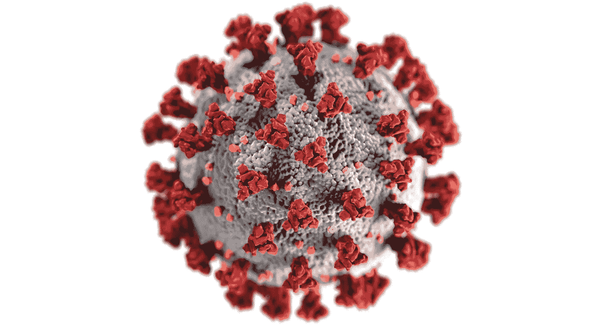

[疾控中心](https://unsplash.com/@cdc?utm_source=unsplash&utm_medium=referral&utm_content=creditCopyText)在 [Unsplash](https://unsplash.com/s/photos/coronavirus?utm_source=unsplash&utm_medium=referral&utm_content=creditCopyText) 上拍照

# 背景

目前，可以使用[聚合酶链式反应](https://en.wikipedia.org/wiki/Polymerase_chain_reaction) (PCR)来诊断新冠肺炎，然而，这一过程很慢，需要几个小时甚至几天才能获得结果。另一方面，胸片可以在几分钟内获得。

> 如果机器学习模型可以使用计算机视觉从胸片中检测到新冠肺炎，它可以大大加快新冠肺炎诊断。

[Kaggle](https://www.kaggle.com/) 是一个由超过 168，000 名数据科学家组成的社区，定期举办比赛以解决数据科学领域的挑战。Kaggle 与包括 [SIIM](https://siim.org/) 、[菲萨比奥](http://fisabio.san.gva.es/en/fisabio)和 [RSNA](https://www.rsna.org/) 在内的合作伙伴最近举办了一场在胸片上识别和定位新冠肺炎异常的比赛，我的团队在全球 1305 个团队中排名第 17 位(前 1.3%)。

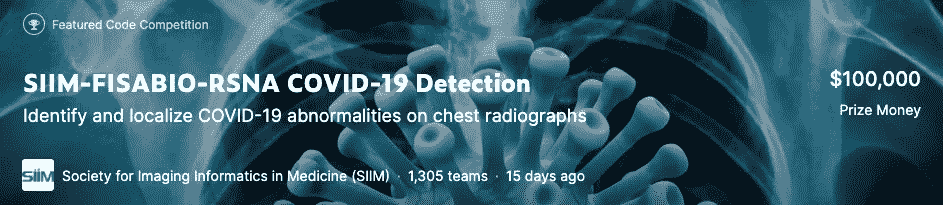

从比赛的描述来看:

> 新冠肺炎在胸片上看起来与其他病毒性和细菌性肺炎非常相似，这使得它很难诊断。你的检测和定位新冠肺炎的计算机视觉模型将帮助医生提供快速和自信的诊断。因此，患者可以在病毒最严重的影响出现之前得到正确的治疗。
> 
> 目前，可以通过聚合酶链反应从病毒或胸片中检测遗传物质来诊断新冠肺炎。然而，在分子测试结果出来之前，可能需要几个小时，有时甚至几天。相比之下，胸片可以在几分钟内获得。虽然存在帮助放射科医生区分新冠肺炎和其他类型感染的指南，但他们的评估各不相同。此外，可以用更好的疾病定位来支持非放射科医生，例如用可视边界框。

在本文中，我将向您介绍我们的竞赛分类方法，并阐明如何在 Kaggle 竞赛中取得好成绩。

# 数据

我们收到了 6054 份胸片。每个研究可以具有同一患者的一个或多个图像(即，胸片)。总共有 6，334 张图片。

比赛中使用的两个数据源是巴伦西亚地区医学成像数据库公布的 BIMCV-COVID19 数据和癌症成像档案馆公布的 MIDRC-RICORD 数据。

图像以 DICOM 格式提供。属于病历报告的图像位于该病历报告的子文件夹中。

对于每一幅图像，如果出现肺部阴影，我们会得到其位置的边界框。肺部阴影可能是由新冠肺炎、其他肺炎感染或不明原因引起的。

对于每项研究，我们都有一个研究级别的标签。它是['肺炎阴性'，'新冠肺炎典型'，'新冠肺炎不确定'，'新冠肺炎非典型']之一。以下是分别属于典型新冠肺炎和不确定新冠肺炎类别的研究中的两个示例图像，以及肺部阴影周围的边界框注释。

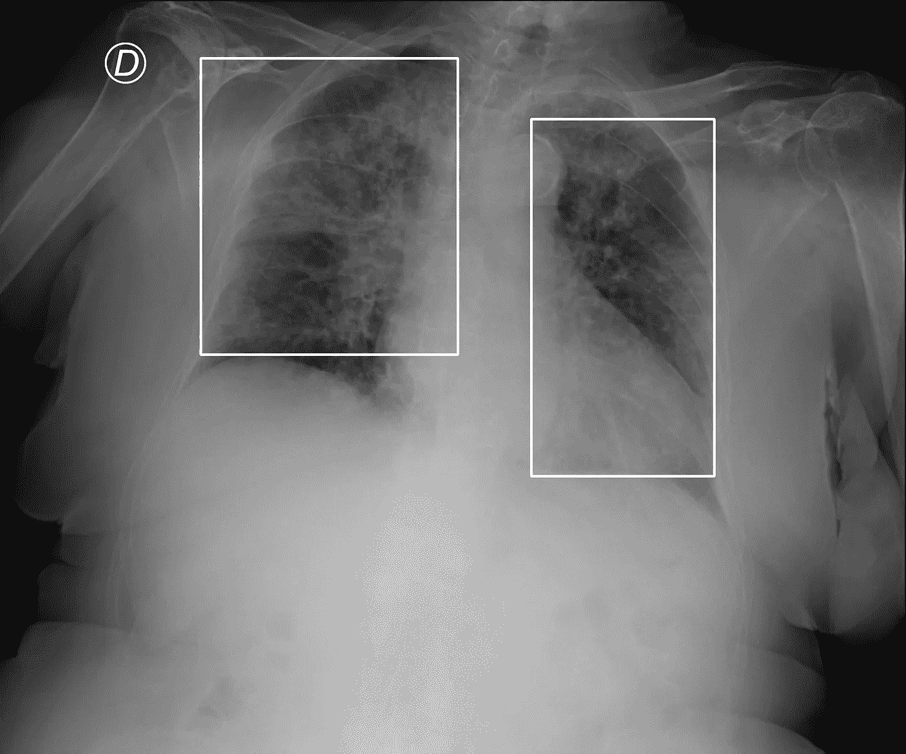

属于“新冠肺炎典型”研究的图像。边界框捕捉肺部阴影。[【8】](https://wiki.cancerimagingarchive.net/pages/viewpage.action?pageId=70230281)

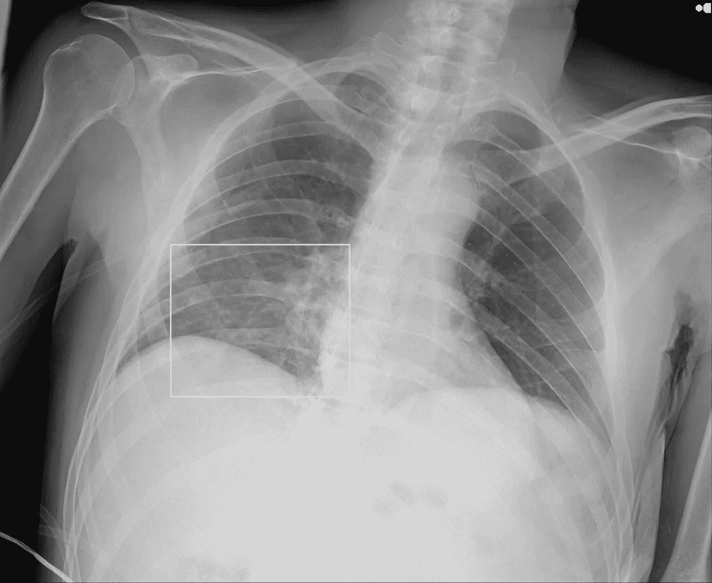

属于“新冠肺炎不确定”研究的图像。边界框捕捉肺部阴影。[【第八期】](https://wiki.cancerimagingarchive.net/pages/viewpage.action?pageId=70230281)

标签的含义可以从其标签方案用于注释图像的论文的摘录中获得。[【1】](https://pubmed.ncbi.nlm.nih.gov/32520846/)

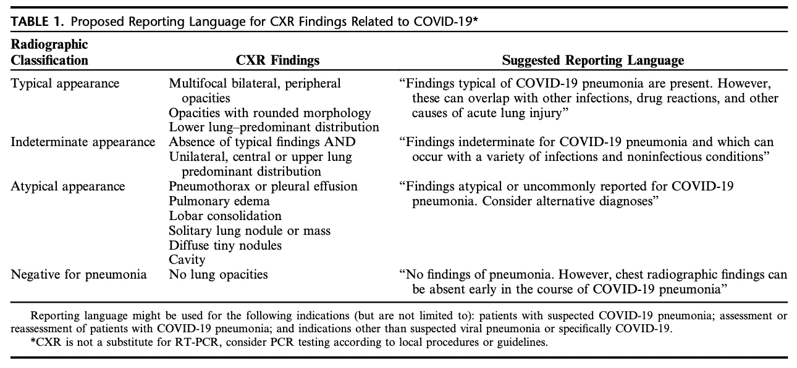

用于注释竞赛研究的标签方案。[【1】](https://pubmed.ncbi.nlm.nih.gov/32520846/)

# 任务

这项任务是双重的。我们必须将整个研究分为“肺炎阴性”、“新冠肺炎典型”、“新冠肺炎不确定”或“新冠肺炎非典型”。我们还必须通过预测胸片上可疑区域周围的边界框来定位肺部阴影。

从比赛的描述来看:

> 在这场比赛中，你将识别和定位胸片上的新冠肺炎异常。特别是，您会将 x 光照片分类为肺炎阴性，或者典型、不确定或新冠肺炎非典型。您和您的模型将处理来自一组放射学家的成像数据和注释。

提交的文件将包含分类和物体探测预测，并使用单一指标；**表示平均精度**(地图)。

# 方法

我负责竞赛的研究分类部分。

我试图遵循一种相对精炼的方法来解决计算机视觉问题。头几天，我花了大量的时间研究数据，查看大量的例子，看我是否能挑出一些模式，并记下我在这个初始阶段得到的任何想法。

我记录了我想尝试的想法，并使用概念按照优先级和潜在回报不断重新排序。

我的概念实验管理页面的一个例子:

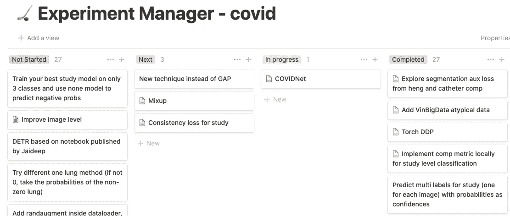

在探索阶段之后，我做的第一件事是建立一个健壮的交叉验证(CV)框架。对于这次比赛，我与**分层组 K 折叠**，在研究 ID 和标签 ID 上分层。

这意味着一份病历报告只能放在一个文件夹中，即使它包含多张图像。这也意味着当创建不同的折叠时，训练集中的标签比例将被保留。我还删除了数据集中存在的重复图像——重复图像可能会出现在训练集和验证集中，导致 CV 指标膨胀。

在交叉验证建立之后，我的目标是建立一个迭代的基线。

我通常不会在开始时查看已发布的代码、内核或讨论，这样我就不会受到流行方法的影响或产生偏见。

在一个清晰的基线建立后，我记录 CV 和排行榜(LB)分数。我记录了所有 CV 和 LB 提交的带有实验描述的分数。这有助于我评估本地简历和 LB 之间的相关性，并指导整合和提交选择。

实验日志的一个例子:

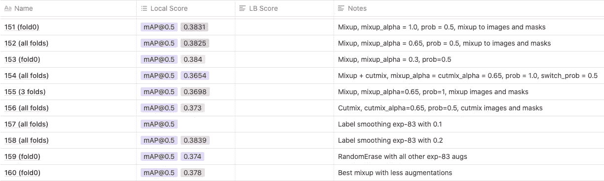

在那之后，是一个又一个实验——通过阅读论文、讨论或代码、与队友合作、回顾过去的竞争解决方案以及基于以前实验的定量和定性反馈产生的任何其他想法。

这里的关键是在管道中有正确的抽象级别来释放所需的迭代速度。

我还使用 [TensorBoard](https://www.tensorflow.org/tensorboard) 在一个地方记录所有实验的指标，以便我可以轻松地比较运行。

我个人最终仅在分类部分就运行了 163 个实验，其中许多实验为单个实验训练了 5 倍模型。来自不到 10 个实验的想法促成了提交的分类集合。

# 什么奏效了

早期，我使用 Grad-CAM[【2】](https://arxiv.org/abs/1611.07450)来可视化对网络决策有贡献的区域。我注意到胸片上的黑角总是对决定有很大影响，比其他相关区域影响更大。这可以从下面的全 X 射线图像中看出，在图像的左下角显示了高梯度激活。

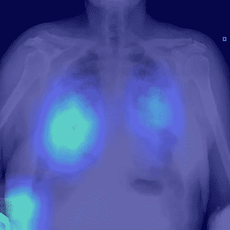

在全 x 光图像上训练的网络 GradCAM。图片来自[【8】](https://wiki.cancerimagingarchive.net/pages/viewpage.action?pageId=70230281)

对于新冠肺炎的诊断，我们只需要肺。我决定构建一个肺部检测器，这样我们就可以只将肺部图像提供给下游的分类器。我相信这将在两个方面有所帮助:

1.  为了减少来自网络用来走捷径的非肺部区域的潜在噪声
2.  允许更有效的训练，因为我们只在与任务相关的区域进行训练(如肺部)

有了肺部检测器，我们的分类模型提高了约 4%。在剩下的比赛中我们一直坚持着。

这场比赛的关键之一是**辅助损耗**。

深度学习算法从损失函数提供的反馈中学习，即通过反向传播损失的梯度并使用这些来更新网络的参数。

每个任务都有一个合适的损失函数，其优化有助于网络更好地完成任务。例如，用于多类分类任务的常见损失函数是交叉熵。二进制分类的一个共同点是二进制交叉熵。

当数据不足时，网络会过度拟合，本质上是记忆训练数据，而不是学习作为决策基础的可概括特征。

减少这种过拟合的方法之一是引入辅助损耗。如果你愿意的话，这些是补充的或次要的损失，与手头的任务有关，但不直接导致它。

它们本质上使网络更难记住训练数据和相关联的标签，因为现在它必须记住两个不同任务的标签——主要损失和辅助损失各一个。这一点可以从下面两个损耗图看出来。

第一个是对没有任何辅助损失的完整图像训练的网络，而第二个是对有辅助损失的肺训练的相同网络。在非辅助情况下，验证损失约为训练损失的 1.16 倍，而在辅助情况下，验证损失约为训练损失的 1.07 倍，辅助情况下的 mAP 分数约高 10%(图中未显示)。肺部定位和辅助损失被正则化并使网络学习得更好。

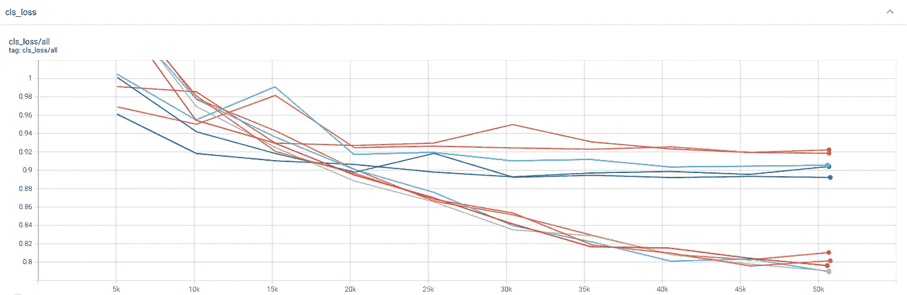

无辅助损耗的网络训练损耗。顶部的曲线组用于五个验证折叠，而底部的曲线组用于一次运行中的五个训练数据集。

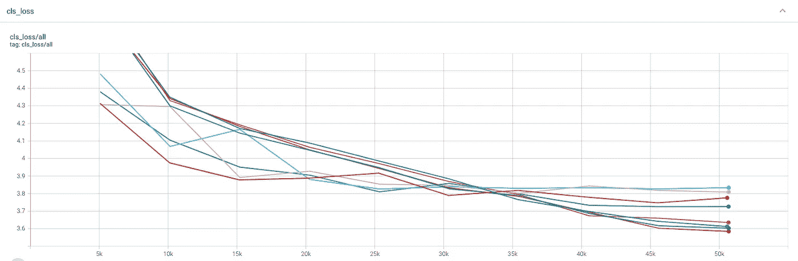

用辅助损耗训练的网络损耗。顶部的曲线组用于五个验证折叠，而底部的曲线组用于一次运行中的五个训练数据集。

在本次竞赛中，我们获得了两个研究级别标签(“肺炎阴性”、“新冠肺炎典型”、“新冠肺炎不确定”或“新冠肺炎非典型”)，以及不透明位置的边框注释。

我们可以将边界框注释转换为二进制掩码，并使用二进制掩码在网络中引入辅助分割损失——实质上要求网络不仅预测研究级别标签，还预测肺部阴影可能出现的分割。

使用分段辅助损失将我们的分类模型提高了大约 5%。然而，这来自于许多探索如何最大化辅助损失收益的实验。

首先，我们在分类损失(交叉熵)和辅助损失(二元交叉熵)之间使用 1:1 的比率。我注意到对*分类:分割*损失使用更高的比率提供了改进，我们决定使用 1:10 *分类:分割*损失比率。

另一个额外的好处来自用于二进制蒙版的图像分辨率。最初，我们使用网络中倒数第二个块的特征图，将其传递到两个卷积层，并根据下采样不透明度二进制蒙版(32x32)计算损失。

我尝试使用几个卷积层，并在这个过程中对预测的不透明度遮罩进行上采样，以计算输入图像分辨率(448x448)下二进制遮罩的损失。这提高了成绩，我们在剩下的比赛中坚持了下来。一种可能性是，辅助的好处在较高的分辨率下更明显，因为更难过度拟合。

我们从 B3 高效网络开始，但后来转移到了高效网络 V2_L

肺检测器和辅助损失使得网络更好地关注图像的更多相关区域。以下是仅在肺上训练的网络的梯度激活，并且使用与之前相同的图像使用辅助损失。

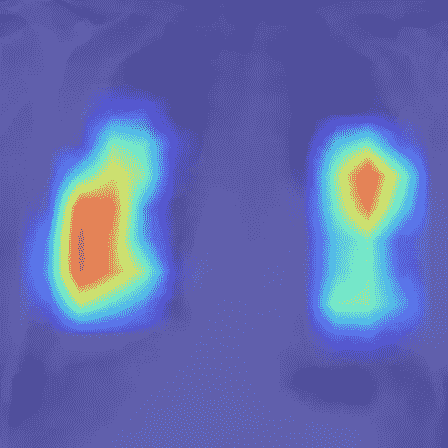

网络的 GradCAM 训练了肺和辅助损失。图片来自[【8】](https://wiki.cancerimagingarchive.net/pages/viewpage.action?pageId=70230281)

我们的网络架构:

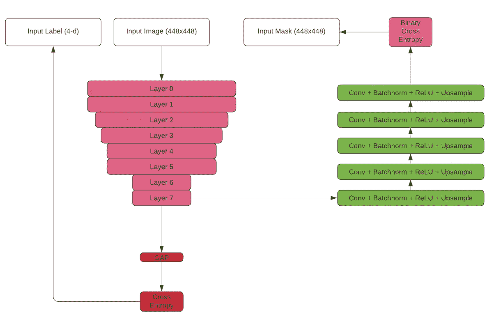

基于高效网络的最佳分类网络体系结构

我们采用的增强技术是:

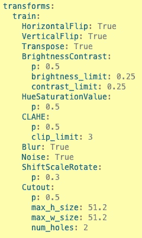

增强配置。

其他培训详情如下:

*   SGD 的学习率为 1.0e-2，动量为 0.9，重量衰减为 1.0e-5
*   CosineAnnealingLR 计划程序
*   为每个褶皱的模型训练 10 个时期
*   4 倍测试时间增加
*   混合精确训练和推理

# 什么没起作用

这次比赛有很多潜在的有用的外部数据。来自其他肺炎比赛和开源新冠肺炎数据集的数据，等等。

我们无法从这些数据源中获得任何好处，因为不同的标记方案，也因为我们在尝试使用最佳模型对外部数据进行伪标记时犯了一个错误。

当我们尝试伪标签时，我们从我们的最佳研究分类模型中挑选了五重模型，并使用所有这些模型的**来预测外部数据上的标签。我们将软伪标记的外部数据添加到所有训练折叠中，并使用相同的验证折叠从头开始重新训练。**

存在错误——使用在验证折叠 0 上训练的模型来伪标记外部数据并将其添加到训练折叠中，同时仍然在折叠 0 上验证会将目标泄漏引入训练中。这通过泄漏而不是通过学习人为地夸大了我们的交叉验证分数。

此外，一些外部数据被用于竞争数据，这是另一个泄漏源，我们得到了非常高的 CV 分数，但没有反映在 LB 上。

我们团队中的大师(CPMP)提醒了我们这一点，但在剩下 4 天的时间里重新训练模型为时已晚，因为总数据集接近 50，000 个样本。

因为这个原因，我们大部分用外部数据做的实验都失败了。

# 概括起来

在对病历报告进行分类时，什么对我们有帮助:

*   GradCAM 的见解导致肺部检测器最大限度地减少噪音并提高训练效率。
*   用于正则化的辅助损耗(我们的集合使用具有 BCE 和 dice 损耗的模型作为辅助损耗)
*   用于辅助任务的更强的解码器，并且使用原始图像维度而不是下采样特征图来计算辅助损失
*   EfficientNetV2 而不是 EfficientNet
*   标签平滑

一些没有成功的事情:

*   使用外部数据(手动或伪标记)
*   不同的损失函数(聚焦、回火 softmax、Lovasz 用于辅助)
*   swin transformer[【3】](https://arxiv.org/abs/2103.14030)
*   通过研究中图像频率的倒数来衡量每个图像的损失
*   只需训练两次[【4】](https://arxiv.org/abs/2107.09044)
*   混乱
*   cutmix[【6】](https://arxiv.org/abs/1905.04899)
*   随机酶[【7】](https://arxiv.org/abs/1708.04896)

我要感谢我的队友，Rohit Singh，Jaideep Valani，Ioannis Meintanis 和江泽龙·普吉特。我从我们的讨论中学到了很多。

# 参考

[[1]利特曼诺维奇德，钟 M，柯克布里德 RR，基茨卡 G，坎内 JP。回顾新冠肺炎肺炎的胸片表现和建议的报告语言。胸部影像杂志。2020 年 11 月 14 日；35(6):354–60.](https://pubmed.ncbi.nlm.nih.gov/32520846/)

[[2] Selvaraju，R.R .，Das，a .，Vedantam，r .，Cogswell，m .，Parikh，d .，Batra，d .，2016。你为什么这么说？。 *arXiv 预印本 arXiv:1611.07450* 。](https://arxiv.org/abs/1611.07450)

[[3]刘，张，林，杨，曹，胡，胡，魏，杨，张，张，林，郭，2021。Swin transformer:使用移位窗口的分层视觉转换器。 *arXiv 预印本 arXiv:2103.14030* 。](https://arxiv.org/abs/2103.14030)

[[4]刘，E.Z .，Haghgoo，b .，陈，A.S .，Raghunathan，a .，Koh，P.W .，Sagawa，s .，梁，p .和 Finn，c .，2021 年 7 月。只需训练两次:无需训练群体信息提高群体鲁棒性。在*机器学习国际会议*(第 6781–6792 页)。PMLR。](https://arxiv.org/abs/2107.09044)

[[5]张，h .，西塞，m .，多芬，Y.N .，洛佩斯-帕兹，d .，2017。混淆:超越经验风险最小化。 *arXiv 预印本 arXiv:1710.09412* 。](https://arxiv.org/abs/1710.09412)

[【6】云，s，韩，d，哦，S.J，春，s，崔，j，柳，y，2019。Cutmix:用可定位特征训练强分类器的正则化策略。IEEE/CVF 国际计算机视觉会议的会议记录(6023–6032 页)。](https://arxiv.org/abs/1905.04899)

[[7]钟，郑，李，康，李，杨，杨，2020 年 4 月。随机擦除数据增强。在*AAAI 人工智能会议记录*(第 34 卷，第 07 期，第 13001-13008 页)。](https://arxiv.org/abs/1708.04896)

[【8】](https://wiki.cancerimagingarchive.net/pages/viewpage.action?pageId=70230281)[de la Iglesia vay，m .，Saborit，J.M .，Montell，J.A .，Pertusa，a .，Bustos，a .，Cazorla，m .，Galant，J. and Barber，x .，d .奥罗兹科-贝尔特兰，f . garca-garca，M. CaparrÃ，G. Gonzà lez，JM 萨利纳斯，Bimcv 新冠肺炎+:一个来自新冠肺炎患者的 rx 和 ct 图像的大型注释数据集(2020)。 *arXiv 预印本 arXiv:2006.01174* 。](https://arxiv.org/abs/2006.01174)