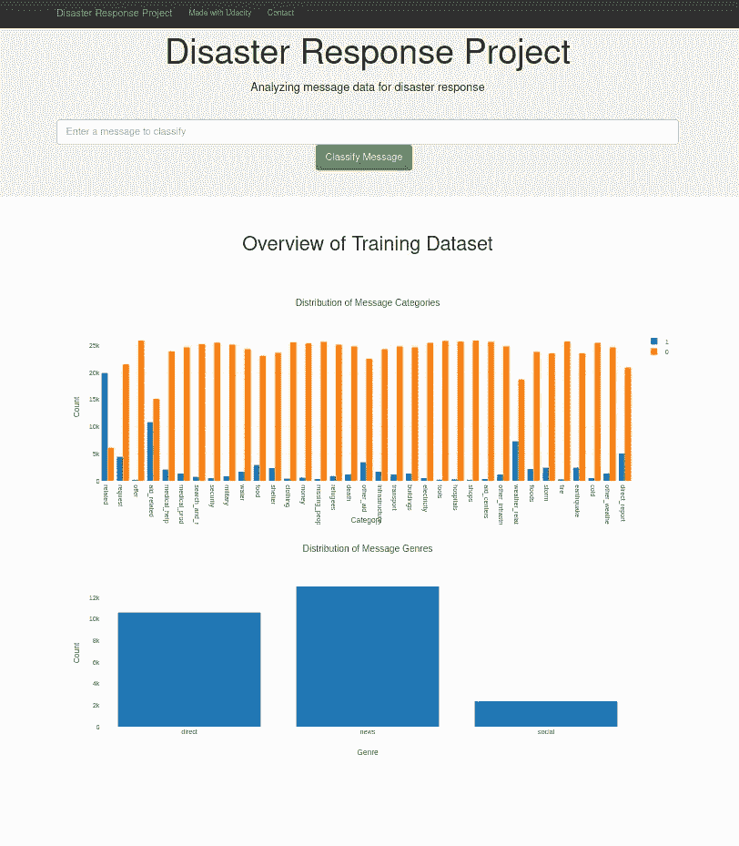
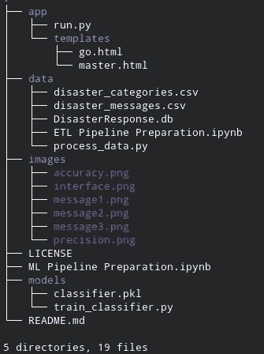
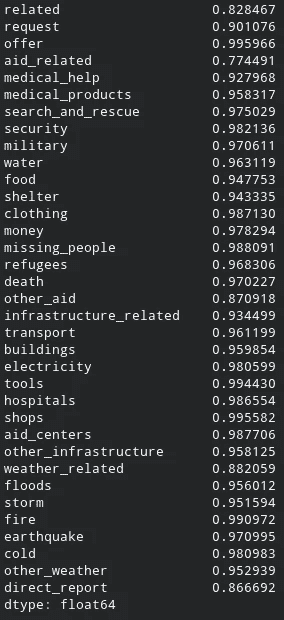
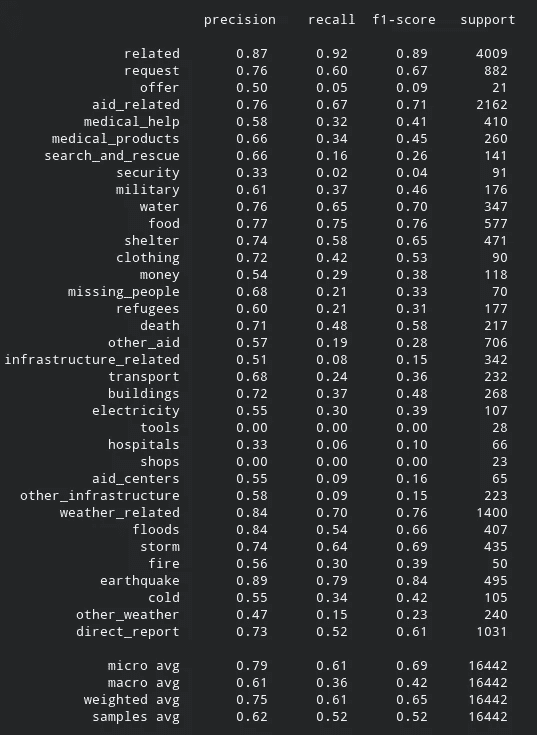
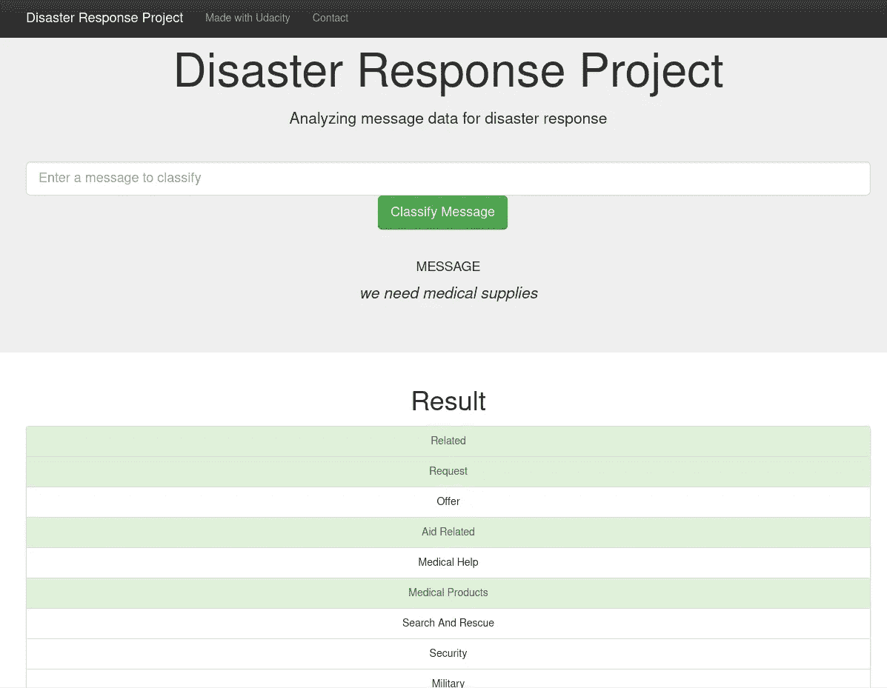
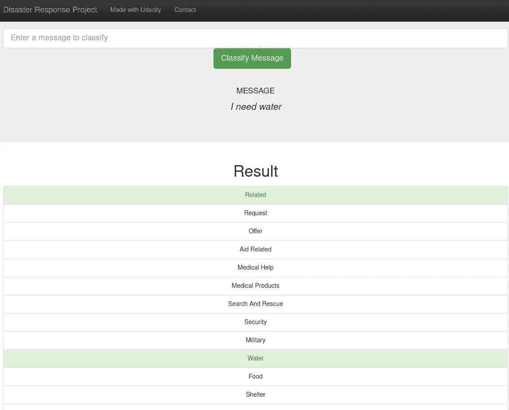
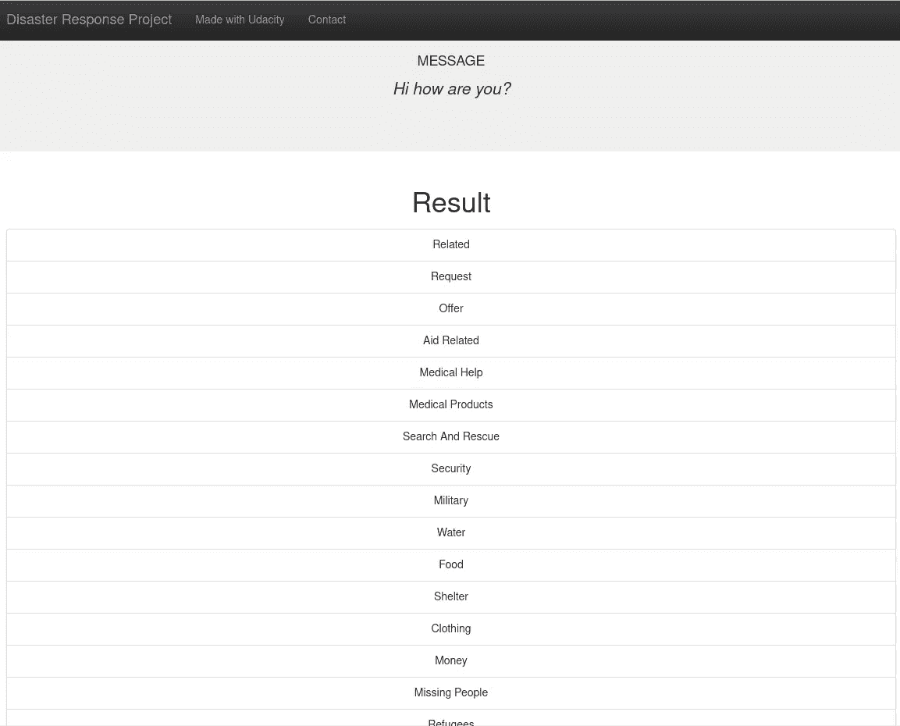

# 自然语言处理在灾难应对中的应用

> 原文：<https://pub.towardsai.net/using-nlp-in-disaster-response-9a39b16fdd13?source=collection_archive---------4----------------------->

在这个项目中，我们将应用 ETL、NLP 和 ML 管道来分析来自**图八**的灾难数据，以构建一个对灾难消息进行分类的 API 模型。

这是数据科学和机器学习中最关键的问题之一。在一场灾难中，我们直接或通过社交媒体收到了数百万条信息。我们大概会看到 1/1000 的相关消息。在灾难应对中，会用到一些关键词，比如水、封锁的道路和医疗用品。我们有一个分类数据集，利用它我们可以训练一个 ML 模型，看看我们是否可以识别哪些消息与灾难响应相关。

**主网页界面**



作者图片

在此项目中，数据科学项目的三个主要特征得到了利用:

1.  **数据工程** —在这一部分，我致力于如何提取、转换和加载数据。之后我准备了模型训练的数据。为了做好准备，我通过删除坏数据( **ETL 管道**)来清理数据，然后使用 NLTK 对数据进行标记化和符号化( **NLP 管道**)。最后使用自定义特性，如 StartingVerbExtractor 和 StartingNounExtractor，向主数据集添加新的。
2.  **模型训练** —我使用 XGBoost 分类器为模型训练创建 ML 管道。
3.  **模型部署** —对于模型部署，我使用了 flask API。

这个项目是在 anaconda 平台上使用 jupyter notebook jupyter notebook 完成的。如何安装 anaconda 的详细说明可以在[这里](https://docs.conda.io/projects/conda/en/latest/user-guide/install/index.html)找到。要创建一个虚拟环境，请看[这里](https://docs.conda.io/projects/conda/en/latest/user-guide/tasks/manage-environments.html)

在虚拟环境中，克隆存储库:

```
git clone [https://github.com/abhishek-jana/Disaster-Response-Pipelines.git](https://github.com/abhishek-jana/Disaster-Response-Pipelines.git)
```

用于本项目的 Python 包有:

```
Numpy 
Pandas 
Scikit-learn 
NLTK 
re 
sqlalchemy 
pickle 
Flask 
Plotly
```

1.  在项目的根目录中运行以下命令来设置您的数据库和模型。

*   运行 ETL 管道来清理数据并将其存储在数据库中`python data/process_data.py data/disaster_messages.csv data/disaster_categories.csv data/DisasterResponse.db`
*   运行训练分类器并保存的 ML 管道`python models/train_classifier.py data/DisasterResponse.db models/classifier.pkl`

2.在应用程序的目录中运行以下命令来运行您的 web 应用程序。`python run.py`

该项目的结构如下:



**数据**文件夹包含数据“disaster_categories.csv”和“disaster_messages.csv”以提取消息和类别。“DisasterResponse.db”是保存在 SQLite 数据库中的数据集的清理版本。“ETL Pipeline Preparation.ipynb”是解释数据准备方法的 jupyter 笔记本。“process_data.py”是笔记本的 python 脚本。

“ML Pipeline Preparation.ipynb”是解释模型训练方法的 jupyter 笔记本。相关的 python 文件“ **train_classifier.py** ”可以在“**models”**文件夹下找到。最终训练好的模型保存为“**models”**文件夹中的“classifier.pkl”。

**app** 文件夹包含“run.py”脚本，用于在 web 上呈现可视化和结果。**模板**文件夹包含了。web 界面的 html 文件。

准确度、精确度和召回率为:

**精度**



**精度和召回**



也给出了对消息的一些预测:

**消息 1**



**消息 2**



**消息三**



未来，我计划在项目的以下领域开展工作:

1.  测试不同的估计值，并在数据中添加新的特征，以提高模型的准确性。
2.  添加更多的可视化来理解数据。
3.  改进网页界面。
4.  根据 ML 算法将文本分类到的类别，建议一些组织进行连接。

5.该数据集是不平衡的(例如，像水这样的一些标签几乎没有实例)。在自述文件中，讨论这种不平衡如何影响模型的训练，以及您对强调各种类别的精确度或召回率的看法。

该项目的 GitHub 链接可以在这里找到[。](https://github.com/abhishek-jana/Disaster-Response-Pipelines/tree/main)

# 承认

我感谢 Udacity 数据科学纳米学位项目和 figure figure figure 在这个项目中激励了我。

我也感谢 figure eight 将数据公之于众。