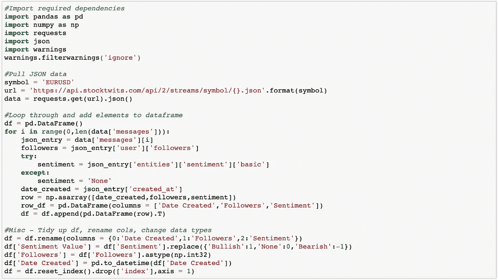
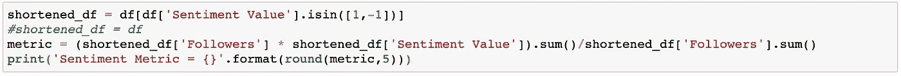
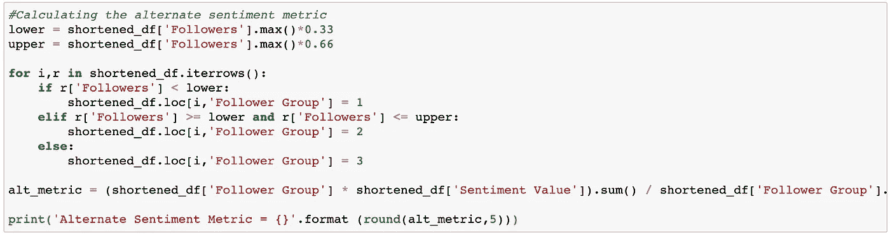
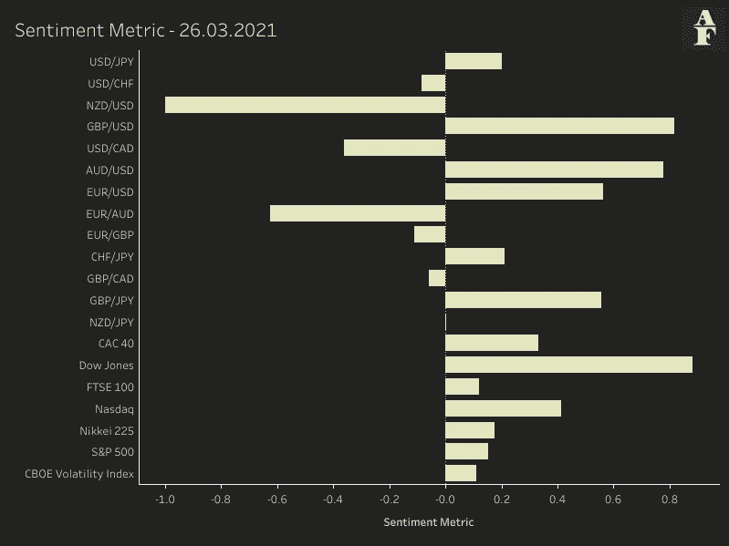

# 使用 Stocktwits 创建投资者情绪指标

> 原文：<https://pub.towardsai.net/using-stocktwits-to-create-an-investor-sentiment-metric-a137a2dfac2b?source=collection_archive---------2----------------------->

## [编程](https://towardsai.net/p/category/programming)

图片来自 [Pixabay](https://pixabay.com/?utm_source=link-attribution&amp;utm_medium=referral&amp;utm_campaign=image&amp;utm_content=5090539) 的 [xresch](https://pixabay.com/users/xresch-7410129/?utm_source=link-attribution&amp;utm_medium=referral&amp;utm_campaign=image&amp;utm_content=5090539)

## 介绍

Stocktwits 被宣传为交易者的社交媒体渠道。在他们的网站上，你可以通过滚动条搜索，查看不同账户的评论，以及相关的看涨、看跌或中性方向。每张图的正上方是一个情绪值，它将每天看涨和看跌消息或“twits”的数量汇总成一个单一的指标。

这个指标有一些问题。最主要的一点是，它没有考虑到用户是谁。任何人都可以在 Stocktwits 上创建一个帐户，并在任何他们想要的股票上发表意见。这并不是说他们一定是错的，但是可能会有一些用户的意见你会比其他人更重视。

对此的一个解决方法是设计您自己的指标。本文中展示的方法很简单，由于 Stocktwits API 只允许我获取 30 条最近的消息，所以它的能力略有限制，但这是一个可以轻松扩展更多数据的框架，并且有可能为我们提供比 Stocktwits 指标更清晰的情绪图像。

## 方法学

那么，我们如何创建一个指标，给我们认为更“见多识广”的交易者以信任呢？到目前为止，最简单的方法是根据用户拥有的关注者数量对每条消息进行加权。我们假设一个在他们看来有成功历史的用户会获得一个追随者，因为其他用户会观察到这一点并通过追随他们的帐户来回应。随着用户继续提供更多有用的见解，我们预计他的追随者会增加，因此他们在我们算法中的重要性也会增加。

Stocktwits API 是免费的，不需要任何认证。它允许您访问来自用户的与我们提供的符号相关的 30 条最新消息。我的代码的第一部分获取 EURUSD 消息并遍历返回的 JSON 文件，为我们呈现一个包含 3 列的数据框架，即消息日期、用户的关注者数量以及用户指定的情绪值(看涨、看跌或中性)。

作者代码摘录

下一步是计算我们的指标。我们已经将情绪转换为数字，以确定它们如何影响我们的价值，因此看跌情绪将被分配为-1，看涨情绪将被分配为+1，中性情绪将被分配为 0。我们的指标将返回一个介于-1 和 1 之间的值，计算方法是将 followers 列乘以 perspective 列，然后除以 followers 列的总和。

人们很快发现，大量的“中性”信息严重稀释了我的情绪指标。拥有最多关注者的用户所需要做的就是保持中立，我们的指标将非常接近于 0，不会给我们一个很好的情绪指标。解决方案是完全删除中性信息。这和股票投机者自己使用的策略是一样的，他们忽略任何中性的信息，只汇总看涨和看跌的信息。

作者代码摘录

我还发现这个指标有一个可选的修改，非常有用。类似于我在中性消息中观察到的问题，如果一个用户的关注者数量明显高于所有其他人，我们的情感指标会受到他的严重影响。理想情况下，我们不希望这种情况发生，一个高度关注的用户应该这样加权，但不要达到他们占我们整个指标的 90%的程度。

解决方案是将我们的追随者分配到三个组中的一个，每个组代表拥有最多追随者的 33%的用户群。然后，我们使用追随者群体作为我们的权重，而不是用户拥有的追随者的实际数量。

作者代码摘录

人们可以对这个模型做出许多分支。虽然 API 非常有限，但是如果我们构建一个 scraper 来直接从 Stocktwits 网站获取信息，就有可能获得更多的数据。类似的过程可以通过 Twitter 来完成，我们通过标签进行搜索，并使用某种形式的自然语言处理来衡量推文的情绪，然后通过追随者进行加权。然而，我们在 Twitter 上遇到的潜在问题是，它的目的不仅仅是发布交易想法，因此，我们的关注者数量可能会有偏差。偶尔交易者可能会因为他们提供的其他内容而拥有成千上万的追随者，因此在我们的模型中给他们一个高权重是不准确的。

以下是 Stocktwits 对一组重要资产的看法表，来自 3 月 26 日晚 21:00 GMT 运行的代码，作为示例输出。

作者图片

感谢您花时间阅读这篇文章。如果你喜欢这些内容，我将推出一份新的算法金融时事通讯，名为 Algo Fin，你可能会感兴趣。这篇时事通讯将探索数据科学和金融之间的联系，最初的重点是货币市场，但我希望在未来建立更多的途径。时事通讯目前是免费加入的，因为我仍计划为付费订户推出，所以如果这听起来像是你可能感兴趣的东西，它绝对值得查看[这里](https://algofin.substack.com/)！。