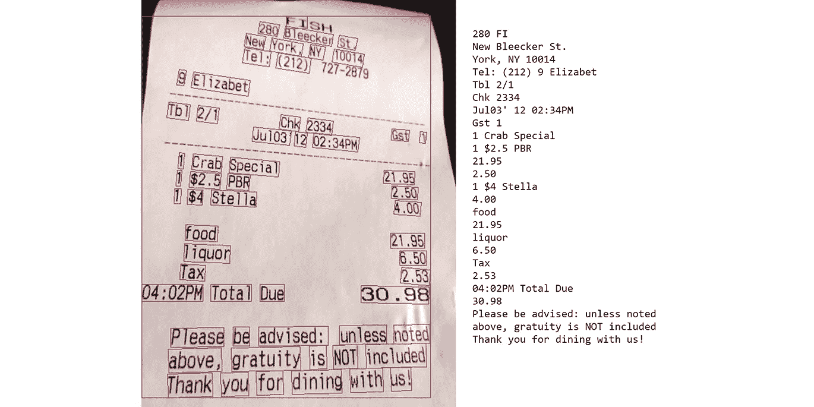
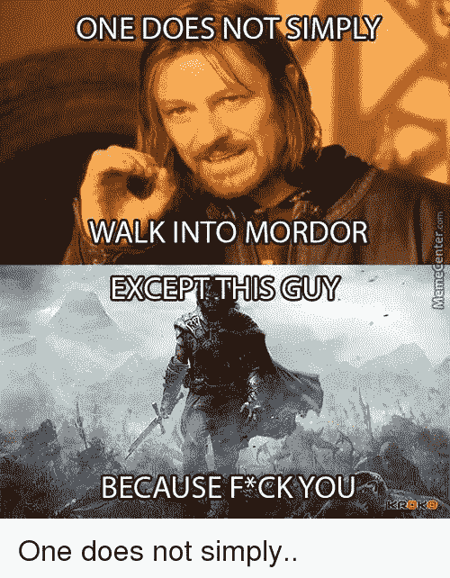

# 通过 Google Colab 使用 Tesseract-OCR 进行文本识别

> 原文：<https://pub.towardsai.net/using-tesseract-ocr-for-text-recognition-with-google-colab-1c4513b9d3e0?source=collection_archive---------0----------------------->

## [光学字符识别系统](https://towardsai.net/p/category/systems)

## 在 Google Colab 上安装宇宙魔方并试用



检索自:[https://www . leanx . eu/tutorials/use-Google-cloud-vision-API-to-process-invoices-and-receipts](https://www.leanx.eu/tutorials/use-google-cloud-vision-api-to-process-invoices-and-receipts)

* * *以上是 Google OCR API 的一个例子，希望有一天我也能对 Tesseract 做同样的事情

## 装置

这个库的安装花了我比平时更长的时间。

```
!pip install pytesseract
```

虽然您应该从使用 pip 安装 pytesseract 开始，但是如果您尝试运行库，它将运行错误。

```
TesseractNotFoundError: /usr/bin/tesseract is not installed or it's not in your PATH
```

安装有点忙乱。事实上，您首先需要安装另一个名为 tesseract-ocr 的包，并与。exe 文件(都写在说明里，在我的回购上有，不要绝望)。

```
!sudo apt install tesseract-ocr
```

确保同时安装两个库。

## 导入库

```
try:
 from PIL import Image
except ImportError:
 import Image
import cv2
import pytesseract
```

## 正在检查安装文件夹

在继续之前，您将需要找出在哪里可以找到宇宙魔方执行文件。

```
!which tesseract
/usr/bin/tesseract
```

现在可以复制输出来指定。exe 文件。不幸的是，这似乎是让 Tesseract 在 Google Colab 上工作的唯一变通方法。到目前为止，这似乎是我搜索过的众多教程中唯一有效的。

```
pytesseract.pytesseract.tesseract_cmd = (
    r'/usr/bin/tesseract'
)
```

库应该已经被正确导入。

## 导入图像

我将使用 cv2 库来导入和编辑图像。我必须确保在我的笔记本存储器中我已经上传了我想要的图像，并且我可以正确地访问它的路径。在这种情况下，图像被称为 image.png。



我最喜欢的迷因之一！

```
img_cv = cv2.imread(r'/content/image.png')# By default OpenCV stores images in BGR format and since pytesseract assumes RGB format,
# we need to convert from BGR to RGB format/mode:
#d = cv2.cvtColor(img_cv, cv2.COLOR_BGR2RGB)
```

我可以直接把图像输入模型。知道在使用 Tesseract 时可以使用各种配置选项:

```
#Page segmentation modes:
#  0    Orientation and script detection (OSD) only.
#  1    Automatic page segmentation with OSD.
#  2    Automatic page segmentation, but no OSD, or OCR.
#  3    Fully automatic page segmentation, but no OSD. (Default)
#  4    Assume a single column of text of variable sizes.
#  5    Assume a single uniform block of vertically aligned text.
#  6    Assume a single uniform block of text.
#  7    Treat the image as a single text line.
#  8    Treat the image as a single word.
#  9    Treat the image as a single word in a circle.
# 10    Treat the image as a single character.
# 11    Sparse text. Find as much text as possible in no particular order.
# 12    Sparse text with OSD.
# 13    Raw line. Treat the image as a single text line,
#                        bypassing hacks that are Tesseract-specific.
```

让我们试着看看输出:

```
#by using print we avoid a single string containing various /n
print(pytesseract.image_to_string(img_cv, lang='eng', config='-psm 1'))
...
ONE DOES NOTSSIMPINGWALK INTO MORDOROne does not simply..
```

不幸的是，到目前为止还不完美。然而，本文的目标是能够在 Google Colab 中挂载 Tesseract OCR。在对这个库和 OpenCV (cv2)做了一些试验之后，我将发表另一篇文章，指导你如何获得更好的图像性能。恐怕这个工具需要一点深入的研究。