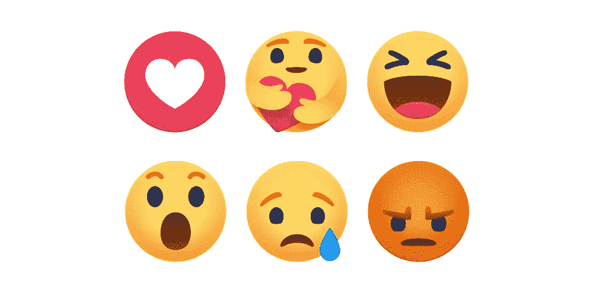
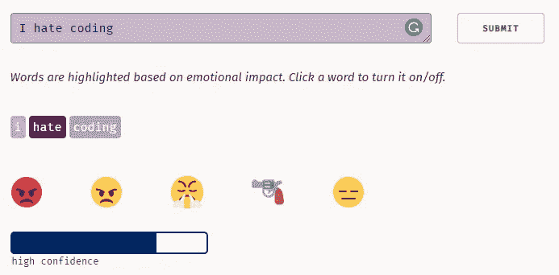

# 将 Torchmoji 与 Python 和深度学习结合使用

> 原文：<https://pub.towardsai.net/using-torchmoji-with-python-and-deep-learning-3fefee62c9a1?source=collection_archive---------1----------------------->

## [深度学习](https://towardsai.net/p/category/machine-learning/deep-learning)

## 利用深度学习将文本转换为表情符号。在我的 Github 库有完整的代码[。](https://github.com/arditoibryan/Projects/blob/master/20200618_torchMoji/torchMoji.ipynb)

一直很难找到关于如何使用 Python 来使用臭名昭著的 DeepMoji 的教程。在我的笔记本上尝试了几次，出现了几次错误之后，我放弃了，决定使用 Keras: torchMoji 训练的替代版本。



脸书表情符号

事实上，我还没有找到一个关于如何将文字转换成表情符号的教程。你很幸运，这里有一个。

# 装置

* * *代码，不幸的是，不完全是我的，[源代码可在此链接](https://github.com/mohammedterry/NLP_for_ML/blob/master/Sentiment_Analysis.ipynb)。

```
!pip3 install torch==1.0.1 -f [https://download.pytorch.org/whl/cpu/stable](https://download.pytorch.org/whl/cpu/stable) 
!git clone [https://github.com/huggingface/torchMoji](https://github.com/huggingface/torchMoji)
import os
os.chdir('torchMoji')
!pip3 install -e .
#if you restart the package, the notebook risks to crash on a loop
#I did not restart and worked fine
```

代码将下载大约 600 MB 的数据来训练 AI。我一直在用谷歌 Colab。然而，我注意到**当程序要求你重启笔记本**以进行所需的更改时，它开始在一个没有补救措施的循环中崩溃。如果你能从我的错误中吸取教训，不要重启笔记本，让它去吧，它会工作的。

```
!python3 scripts/download_weights.py
```

这个脚本应该下载神经网络的调整。询问时，按 **yes** 确认。

# 设置转换功能

使用下面的函数，您将能够输入文本，作为回报，该函数将输出最有可能的 n 个表情符号(n 待定)。

```
import numpy as np
import emoji, json
from torchmoji.global_variables import PRETRAINED_PATH, VOCAB_PATH
from torchmoji.sentence_tokenizer import SentenceTokenizer
from torchmoji.model_def import torchmoji_emojis

EMOJIS = ":joy: :unamused: :weary: :sob: :heart_eyes: :pensive: :ok_hand: :blush: :heart: :smirk: :grin: :notes: :flushed: :100: :sleeping: :relieved: :relaxed: :raised_hands: :two_hearts: :expressionless: :sweat_smile: :pray: :confused: :kissing_heart: :heartbeat: :neutral_face: :information_desk_person: :disappointed: :see_no_evil: :tired_face: :v: :sunglasses: :rage: :thumbsup: :cry: :sleepy: :yum: :triumph: :hand: :mask: :clap: :eyes: :gun: :persevere: :smiling_imp: :sweat: :broken_heart: :yellow_heart: :musical_note: :speak_no_evil: :wink: :skull: :confounded: :smile: :stuck_out_tongue_winking_eye: :angry: :no_good: :muscle: :facepunch: :purple_heart: :sparkling_heart: :blue_heart: :grimacing: :sparkles:".split(' ')
model = torchmoji_emojis(PRETRAINED_PATH)
with open(VOCAB_PATH, 'r') as f:
  vocabulary = json.load(f)
st = SentenceTokenizer(vocabulary, 30)def deepmojify(sentence,top_n =5):
  def top_elements(array, k):
    ind = np.argpartition(array, -k)[-k:]
    return ind[np.argsort(array[ind])][::-1]tokenized, _, _ = st.tokenize_sentences([sentence])
  prob = model(tokenized)[0]
  emoji_ids = top_elements(prob, top_n)
  emojis = map(lambda x: EMOJIS[x], emoji_ids)
  return emoji.emojize(f"{sentence} {' '.join(emojis)}", use_aliases=True)
```

# 文本实验

```
text = ['I hate coding AI']for _ in text:
  print(deepmojify(_, top_n = 3))
```

## 输出:

# 😡 😠 😤

如你所见，我已经告诉程序运行这行文本。因为它是一个列表，所以你可以添加多少个字符串。

# 原始神经网络

如果你不知道如何编码，你只是想玩，你可以使用 DeepMoji 的网站。



www 的截图。DeepMoji.com

源代码应该是完全一样的，事实上，如果我输入 5 个表情符号而不是 3 个，这是我的代码中的结果:

# 😡 😠 😤 🔫 😒

# 输入列表而不是一个句子

* * *现在，这是我的代码


当执行情感分析时，我通常会在 pandas 上存储一个 tweets 或 reviews 数据库，我将使用以下算法将字符串列表转换为具有指定数量表情符号的 Pandas 数据帧。

```
import pandas as pddef emoji_dataset(list1, n_emoji=3):
  emoji_list = [[x] for x in list1]for _ in range(len(list1)):
    for n_emo in range(1, n_emoji+1):
      emoji_list[_].append(deepmojify(list1[_], top_n = n_emoji)[2*-n_emo+1])emoji_list = pd.DataFrame(emoji_list)
  return emoji_listlist1 = ['Stay safe from the virus', 'Push until you break!', 'If it does not challenge you, it will not change you']
```

我想估计一下这个字符串列表中最有可能的 5 个表情符号:

```
emoji_dataset(list1, 5)
```


不错的结果！