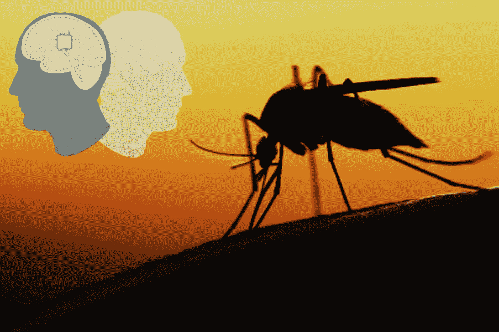
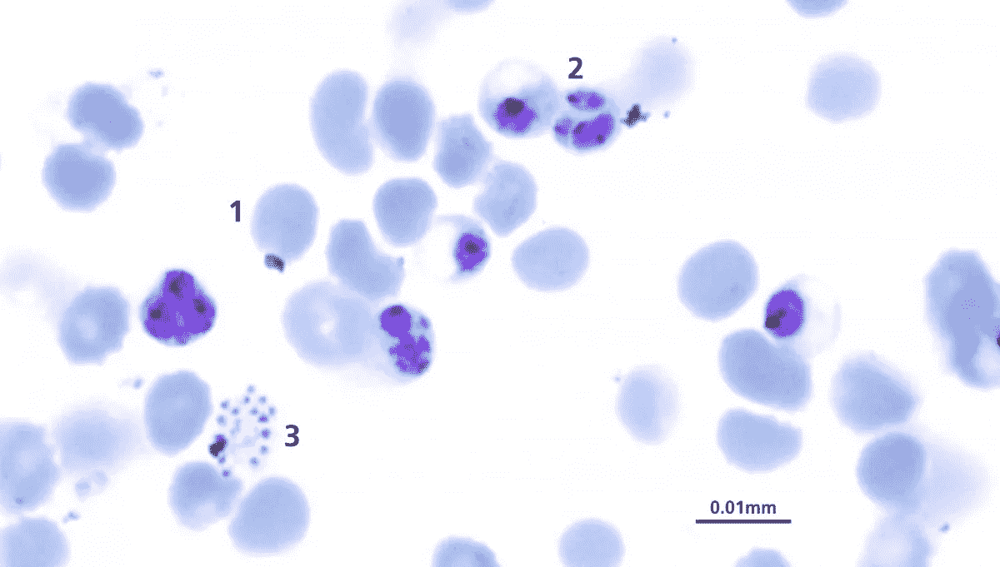
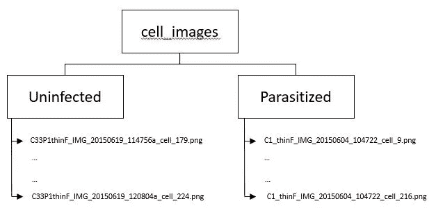
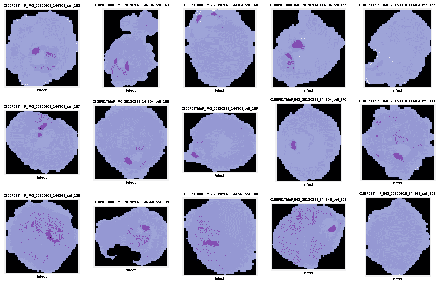
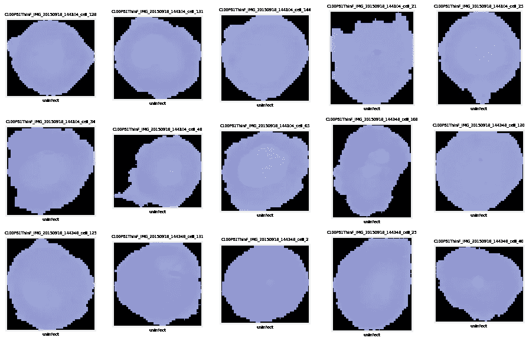
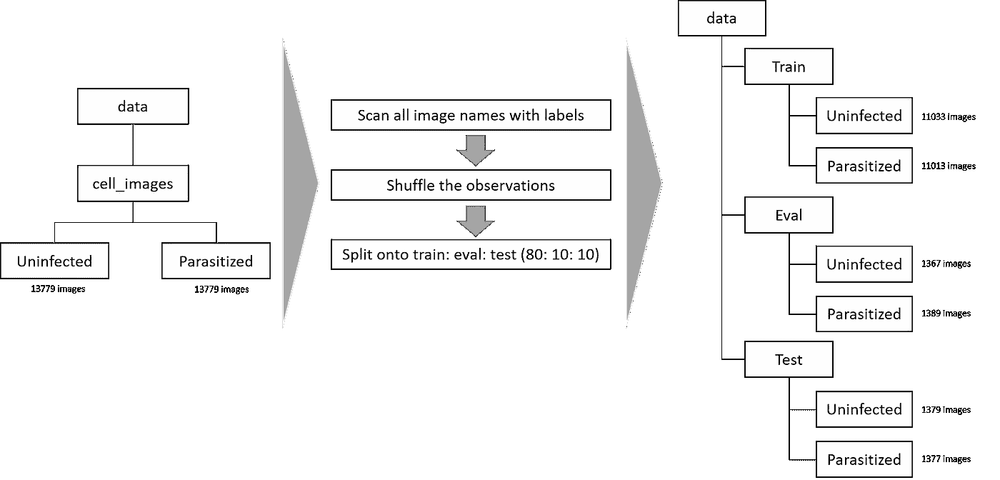
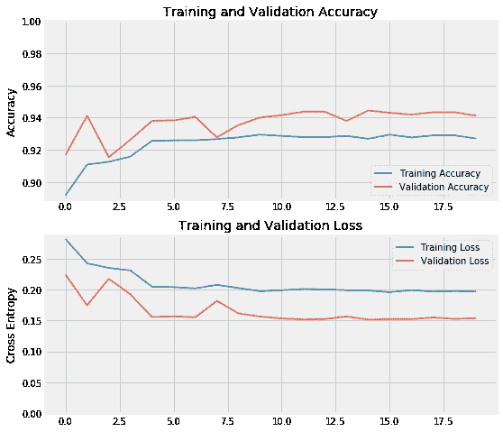

# 利用迁移学习检测疟疾疾病

> 原文：<https://pub.towardsai.net/using-transfer-learning-to-detect-malaria-diseases-3b5305ba889a?source=collection_archive---------1----------------------->



## 用机器学习对抗疟疾| [走向 AI](https://towardsai.net)

## 通过 TFHub 使用深度学习和转移学习帮助世界抗击疟疾

疟疾仍然是迄今为止最常见的传染病之一，也是需要应对的全球性挑战。它是由一种寄生虫引起的，这种寄生虫通过被感染的雌性*按蚊* **蚊子**的叮咬传播。导致疟疾的寄生虫是一种微小的单细胞生物，称为“**疟原虫**”。

*   2017 年，87 个国家估计有 2.19 亿疟疾病例，43.5 万人死亡。
*   2017 年，非洲地区有 92%的疟疾病例和 93%的死亡病例。
*   疟疾最常见于非洲、南美和亚洲的热带和亚热带地区。
*   尽管致命，但如果早期发现，它是可以治愈的。然而，准确诊断疟疾的方法是取一滴血，涂在载玻片上，然后**在显微镜下检查**寻找红细胞内的疟原虫。



图 1:血涂片显微镜；(1)健康红细胞；(2)在受感染的红细胞内发展的疟原虫；(3)疟原虫即将爆发(图片鸣谢:威尔·汉密尔顿)

医疗保健行业开始转向使用机器学习和训练图像分类模型，以帮助减轻资源受限地区的显微镜专家的负担，并提高诊断准确性。

我将使用***tensor flow Hub***中的**预训练模型组件**来演示我们如何将它用于其他问题，因此也就是疟疾。本文将遵循一般的机器学习工作流程:

1.  通过观察显微镜照片来检查和理解数据
2.  构建模型的数据管道
3.  构建模型
4.  训练模型
5.  模型评估

数据集和解释可以在[这里](https://ceb.nlm.nih.gov/repositories/malaria-datasets/)找到。

# 数据理解

在一个`zip`文件中提供并加密红细胞的载玻片图像。我们应该确认给出了多少图像以及提供了哪些扩展。



图 2:给定 Zip 文件中的数据

一旦我们从列表中删除了不必要的文件(其他不是图像的文件)。然后让我们观察每个班级的样本图像。



图 3:受感染的红细胞



图 4:未感染的红细胞

通过绘制这些样本图像，我们可以看到**图像的大小不相等，这需要在输入到模型之前固定**。

人类善于观察和发现图像中的图案，我们可以注意到受感染的红细胞图像具有紫色的致密颜色，这表明疟疾感染。

# 数据管道

通常，当我们处理数据集时，我们会将这些数据加载到内存中(即`pandas`数据帧或`numpy`数组)。然而，当我们处理其他非结构化数据或大量数据时，我们无法将所有图像都放入内存中(也许我们可以，但成本会很高)。

在本文中，我将演示如何使用来自 **ImageDataGenerator** 类的 **flow_from_directory()** 方法将训练图像提供给模型。

所以现在我们需要从我们现有的文件夹中重组，下图展示了这方面的思考过程。



图 5:构建数据管道之前的预处理

我们最终只扫描与图像相关的文件名和标签，而不会将实际的图像加载到内存中。

# **用 TFHub 转移学习**

在这一步，我将使用特征提取器 MobileNet V2，这是可用的[这里](https://tfhub.dev/google/imagenet/mobilenet_v2_140_224/feature_vector/3)。

加载预训练的特征提取器模块并冻结权重

我们从 TF Hub 加载特征提取器，并获得预期的图像大小。当我们从每个文件夹生成数据管道来为训练、评估和测试数据集提供数据时，将会用到它。

使用我们创建的文件夹创建数据管道

接下来，我们可以在 **ImageDataGenerator** 类中使用 **flow_from_directory** ()方法。

*   在训练数据生成器中，我应用了一些数据增强，如缩放、移位和翻转。
*   所有数据生成器都将缩小到[0，1]以内。
*   然后，我们调整所有数据生成器的图像大小，以适合特征提取器模块。
*   训练和验证生成器将被打乱，因为我们希望随机提供图像。

然后，我们可以将特征提取器与分类器层包装在一起，专门用于我们的疟疾分类任务。

向网络添加顶级分类器层

我们可以开始用我们的数据集训练网络，在回调中，我已经包含了一些回调函数来微调，如果没有改善就停止训练。

使用发电机训练网络

使用历史记录来绘制培训期间的进度和信息。



图 6:历史图—时期 15 提供最佳的 val_acc 和 val_loss

最后，我们可以使用模型来预测测试数据生成器。

使用测试图像名称、真实标签和预测制作数据框

这种简单的迁移学习可以在各项指标上取得良好的绩效。

```
The AUC score: 0.9405, accuracy score: 0.9405, f1 score: 0.9413
```

# 我们还能改进什么？

基于现有的 MobileNet V2 模型，我们可以解冻权重，训练几个上层(不是全部)。这将允许专门检测特定模式的上层适应疟疾图像。

在本文中，我使用了来自[***TF hub***](https://www.tensorflow.org/hub)*的预先训练好的特征提取器来从幻灯片图像数据中预测疟疾。通过这种方法，它可以实现可重用的机器学习模块和快速的数据产品开发。*

*关于完整的代码，请访问下面的 GitHub 库，获取完整的笔记本解释:*

*[](https://github.com/netsatsawat/Malaria-Detection) [## netsatsawat/疟疾检测

### 演示迁移学习在 TF hub-netsatsawat/疟疾检测中的应用的存储库

github.com](https://github.com/netsatsawat/Malaria-Detection)* 

# *参考*

*[1][https://www.who.int/news-room/fact-sheets/detail/malaria](https://www.who.int/news-room/fact-sheets/detail/malaria)*

*[2][https://ceb.nlm.nih.gov/repositories/malaria-datasets/](https://ceb.nlm.nih.gov/repositories/malaria-datasets/)*