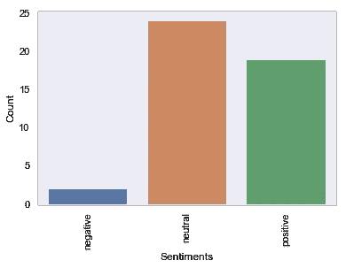

# 使用 Python 中的 Twitter Rest APIs 来批量搜索和下载 Tweets

> 原文：<https://pub.towardsai.net/using-twitter-rest-apis-in-python-to-search-and-download-tweets-in-bulk-da234b5f155a?source=collection_archive---------2----------------------->

## [数据挖掘](https://towardsai.net/p/category/data-mining)，[编程](https://towardsai.net/p/category/programming)

## 了解如何对推文应用语言检测和情感分析


照片由[🇨🇭·克劳迪奥·施瓦茨| @purzlbaum](https://unsplash.com/@purzlbaum?utm_source=medium&utm_medium=referral) 在 [Unsplash](https://unsplash.com?utm_source=medium&utm_medium=referral)

**获取 Twitter 数据**

让我们使用 python 中的 Tweepy 包，而不是直接处理 Twitter API。我们将对这个包做的两件事是，授权我们自己使用 API，然后使用光标访问 twitter 搜索 API。

让我们继续装进口货吧。

```
import tweepy
import pandas as pd
import matplotlib.pyplot as plt
import seaborn as sns
import numpy as npsns.set()
%matplotlib inline
```

## Twitter 授权

要使用 Twitter API，您必须首先注册以获得 API 密钥。要安装 Tweepy，只需通过 pip 安装 Tweepy。Tweepy 文档最擅长解释如何进行身份验证，但是我将介绍基本步骤。

一旦你注册了你的应用程序，你将会收到 API 密匙，接下来使用 Tweepy 来获得一个 OAuthHandler。我将密钥存储在一个单独的配置字典中。

```
config = {"twitterConsumerKey":"XXXX", "twitterConsumerSecretKey" :"XXXX"} 
auth = tweepy.OAuthHandler(config["twitterConsumerKey"], config["twitterConsumerSecretKey"]) 
redirect_url = auth.get_authorization_url() 
redirect_url
```

既然我们已经为 Tweepy 提供了生成 OAuthHandler 的密钥，现在我们将使用该处理程序来获取一个重定向 URL。从浏览器中的输出转到 URL，您可以允许您的应用程序授权您的帐户，以便您可以访问 API。

一旦你用该应用程序授权了你的帐户，你将获得一个 PIN。使用 Tweepy 中的那个数字让它知道您已经用 API 授权了它。

```
pin = "XXXX"
auth.get_access_token(pin)
```

# 搜索推文

获得授权后，我们可以用它来搜索所有包含“英航”一词的推文；我们已将最大结果限制为 1000。

```
query = 'British Airways'
max_tweets = 10
searched_tweets = [status for status in tweepy.Cursor(api.search, q=query,tweet_mode='extended').items(max_tweets)]search_dict = {"text": [], "author": [], "created_date": []}for item in searched_tweets:
    if not item.retweet or "RT" not in item.full_text:
        search_dict["text"].append(item.full_text)
        search_dict["author"].append(item.author.name)
        search_dict["created_date"].append(item.created_at)df = pd.DataFrame.from_dict(search_dict)
df.head()# Out:
    text                                                author      created_date
0   @RwandAnFlyer @KenyanAviation @KenyaAirways @U...   Bkoskey     2019-03-06 10:06:14
1   @PaulCol56316861 Hi Paul, I'm sorry we can't c...   British Airways     2019-03-06 10:06:09
2   @AmericanAir @British_Airways do you agree wit...   Hat     2019-03-06 10:05:38
3   @Hi_Im_AlexJ Hi Alex, I'm glad you've managed ...   British Airways     2019-03-06 10:02:58
4   @ZRHworker @British_Airways @Schmidy_87 @zrh_a...   Stefan Paetow   2019-03-06 10:02:33
```

# 语言检测

上面的代码下载的 tweets 可以是任何语言，在我们使用这些数据进行进一步的文本挖掘之前，我们应该通过执行语言检测来对其进行分类。

通常，语言检测是由基于朴素贝叶斯算法或更现代的神经网络的预训练文本分类器来执行的。Google 的[compact language detector library](https://github.com/google/cld3)是生产级工作负载的绝佳选择，您必须在不到几分钟的时间内分析成千上万的文档。然而，设置起来有点棘手，因此，许多人依赖于调用第三方提供商如 Algorithmia 的[语言检测 API](https://algorithmia.com/algorithms/specrom/NaturalLanguageDetection) ，该 API 每月可免费使用数百次(需要免费注册，无需信用卡)。

让我们在这个例子中保持简单，只使用一个名为 Langid 的 Python 库，它比上面讨论的选项慢几个数量级，但在这个例子中对我们来说应该没问题，因为我们只分析大约 100 条推文。

```
from langid.langid import LanguageIdentifier, model
def get_lang(document):
    identifier = LanguageIdentifier.from_modelstring(model, norm_probs=True)
    prob_tuple = identifier.classify(document)
    return prob_tuple[0]df["language"] = df["text"].apply(get_lang)
```

我们发现输出中有四种独特语言的推文，100 条推文中只有 45 条是英语，如下所示进行过滤。

```
print(df["language"].unique())
df_filtered = df[df["language"]=="en"]
print(df_filtered.shape)#Out:
array(['en', 'rw', 'nl', 'es'], dtype=object)
(45, 4)
```

# 让情绪为推文评分

我们可以使用前面部分创建的 df_filtered，并通过预先训练的情感分析库运行它。出于说明的目的，我们使用 Textblob 中的一个，但是，我强烈建议使用更准确的情绪模型，如 coreNLP 中的模型，或者使用 Sklearn 或 Keras 训练您自己的模型。

或者，如果你选择通过 API 途径，那么在 Algorithmia 上有一个非常好的[情绪 API](https://algorithmia.com/algorithms/specrom/GetSentimentsScorefromText) 。

```
from textblob import TextBlobdef get_sentiments(text):
    blob = TextBlob(text)
*#     sent_dict = {}*
*#     sent_dict["polarity"] = blob.sentiment.polarity*
*#     sent_dict["subjectivity"] = blob.sentiment.subjectivity*

    if blob.sentiment.polarity > 0.1:
        return 'positive'
    elif blob.sentiment.polarity < -0.1:
        return 'negative'
    else:
        return 'neutral'def get_sentiments_score(text):
    blob = TextBlob(text)
    return blob.sentiment.polarity

df_filtered["sentiments"]=df_filtered["text"].apply(get_sentiments)
df_filtered["sentiments_score"]=df_filtered["text"].apply(get_sentiments_score)
df_filtered.head()
#Out:
    text                                                author          created_date    language    sentiments  sentiments_score
0   @British_Airways Having some trouble with our ...   Rosie Smith     2019-03-06 10:24:57     en  neutral     0.025
1   @djban001 This doesn't sound good, Daniel. Hav...   British Airways     2019-03-06 10:24:45     en  positive    0.550
2   First #British Airways Flight to #Pakistan Wil...   Developing Pakistan     2019-03-06 10:24:43     en  positive    0.150
3   I don’t know why he’s not happy. I thought he ...   Joyce Stevenson     2019-03-06 10:24:18     en  negative    -0.200
4   Fancy winning a global holiday for you and a f...   Selective Travel Mgt 🌍  2019-03-06 10:23:40     en  positive    0.360
```

让我们绘制情绪得分图，看看人们为“英国航空公司”发送了多少负面、中立和正面的推文。您也可以将其保存为 CSV 文件，以便以后进一步处理。



*原载于 2019 年 2 月 1 日*[*http://jaympatel.com*](http://jaympatel.com/2019/02/using-twitter-rest-apis-in-python-to-search-and-download-tweets-in-bulk/)*。*