# 利用 Dask ML 框架进行欺诈检测—端到端数据分析

> 原文：<https://pub.towardsai.net/utilization-of-dask-ml-framework-for-fraud-detection-end-to-end-data-analytics-310b2f94d897?source=collection_archive---------2----------------------->

## [数据分析](https://towardsai.net/p/category/data-analytics)，[机器学习](https://towardsai.net/p/category/machine-learning)

照片由[迈克尔·朗米尔](https://unsplash.com/@f7photo?utm_source=unsplash&utm_medium=referral&utm_content=creditCopyText)在 [Unsplash](https://unsplash.com/s/photos/finance?utm_source=unsplash&utm_medium=referral&utm_content=creditCopyText) 上拍摄

# 介绍

欺诈活动已经成为一种猖獗的活动，引起了金融界的许多好奇。这给帮助该部门有效管理其客户带来了许多问题。在本教程中，我们将使用 Dask 机器学习框架来直观地检测金融行业中的欺诈交易。该模型的结果是，我们可以在任何类型的银行中高效部署，通过提醒账户所有人和银行团队来减少欺诈手段。此代码的链接在 [Github](https://github.com/elishatofunmi/Medium-Intelligence/tree/master/Introduction%20to%20dask) 上提供。

首先也是最重要的，既然这是一个机器学习问题，既然我们有像 pandas、bumpy 和 scikit-learn 这样著名的框架来完成工作，我们为什么还要使用 dask 呢？我想说的是，dask 已经被证明是一个用最少的代码高效地扩展 pandas、bumpy 和 scikit-learn 工作流的框架。有了 dask，你可以执行各种 numpy、pandas 和 scikit-learn 操作。

> Dask 已经被证明是一个用最少的代码高效扩展 pandas、numpy 和 scikit-learn 工作流的框架

在本教程中，我们希望根据银行 A 从其客户数据库中提供的一组信息建立一个模型；识别欺诈交易和非欺诈交易。这家银行拥有帐户卷入欺诈行为的客户和帐户没有欺诈历史的客户的数据。我们将利用这些信息根据某些特征来预测欺诈账户。

好的，首先，我将使用 kaggle [上的一个数据集。我们将通过以下步骤来解决此问题:](https://www.kaggle.com/c/frauddetectionchallenge)

*   了解我们的数据
*   使用 dask pandas 和 numpy 框架进行数据分析/预处理。
*   用 seaborn 和 matplotlib 实现数据可视化。
*   特征工程
*   使用 Dask ML 框架的预测模型。

> 有了 dask，你可以进行各种各样的 numpy，pandas 和 scikit-learn 操作。

# 数据分析

在本节中，我们将开始了解我们的数据，并使用 dask 执行基本的数据预处理和清理，同时决定哪个特性与问题建模相关。首先，让我们导入所有库并通过以下方式加载数据集:

您可以使用 **read_csv** 方法将数据读入 dask 中的数据帧，然后传入 csv 文件。您可以使用**查看数据中的前 5 个条目。数据帧的头**属性。我们接下来要做的是了解我们正在使用的功能。在 dask 中，要做到这一点，可以运行 dataframe 和 column 属性。下面的代码说明了这一点。

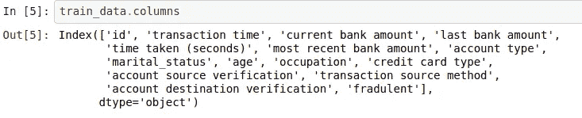

关口

有了这个，我们可以说我们对我们的数据有了一个概念。因此，我们的数据包含交易时间、当前银行金额、上次银行金额、处理交易所需的时间、账户类型、婚姻状况等信息，以及银行每位用户提供的其他信息。更重要的是，我们试图预测或理解的特征与其他特征相比是欺诈性的；这是我们的目标功能。我们仍然需要更多地了解我们的数据，以便我们能够知道如何分析、选择最佳特征和转换以实现完美的建模。下一件你可能想做的事情是看看我们数据中数字条目的描述性分析。Dask 通过运行下面的代码帮助我们高效地完成这项工作，我们将得到相应的输出。

计算

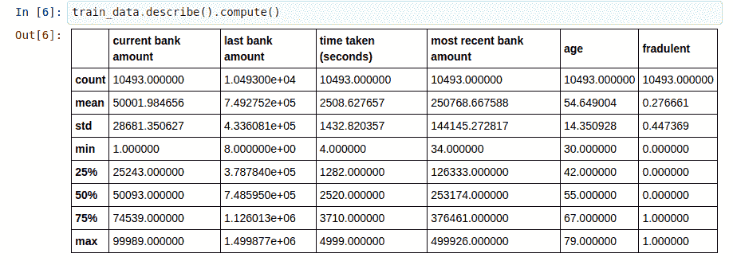

结果

dask dataframe 的`describe()`方法通过告诉我们每个特征中有效条目的数量(计数)、平均值、中值、众数、最小值、最大值、标准偏差、下百分位、上百分位以及每个相应条目的其他信息，为我们提供了对数据数字特征的统计洞察。这实际上揭示了我们数据中的一些东西，但是让我们注意，这只是针对我们数据中的数字信息。那么非数字信息呢，我们仍然需要将它们转换成数字，以便为算法学习它们做准备。首先，让我们通过了解哪些数据是数值型的，哪些不是来看一看我们的数据。下面的代码帮助我们在 dask 中做到这一点。

计算

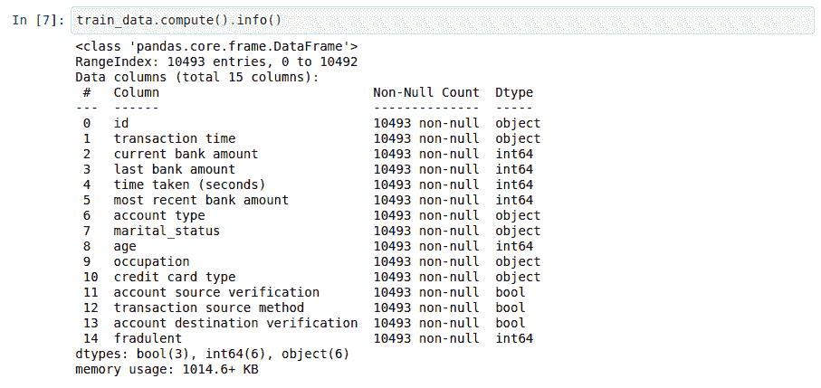

结果

从上面的代码中，我们可以看到我们有 3 个布尔特征(账户来源验证、交易来源方法和账户目的地验证)、6 个数字数据和 6 个文本数据(字符串)。现在，我们已经对我们试图建模的信息有了一个概念，现在让我们通过使用 dask 深入了解每个特性来一步一步地深入这个概念。先说**婚姻状况**。下面的代码让我们了解了婚姻状况所包含的内容。

## 婚姻状况

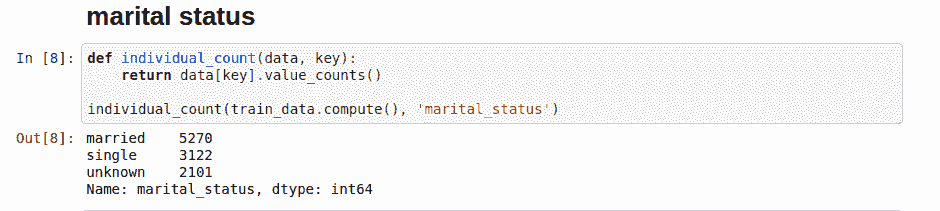

婚姻状况

密码

婚姻状况功能生动地告诉我们，这个数据库中的客户大多已婚，有些是单身，有些没有透露他们的婚姻状况。这可能是确定欺诈行为的一个独特特征吗？可能会，也可能不会。下面是一个直方图，显示了婚姻状况中每个唯一条目出现的频率。

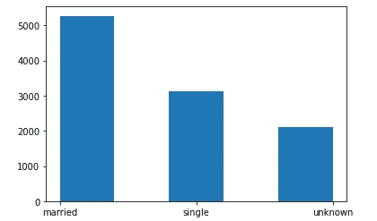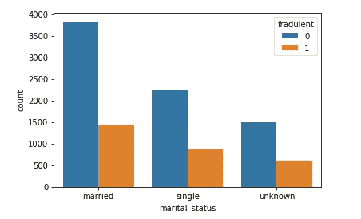

从上图可以看出，许多已婚客户的账户中没有欺诈记录，这也对应于单身和未知客户的相同比例。从上图可以看出，欺诈性账户与非欺诈性账户的比例几乎相同(已婚、单身和未知)。我们可以说，婚姻状况和我们的目标之间存在着正比关系，具有欺骗性。我们将保留它，因为它是我们模型的有效条目。

让我们继续下一组功能，它们是:

*   身份
*   当前银行金额
*   最后的银行金额，以及
*   最近的银行金额。

我们放弃它们是因为我们想假设它们不能成为确定欺诈交易的唯一决定因素。下面的代码(在 dask 中)帮助我们执行这个。

现在我们只剩下更少的信息需要处理。我们可以在婚姻状况和欺诈之间做同样的事情，对于欺诈的其他特征，我们可以有以下视觉效果。

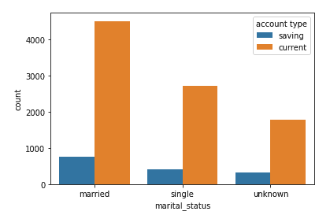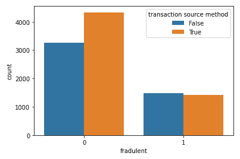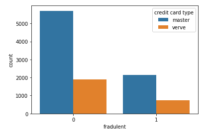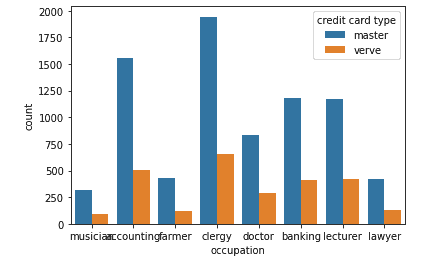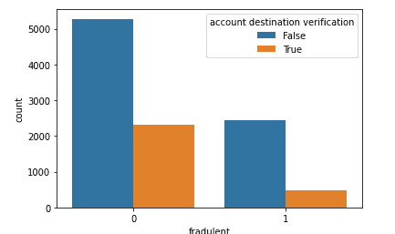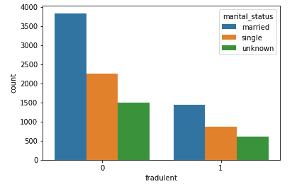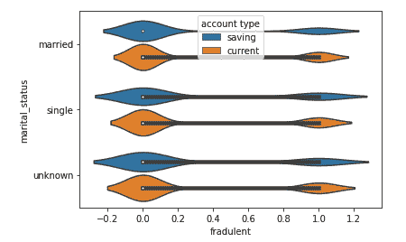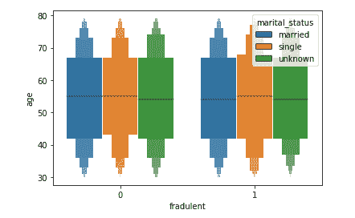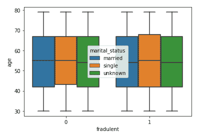

让我们采取一些其他的特征，分析和转换。首先，让我们研究一下交易时间。由于这与时间有关，我们将需要使用 python 中的时间、日期库来处理它。下面的代码有助于我们高效地做到这一点:

上面所做的是让我们应用基本的字符串操作，将时间分成年、月、日、小时、分钟和秒，用于该特性中的每个条目(事务时间)。完成这些后，我们将它们转换成数据框架的新特性，然后删除原始的事务时间列。下一步是我们将数据分成 X 和 y，这样 X 包含我们想要使用的所有特征，y 是目标特征。为此，我们有:

x 和 Y

# 特征工程

现在我们已经有了一些关于数据的想法，让我们继续做一些特性工程。在数据中生成更多要素有两种主要方式:

*   **标签编码器** —此处，特征参数或条目按优先级顺序编码。
*   **一键编码器** —这里，特征参数或条目通过赋予所有条目相同的优先级进行编码。更有甚者，这种编码器倾向于通过特定特征中有效条目的数量来增加数据的维度。
*   **多项式—** 对数据中存在的输入特征进行数据扩展的聚合方法。

但是为了这个教程，我们将把重点放在**标签编码和一键**上。Dask 支持标签编码和一键编码。首先，这里有一些我们已经研究过的特性，我们想把它们从一个物体编码成数字。这是因为我们的算法处理数字，而不是字符串，所以如果与数据相关，它们需要被编码。我们正在使用标签编码对以下功能进行编码:

1.  帐户来源验证。
2.  帐户目的地验证。
3.  交易来源方法。

使用 dask 对它们进行编码的方法如下，使用下面的代码:

有些特征在确定欺诈交易时不太重要，如处理交易所需的时间、年龄和 Id。因此，为了将它们从我们的数据中删除，我们执行以下操作:

现在，我们只剩下 6 个特征来构建一个模型，该模型将有效地确定交易是否是欺诈性的。为了证实这一点，你可以使用**。要查看的数据帧的 head** 属性。为此，我们有:

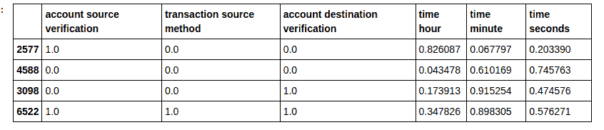

由于我们所有的特征现在都是数字，我们可以使用以下任何一种技术来标准化和减少每个特征的差异:

1.  **标准缩放器** —一种基于标准差重新缩放数据的方法。
2.  **规格化器** —一种将特定特征的所有输入规格化为 1 的方法
3.  **最小-最大缩放器** —一种通过相应的最大数字重新缩放每一列的所有相应条目来减少各种特征差异的方法。

这些技术是在建模之前用于数据科学和 ML 任务的缩放技术。Dask 对此有支持，要导入它们，请执行以下操作:

完成缩放和数据标准化后，我们可以继续建模。Dask 确实在帮助我们建模数据方面提供了支持，上面的代码向我们展示了如何导入高效建模数据所需的必要库。这包括 **train_test_split** ，将我们的数据分成训练和测试数据，用于建模和测试模型性能。更重要的是，您可以使用 dask 导入如上所示的逻辑回归算法(这将是为我们的数据建模的算法)。最后，我们可以继续使用 dask 导入指标，即**准确性得分**和 **log_loss** ，它们是用于在 desk 中分类的可用指标。首先，让我们将我们的训练数据分成两部分，一部分用于**建模**，另一部分用于**测试**，为此，我们有以下内容:

> Dask 确实在帮助我们建立数据模型方面提供了支持，

既然我们已经能够分成建模数据和测试数据，我们可以继续将建模数据输入到我们的算法中，以使用 dask 进行学习，并最终在训练时评估模型。下面的代码向我们展示了如何做到这一点:

在训练时，该模型大约 72%准确，这表明该模型学习了。让我们继续对测试数据进行预测，并评估它在以前没有见过的数据上的性能。下面的代码帮助我们做到这一点:

1.  如何用 dask 进行数据预处理和清洗？

> Dask 为我们提供了端到端的数据分析和建模灵活性。

如何用 dask 进行数据预处理和清洗？

1.  用 dask 进行数据建模和预测。

我希望你已经学到了很多，如果你真的喜欢这个教程，请与朋友分享。谢了。

# 链接和参考

1.  [https://github . com/elishatofunmi/Medium-Intelligence/tree/master/Introduction % 20 to % 20 task](https://github.com/elishatofunmi/Medium-Intelligence/tree/master/Introduction%20to%20dask)(本作笔记本)。
2.  https://dask.org
3.  [https://colab . research . Google . com/drive/1 uvrpop 9 l 1 hge 2 gnnij 5 FJ 0h 7 VL 0 lqmbz？usp =分享](https://colab.research.google.com/drive/1uvRpOp9L1Hge2GNniJ5fJ0H7VL0LQmbZ?usp=sharing)(合作笔记本)。
4.  https://docs.dask.org/en/latest/(dask 文档)。
5.  [https://github.com/dask/dask-tutorial](https://github.com/dask/dask-tutorial)(dask 教程)。