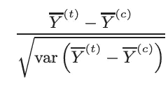
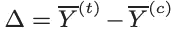
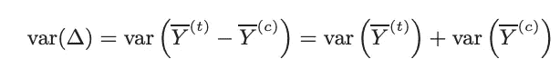
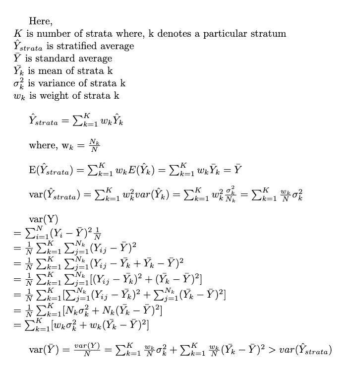
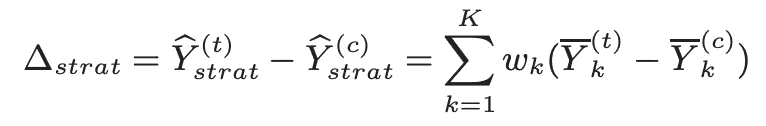
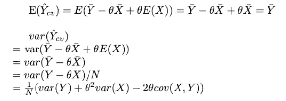
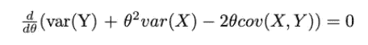
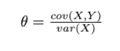
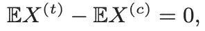

# 因果推理中的方差缩减

> 原文：<https://pub.towardsai.net/variance-reduction-in-causal-inference-d0e51229d0aa?source=collection_archive---------2----------------------->

由 [Unsplash](https://unsplash.com?utm_source=medium&utm_medium=referral) 上的 [CHUTTERSNAP](https://unsplash.com/@chuttersnap?utm_source=medium&utm_medium=referral) 拍摄

## [统计](https://towardsai.net/p/category/statistics)

许多公司，如脸书、推特、谷歌，每年都会进行成千上万次实验来做出数据驱动的商业决策，提高这些实验的灵敏度可以做出更精确的决策。敏感度或功效被定义为正确拒绝零假设的概率，或者换句话说，只在有影响时才检测到影响。

有许多方法可以提高实验的灵敏度，包括[增加样本量和效应量](https://medium.com/swlh/why-sample-size-and-effect-size-increase-the-power-of-a-statistical-test-1fc12754c322)，使用更高的显著性水平等。但是将样本大小增加 4 倍会将功效增加 2 倍，功效与平方根 n 成正比。

由于增加样本大小并不总是一个选项，增加功效的其他两个选项如下:

1.  更好的实验有更大的效果。
2.  在不增加样本量的情况下减少实验中的方差。

在本文中，我们将讨论第二点。

实验中的任何可变性将来自实验过程中由于没有正确控制环境或实际实验处理而导致的异常。

那么，如何对实验的可变性进行建模和控制，从而确保你的研究能够检测到真实的效果呢？

在这里，我们将讨论 2 种技术来减少实验中的方差，但在此之前，让我们看看如何减少方差，增加功率。

## 减少方差以增加功率:

考虑最常见的统计检验类型，即基于 t 统计量的双样本均值 t 检验:

这里，

△是偏移的无偏估计量。因为样本*(处理和对照)*是独立的，

为了减少估计 delta 的方差，我们需要减少两个样本均值的方差。我们需要找到一个调整后的 delta △*，

a) △*是偏移的无偏估计量(与△相同)

b) var(△*) < var(△)

减少方差将增加 t 统计量的值，因此更有可能拒绝相同效应大小的零假设，从而增加功效。

现在，我们来谈谈减少两个样本中观测 Y 的方差的两种技术。

## 技巧 1:分层

这里的基本概念是将样本分成不同的层，然后计算每个层的平均值和方差，以获得总体估计值。分层样本的均值也是总体均值的无偏估计量，分层样本均值的方差小于随机样本均值的方差。以下证明:

在在线实验中，我们可以使用实验前数据(协变量)来形成这些地层。重要的是采取实验前协变量来形成下层，因为这样不会在分层三角洲中引入偏差，因为地层不受处理效果的影响。一个好的分层是与数据中的潜在聚类很好地对齐，因此选择协变量。

例如，如果 Yi 是来自用户 I 的查询次数，则协变量 Xi 可以是用户在实验开始之前使用的浏览器。

## 技术 2:控制变量

这里，我们模拟一个新的变量 Y_cv，使得它是 Y 的无偏估计量，并且具有比 Y 更低的方差。为了实现这一点，我们使用具有已知 E(X)的随机变量 X，使得我们具有(Yi，)的独立对，i = 1，.。。，n .定义:

其中，Y_cv 的均值和方差为:

正如我们所见，Y_cv 是总体均值的无偏估计量，为了最小化方差，我们将𝛉设为:

在方差方程中代入这个𝛉后，

其中，𝞺 = cov(X，y)

方差因𝞺因子而减少。𝞺越大，方差减少越好。所以，我们需要找到一个已知 E(X)的协变量 X，它与 y 高度相关。

将此应用到我们得到的 delta 算子，

鉴于，

重要的是，上述等式成立，以获得δ作为偏移的无偏估计量。此外，X 是实验前协变量，这意味着它不受治疗效果的影响，因此对照组和治疗组的随机化确保两个期望值相等。

那么现在如何得到这个预实验，已知 E(X)并且与 Y 高度相关，协变量？其中一种方法是在实验前观察阶段获得与 Y 相同的协变量。比方说，实验是观察在推荐引擎中做了改动后对 CTR 的影响。在这种情况下，协变量可以是实验开始前用户在平台上的 CTR。

除了选择适当的协变量，还有其他因素会影响结果，例如:

1.  实验将持续多长时间？有时运行实验太久会将新的或失效的用户带入实验，对于这些用户来说，实验前数据中匹配的相应协变量 X 将会丢失，这降低了实验覆盖范围。
2.  *预实验持续时间的范围。*为了得到协变量 X，我们需要回溯到实验前期的多远？太短的时间会导致不良匹配，而太长的时间会降低实验期间与结果度量的相关性。

这两种技术都有助于减少方差，从而降低实验的灵敏度。第二种技术也被称为 CUPED，使用实验前数据的控制实验。在某些情况下，这两种方法密切相关，并显示出相同的结果。有关该主题的更多详细信息，请参考下面的资源。

# 密码

 [## ShwetaBaranwal master 的中型员额/variance _ reduction . ipynb/中型员额

### 在 GitHub 上创建一个帐户，为 ShwetaBaranwal/Medium-Posts 的发展做出贡献。

github.com](https://github.com/ShwetaBaranwal/Medium-Posts/blob/master/variance_reduction.ipynb) 

# 资源

*   [https://exp-platform . com/Documents/2013-02-CUPED-improvingsensitivity of controlled experiments . pdf](https://exp-platform.com/Documents/2013-02-CUPED-ImprovingSensitivityOfControlledExperiments.pdf)https://www.kdd.org/kdd2016/papers/files/adp0945-xieA.pdf T2
*   [https://medium . com/swlh/why-sample-size-and-effect-size-increase-the-power of-a-statistical-test-1fc 12754 c322](https://medium.com/swlh/why-sample-size-and-effect-size-increase-the-power-of-a-statistical-test-1fc12754c322)
*   [https://towards data science . com/online-experiments-tricks-variance-reduction-291 b 6032 DCD 7](https://towardsdatascience.com/online-experiments-tricks-variance-reduction-291b6032dcd7)