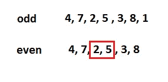
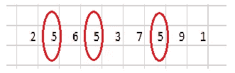
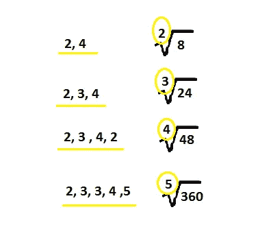
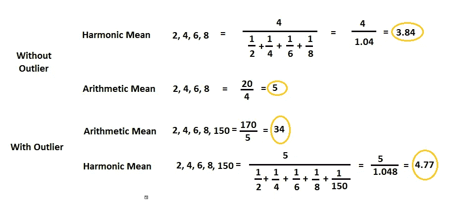

# 各种类型集中趋势测量

> 原文：<https://pub.towardsai.net/various-type-of-central-tendency-measurement-d3cece097345?source=collection_archive---------2----------------------->

## [统计数据](https://towardsai.net/p/category/statistics)

## 中心趋势超出平均值、中间值和众数

由[威廉·沃比](https://unsplash.com/@wwarby?utm_source=medium&utm_medium=referral)在 [Unsplash](https://unsplash.com?utm_source=medium&utm_medium=referral) 上拍摄的照片

统计学是从收集的数据中学习洞察力的艺术。组织一个团队或一个商业模式需要一些数据形式的输入来总结有意义的信息。一个值就能说明大量数据的行为。为了识别单个值，我们测量代表整个记录的集中趋势。统计学是一门研究数据的学科，它以可再现的形式对大量数据进行变异和缩减。

在本文中，我们将研究各种类型的中心倾向及其优缺点。各种测量如下所示:

1.  **的意思是**
2.  **中位数**
3.  **模式**
4.  **毕达哥拉斯的意思是**

*   ***算术平均值***
*   ***几何平均***
*   ***谐音的意思是***

这里的一切只是为了从这些平均值中获取信息。

> ***意为***

简单平均数也称为算术平均数。它只是其他值的平均值。这是一个非常简单的计算，只需将所有数字相加，然后除以总观察数。

公式:

***均值=总和(n(1)+n(2)…..n(I))/总人数***

**优点:**

*   用来求平均值的概率。

**缺点:**

*   受异常值影响。
*   不用于计算定性数据。
*   如果某些值缺失，计算平均值就没什么用了。

> ***中间值***

它还用于计算记录中的中心值。求中值的方法是将数值按升序排列，在数据中求中间值。

如果记录是奇数，那么很容易找到中间的数字，如果记录是偶数，那么取中间两个数字的平均值，并找到它的平均值。这将是新的中间值。

奇数和偶数记录来寻找中间值。作者的照片

**优势:**

*   容易处理异常值。
*   可以计算出记录中是否有任何缺失值。
*   也用于定性数据。
*   善于处理数据中的异常值。

**缺点:**

*   仅仅对于偶数，它并不精确。

> ***模式***

找出模式中的中心趋势就是找出记录中大多数时间发生的观察值。

记录中的模式。作者的照片

如果我们在上面的图像中看到“5”出现得最多，我们可以说 5 是数据中的中心度量值。这个数据很小，这就是为什么我们可以很容易地观察到最大发生值。如果数据非常大，那么按升序排列并找到数字，或者我们可以借助编程来找到数据中唯一值的计数。

**优势:**

*   它很容易被发现。
*   可以计算出记录中是否有任何缺失值。
*   也用于定性数据。
*   善于处理数据中的异常值。

**缺点:**

*   有时我们会得到两种以上的模式。

> ***勾股的意思是***

希腊数学家按比例研究了这些方法。在毕达哥拉斯学派中，主要有三种意思。

1.  **算术平均值**

这个平均值与我们上面研究的相同。

2.**几何平均值**

当有少量数据时，这种方法很有用。这个均值的计算就是取每个数的乘积，取这个乘积数的根。例如，对两个数取其乘积的平方根，对三个数取其乘积的立方根，等等。

记录的几何平均值。作者的照片

3.**调和平均值**

调和平均数是衡量数据集中趋势的另一种方法。调和平均值的计算就是求值的平均倒数的倒数。让我用下面的例子来说明这一点:

有和没有异常值的调和平均值。作者的照片

这些是日常生活问题中使用的一些中心趋势值。根据权力、职能等，还有更多衡量手段。例如，幂平均、f-平均、截断平均等。

 [## Python 中的继承及其类型

### 单一、多级和多重继承方法的概念

medium.com](https://medium.com/towards-artificial-intelligence/inheritance-and-its-type-with-python-f35b993d712e) 

> ***结论:***

中心值的测量提供了非常好的数据信息。我们可以使用模式中的数据统计分析和业务增长可视化。

我希望你喜欢这篇文章。通过我的 [LinkedIn](https://www.linkedin.com/in/data-scientist-95040a1ab/) 和 [twitter](https://twitter.com/amitprius) 联系我。

# 推荐文章

1.  [NLP —用 Python 从零到英雄](https://medium.com/towards-artificial-intelligence/nlp-zero-to-hero-with-python-2df6fcebff6e?sk=2231d868766e96b13d1e9d7db6064df1)

2. [Python 数据结构数据类型和对象](https://medium.com/towards-artificial-intelligence/python-data-structures-data-types-and-objects-244d0a86c3cf?sk=42f4b462499f3fc3a160b21e2c94dba6)

3. [MySQL:零到英雄](https://medium.com/towards-artificial-intelligence/mysql-zero-to-hero-with-syntax-of-all-topics-92e700762c7b?source=friends_link&sk=35a3f8dc1cf1ebd1c4d5008a5d12d6a3)

4.[用 Python 实现时间序列的基础知识](https://medium.com/towards-artificial-intelligence/basic-of-time-series-with-python-a2f7cb451a76?source=friends_link&sk=09d77be2d6b8779973e41ab54ebcf6c5)

5. [NumPy:用 Python 零到英雄](https://medium.com/towards-artificial-intelligence/numpy-zero-to-hero-with-python-d135f57d6082?source=friends_link&sk=45c0921423cdcca2f5772f5a5c1568f1)

6.[用 python 实现熊猫系列和数据帧的基础](https://medium.com/towards-artificial-intelligence/fundamentals-of-series-and-data-frame-in-pandas-with-python-6e0b8a168a0d?source=friends_link&sk=955350bf43c7d1680be6e37b15b6628b)