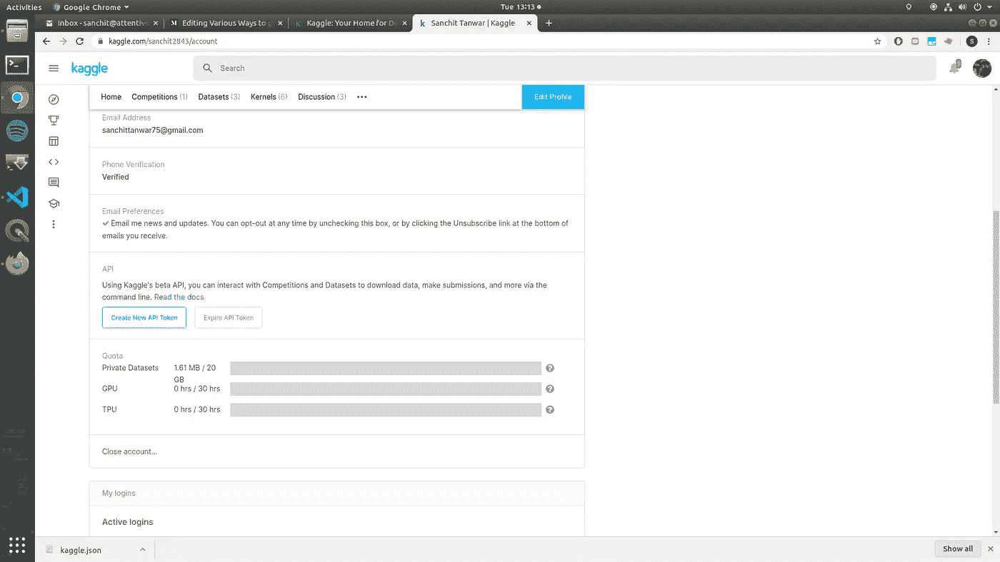
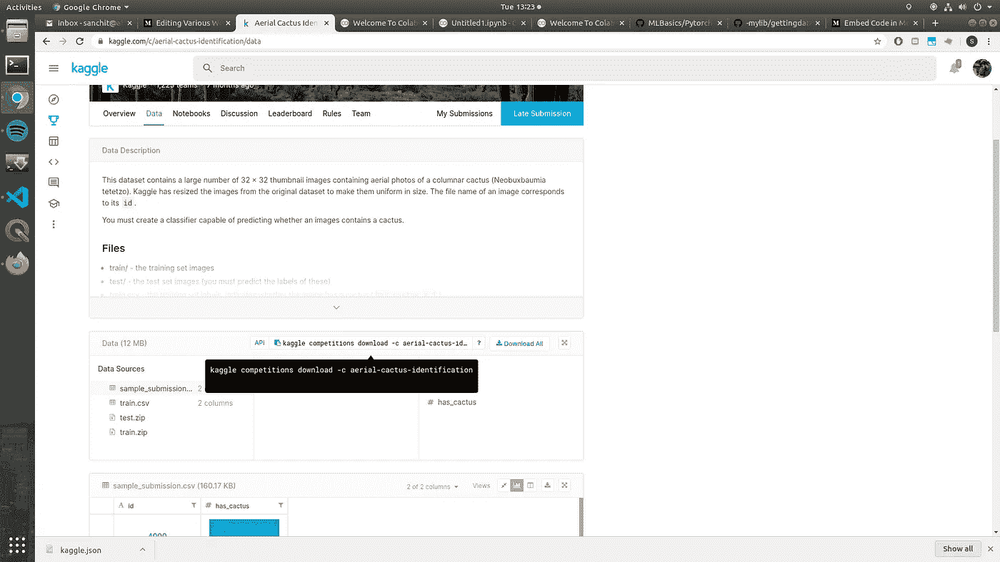

# 在 Google Colab 上获取数据的各种方法

> 原文：<https://pub.towardsai.net/various-ways-to-get-data-on-google-colab-7a77d4ef34b5?source=collection_archive---------1----------------------->

Google colab 是给免费 GPU 最好的平台之一。如果你从深度学习开始，这是最好的实验场所之一。除了免费的 GPU 之外，google colab 最棒的一点是，它装载了你开始深度学习所需的大多数库和框架，它是直接代码和运行类型的东西，你很可能不需要安装任何东西。但我面临的一个问题是，如果我使用 google colab，会遇到抢先驱动。google colab 的运行时间每隔 8-10 小时就会停止。所以你每次都需要下载数据，因为服务器停止时硬盘也会被刷新。在这篇博客中，我将告诉你在 google colab 上下载数据集的方法，这取决于你的数据集的来源以及如何在你处理数据时将数据集保存在你的驱动器上，以便你以后可以再次使用它。所以我们先从最流行的数据集源 Kaggle 开始下载数据集。

# 卡格尔

从 kaggle 下载数据集是最简单的，因为 kaggle 提供了 CLI，您可以通过执行一行命令轻松下载数据集。我将编写从 kaggle 下载数据集所需执行的步骤。

1.  创建一个 kaggle 帐户。😅
2.  转到我的帐户部分。


3.单击 create a new API token 按钮，这将下载 kaggle.json 文件。



4.运行下面提到的代码，它会要求你上传一个文件。上传刚刚下载的 kaggle.json 文件。

```
from google.colab import files
files.upload()
os.system("mkdir -p ~/.kaggle")
os.system("cp kaggle.json ~/.kaggle/")
os.system("chmod 600 ~/.kaggle/kaggle.json")
```

5.复制要下载的数据集的 API 命令。



您可以在每个数据集的数据集页面上找到它。

```
!kaggle competitions download -c aerial-cactus-identification
```

在此命令前使用感叹号，这是运行 Linux 命令所必需的。这将下载数据集，您可以对其进行操作。它将会是 zip 格式，所以你可能需要解压它。

# 2.Google drive

有时候你会需要从 google drive 下载一个数据集或者其他一些文件(比如权重文件)，从 google drive 下载数据是非常容易的。我们可以直接使用这个 API。

```
from google_drive_downloader import GoogleDriveDownloader as gddgdd.download_file_from_google_drive(file_id='1iytA1n2z4go3uVCwE__vIKouTKyIDjEq',dest_path='./data/mnist.zip',unzip=True)
```

我们可以从链接共享选项中获取 google drive 中文件的 file_id。这个 API 有一个限制。您要下载的文件应该对公共网站开放；否则不会下载。

# 3.对于所有其他来源

有不同的方式，这完全取决于不同的来源。但是有一个通用的解决方案，适用于所有来源。唯一的限制是，如果有多个文件要下载，或者下载的链接是动态的，每次都会改变(例如，如果您在本地系统上从 google drive 下载了一些东西，下载链接每次都是新的)。

firefox 有一个扩展(我试着在 chrome 上找，但找不到任何扩展，如果有人知道有这样的扩展，请在评论中告诉我) [cliget](https://addons.mozilla.org/en-US/firefox/addon/cliget/) 。

在您的浏览器中添加此扩展。并转到您想要下载数据的网站。下载弹出窗口一出现，这个扩展就会捕捉到它，并生成一个 curl 命令来使用 CLI 下载数据。你只需要复制那个命令并在 google colab 运行时运行。别忘了加上“！”在这个命令之前。

如果您的链接是动态的，您将不得不每次都这样做，因为前面的命令将不再工作。

这是一个典型的 curl 命令的样子

```
!curl --header 'Host: [www.crcv.ucf.edu'](http://www.crcv.ucf.edu') --user-agent 'Mozilla/5.0 (X11; Ubuntu; Linux x86_64; rv:73.0) Gecko/20100101 Firefox/73.0' --header 'Accept: text/html,application/xhtml+xml,application/xml;q=0.9,image/webp,*/*;q=0.8' --header 'Accept-Language: en-US,en;q=0.5' --referer '[https://www.crcv.ucf.edu/data/UCF101.php'](https://www.crcv.ucf.edu/data/UCF101.php') --cookie 'sc_is_visitor_unique=rx8721945.1582018638.B9D513E5B1294F3FF5FA6112CC6A1234.1.1.1.1.1.1.1.1.1; __utma=1.544635313.1582018638.1582018638.1582018638.1; __utmb=1.1.10.1582018638; __utmc=1; __utmz=1.1582018638.1.1.utmcsr=google|utmccn=(organic)|utmcmd=organic|utmctr=(not%20provided); __utmt_ucfhb=1' --header 'Upgrade-Insecure-Requests: 1' '[https://www.crcv.ucf.edu/data/UCF101/UCF101.rar'](https://www.crcv.ucf.edu/data/UCF101/UCF101.rar') --output 'UCF101.rar'
```

如果要更改文件位置，请更改'— output '。

Google colab 提供了在当前运行时挂载 google drive 的内置代码。您只需要用您的 id 登录并输入一个自动生成的密钥。驱动器将被安装，如果您想保存驱动器上的任何内容或使用驱动器上的任何内容，您只需给出该路径，文件将变得可读，您编写的文件将自动上传到驱动器上。

延伸阅读:

[https://Neptune . ai/blog/how-to-use-Google-colab-for-deep-learning-complete-tutorial](https://neptune.ai/blog/how-to-use-google-colab-for-deep-learning-complete-tutorial)

和平。