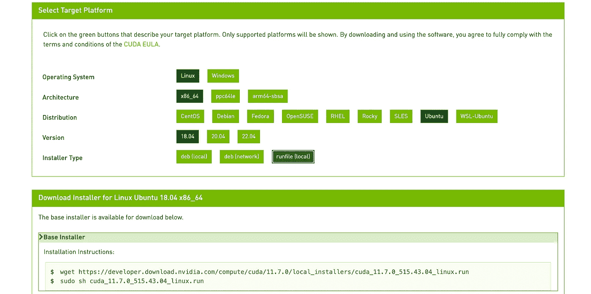
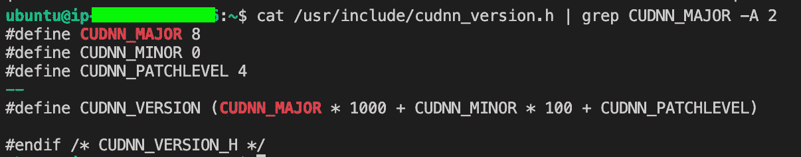
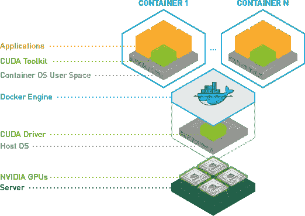
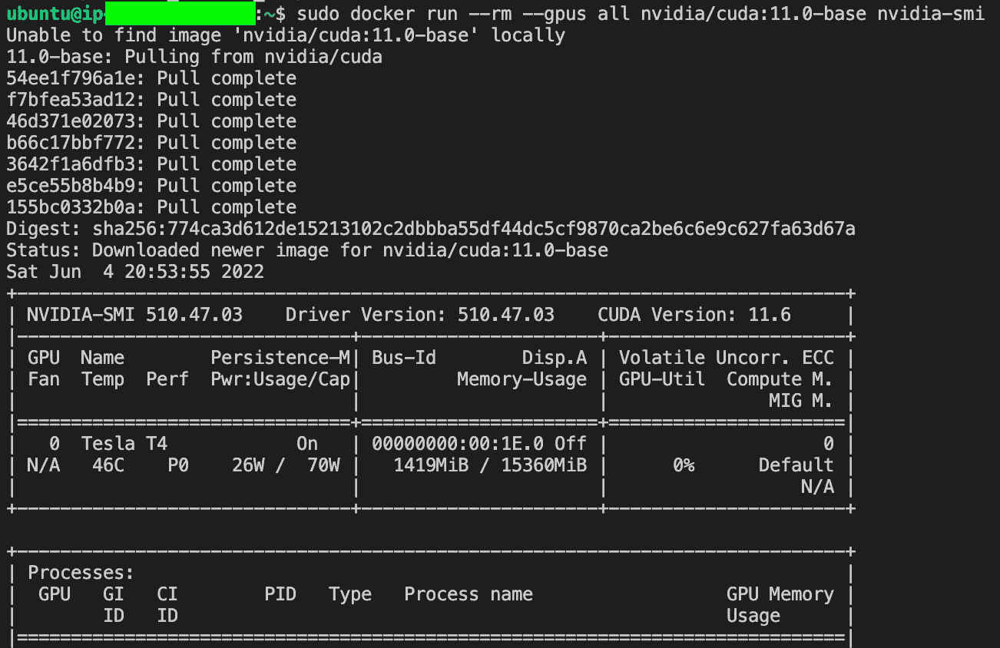
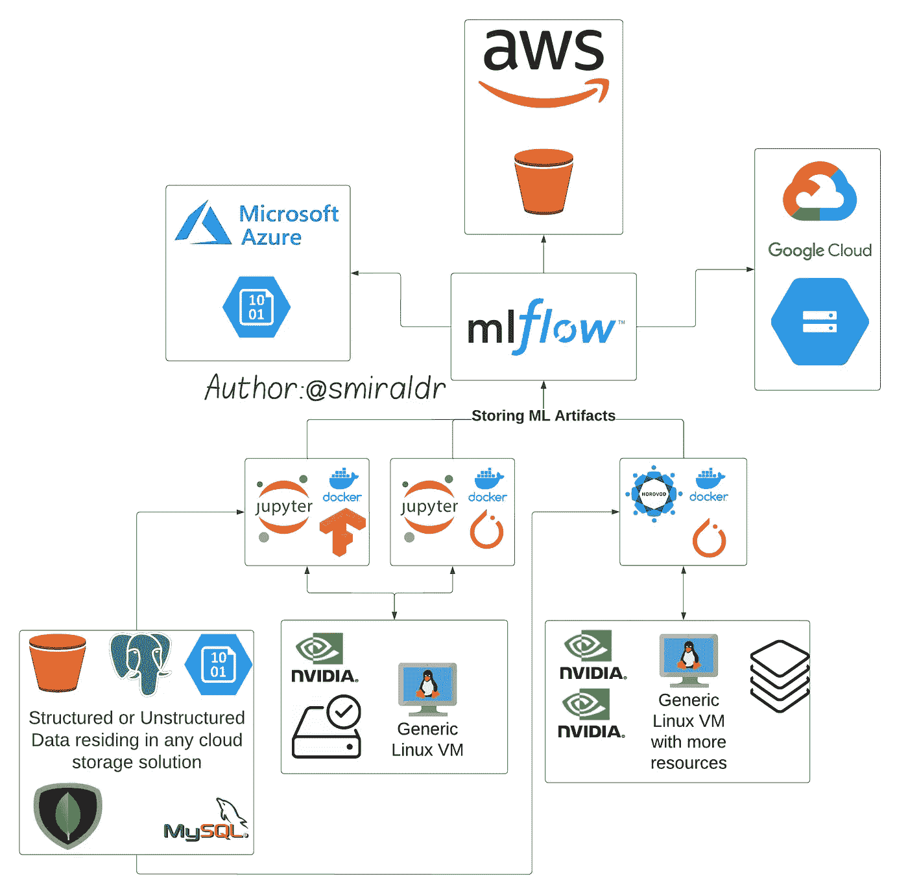
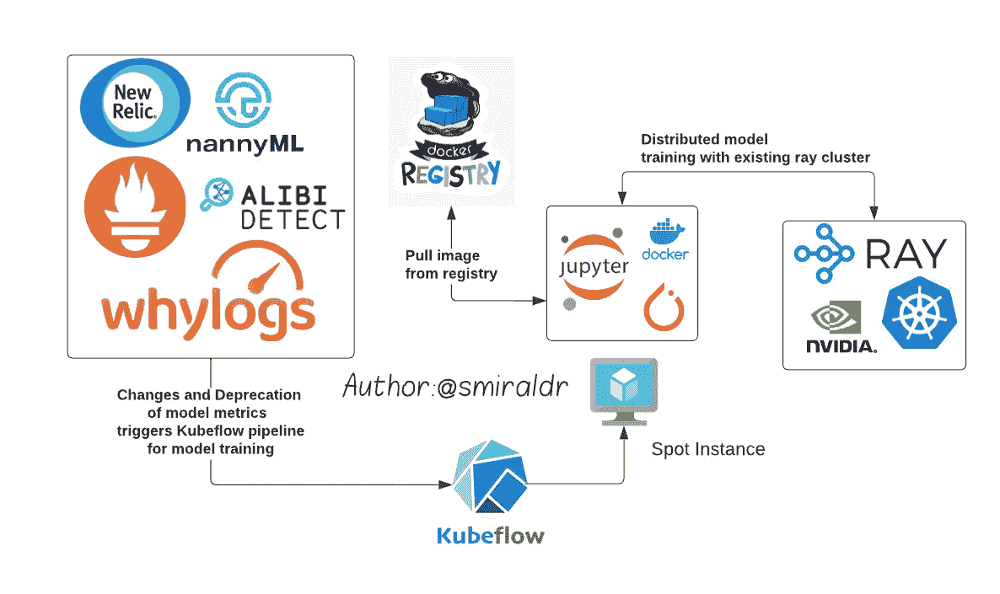

# 在 GPU 支持下运行 ML & DL 实验的独立于供应商的设置

> 原文：<https://pub.towardsai.net/vendor-agnostic-setup-for-running-ml-dl-experiments-with-gpu-support-1a6ffa6f673d?source=collection_archive---------2----------------------->


汤姆·温克尔斯在 [Unsplash](https://unsplash.com?utm_source=medium&utm_medium=referral) 上的照片

随着许多新兴解决方案的出现，如 AWS Sagemaker、Microsoft Azure Machine Learning Studio、Google Cloud AI Platform 等，考虑到成本限制和用例，选择一个解决方案可能会非常困难。

使用云供应商解决方案有一些优点和缺点:
优点:
-一个紧密集成的平台，用于数据访问、IAM、培训、测试和部署 ML & DL 工作负载
-像 AWS Sagemaker 这样的解决方案支持开箱即用的多个内核配置，可用于在不同的环境配置上运行同一台笔记本电脑
-云支持可以方便地解决平台问题
-一键式环境创建&作为托管服务，这些平台通常很少出现基础设施管理问题

缺点:
-此类托管解决方案的定价可能高于加速硬件(GPU)虚拟机。
-所创建的解决方案和管道将主要依赖于供应商，基于所使用的托管服务或工具。这引入了供应商锁定，使得评估或转向不同供应商的云解决方案变得困难。

# **独立于供应商的设置**

我们可以在同一台装有卷的机器上使用 Docker 容器运行多个工作负载，这有助于快速原型开发和实验。这种设置可以通过系统化和集成各种开源解决方案来发展，如 Kubeflow、用于编排的 Flytelab、用于模型库和版本控制的 MLFlow、用于分布式培训的 Horovod 或 Ray 等。

优点:
-较小的工作负载可以共享相同的虚拟机及其资源(包括 GPU)。
-使用挂载的卷，相同的文件可以在相同虚拟机上托管的所有容器中访问。对于 ML & DL 库，我们也可以使用像 venv 或 conda 这样的环境管理器，但是通常在这些环境中管理包会很麻烦。我们还可以定制每个容器的 python 版本，而不会对基本 VM 或其他容器产生任何影响。
-将基础映像拉至虚拟机的一次性等待时间:下载完所有依赖项后，生成另一个容器只需不到几秒钟，相比之下，AWS Sagemaker 实例每次分配资源需要大约 2 分钟。
-GPU 加速虚拟机的成本通常低于托管平台的成本，从长远来看，这可能会带来巨大的收益。
-无供应商锁定:通过将 docker 映像推送到私有注册表并将其拉至不同云供应商的虚拟机，自由移动您的工作负载。

反对意见:
-不了解基础设施的数据科学家可能更喜欢托管平台，而不是管理基础设施来进行试验和部署。
-设置警报、服务和基础设施监控需要额外的工作，这对任何生产系统都是必不可少的。

# 设置独立于供应商的设置的步骤:

步骤 1 :
根据各自的工作负载需求，为任何基于 Linux 的虚拟机提供所需的资源。例如，我们将假设我们想要建立一个 GPU 加速实验平台。我们将需要一台配置了 GPU 的虚拟机，例如 AWS 或 NCasT4_v3 系列上的 G4 系列，或者一台配有 Nvidia t4、16 GB 内存、4 个 vCPUs 和 125 GB 永久存储的 GCP 计算引擎。

步骤 2 :
安装并更新操作系统正常运行所需的所有开发依赖项。

安装和更新操作系统的开发依赖项

第 3 步:
安装 CUDA 工具包以访问驱动程序，从而高效地使用 GPU
请跳过这一步以防:
-虚拟机没有配备 Nvidia GPU
-基础映像操作系统是定制的，并且已经支持 CUDA

前往[https://developer.nvidia.com/cuda-downloads](https://developer.nvidia.com/cuda-downloads)，选择合适的选项

[](https://developer.nvidia.com/cuda-downloads)

选择适当的基础架构配置来获取安装 CUDA 驱动程序的命令(来源:[https://developer.nvidia.com/cuda-downloads](https://developer.nvidia.com/cuda-downloads)

对于高级用户来说，如果有任何依赖或特定的用例，可以随意进入文档库更改 CUDA 版本并安装相同的版本。如果对 CUDA 版本没有偏好，上述过程应该可以正常工作。
运行 Nvidia-smi 命令验证 Cuda 安装是否正确


nvidia-smi 输出(来源:作者)

CUDA 安装故障排除:
确保将 CUDA_HOME 和 LD_LIBRARY_PATH 添加到正确调用 nvidia-smi 命令的路径中

CUDA 安装常见错误配置的故障排除

安装 Nvidia cuDNN(可选):
[NVIDIA cuDNN](https://developer.nvidia.com/cudnn) 是一个用于深度神经网络的 GPU 加速原语库。如果我们需要运行深度学习和基于神经网络的工作负载，建议在基本虚拟机上安装 cuDNN。
前往 https://developer.nvidia.com/rdp/cudnn-download接受条款和条件。下载最新版本，以防工作负载没有冻结需求。
注意:cuDNN 的安装遵循文档:[链接](https://docs.nvidia.com/deeplearning/cudnn/install-guide/index.html#installlinux-deb)
安装依赖关系
8.x.x.x-1+cudaX 时，确保匹配从网站下载的 CUDA 和 cuDNN 包 deb 的版本。Y < - 8.x.x.x-1 指下载的 cuDNN 版本和 cudaX。y 指以前安装的 CUDA 版本。要确认 Cuda 版本，请运行 Nvidia-smi 命令。(以上版本为 11.6)
运行以下命令，确保 cuDNN 安装正确:



cuDNN 安装的验证(来源:作者)

第四步:
安装 Docker 和 Docker-compose -

```
#Docker installation
curl [https://get.docker.com](https://get.docker.com) | sh \
  && sudo systemctl --now enable docker#Docker-compose installation
cd /usr/local/bin && sudo rm -rf docker-compose
sudo curl -L "[https://github.com/docker/compose/releases/download/v2.2.3/docker-compose-linux-x86_64](https://github.com/docker/compose/releases/download/v2.2.3/docker-compose-linux-x86_64)" -o /usr/local/bin/docker-compose
sudo chmod +x docker-compose
```

我们可以使用 docker-compose 为我们的训练容器设置多个依赖项，如 mock DB。这在使用 docker-compose 通过快速原型制作评估新解决方案时会派上用场。

安装 Nvidia-Docker2 :
在有 GPU 加速工作负载的情况下，我们需要系统满足以下配置-
1。Docker 引擎需要额外的驱动程序来运行 GPU 上的工作负载。
2。加速工作负载容器需要在容器上安装 Cuda 驱动程序，以利用 GPU 处理。

[](https://github.com/NVIDIA/nvidia-docker)

Nvidia-docker2 使用情况(来源:[https://github.com/NVIDIA/nvidia-docker](https://github.com/NVIDIA/nvidia-docker)

运行以下命令，在虚拟机实例上安装 nvidia-docker2。

```
#adds the distribution to OS for installing drivers for docker
distribution=$(. /etc/os-release;echo $ID$VERSION_ID) \
&& curl -s -L [https://nvidia.github.io/nvidia-docker/gpgkey](https://nvidia.github.io/nvidia-docker/gpgkey) | sudo apt-key add — \
&& curl -s -L [https://nvidia.github.io/nvidia-docker/$distribution/nvidia-docker.list](https://nvidia.github.io/nvidia-docker/$distribution/nvidia-docker.list) | sudo tee /etc/apt/sources.list.d/nvidia-docker.list#Update and install nvidia-docker2
sudo apt-get update
sudo apt-get install -y nvidia-docker2#restart docker engine to load new config
sudo systemctl restart docker
```

我们可以通过以下命令来验证安装:

```
sudo docker run -rm -gpus all nvidia/cuda:11.0-base nvidia-smi
```



Nvidia-Docker2 安装的验证(来源:作者)

至此，我们已经完成了在平台无关的虚拟机上运行和管理 GPU 工作负载所需的基本设置。

# 根据要求创建自定义 docker 图像:

如上所述，如果我们想要运行 GPU 加速的工作负载，容器必须有 Cuda 工具包和驱动程序来与 GPU 通信。

这可以通过获得 docker 版本的基础映像来实现，该版本已经预装了 Cuda 驱动程序，我们可以通过为 python 和 OS 安装软件包来进一步定制。要了解更多关于使用容器处理数据科学工作负载的信息，请查看博客:[链接](https://blog.devgenius.io/breaking-down-docker-for-data-science-6fabb752b087)。

注意:对于在虚拟机上运行使用 GPU 进行加速的容器化工作负载，docker run 命令如下所示

```
# Here — gpus all specify that all GPUs available are to be used for # accelerating workload
sudo docker run — gpus all tensorflow/tensorflow:latest-gpu-jupyter
```

# 现在我们有了基本的设置，我们要去哪里？

现在，您能够仅使用 docker 容器中的虚拟机运行平台无关的加速工作负载，它最终可以发展为基于定制需求和用例的更加自以为是的系统。请记住，如果需要，这些可以再次与托管开源产品集成，甚至与特定于云的工具集成。

例如(见图 1)，容器可以通过为虚拟机或 Kubernetes 集群网络启用的私有 VPC 访问驻留在任何结构化或非结构化数据库中的数据。我们可以有一个具有 GPU 加速的单个虚拟机来运行多个较小的工作负载，或者一个强大的多 GPU 实例来运行大量数据的分布式培训。然后，这些可以与 MLFlow 集成，用于存储和管理 ML 工件及其培训和评估指标。基于首选的云环境，我们可以进一步将工件存储配置为 s3 存储桶、azure blob 存储桶或 GCP 存储桶。



图 1-平台无关的 ML 训练系统(来源:作者)

在部署模型后进一步(见图 2 ),使用 whylogs、nannyml 等 MLOps 解决方案，我们可以基于模型推断指标折旧和漂移指标触发 kubeflow 管道。可以将管道配置为在 Kubernetes 上生成 spot 实例 pod(比按需实例 pod 便宜),然后可以使用它在 Ray 集群上的相同环境中使用新的或修改的数据重复训练过程，以进行分布式训练。培训完成后，资源被释放出来，这有助于降低长期成本。



图 2-平台无关的 ML 培训管道(来源:作者)

所有这些系统都需要一次性安装。还需要配置监控和自定义警报来提高管道的透明度。

# 总和与实质

ML 架构师必须评估典型的“构建 vs 购买”场景的情况。如果我们计划在短期内进行更小规模的试验，购买和使用托管服务将提供更好的投资回报，因为构建定制平台必须证明其努力的合理性。在需要定制解决方案的长期基础上运行更大和更长的实验的情况下；在进行了成本和工作量分析之后，构建一个平台可能更适合于培训、部署、监控和长期维护生产中的 ML 模型。