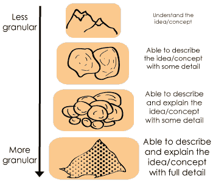
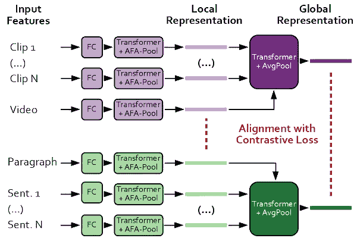
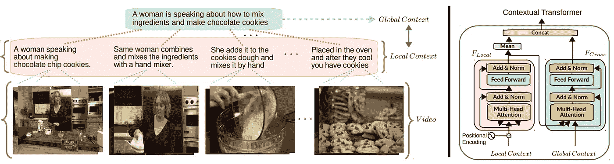
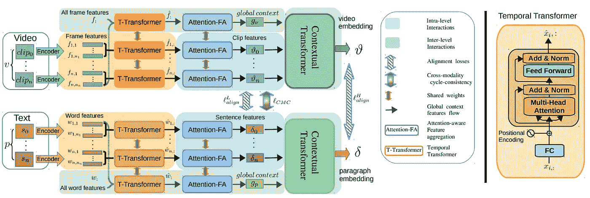
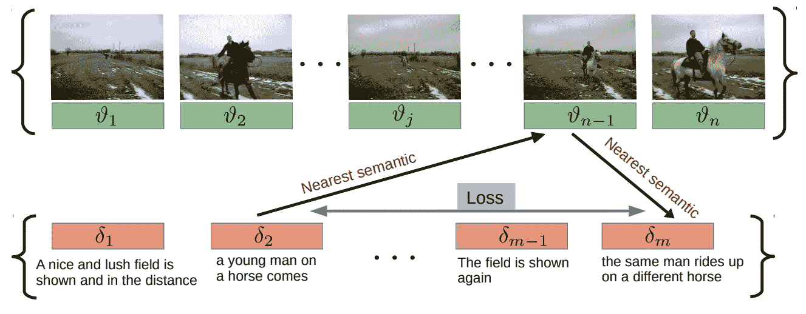

# 使用深度学习和变形金刚的视频到文本描述

> 原文：<https://pub.towardsai.net/video-to-text-description-using-deep-learning-and-transformers-coot-e05b8d0db110?source=collection_archive---------2----------------------->

## [计算机视觉](https://towardsai.net/p/category/computer-vision)、[深度学习](https://towardsai.net/p/category/machine-learning/deep-learning)、[自然语言处理](https://towardsai.net/p/category/nlp)

## NeurIPS2020 会议上发布的这一新模型使用变压器为视频的每个序列生成准确的文本描述，使用视频和对它的一般描述作为输入。

## 它理解视频中每个片段发生的事情，就像人类一样。让我们看看他们是如何做到的。

正如你们中的许多人可能已经知道的，我们正在接近神经信息处理系统会议的日期，也被称为 NeurIPS 会议。在那里，许多优秀的论文将会公之于众，与更多的读者分享。我肯定会报道最有趣的，就像这个视频里的那个。

它被称为 COOT:用于视频-文本表示学习的协作分层变换器。顾名思义，它使用转换器为视频的每个序列生成准确的文本描述，将视频和视频的一般描述作为输入。

在继续之前，如果您不熟悉 transformer 的架构，我邀请您观看我制作的解释它的视频。这将有助于您理解视频的其余部分，在那里我不会深入介绍这种架构的细节。

在深入这个网络之前，我们还需要回顾一个重要的概念。粒度。

理解粒度以及它如何应用于我们的工作是极其重要的。尤其是在从视频生成文本描述时。粒度是指特定实体的大小。在我们的例子中，它指的是视频和文本，其中有许多粒度级别。视频可以被称为帧、剪辑或直接称为完整视频。在这里，单词也可以被看作句子、段落，甚至是字母。它们各有不同的语义和含义。例如，生成一个视频的一般描述比生成整个视频的多个更深入的描述要简单得多，正如本文中所实现的那样。

他们通过对这些不同粒度级别之间的交互进行建模来实现这一点，以便更好地理解视频帧和剪辑的上下文。他们的方法基本上由三个主要部分组成。该架构的第一部分在一个剪辑中工作。它利用本地时间上下文，即每个剪辑中与理解上下文相关的信息，通过使用注意感知特征聚合层。

然后，有一个上下文转换器，它使用这个时间转换器作为基础，学习每个剪辑、句子、段落如何相互作用，以产生最终的视频/段落。

简而言之，这个上下文转换器鼓励模型针对局部和全局上下文之间的交互来优化表示。像人类一样，结合全球和本地背景来理解整个视频中发生的事情是很重要的。这样，模型就知道每个剪辑都连接在一起，下一个剪辑是当前剪辑的延续。在这个例子中，模型知道在整个视频中仍然是同一个人用多个步骤做同一件事，这就是巧克力饼干的配方。

该部分由两个分支组成，一个用于视频输入，一个用于文本输入。给定一个特定的视频和它的一般文本描述，他们将它们编码到尽可能最小的粒度，即帧和单词级别。然后，这些编码输入被发送到这些时间变换器和注意力特征聚集模块，以从帧和单词信息中获得片段级和句子级特征。使用关注这些低层次实体之间的互动，我重复一下，在我们的例子中，是一般描述的词和视频的帧。

最后，就像在每个深度学习模型中一样，有一个损失函数。在这种情况下，将视频连接到文本并改善结果是一种跨模态的循环一致性损失。使用联合嵌入空间，他们在每个句子的剪辑序列中找到最近的邻居，并以相反的方式做同样的事情。

这是他们的模型在试图随机给视频剪辑加标题并把它们放在一起时的输出。观看此视频，了解更好的解释和更多示例:

当然，这只是这篇新论文的一个简单概述，我强烈邀请你阅读下面我的参考资料中链接的论文。你也可以在下面的 GitHub 链接上找到他们的公开代码！

如果你喜欢我的工作并想支持我，我会非常感谢你在我的社交媒体频道上关注我:

*   支持我的最好方式就是跟随我上**。**
*   **订阅我的[YouTube 频道 。](https://www.youtube.com/channel/UCUzGQrN-lyyc0BWTYoJM_Sg)**
*   **在 [**LinkedIn**](https://www.linkedin.com/company/what-is-artificial-intelligence) 上关注我的项目**
*   **一起学习 AI，加入我们的 [**Discord 社区**](https://discord.gg/SVse4Sr) ，*分享你的项目、论文、最佳课程，寻找 Kaggle 队友，等等！***

****参考文献:****

**论文:[https://arxiv.org/pdf/2011.00597.pdf](https://arxiv.org/pdf/2011.00597.pdf)**

**GitHub:[https://github.com/gingsi/coot-videotext](https://github.com/gingsi/coot-videotext)**