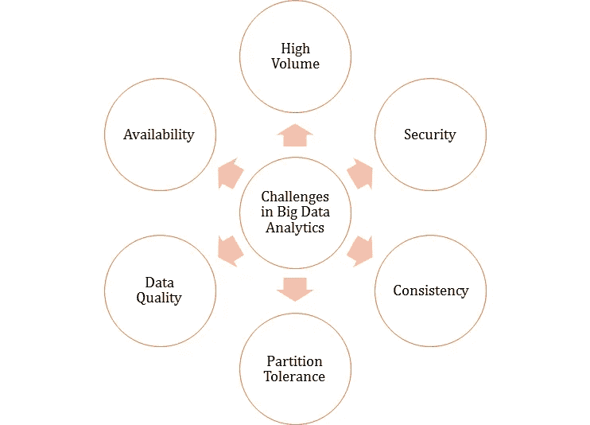
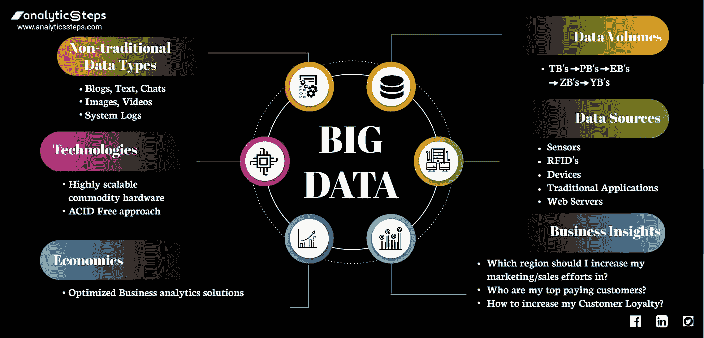
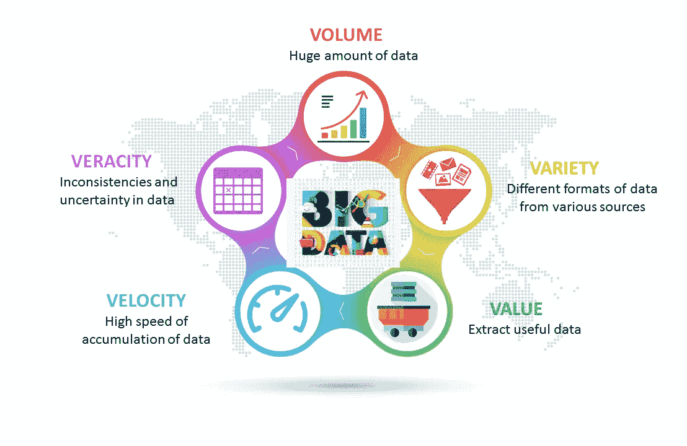
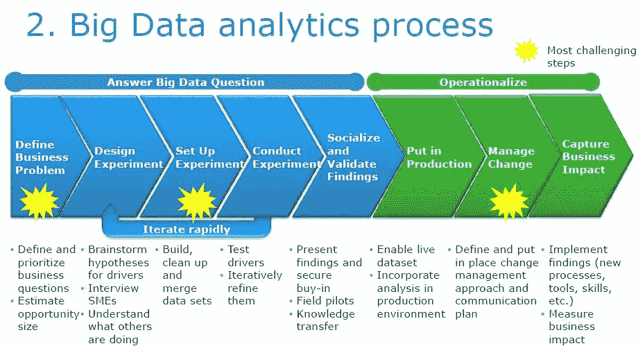
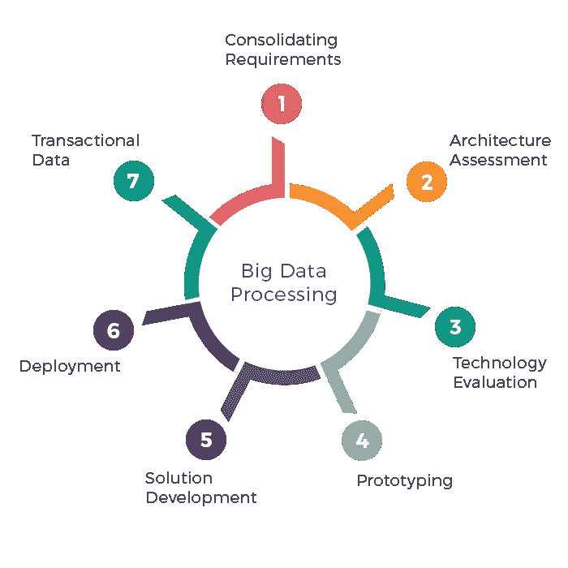
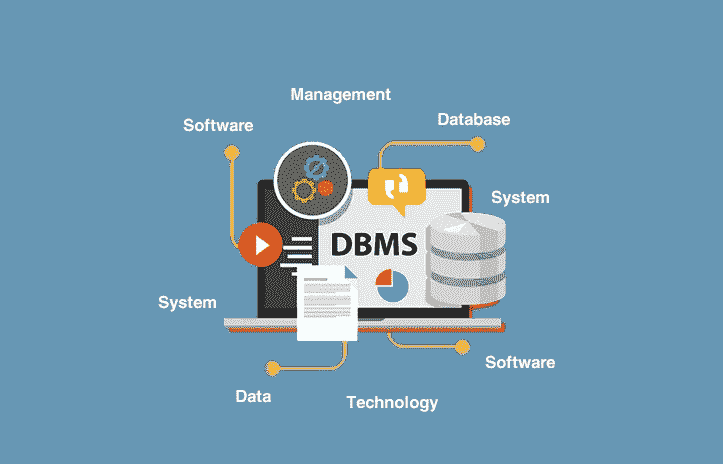
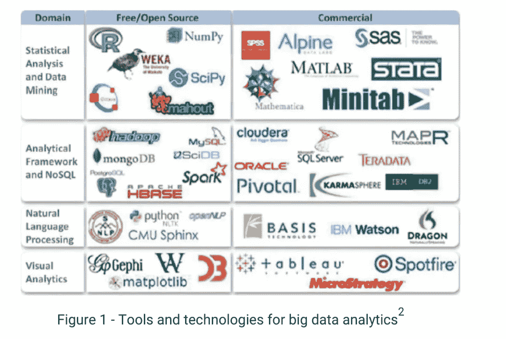

# 大数据可视化指南:与数据和技术的 10 大差异

> 原文：<https://pub.towardsai.net/visual-guide-to-big-data-10-differences-vs-data-and-technologies-7bd8b27ba87?source=collection_archive---------2----------------------->

## 了解数据和大数据之间的 10 个区别、大数据实施过程中采取的 4 个高级步骤、管理它们的挑战以及使用大数据的 10 项技术。

来自 Unsplash 的安德鲁·乔治

# **我从与人的讨论和互动中了解到的关于大数据的 8 件事**:

1.我们正在努力解决如何最好地利用大数据，并将其转化为可用于做出更好决策和提高绩效的见解。

2.数据正以前所未有的速度增长，让我们难以跟上。

3.数据的来源比以往任何时候都多，这使得整合和理解所有数据变得非常困难。

4.数据通常是非结构化的，因此很难分析和得出结论。

作者[https://www . research gate . net/figure/Challenges-in-Big-Data-Analytics _ fig 4 _ 322063809](https://www.researchgate.net/figure/Challenges-in-Big-Data-Analytics_fig4_322063809)

5.处理大数据的工具和技术仍在快速发展和变化。

6.缺乏了解如何处理大数据的熟练人员。

7.安全和隐私问题是大数据的主要问题。

8.存储和处理大数据的成本可能会让我们的组织望而却步。

到[https://www . analyticssteps . com/blogs/top-10-big-data-technologies-2020](https://www.analyticssteps.com/blogs/top-10-big-data-technologies-2020)

# **什么是大数据**

大数据是一个术语，用于描述由企业和组织生成的大量数据。这些数据可以是客户数据、财务数据或其他类型的数据。大数据可用于帮助企业和组织做出更好的决策，改善运营，并深入了解客户和市场。

由[https://big data path . WordPress . com/2021/01/27/5-vs-of-big-data/](https://bigdatapath.wordpress.com/2021/01/27/5-vs-of-big-data/)

# **数据和大数据的 10 个区别**

1.数据是一组可以被处理以产生信息的值。大数据是一组更大的数据，可能更难处理成信息。

2.数据通常存储在单个数据库或表中。大数据可能分布在多个数据源中。

3.数据处理可以通过简单的查询来完成。大数据处理可能需要特殊的工具和技术。

4.数据通常是成批处理的。大数据可以实时处理。

5.数据通常在一台服务器上处理。大数据可以在分布式系统上处理。

6.数据处理通常需要提取、转换和加载(ETL)过程。大数据处理可能不需要 ETL。

7.通常使用传统的关系数据库来处理数据。大数据通常使用 NoSQL 数据库进行处理。

8.通常使用 SQL 处理数据。大数据通常使用 MapReduce、Apache Hive 或其他类型的大数据查询语言进行处理。

9.通常使用单个处理线程来处理数据。大数据通常使用多个处理线程进行处理。

10.数据通常存储在单个存储设备上。大数据通常分布在多个存储设备上。

# **大数据是如何工作的？**

大数据系统旨在捕获和处理大量数据(通常是实时的)，然后为用户提供分析这些数据的能力，以提取有价值的见解。一般来说，对于传统的数据处理技术来说，存在太大或太复杂的数据集。由于大数据通常是非结构化的，并且难以使用传统的数据处理技术进行处理，因此开发了 Hadoop 和 NoSQL 等技术来高效处理和存储大数据。同样，为了处理大数据，企业通常使用专门设计的软件和硬件来处理大量数据。

作者[https://www . Dell . com/en-us/blog/the-big-data-wildline-finding-your way-starts with-questing-the-right-questions/](https://www.dell.com/en-us/blog/the-big-data-wilderness-finding-your-way-starts-with-asking-the-right-questions/)

# **大数据流程中采取的 4 个高级步骤**

1.数据接收:从各种来源收集数据，并存储在一个中心位置。

2.数据处理:对数据进行处理，以提取重要信息，并转换成决策者可以使用的格式。

3.数据分析:对处理后的数据进行分析，以确定趋势、模式和关系。

4.数据可视化:数据分析的结果以易于理解和解释的可视化格式呈现。

由[https://dopikai.com/big-data-processing/](https://dopikai.com/big-data-processing/)

# **管理大数据的低级流程中的 15 个步骤**

1.从各种来源收集数据

2.过滤并清理数据，以消除任何不一致之处

3.将数据组织成易于分析的结构

4.分析数据以发现模式和趋势

5.根据数据分析的结果提出假设

6.用额外的数据检验假设

7.根据测试结果完善假设

8.基于完善的假设开发大数据解决方案

9.实施大数据解决方案

10.评估解决方案的结果

11.根据评估结果完善大数据解决方案

12.根据需要重复步骤 9–11

13.大数据解决方案的维护和支持

14.大数据流程的文档记录

15.过程结果的交流

由[https://bleuwire.com/5-biggest-big-data-challenges/](https://bleuwire.com/5-biggest-big-data-challenges/)

# **与大数据相关的 10 大挑战**

大数据带来了一些挑战，如数据质量、存储和隐私。从低层次来看，挑战包括捕获、存储、分析、数据监管、搜索、共享、传输、可视化、查询、更新、信息隐私和数据安全。总体而言，这些挑战包括:

1.数据过载:过多的数据可能难以管理，并可能导致数据泄露等问题。

2.数据质量:数据质量差会导致错误的分析和决策。

3.数据安全性:必须保护数据免受未经授权的访问，防止数据被破坏或丢失。

4.数据隐私:个人数据必须得到保护，以保护人们的隐私权。

5.数据治理:必须有明确的政策和程序来确保数据得到有效管理。

6.数量:庞大的数据量可能会让人不知所措，难以管理。

7.多样性:有许多不同类型的数据，这使得分析和得出结论变得困难。

8.速度:数据生成和收集的速度可能很难跟上。

9.准确性:数据的准确性和可信度可能很难确定。

10.价值:很难确定大数据的价值以及如何利用大数据来改善业务决策。

由[https://www . digital journal . com/pr/database-management-system-DBMS-market-to-witness-using-growth-in-approach-years-2022-2028-微软-新技术-sap-SAS-institute-objectivity-Pitney-Bowes](https://www.digitaljournal.com/pr/database-management-system-dbms-market-to-witness-stunning-growth-in-upcoming-years-2022-2028-microsoft-neo-technology-sap-sas-institute-objectivity-pitney-bowes)

# **什么是数据库管理系统(DBMS ),为什么它们对大数据很重要？**

管理大数据的一项技术是数据库管理系统(DBMS)。DBMSs 是允许用户创建和维护数据库的软件程序。此外，DBMSs 还提供了一种组织数据的方法，以便于访问和更新。大数据管理系统(BDMSs)是一种专门为管理大量数据而设计的 DBMS。bdm 通常使用并行处理和分布式计算来帮助管理大型数据集。

# **大数据的数据挖掘和数据仓库怎么样？**

管理大数据的另一项技术是数据挖掘。数据挖掘是从大型数据集提取模式[10]和趋势的过程，数据挖掘可用于发现[11]数据项之间的关系，找到隐藏的模式，或预测未来趋势。大数据管理也可以使用数据仓库来完成。数据仓库是将数据存储在一个集中的位置以便业务决策者可以访问和分析的过程。

由[https://encyclopedia.pub/entry/10083](https://encyclopedia.pub/entry/10083)

# **管理大数据的 10 项技术**

通常，我们会听说 Hadoop、Spark、Hive、Impala 和 Drill。以下是 10 项技术。

1.Apache Hadoop: Hadoop 是一个开源框架，用于大型数据集的分布式存储和处理[1]。

2.Apache Spark: Spark 是一个用于快速和通用数据处理的开源框架[2]。

3.Apache Flink: Flink 是一个用于流处理的开源框架[3]。

4.Kafka: Kafka 是一个开源的消息代理，帮助存储和处理大型数据集[4]。

5.Cassandra: Cassandra 是一个开源的分布式数据库管理系统，旨在处理大量数据[5][12]。

6.HBase: HBase 是一个开源的、面向列的数据库管理系统，构建在 Hadoop 分布式文件系统之上[6]。

7.MongoDB: MongoDB 是一个开源的、面向文档的数据库管理系统。

8.CouchDB: CouchDB 是一个开源的、面向文档的数据库管理系统[7]。

9.DynamoDB: DynamoDB 是由 Amazon [8]提供的完全托管的 NoSQL 数据库服务。

10.BigQuery: BigQuery 是 Google 提供的云数据仓库服务[9]。

如果您有任何编辑/修改建议或关于进一步扩展此主题的建议，请考虑与我分享您的想法。

# **另外，请考虑订阅我的每周简讯:**

 [## 周日报告#1

### 设计思维与 AI 的共生关系设计思维能向 AI 揭示什么，AI 又能如何拥抱…

pventures.substack.com](https://pventures.substack.com/) 

*参考文献。*

*【1】。*[*https://www.sas.com/en_us/insights/big-data/hadoop.html*](https://www.sas.com/en_us/insights/big-data/hadoop.html)

*【2】。*[*https://spark.apache.org*](https://spark.apache.org/)

*【3】。【https://flink.apache.org】*

**【4】。*[*https://kafka.apache.org*](https://kafka.apache.org/)*

**【5】。**

***【6】。*[*https://hbase.apache.org*](https://hbase.apache.org/)**

***【7】。*[*https://couchdb.apache.org*](https://couchdb.apache.org/)**

***【8】。*[*https://docs . AWS . Amazon . com/whites/latest/big-data-analytics-options/Amazon-dynamo db . html*](https://docs.aws.amazon.com/whitepapers/latest/big-data-analytics-options/amazon-dynamodb.html)**

***【9】。*[*https://cloud.google.com/bigquery*](https://cloud.google.com/bigquery)**

***【10】。人力资源组织视图中的数据挖掘。*T32*https://www . organization view . com/insights-articles/2018/5/28/data-mining-in-HR***

***【11】。数据挖掘技术可以应用于以下哪些领域？。*[*https://www . tutorialspoint . com/以下哪些领域的数据挖掘技术可以应用*](https://www.tutorialspoint.com/which-of-the-following-areas-data-mining-technology-can-be-applied)**

***【12】。数据—春天。*[*https://docs . spring . io/spring-boot/docs/3 . 0 . 0-SNAPSHOT/reference/html/data . html*](https://docs.spring.io/spring-boot/docs/3.0.0-SNAPSHOT/reference/html/data.html)**