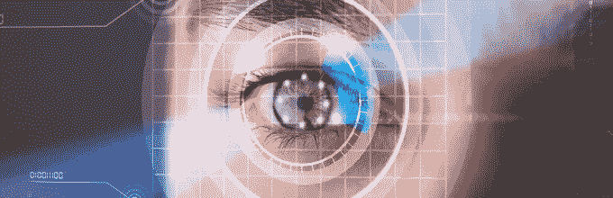
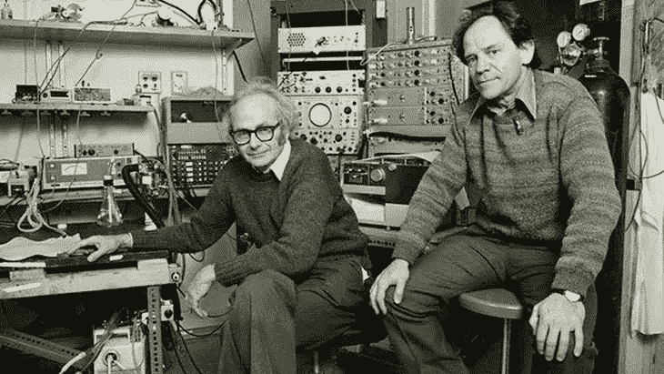
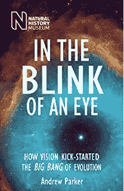
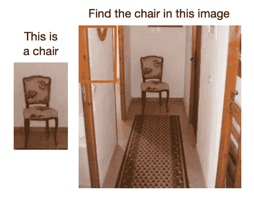
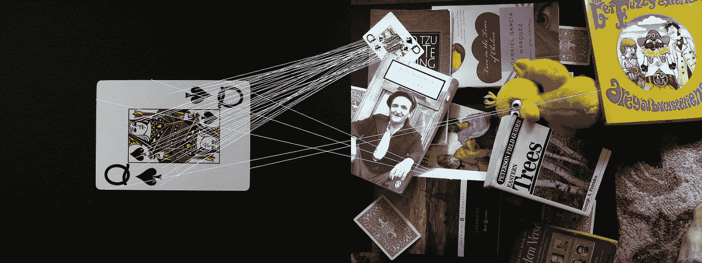
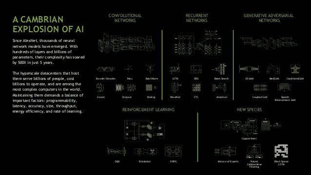

# 视觉感知——从人类视觉到计算机视觉

> 原文：<https://pub.towardsai.net/visual-perception-from-human-vision-to-computer-vision-3152134292?source=collection_archive---------3----------------------->

## 浅谈人类认知的启发性理念

人类视觉皮层由 1.4 亿个神经元组成，是大脑中最神秘的部分之一，负责处理和解释视觉数据，以提供感知和形成记忆。人类可以从一点点信息中了解一个场景的很多情况。例如，给定下面的图像，一个人可以利用上下文和他的先验知识给出这个场景背后的整个故事。

但是让计算机感知视觉世界有多难呢？截至 2019 年，我们已经取得了重大进展，但仍有很长的路要走。计算机视觉是计算机科学的一个相对新颖的领域，大约有 60 年的历史。

## 人类视觉的进化

5.5 亿年前，生命主要存在于水中，但 5.43 亿年前，当地球上的物种数量爆炸时，发生了一些事情，牛津大学的动物学家[安德鲁·帕克](https://en.wikipedia.org/wiki/Andrew_Parker_(zoologist))在他的书《眨眼之间的中称之为[寒武纪大爆发](https://www.independent.co.uk/news/science/you-can-see-it-in-their-eyes-543551.html)。它是由视觉的突然进化引发的，引发了动物要么进化要么死亡的进化军备竞赛。这就是视觉引发进化大爆炸的原因。

## 大脑是如何解决视力问题的？

直到 1959 年，我们对生物视觉知之甚少。1959 年，哈佛医学院的两位神经生物学家 David Hubel 和 Torsten Wiesel 做了一项惊人的实验，获得了两项诺贝尔奖，揭示了人类视觉系统的几个秘密。

[https://www.youtube.com/watch?v=NV1uBSSC8jE&feature = youtu . be](https://www.youtube.com/watch?v=NV1uBSSC8jE&feature=youtu.be)

他们记录了猫大脑中单个神经元的电活动。他们用幻灯机向猫展示特定的图案，并注意到特定的图案刺激了大脑特定部位的活动。实验告诉我们，视觉皮层细胞对边缘的方向很敏感，但对它们的位置不敏感。他们得出结论，视觉皮层中有 3 种类型的细胞——简单细胞、复杂细胞和超复杂细胞。视觉处理从简单的细胞开始，这意味着它从学习简单的东西开始，例如边缘和角落。这为现代计算机视觉奠定了基础。

## 生物视觉到计算机视觉

在 70 年代，麻省理工学院的神经科学家 David Marr 从 Hubel 和 Wiesel 关于大脑视觉处理系统的实验中获得灵感，开始设计计算机视觉来模仿人类的视觉能力。他说，为了理解视觉信息，当它在视觉皮层中被处理时，需要经过几个步骤的处理。他提出了一个假设，即有少量的几何组成形状形成原始的视觉对象。他把他的大部分发现写进了他的书《T2 的愿景》。

受视觉皮层中分层处理的启发，通用对象识别的分层方法近年来变得越来越流行。人们开始思考人类视觉已经解决的圣杯问题，即人脸识别、物体识别和分割。

学术界第一次正式的计算机视觉工作开始于 1966 年的麻省理工学院，名为[麻省理工学院夏季视觉项目](http://people.csail.mit.edu/brooks/idocs/AIM-100.pdf)，目的是在 1966 年夏天解决计算机视觉问题。

## 经典计算机视觉

在现代深度学习启发计算机视觉之前，在 70 年代，人们开始使用模板匹配方法和滑动窗口方法来解决对象识别和检测问题，用于对象检测和分类。

这里给定一个对象的模板，你在数百个可能的窗口中寻找模板对象。但是在现实世界中，由于视点、比例和光照变化以及遮挡，这种方法不起作用。此外，您不可能拥有所有可能的模板来模拟组内或组间可变性。

所以人们开始研究基于特征的方法。特征是图像中对上述变化保持不变的感兴趣的点。

匹配不同场景中的对象。大卫·洛，1999 年

1999 年，David Lowe 在 ICCV 会议上发表了尺度不变特征变换。SIFT 的思想是——将图像内容转换成局部特征坐标，该坐标对于平移、旋转、缩放和其他成像参数是不变的。这被描述为经典计算机视觉的时刻。它为物体识别研究提供了燃料，因为有了 SIFT，人们不必考虑尺度、光照变化和遮挡。

## 机器学习启发了计算机视觉

到 2000 年，统计机器学习已经在视觉上起飞。 [Paul Viola 和 Michael Jones](https://web.stanford.edu/class/cs231a/prev_projects_2016/cs231a_final_report.pdf) 在 2001 年使用机器学习开发了最好的人脸检测算法，这仍然是最快的人脸检测方法之一。

苹果 Face ID

2006 年，富士胶片制造了第一台内置人脸检测功能的相机。90 年代后期支持向量机的成功使得计算机视觉更容易完成物体分类任务。仍然缺乏用于研究的数据集。在创建标准研究型数据集的方向上，牛津大学[视觉几何组](http://www.robots.ox.ac.uk/~vgg/index.html)的 Andrew Zisserman 与马克·埃弗灵厄姆一起创建了 [PASCAL](http://host.robots.ox.ac.uk/pascal/VOC/) 视觉对象类数据集，为视觉和机器学习社区提供了图像和注释的标准数据集以及标准评估程序。它导致了分类和检测算法的发展，但是由于当代机器学习算法的较高模型容量和 PASCAL 数据集相对较小的大小，模型很容易过度拟合，并且在看不见的图像上没有给出好的结果。

## 深度学习的寒武纪大爆发

研究人员一直在努力设计越来越复杂的算法来索引、检索、组织和注释多媒体数据。但是好的研究需要好的资源。为了大规模解决这些问题，如果有一个大规模的图像数据库，将对研究人员有极大的帮助。这就是斯坦福视觉实验室的费教授创建 ImageNet 的动机，ImageNet 是一个拥有超过 1500 万张图片的数据集。菲菲的一位博士顾问[皮埃特罗·佩罗娜](http://www.vision.caltech.edu/Perona.html)是吉坦德拉·马利克的学生。2011 年，Jitendra 打电话给 [Geoffrey Hinton](http://www.cs.toronto.edu/~hinton/) ，建议他使用 Imagenet，接下来的一年，在 2012 年 NIPS 大会上发生了一件令人瞩目的事情。Hinton 和 Alex Krizhevsky 一起发表了 [AlexNet](https://papers.nips.cc/paper/4824-imagenet-classification-with-deep-convolutional-neural-networks.pdf) ，这被 NVIDIA 首席执行官黄仁勋在 2018 年 GTC 峰会上称为深度学习的寒武纪大爆发

黄仁勋的幻灯片，英伟达 GTC，2018 年

结果太惊人了，连菲菲都惊讶不已，认为数据集有问题。从那以后，现代计算机视觉受到了深度学习的极大启发。

## 为什么计算机视觉很难？

视觉理解远远超出了物体识别。只需看一眼图像，我们就可以毫不费力地想象像素之外的世界:例如，我们可以推断人们的行动、目标和精神状态。虽然这项任务对人类来说很容易，但对今天的视觉系统来说却非常困难，需要对世界的高阶认知和常识推理。

始于 1966 年的麻省理工学院夏季视觉项目，目的是在一年的夏季解决计算机问题，即使在这些巨大的努力之后，计算机视觉仍然不是一个已解决的问题，它只在少数特定的受限环境中工作。