# 矩阵和向量运算的可视化表示以及在 NumPy、Torch 和 TensorFlow 中的实现。

> 原文：<https://pub.towardsai.net/visual-representation-of-matrix-and-vector-operations-and-implementation-in-numpy-torch-and-tensor-6a94d14913c6?source=collection_archive---------1----------------------->

## [深度学习](https://towardsai.net/p/category/machine-learning/deep-learning)

在深度学习的基本单元上实现从初级到高级的操作。

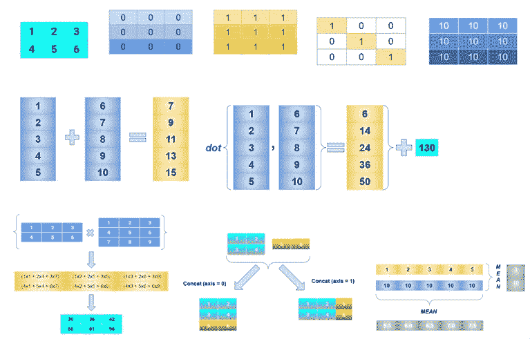

摘录

我习惯于为不同的问题创建新的深度学习架构，但选择哪个框架( **Keras，Pytorch，TensorFlow** )往往更难。

由于其中存在不确定性，所以了解这些框架的基本单元(NumPy、Torch、Tensor)的基本操作是有好处的。

在这篇文章中，我已经在 3 个框架中执行了一些相同的操作，也尝试了大部分框架的可视化。

这是一个适合初学者的帖子，让我们开始吧。

# 1.装置

# 2.版本检查

# 3.数组初始化~一维、二维、三维

## 标量和一维数组

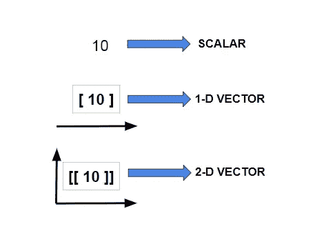

标量、一维、二维数组

## Numpy 实现:

## TensorFlow 实现:

## 火炬实施:

## 二维向量阵列

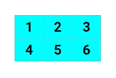

二维数组

## Numpy 实现:

## TensorFlow 实现:

## 火炬实施:

# 4.生成数据

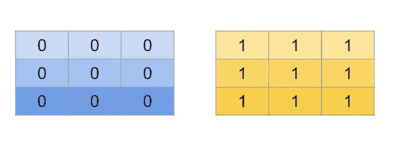

零和一

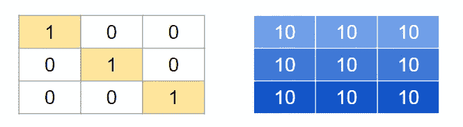

对角线和相同元素填充

## Numpy 实现:

## TensorFlow 实现:

## 火炬实施:

## 从正态分布中抽取随机样本

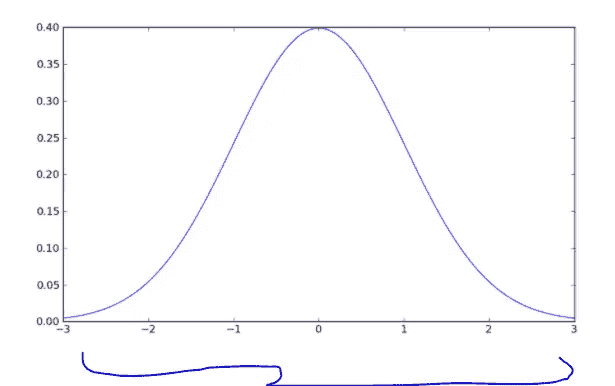

正态分布钟形曲线

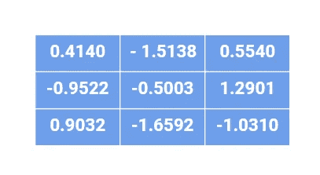

样本取自正常区

## Numpy 实现:

## TensorFlow 实现:

## 火炬实施:

## 从均匀分布中抽取样本

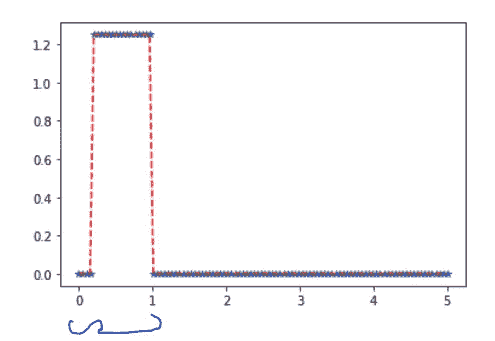

均匀分布曲线

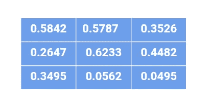

样品取自制服区

## Numpy 实现:

## TensorFlow 实现:

## 火炬实施:

# 6.向量排列

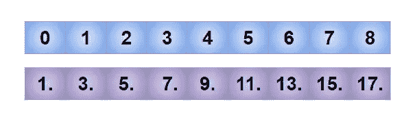

## Numpy 实现:

## TensorFlow 实现:

## 火炬实施:

# 7.数据类型—转换

uint 8/16/32/64←→float 8/16/32/64

## Numpy 实现:

## TensorFlow 实现:

## 火炬实施:

# 8.数学运算

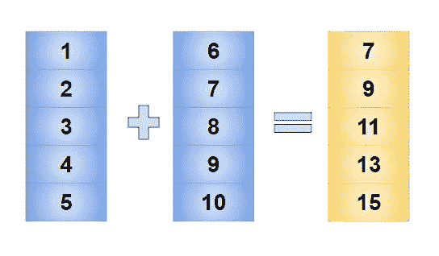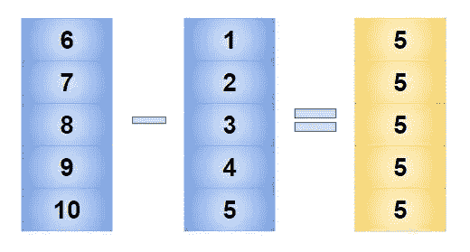

加法和减法运算

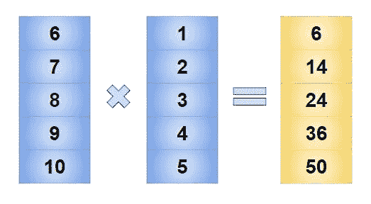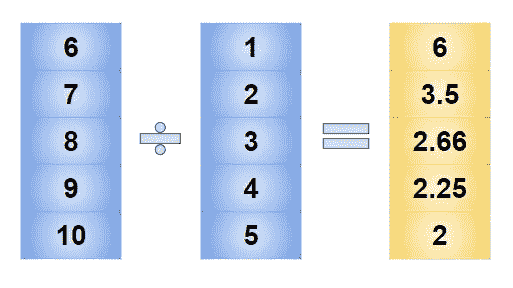

乘法和除法运算

## Numpy 实现:

## TensorFlow 实现:

## 火炬实施:

# 9.点积

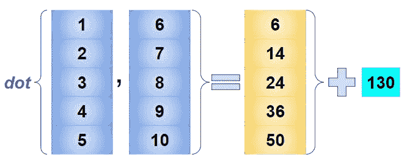

点积

## Numpy 实现:

## TensorFlow 实现:

## 火炬实施:

# 10.矩阵乘法

矩阵乘法

## Numpy 实现:

## TensorFlow 实现:

## 火炬实施:

# 11.索引和切片(二维)

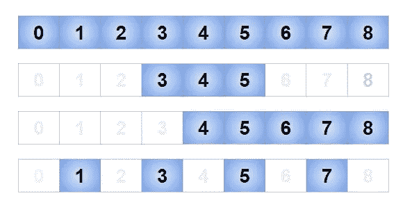

索引和切片

## Numpy 实现:

## TensorFlow 实现:

## 火炬实施:

# 12.索引和切片(二维矩阵)

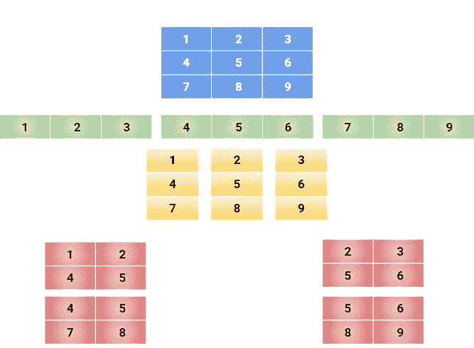

矩阵切片

## Numpy 实现:

## TensorFlow 实现:

## 火炬实施:

# 13.重塑和转置轴

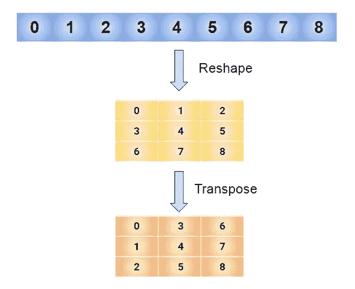

重塑和移调

## Numpy 实现:

## TensorFlow 实现:

## 火炬实施:

# 14.串联

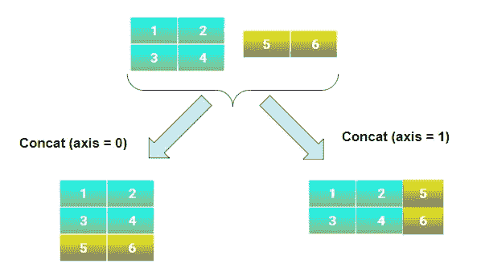

矩阵串联

## Numpy 实现:

## TensorFlow 实现:

## 火炬实施:

# 15.跨轴求和

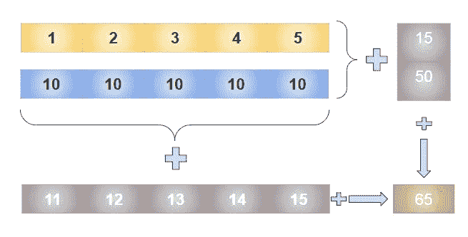

坐标轴—总和

## Numpy 实现:

## TensorFlow 实现:

## 火炬实施:

# 16.跨轴平均值

## Numpy 实现:

## TensorFlow 实现:

## 火炬实施:

# 17.尺寸扩展和移动轴。

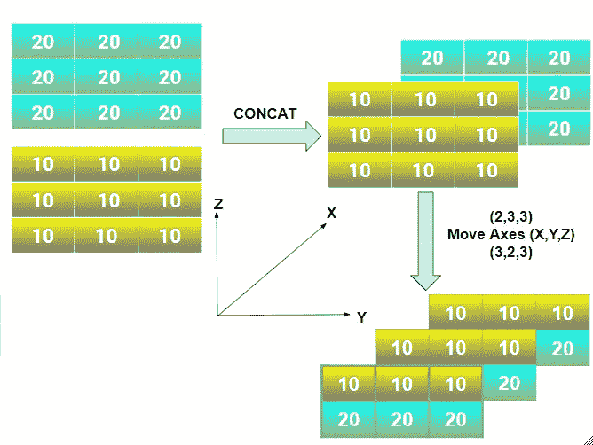

串联和移动轴

## Numpy 实现:

## TensorFlow 实现:

## 火炬实施:

# 18.Max (Min)和 Argmax:

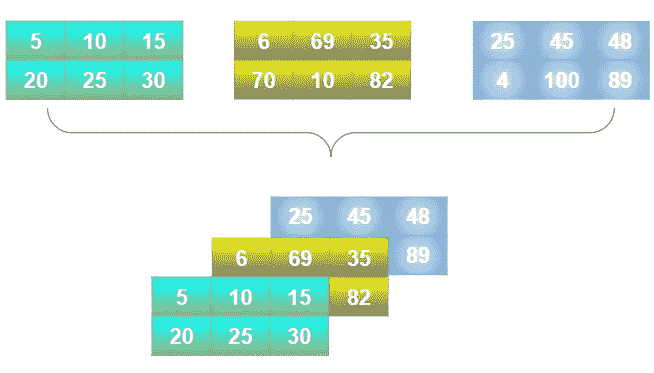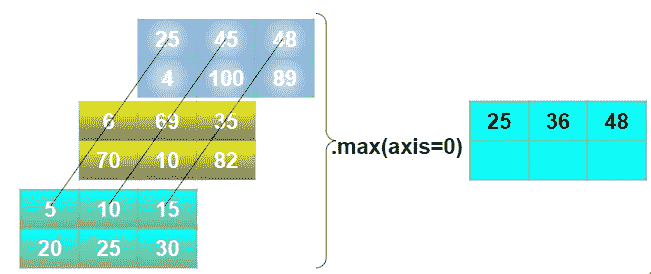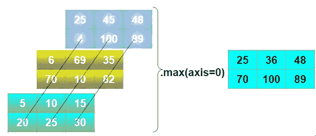

轴的最大值=0

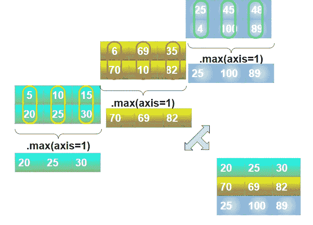

轴的最大值=1

## Numpy 实现:

## TensorFlow 实现:

## 火炬实施:

# 19.切片和索引(三维矩阵)

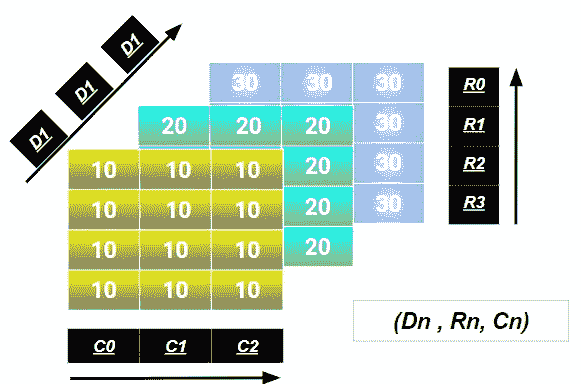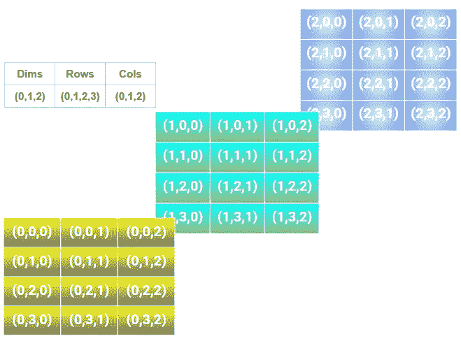

3x3 矩阵及其指数

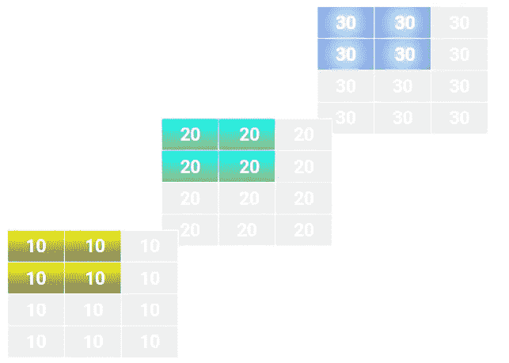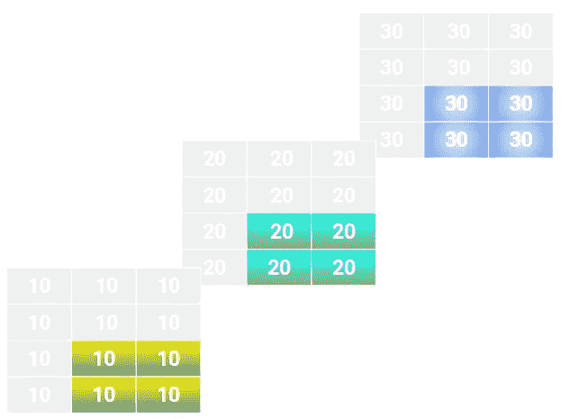

左上和右下

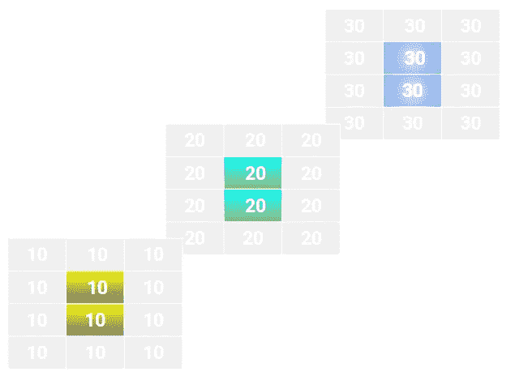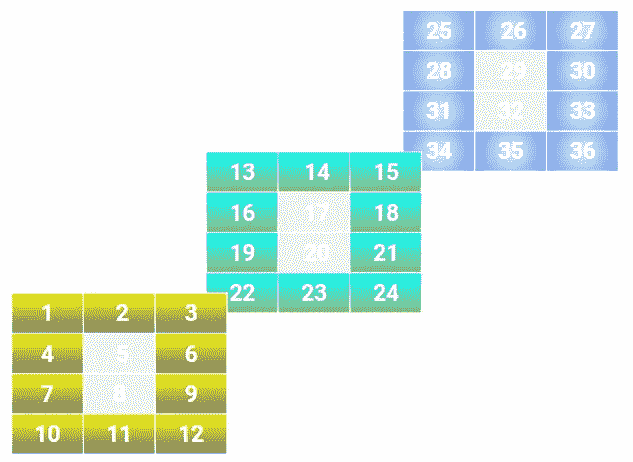

中间元素&逆中间元素

## Numpy 实现:

## TensorFlow 实现:

## 火炬实施:

由于可视化的限制，我跳过了高维度部分的操作。

我希望我能够对一些基本操作以及您选择的深度学习框架提供一些视觉理解，我将很快添加更多详细的操作。

在 Google Colab 这里查看笔记本→ [***Colab***](https://colab.research.google.com/github/bala-codes/Numpy-Tensor-Torch-Operations-Visualized/blob/master/codes/Numpy_Tensor_Torch_Operations_Visualized.ipynb) 。

(或)

在 Kaggle 这里查看笔记本→[***Kaggle***](https://www.kaggle.com/balakrishcodes/visual-representation-of-matrix-vector-operation)

在那之前，下次见。

**文章作者:**

**BALAKRISHNAKUMAR V**