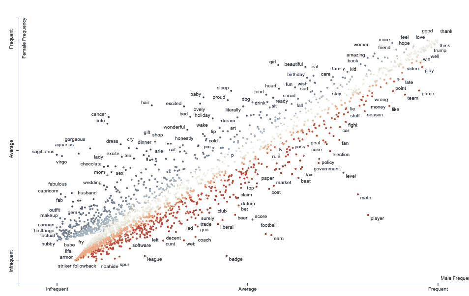
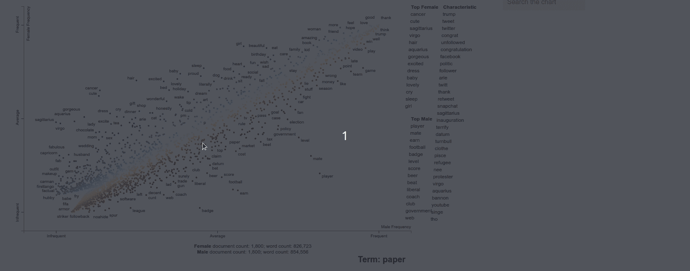
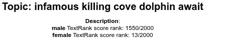
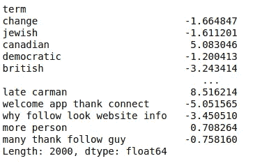
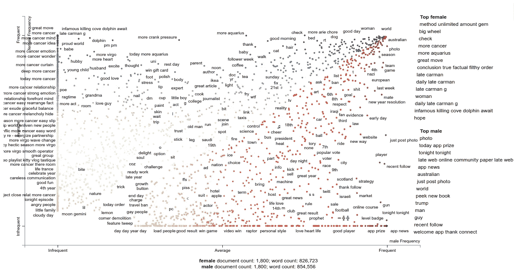

# 用分散文本可视化特定性别的推文

> 原文：<https://pub.towardsai.net/visualize-gender-specific-tweets-with-scattertext-5167e4600025?source=collection_archive---------1----------------------->

## [数据可视化](https://towardsai.net/p/category/data-visualization)，[自然语言处理](https://towardsai.net/p/category/nlp)

## 区分推文中的性别，并在交互式 HTML 散点图中呈现


照片由 [Dainis Graveris](https://unsplash.com/@dainisgraveris?utm_source=medium&utm_medium=referral) 在 [Unsplash](https://unsplash.com?utm_source=medium&utm_medium=referral) 上拍摄

# 动机

如果给你一条推文，你能认出它属于哪个性别吗？你或许可以通过查看推文中的特定单词来识别作者的性别。

比如说。如果你在一条推文中看到“可爱”这个词，很大一部分作者是女性。因为有些词是某个性别更经常使用的，所以机器学习模型有可能使用这些与性别相关的词来区分不同的性别。

如果我们可以在 Twitter 上可视化不同的单词如何与不同的性别相关联，这不是很有趣吗？这可以很容易地用散文本来完成。下面是扫描一些 Twitter 数据后生成的一个剧情散点文字。



[链接到交互图](https://khuyentran1401.github.io/visualize_gender_in_tweets/tweets_gender.html)

在这篇文章中，我们将学习如何使用散点图创建一个像上面这样的情节。

# 开始

## 什么是分散文本？

[Scattertext](https://github.com/JasonKessler/scattertext) 是一个 Python 库，它在语料库(由大量文本组成的语言资源)中查找有区别的术语，并在一个交互式的 HTML 散点图中呈现它们。

安装分散文本使用

```
pip install scattertext
```

## 输入数据

我们将使用的数据是来自 CLEF 2017 的 PAN 的[作者分析数据集。提供了每条推文作者的性别和国家。](https://pan.webis.de/clef17/pan17-web/author-profiling.html)

由于这篇文章是关于使用散射文本进行可视化的，所以我不会展示处理数据的代码，但可以在这里随意使用笔记本。

从 Google Drive 下载处理过的数据

处理后的数据如下所示:

注意，不同行的推文属于不同的人。这意味着列`tweets`中的每一行都是一个人的推文的组合。

# 使用分散文本可视化单词关联

创建语料库以添加到散点文本的绘图功能

可视化我们的语料库

上述代码的解释:

*   `category=’female’, category_name=’Female’, not_category_name=’Male’`指定女性在 y 轴，男性在 x 轴
*   `minimum_term_frequency`:如果`minimum_term_frequency=2`，出现频率小于 2 的术语将不在图中显示
*   `pmi_threshold_coefficient`:点态互信息。如果两项独立，pmi=0
*   `width_in_pixels`:图像的宽度
*   `metadata`:文本所属的另一个类别。在这个语境下，就是`country`
*   `transform=st.Scalers.dense_rank`:将相同比例的短语上下放置



你可以在这里探索[上面的剧情。将鼠标悬停在每个术语上，以查找女性和男性之间的术语频率比率。单击一个术语以查看使用该术语的作者的国籍。](https://khuyentran1401.github.io/visualize_gender_in_tweets/tweets_gender.html)

女性热门词汇是那些频繁出现在女性推特上，但很少出现在男性推特上的词汇。从图表中，我们可以看到:

*   排名靠前的女性词汇有巨蟹、可爱、射手座、处女座、头发、水瓶座、华丽、兴奋、打扮、宝贝、可爱、哭泣、睡觉、女孩。
*   顶级男性术语是球员、伴侣、收入、足球、徽章、级别、分数、啤酒、节拍、自由主义者、教练、俱乐部、政府、网络。

这些术语听起来就像典型的女性或男性的推文！

# 使用 Scattertext 和 PyTextRank 可视化短语关联

单词很酷，但是如果我们想将性别和短语(一个或两个以上的单词)之间的联系可视化呢？分散文本也允许我们这样做。

我们还将使用 [PyTextRank](https://github.com/DerwenAI/pytextrank) ，它允许我们从文本文档中提取排名靠前的短语。使用安装 PyTextRank，s [paCy](https://spacy.io/usage) 及其英文模型

```
pip install pytextrank
pip install -U spacy
python -m spacy download en
```

加载 spaCy 的英语模型，并创建一个所有推文的语料库。我们添加`st.PyTextRankPhrases()`来提取排名靠前的短语，而不是单词。

运行`corpus.get_metadata_freq_df('')`以获得每个类别的术语 TextRank 分数。

知道分数不如知道每个术语相对于每个类别中其他术语的排名更有帮助。因此，我们将根据分数获得每个类别中每个术语的排名。

数字越小，术语的等级越高。例如，1550/2000 的等级低于 13/2000。

我们还将指定当点击一个术语时显示哪个文本

当点击“臭名昭著的猎杀海豚等待”时，会显示以下内容:



我们还会根据与分数关联度更高的性别，将分数更改为负数或正数。如果一个学期的女性分数高于该学期的男性分数，则该数字为正。否则将是负的。



创建可视化

函数中参数的解释:

*   `sort_by_dist=False`:确保显示在图表右侧的短语按分数排列，而不是按与左上角或右下角的距离排列
*   `scores`:术语的分数，用于查找术语在图表中的位置
*   `metadata_descriptions`:点击时的术语描述
*   `use_full_doc=True`:使用数据集中的所有文档。如果你有大量的文档，把这个设置为`False`。

这是图表的样子！



情节看起来很酷，不是吗？你可以在这里探索剧情[。](https://khuyentran1401.github.io/visualize_gender_in_tweets/tweets_gender_textrank.html)

# 结论

恭喜你！您刚刚学习了如何创建一个交互式绘图，以使用分散文本区分语料库中的术语。下次使用文本分类数据集时，请尝试使用分散文本。当看到用于训练模型的特征时，您将更好地理解您的模型。

您甚至可以检测应该从语料库中删除的单词或短语，以收集更多相关的特征。

本文的源代码可以在这里找到:

[](https://github.com/khuyentran1401/Data-science/tree/master/visualization/scattertext) [## khuyentran 1401/数据科学

### 有用的数据科学主题以及代码和文章的集合- khuyentran1401/Data-science

github.com](https://github.com/khuyentran1401/Data-science/tree/master/visualization/scattertext) 

我喜欢写一些基本的数据科学概念，并尝试不同的算法和数据科学工具。你可以在 LinkedIn 和 Twitter 上与我联系。

如果你想查看我写的所有文章的代码，请点击这里。在 Medium 上关注我，了解我的最新数据科学文章，例如:

[](https://towardsdatascience.com/introduction-to-yellowbrick-a-python-library-to-explain-the-prediction-of-your-machine-learning-d63ecee10ecc) [## Yellowbrick 简介:可视化机器学习预测的 Python 库…

### 您将 f1 分数提高到了 98%！但这是否意味着你的模型表现更好呢？

towardsdatascience.com](https://towardsdatascience.com/introduction-to-yellowbrick-a-python-library-to-explain-the-prediction-of-your-machine-learning-d63ecee10ecc) [](https://towardsdatascience.com/top-6-python-libraries-for-visualization-which-one-to-use-fe43381cd658) [## 可视化的 6 大 Python 库:使用哪一个？

### 对使用哪种可视化工具感到困惑？我为你分析了每个图书馆的利弊

towardsdatascience.com](https://towardsdatascience.com/top-6-python-libraries-for-visualization-which-one-to-use-fe43381cd658) [](https://towardsdatascience.com/i-scraped-more-than-1k-top-machine-learning-github-profiles-and-this-is-what-i-found-1ab4fb0c0474) [## 我收集了超过 1k 的顶级机器学习 Github 配置文件，这就是我的发现

### 从 Github 上的顶级机器学习档案中获得见解

towardsdatascience.com](https://towardsdatascience.com/i-scraped-more-than-1k-top-machine-learning-github-profiles-and-this-is-what-i-found-1ab4fb0c0474) [](https://towardsdatascience.com/streamlit-and-spacy-create-an-app-to-predict-sentiment-and-word-similarities-with-minimal-domain-14085085a5d4) [## Streamlit 和 spaCy:创建一个应用程序来预测情绪和单词的相似性，最小域…

### 只需要 10 行代码！

towardsdatascience.com](https://towardsdatascience.com/streamlit-and-spacy-create-an-app-to-predict-sentiment-and-word-similarities-with-minimal-domain-14085085a5d4)