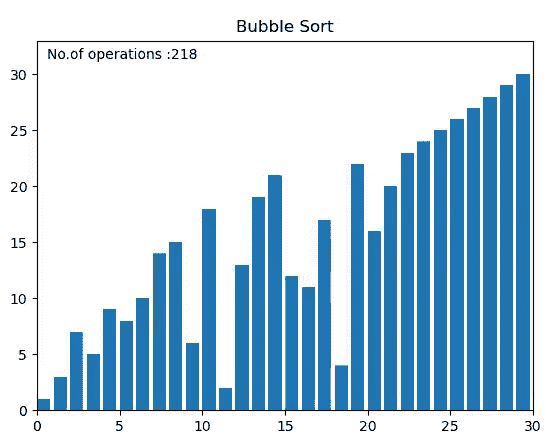
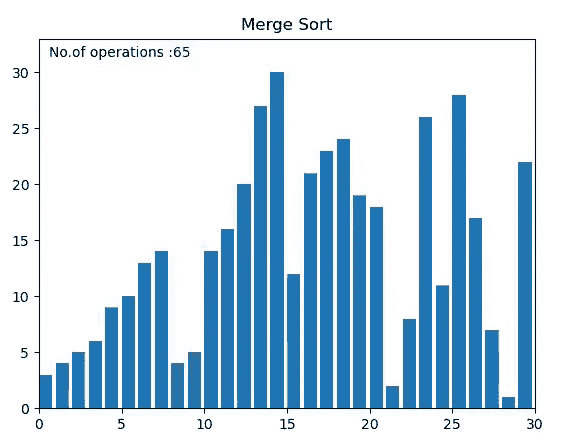

# 用 Python 可视化一个有趣的排序算法

> 原文：<https://pub.towardsai.net/visualize-interesting-sorting-algorithms-with-python-bdd64bdd0713?source=collection_archive---------0----------------------->

## [编程](https://towardsai.net/p/category/programming)

## 永远不要忘记那些排序算法，用 Python 可视化它们。

> 有各种类型的排序算法，有时如果没有可视化，理解它们的内部工作会变得非常困难。因此，我决定借助 matplotlib.animations 库用 python 可视化这些排序算法。



左边是冒泡排序，右边是合并排序

> **注意:-在本文中，我们还将计算执行的操作数量，并能够看到排序算法的时间复杂度。**

因为我们的目的只是可视化排序算法，所以我将使用`merge sort` 进行演示，但是你应该实现它们的其余部分，以便理解它们之间的差异。

在我们开始编码之前，你必须安装`python 3.3` 或更高版本，因为我已经使用了`yield from`功能或生成器。

## **我们开始吧:-**

首先，您需要导入给定的库。我们已经使用了`random`模块来生成一个要排序的随机数字数组。`matplotlib pyplot`和`animation`模块将用于激活排序算法。

```
import random
import matplotlib.pyplot as plt
import matplotlib.animation as anim
```

下面给定的`swap`函数将用于交换给定数组中的元素。定义一个单独的函数是有用的，因为它将在不同的算法中被详尽地使用。

```
def swap(A, i, j):
    a = A[j]
    A[j] = A[i]
    A[i] = a
    # also in python A[i],A[j]=A[j],A[i]
```

我们使用了`Merge Sort`来演示这种可视化，因为这是最流行的，也是最好的排序算法之一。合并排序遵循`Divide and Conquer`排序技术。它将数组分成两个子数组，通过递归调用合并排序对每个子数组进行排序。我们的主要焦点是可视化算法，因此我不会解释它的工作原理。下面的代码显示了合并排序。为了直观地了解它是如何工作的，人们可以观看 youtube 上的这段视频[珍妮的讲座](https://youtu.be/jlHkDBEumP0.)。

```
def merge_sort(arr,lb,ub):
    if(ub<=lb):
        return
    elif(lb<ub):
        mid =(lb+ub)//2
        yield from merge_sort(arr,lb,mid)
        yield from merge_sort(arr,mid+1,ub)
        yield from merge(arr,lb,mid,ub)
        yield arrdef merge(arr,lb,mid,ub):
    new = []
    i = lb
    j = mid+1
    while(i<=mid and j<=ub):
        if(arr[i]<arr[j]):
            new.append(arr[i])
            i+=1
        else:
            new.append(arr[j])
            j+=1
    if(i>mid):
        while(j<=ub):
            new.append(arr[j])
            j+=1
    else:
        while(i<=mid):
            new.append(arr[i])
            i+=1
    for i,val in enumerate(new):
        arr[lb+i] = val
        yield arr
```

现在我们将简单地创建要排序的随机数字列表，数组的长度将由用户自己决定。之后用`if condition`选择算法。

```
n = int(input("Enter the number of elements:"))
al = int(input("Choose algorithm:  1.Bubble \n 2.Insertion \n 3.Quick \n 4.Selection \n 5.Merge Sort))
array = [i + 1 for i in range(n)]
random.shuffle(array)if(al==1):
    title = "Bubble Sort"
    algo = sort_buble(array)
elif(al==2):
    title = "Insertion Sort"
    algo = insertion_sort(array)
elif(al==3):
    title = "Quick Sort"
    algo = quick_Sort(array,0,n-1)
elif(al==4):
    title="Selection Sort"
    algo = selection_sort(array)
elif (al == 5):
    title = "Merge Sort"
    algo=merge_sort(array,0,n-1) 
```

现在我们将使用 matplotlib `figure` 和`axis`为动画创建一个画布。然后，我们创建了条形图，其中每个条形代表数组中的一个数字。这里的`text()`用于显示画布上的操作次数。前两个参数是标签的位置。`transform=ax.transAxes`表示前两个参数是轴分数，而不是数据坐标。

```
fig, ax = plt.subplots()
ax.set_title(title)
bar_rec = ax.bar(range(len(array)), array, align='edge')
text = ax.text(0.02, 0.95, "", transform=ax.transAxes)
```

`update_plot`函数用于更新我们动画中每一帧的图形。实际上，该函数将传递给`anima.FuncAnimamtion()` ，后者使用它来更新绘图。这里，我们已经传递了上面定义的输入数组`rec` ，以及跟踪所执行操作数量的时期。有人可能认为我们可以在 epochs 中简单地使用整数值而不是列表，但是像`epoch = 0`这样的整数不能通过引用传递，而只能通过值传递，不像列表那样通过引用传递。`set_height()`用于更新每个条的高度。

```
epochs = [0]
def update_plot(array, rec, epochs):
    for rec, val in zip(rec, array):
        rec.set_height(val)
    epochs[0]+= 1
    text.set_text("No.of operations :{}".format(epochs[0]))
```

最后，我们创建`anima`对象，在其中我们传递接受生成器函数的`frames=algo` (该算法是一个生成器函数，因为它包含 yield ),之后，它将生成或更新的数组传递给`update_plot` , `fargs` 接受额外的参数，即`epochs`和`bar_rec`,`interval`是每帧之间的延迟，以毫秒为单位。

最后，我们使用`plt.show()`来绘制动画人物。

```
anima = anim.FuncAnimation(fig, func=update_plot, fargs=(bar_rec, epochs), frames=algo, interval=1, repeat=False)
plt.show()
```

我的 [**Github**](https://github.com/PushkaraSharma/Visualize_DS) repo 中有所有排序算法的完整代码。看看这个。如果你喜欢这篇文章，请告诉我。

查看我的文章[使用 Python 将图像转换成 ASCII 艺术图像](https://medium.com/@pushkarasharma11/convert-images-to-ascii-art-images-using-python-90261de03c53)

了解关于[动画功能](https://matplotlib.org/3.2.1/api/_as_gen/matplotlib.animation.FuncAnimation.html)的更多信息