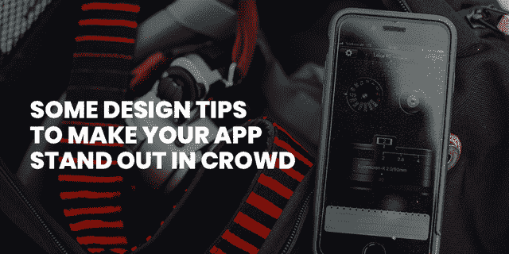
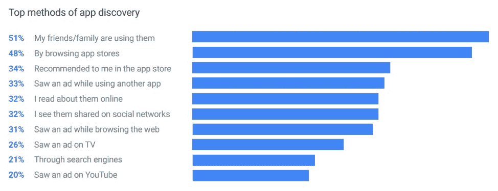
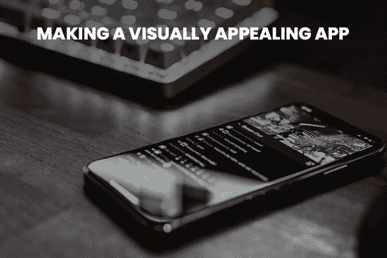
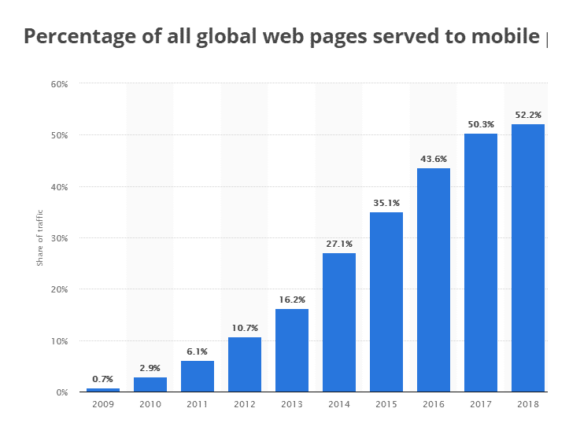
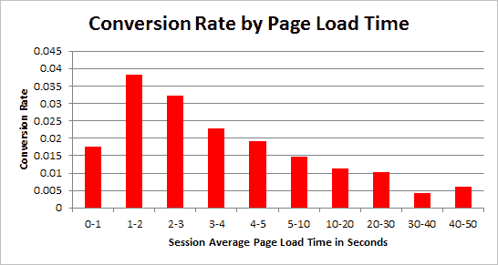

# 想让你的应用变得有吸引力？这里有一些设计技巧

> 原文：<https://pub.towardsai.net/want-to-make-your-app-attractive-here-are-some-design-tips-df8e32dbe67c?source=collection_archive---------1----------------------->

移动应用程序开发最近已经成为一个爆炸性的现实，特别是对于那些幻想实现更突出目标的组织。由于其在当前场合的蓬勃发展的兴趣，具有多用途的应用意味着对商业发展的实质性提升。尽管如此，每一个奇怪的客户中只有一个倾向于下载和使用应用程序。

根据一份**的报告，大多数用户通过浏览应用商店 **(48%)** 、查看应用商店的推荐应用 **(34%)** 以及查看应用内广告 **(33%)** 来了解来自朋友或家人的新应用 **(51%)****

****

**(图片来源:[离合器 ](http://clutch.co/hlr/l.php?u=https%3A%2F%2Fwww.thinkwithgoogle.com%2F_qs%2Fdocuments%2F331%2Fhow-users-discover-use-apps-google-research.pdf&r=https%3A%2F%2Fclutch.co%2Fapp-developers%2Fresources%2F7-ways-to-attract-app-users&pid=381094)**

**随着移动应用程序开发接近饱和点，应用程序商店目前受到大量应用程序的限制，形成了激烈的竞争。 [**移动应用开发**](https://www.xicom.biz/offerings/mobile-app-development/) 是一种需要，不管业务是小是大。**

> **不管该应用程序是否简单易用，它肯定意味着可以看到更多的业务采购。**

**虽然计划和风格不足以击败实体，但视觉外观仍然可以承担起引领变革的重要任务。不管你在结构化上花了多少钱，最后，你需要的是一个理想的移动应用，以及如何制作一个简单的应用。**

> **那么，现在让我们进入更好的元素，如何保证你的应用程序结构创新，完美地保持平面组件和多功能建筑的和谐状态。**

# **如何制作一个有吸引力的安卓 App？**

****

> **以下是关于如何制作专业 android 应用程序的一些最著名的技巧和功能:**

## **1.让用户通过它的简单性进行连接**

**以下是如何制作一个有吸引力的 android 应用程序。在您准备好应用程序配置的用户界面之后，与您的一部分同伴或家庭成员分享这项工作，他们在技术上并不差。在这一点上，他们的行为类似于最终客户。给他们一个完整的机会来调查和判断你的申请计划的不同组成部分，并了解其进展情况。如果他们称之为自然体验，你可以说你已经以正确的方式努力了。**

> **由于最终目标是让客户与您的应用程序相关联，因此您必须努力保持最基本的东西。从捕捉到菜单标签和活动呼叫，它的所有方面都有所不同，需要你冷静考虑。**

## **2.点和像素的高分辨率**

**在计划时，一个重点应该是展览的空间划分。当客户在屏幕上摆弄应用程序的内部时，点和像素决定了应用程序的最后图像将如何呈现给他们。点和像素共同决定了总体目标。如果你想知道如何让一个 android 应用看起来不错，那么这可能是一个很好的观点。**

**建筑师应该考虑像素，这是屏幕上空间中最小的点，几乎不明显但很重要。这些像素的巨大厚度产生了最好的图像。为了实现更高的目标和清晰度，在一个演示文稿中应该逐步设置一定数量的像素。点是包含一定量像素的空间单位，构成一个展示区。**

> **沿着这些思路，一个移动应用程序的创建者应该在整个计划过程中控制所有的点，以向客户传达高目标的视觉体验。目标越高，你的应用程序越有吸引力。**

## **3.标题、描述和引人入胜的视频**

**如果你想知道如何让 android 应用程序更有吸引力，以下是你可以做到的。**

> **根据 Hubspot 的一份报告，88%的视频营销人员表示，视频给他们带来了积极的投资回报。**

****

**(图片来源:**)****

****标题是你为应用商店优化所做努力的一个重要部分。它有一个巨大的效果是有效的；此时，它将构建到达您的应用程序页面的客人数量。****

> ****精确的元描述可以帮助提高你的导航率。描述应该是一个完美的形式，是一个简短的大纲，其中包括对应用程序的流行语和现实的关注。****

****应用商店中有大量的应用程序，很难突出和增加你的应用程序的下载量。扩大应用程序在应用程序商店中的流行程度的一种方法是为您的应用程序制作一个 see 视频，这将帮助客户更好地理解您的应用程序。****

## ****4.尽量不要选择不规则的阴影****

****应用程序的整个结构组件需要有一个明白无误的理由，包括颜色观点。尽量不要把颜色弄得太亮，太有区别，或者太难辨认。如果颜色过于鲜艳，要确保颜色和阴影不会伤害到人的眼睛。****

****在你 [**雇佣安卓应用开发者**](https://www.xicom.biz/offerings/hire-android-developers/) 之前，那么确定这是一个好点。利用规则的阴影关系来捕捉鱼。因此，如果你想逆转常见的颜色联想，它可能会混淆用户和你的观众。因此，转换率可能会受到影响。****

## ****5.不同的屏幕****

****移动应用程序架构师需要理解不同的屏幕尺寸和屏幕目标。手机，即使来自相似的品牌和制造商，也有着各种独特的形状、尺寸和目标。用户还需要代表不同的手机。考虑有多少人会在他们的平板电脑上使用你的应用。据 [**报道**](https://www.browserstack.com/guide/responsive-design-trends)**94%**的人对网站的评价是响应式网页设计****

********

****(图片来源: **BrowserStack******

****根据您的应用程序在哪里可以访问，用户可能会有机会考虑不同的屏幕，例如智能电视。该计划应改进 [**android 应用程序开发解决方案**](https://www.xicom.biz/offerings/android-development/) 然而，正如可以合理预期的那样，许多屏幕。****

## ****6.分隔文本****

****用户不需要不同的内容就能相互接触。由于应用程序计划的最终目标是高效的，因此在每行内容之间留有巨大的空间并不总是明智的。所以用户需要有不同的方法来分离物质。****

****当然，用户可以利用图片或分页符。然而，他们不能对每一行内容都这么做。因此用户可以利用其他一些简单的特技来识别一行和另一行。例如，特定段的标题可以全部是大写字母。此时，在其正下方，切换回正常的大写规则。同样，您可以给内容加下划线，以形成一个分离的边界。****

> ****利用强烈的内容，区分色调，并改变各行内容的基础或文本风格。****

****这允许用户在不改变内容大小的情况下在每个屏幕上显示更多内容。****

## ****7.加载页面很重要****

****在你 [**雇佣手机应用开发者**](https://www.xicom.biz/offerings/hire-mobile-developers/) 之前，确保你看一看这一点。如果您构建的应用程序的计划过于复杂，它将影响应用程序加载的程度。因此，看一看当页面堆叠时，跳出率如何随着持续通过而增加。****

> ****据[报道](https://www.websitemagazine.com/blog/5-reasons-visitors-leave-your-website)，每一秒钟的延迟都会导致 7%的转化率损失。****

********

****(图片来源: [**网站杂志**](https://www.websitemagazine.com/blog/5-reasons-visitors-leave-your-website)****

****这将伤害用户，并导致客户放弃应用程序。显然，这将是一个重大问题。尽量不要制定一个荒谬和疯狂的计划，否则会导致抛弃。改进计划解决了这个问题。快速的页面加载速度将改善客户体验，增加他们的承诺。当他们充分利用应用程序的经验时，他们会继续利用它，这给了他们获得更多现金流的绝佳机会。****

## ****8.网格逻辑****

****应用程序中的网格工作起来就像一个组织者，并传达可预测的客户参与调查应用程序的各个页面的快照。当用户从一个页面开始改变，然后到下一个页面时，网络确保客户在他们通过页面绘制和混合时不会失去一致性和视觉关联。****

****它适合于便携式应用程序的创建者和工程师建立用于可视通信的网络表示。 [**手机 app 开发服务**](https://www.xicom.biz/offerings/mobile-app-development/) 可以从这一点上受益。沿着这些思路，客户端体验将会越来越复合化，表面上看起来很合适，并被整合到所有应用程序页面上。****

## ****9.应用程序图标和登录功能****

****醒目的图标可以扩大点击率。结构不应该仅仅是重要的，此外，还应该在外表上吸引目标客户。****

****具有吸引人的结构的应用程序图标可以增加被看到的机会，并让客户仔细阅读应用程序的更多功能。一个可行的应用程序图标配置应该有两个基本要素，特别是卓越性和快速明显性。****

****应用程序的登录亮点应该尽可能简单明了。“登录”应该只需要一个单独的快照。当 [**软件开发公司**](https://www.xicom.biz/) 搜索可移植应用程序进展时，利用在线网络登录，如脸书、Google+ answer，登录到应用程序(并保持标记)。****

> ****应该有一种技术来恢复用户名或密码。应该有一个选择给喜欢，提供或评论的不同项目或场合出现在应用程序中。有了这些亮点，就可以让应用程序吸引更多的客户。****

******10。尽量不要复制不同的应用程序******

****几乎每个人都会发生这种情况。在分类和空间中遵循一些卓有成效的应用的愿望很容易使沉思混合。尽管如此，这可以逆转放电。个人可能会很快理解这一点，因为他们会试图模仿客户经常使用的有效应用程序。这可能会导致一幅可怕的画面。因此，做出与众不同的东西是很重要的，同时保证它与客户的和谐是最基本的。****

# ****简单地说****

****客户很重要；关于这一点没有两种不同的方式。此外，他们会根据你的应用程序的结构和便利性来判断你的应用程序，这通常是在访问应用程序的客户附近选择的。因此，无论他们达成了什么样的改进安排，清理应用程序的计划并发现更多组件来扩展其价值是必要的。随着多功能应用程序的不断发展，重要的是要认识到为一个惊人的应用程序创造一个非凡的 UI 的配置倾向。****

> ****我们希望这篇文章已经为您提供了必要的信息。如果没有，用户可以在下面的评论区给我们写信。我们的专业人员将努力解决问题，并回答您的问题。****