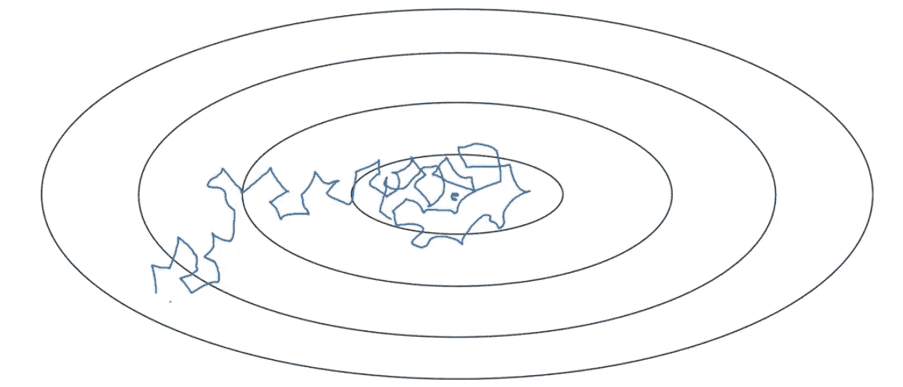
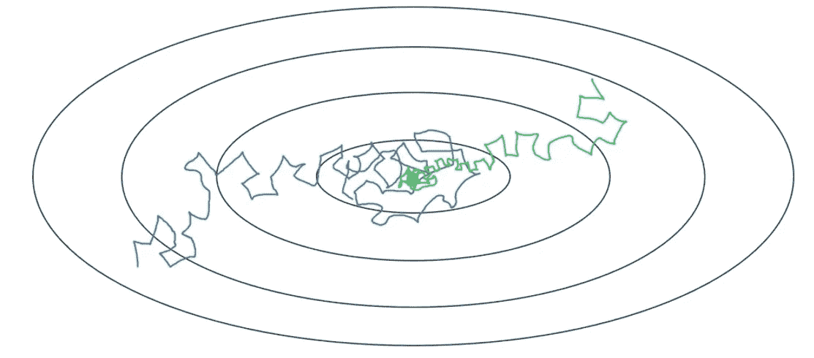
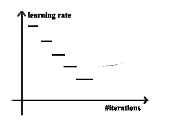
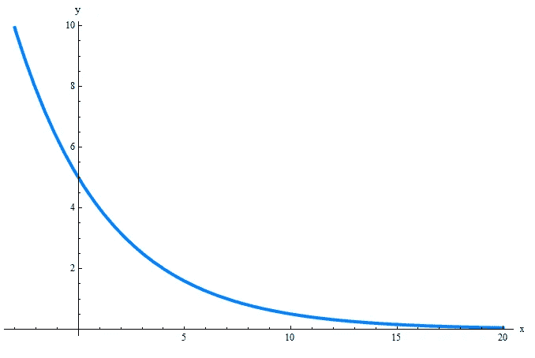

# 想优化你的模型？使用学习率衰减！

> 原文：<https://pub.towardsai.net/want-to-optimize-your-model-use-learning-rate-decay-8ab3ce68addc?source=collection_archive---------2----------------------->

## [深度学习](https://towardsai.net/p/category/machine-learning/deep-learning)

## 随着时间的推移调整你的学习速度参数会有很大的不同！让我们看看怎么做。


由[西蒙·米加杰](https://unsplash.com/@simonmigaj?utm_source=medium&utm_medium=referral)在 [Unsplash](https://unsplash.com?utm_source=medium&utm_medium=referral) 上拍摄的照片

被困在付费墙后面？点击[这里](https://d3nyal.medium.com/want-to-optimize-your-model-use-learning-rate-decay-8ab3ce68addc?sk=e4f5153cd10dc390dfb3ec32a1445a0c)阅读完整故事与我的朋友链接！

这篇文章实际上是一个系列的连续体，专注于对深度学习的构建块的基本理解。以前的一些文章是，如果你需要赶上:

[](https://medium.com/analytics-vidhya/want-your-model-to-converge-faster-use-rmsprop-a28afc2b112b) [## 想让你的模型收敛更快？使用 RMSProp！

### 这是另一种用来加速训练的技术。

medium.com](https://medium.com/analytics-vidhya/want-your-model-to-converge-faster-use-rmsprop-a28afc2b112b) [](https://medium.com/towards-artificial-intelligence/model-overfitting-use-l2-regularization-9f7ca4aadb19) [## 模型过度拟合？使用 L2 正规化！

### 用这个来增强你的深度学习模型！

medium.com](https://medium.com/towards-artificial-intelligence/model-overfitting-use-l2-regularization-9f7ca4aadb19) [](https://medium.com/towards-artificial-intelligence/training-taking-too-long-use-exponentially-weighted-averages-c15279f3df55) [## 训练时间太长？使用指数加权平均值！

### 使用这种优化来加快你的训练！

medium.com](https://medium.com/towards-artificial-intelligence/training-taking-too-long-use-exponentially-weighted-averages-c15279f3df55) 

深度学习在一个领域几乎统治了*最受关注行业的名单，*我认为原因是它在不久的将来有潜力。我已经多次提到过，10 年后，我们将不再有人驾驶出租车，也不再有人是收银员，所有这些工作都将被机器取代。但是我们可以在以后的某一天讨论这个宽泛的方法。

这里，这是一篇技术文章，适合那些对深度学习感兴趣并且知道事物如何工作和做事情的一些基础知识的人。进入这一领域的从业者必须了解基本术语，如*前馈、反向传播、学习速率*等。

让我们在这里回顾一下 ***学习率*** ，因为这是本文的首要重点！

# 学习率

*学习率*是一个*超参数*,它控制每次更新模型权重时，根据估计误差改变模型的程度。选择学习率具有挑战性，因为值*太小*可能导致*长训练*过程停滞，而值*太大*可能导致学习一组次优权重*太快*或*不稳定训练过程*。

> 在[机器学习](https://en.wikipedia.org/wiki/Machine_learning)和[统计](https://en.wikipedia.org/wiki/Statistics)中，**学习速率**是[优化算法](https://en.wikipedia.org/wiki/Mathematical_optimization)中的[调整参数](https://en.wikipedia.org/wiki/Hyperparameter_(machine_learning))，该算法确定每次迭代的步长，同时向[损失函数](https://en.wikipedia.org/wiki/Loss_function)的最小值移动。由于它会影响新获得的信息在多大程度上覆盖旧信息，因此它隐喻性地代表了机器学习模型“学习”的速度。在[自适应控制](https://en.wikipedia.org/wiki/Adaptive_control)文献中，学习率通常被称为**增益**。[1]

# 学习率衰减

> 当使用随机或小批量梯度下降和恒定学习速率训练神经网络时，我们的算法通常以有噪声的方式(MBGD 中噪声较小)收敛于最小值，并最终远离实际最小值振荡，为了克服这种情况，研究人员提出了一种建议，即随着时间的推移衰减学习速率，这有助于网络收敛于局部最小值并避免振荡。[2]

这基本上意味着我们会随着时间的推移慢慢降低学习速度。这在使用小批量梯度下降时会有所帮助。

假设数据有点嘈杂，梯度下降遵循蓝色路径。



图片来自作者。

# 有什么效果？

最初，你会有一个很大的学习率，梯度下降算法将采取很大的步骤，但随着算法的进展，它将开始采取越来越小的步骤，因此，在最小值附近收敛得更好一点！



图片来自作者。

你可以在这里看到绿线是腐朽的！

# 履行

现在，学习率衰减有多种实现方式。

```
å = (1 / (1 + decay_rate * epoch)) * å0 # 1st Implementation
```

另一种是 ***离散楼梯。*** 在这个实现中，我们在每个特定数量的时期之后将学习速率减半。



离散楼梯可视化取自[这里的](https://mc.ai/learning-rate-decay-and-methods-in-deep-learning-3/)。

另一个是 ***指数衰减*** :

```
å = (YOUR_CHOICE_NUM ^ epoch) * å0
# Where ‘YOUR_CHOICE_NUM’ is any number lesser than 1.
```



图片取自[这里](https://www.google.com/url?sa=i&url=https%3A%2F%2Fmathcracker.com%2Fexponential-function-calculator&psig=AOvVaw0dzlSG4AXKD9ZV-kQhfrLv&ust=1605005536907000&source=images&cd=vfe&ved=0CAIQjRxqFwoTCPCawOSl9ewCFQAAAAAdAAAAABAJ)。

另一个实现:

```
å = (k / sqrt(epoch)) * å0
```

运筹学

```
å = (k / sqrt(mini_batch_size)) * å0
```

其中“k”是另一个变量/超参数，我们可以根据需要进行调整。

# 人工腐烂

有时人们自己带着它，观看模型火车，如果需要的话，改变*学习速率*。

但是这种方法是相当**多余的**并且需要很多努力。

相反，我们可以使用一些专门为此创建的函数。

# 自动衰变

我们可以使用多种算法，以便模型能够自行处理学习速率。其中一些是:

*   基于时间的衰减→在迭代的基础上改变学习率。
*   逐级衰减→逐级衰减计划每隔几个历元降低一个因子的学习速率。
*   指数衰减→在迭代的基础上指数衰减。

所有这些都由函数 [LearningRateScheduler](https://keras.io/api/callbacks/learning_rate_scheduler/) 处理。我们主要传递一个自定义函数，上面提到的函数之一。

# Keras 实施

```
def DecayFunction(parameter):
   # desired Decay function
   return newLearningRatemodel.fit((Train_Data), 
   validation_data=(Validation_Data), 
   epochs=YOUR_CHOICE, 
   batch_size=YOUR_CHOICE, 
   callbacks=[LearningRateScheduler], 
   verbose=YOUR_CHOICE
)LearningRateScheduler(DecayFunction)
```

# 结论

在本文中，我们讨论了使用恒定的学习速率如何会使我们的模型性能更差，因此，我们讨论了机器学习实践者广泛使用的一种技术来解决这个问题，并根据模型的需要来改变学习速率。

这样可以让你的模型更好的收敛！

# 参考

[1] → [链接](https://www.google.com/url?sa=t&rct=j&q=&esrc=s&source=web&cd=&ved=2ahUKEwjx6ryr9fjsAhUMxBQKHZnhBJcQFjAAegQIBBAC&url=https%3A%2F%2Fen.wikipedia.org%2Fwiki%2FLearning_rate&usg=AOvVaw1T25UEU3n4avFPLjpGP8c1)。

[2] → [链接](https://medium.com/analytics-vidhya/learning-rate-decay-and-methods-in-deep-learning-2cee564f910b)。

# 进一步阅读

[](https://medium.com/dev-genius/deep-learning-for-weather-classification-fe877cdc721c) [## 用于天气分类的深度学习

### 在不同的天气状态之间分类！

medium.com](https://medium.com/dev-genius/deep-learning-for-weather-classification-fe877cdc721c) [](https://medium.com/analytics-vidhya/lets-discuss-encoders-and-style-transfer-c0494aca6090) [## 让我们讨论编码器和风格转换

### 自动编码器和风格转移小指南。

medium.com](https://medium.com/analytics-vidhya/lets-discuss-encoders-and-style-transfer-c0494aca6090) [](https://medium.com/datadriveninvestor/model-overfitting-use-dropout-a32010f0afd0) [## 模型过度拟合？使用辍学！

### 最好的正规化技术。

medium.com](https://medium.com/datadriveninvestor/model-overfitting-use-dropout-a32010f0afd0) 

# 联系人

如果你想了解我最新的文章和项目，[在 Medium](/@D3nii) 上关注我。以下是我的一些联系人详细信息:

*   [领英](https://www.linkedin.com/in/d3ni/)
*   [GitHub](https://github.com/D3nii?tab=repositories)
*   [推特](https://twitter.com/danyal0_o)

> *快乐学习。:)*