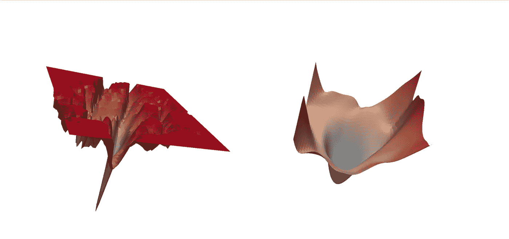
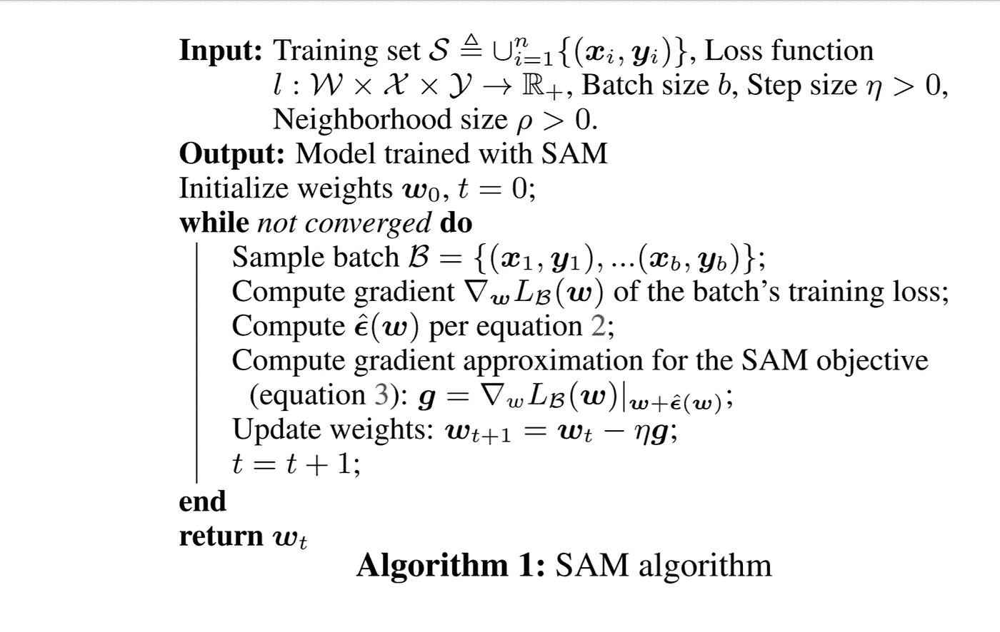

# 我们不再需要担心过度拟合

> 原文：<https://pub.towardsai.net/we-dont-need-to-worry-about-overfitting-anymore-9fb31a154c81?source=collection_archive---------0----------------------->

## [机器学习](https://towardsai.net/p/category/machine-learning)

照片由[穆罕默德·诺哈西](https://unsplash.com/@coopery?utm_source=unsplash&utm_medium=referral&utm_content=creditCopyText)在 [Unsplash](https://unsplash.com/s/photos/joy?utm_source=unsplash&utm_medium=referral&utm_content=creditCopyText) 上拍摄

> 受先前工作的启发，我们引入了一种新颖、有效的方法来同时最小化损失值和损失锐度。特别地，我们的过程，
> 锐度感知最小化(SAM ),寻找位于具有一致低损耗的邻居
> 罩中的参数；这个公式导致一个最小-最大优化问题，在这个问题上可以有效地执行梯度下降。我们提出的实证结果表明，SAM 提高了各种基准数据集的模型泛化能力[1]

来源:清晰度意识最小化论文[1]

在深度学习中，我们使用 SGD/Adam 等优化算法来实现我们模型的收敛，这导致找到全局最小值，即训练数据集损失较低的点。但是几种研究如 [*张等人*](https://arxiv.org/abs/1611.03530) 已经表明，许多网络可以很容易地记忆训练数据，并有能力很容易地过拟合，为了防止这个问题并增加更多的泛化，Google 的研究人员发表了一篇名为 Sharpness Awareness Minimization 的新论文，提供了 CIFAR10 和其他数据集的最新结果。

在本文中，我们将研究为什么 SAM 可以实现更好的泛化，以及我们如何在 Pytorch 中实现 SAM。

# 山姆为什么工作！？

在梯度下降或任何其他优化算法中，我们的目标是找到一个具有低损失值的参数

但是 SAM 通过将**集中在寻找位于具有一致低损失值的邻域中的参数(而不是仅自身具有低损失值的参数)**而实现了比任何其他正常优化方法更好的泛化

由于除了计算单个参数之外，还计算邻域参数，因此与其他优化方法相比，损失情况更加平坦，这反过来增加了模型的通用性。

(左))用 SGD 训练的 ResNet 收敛到的锐最小值。(右)与 SAM 一起训练的 ResNet 收敛到的宽最小值。图片来源:[山姆纸](https://arxiv.org/pdf/2010.01412.pdf) [1]

*注意:SAM 不是一个新的优化器，它与任何其他常见的优化器一起使用，如 SGD/Adam*

# 在 Pytorch 中实现 SAM:

在 Pytorch 中实现 SAM 非常简单明了

代码取自非官方的 Pytorch 实现[2]

代码解释，

*   首先，我们从 Pytorch 的 optimizer 类继承来创建一个优化器，虽然 SAM 不是一个新的优化器，但是为了在每一步更新梯度(在基本优化器的帮助下),我们需要继承那个类
*   该类接受模型参数、基本优化器和 rho，rho 是用于计算最大损失的邻域的大小
*   在进入下一步之前，让我们先看看文中提到的伪代码，这将有助于我们在没有数学知识的情况下理解上面的代码。

图片来源:[山姆论文【1】](https://arxiv.org/pdf/2010.01412.pdf)

*   正如我们在伪代码中看到的，在计算第一次反向传递后，我们计算ε并将其添加到参数中，这些步骤在上述 python 代码的方法 *first_step* 中实现
*   现在，在计算完第一步之后，我们必须回到之前的权重，以计算基本优化器的实际步骤，这些步骤在函数 *second_step* 中实现
*   函数 *_grad_norm* 用于返回矩阵向量的范数，如伪代码的第 10 行所示
*   构建了这个类之后，你可以简单地使用它来完成你的深度学习项目，只需按照下面训练函数中的代码片段。

代码取自非官方的 Pytorch 实现[2]

# 整理想法:

虽然 SAM 实现了更好的泛化，但是这种方法的主要缺点是，它需要两倍的训练时间，因为它计算两次向前和向后传递来计算锐度感知梯度。除此之外，SAM 还在最近发布的 NFNETS 上证明了它的效果，这是 ImageNet 的当前技术状态，在未来，我们可以期待越来越多的论文利用这种技术来实现更好的推广。

如果你喜欢这篇文章或者有任何问题，请随时联系我

# 参考资料:

[1] [有效提高泛化能力的清晰度感知最小化](https://arxiv.org/abs/2010.01412)

[2][Hataya Ryu Ichiro 的 SAM 非正式实现](https://github.com/moskomule/sam.pytorch)