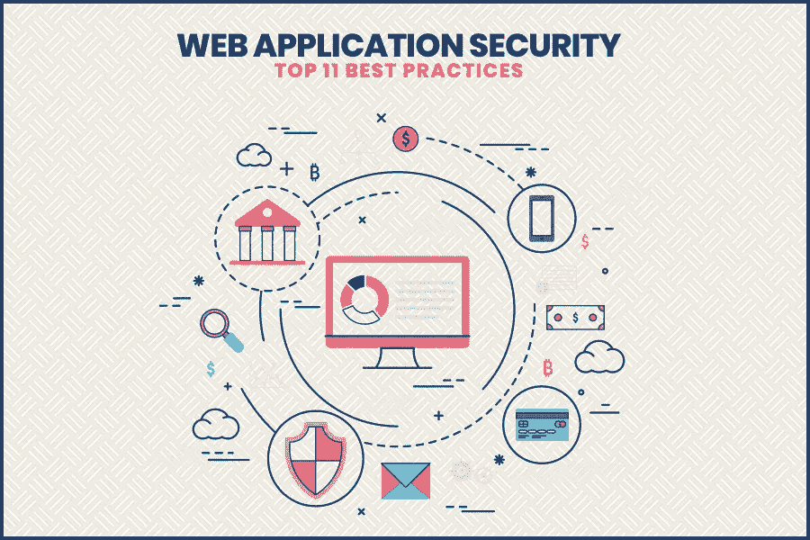
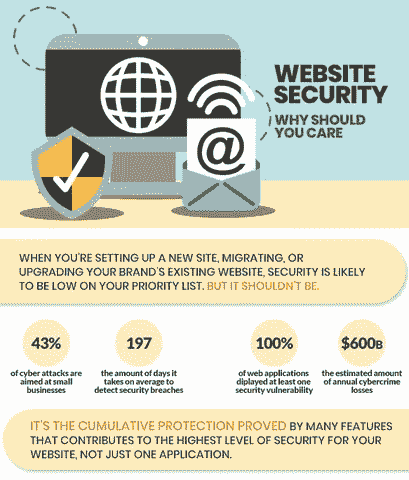
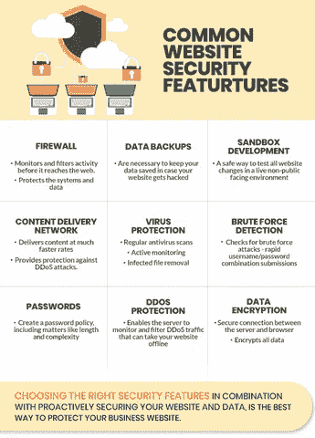
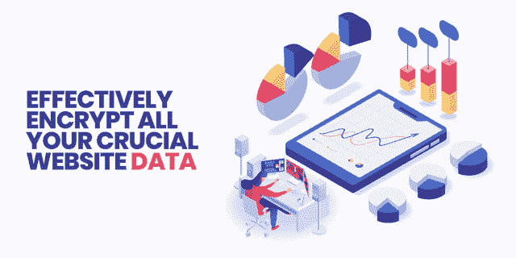

# Web 应用安全:2021 年 11 大最佳实践

> 原文：<https://pub.towardsai.net/web-application-security-top-11-best-practices-for-2020-c3a485e40de8?source=collection_archive---------0----------------------->

你知道网络犯罪或黑客攻击正迅速变得比非法毒品交易更有利可图吗？是的，你没看错！每年，我们都会在新闻中看到数以千计的黑客攻击和安全漏洞案例，这些案例让公司面临金钱损失，同时也损害了他们的品牌声誉。

## 看看网络犯罪的一些事实:

*   2019 年，物联网设备成为恶意软件攻击的重要目标。([来源](https://www.beyondtrust.com/blog/entry/beyondtrust-2019-security-predictions))
*   垃圾邮件是网络犯罪分子传播恶意软件的最常见方法之一。([来源](https://blog.f-secure.com/failed-delivery-spam/)
*   连接智能家居的外部网络使英国、美国和中国更容易受到网络攻击。([来源](https://www.vpngeeks.com/21-terrifying-cyber-crime-statistics-in-2018/))
*   大约五分之一的文件不受保护。([来源](https://info.varonis.com/hubfs/2018%20Varonis%20Global%20Data%20Risk%20Report.pdf))
*   美国用户打开大约三分之一的钓鱼邮件。([来源](https://enterprise.verizon.com/resources/reports/dbir/))
*   信息或数据丢失占网络攻击成本的 43%。([来源](https://www.standardfirms.com/web-design-development-stats-facts/))
*   超过一半的千禧一代在 2019 年经历过网络犯罪。([来源](https://www.arabianbusiness.com/2-5m-uae-consumers-said-be-hit-by-cyber-crime-in-past-year-653743.html))

## 从这些统计数据可以清楚地看出，数据或信息安全在任何组织中都是一个相当大的风险。这是一张描述网站安全重要性的信息图:

# 那么，保护网站安全的步骤是什么呢？让我们在这个博客中找到答案:

## 1.总是备份你所有的网站数据

当恶意软件感染或安全漏洞发生时，您需要在此之后恢复您的 web 应用程序，如果不存储网站的更新或最新版本，将会是灾难性的。当你的网站再次活跃起来的时候，你会很高兴你推迟了它。因此，尽可能多地返回您的数据。值得注意的是，如果发生这种意外，大多数主机服务提供商将从他们的服务器提供备份。

## 2.定期扫描您的网站漏洞

应该定期进行安全扫描和检查，以确保 web 应用程序的安全性。每周至少对你的网站进行一次安全扫描是一个明智的决定。除此之外，您应该在您对 web 应用程序所做的每个更改之后进行扫描。

值得注意的是，各种安全扫描器，即使是经验丰富的人，也无法检测出所有的安全问题。扫描器要么是基于模式的，要么是启发式的，恶意软件总是被设计成扫描器看不见的。一些安全扫描器比其他扫描器更容易发现恶意软件，另一方面，一些扫描器也在努力应对误报。大多数安全扫描仪根本不起作用。此外，您仍然应该了解各种安全缺陷和弱点。

## 3.使用 WebARX 这样的网站安全平台

WebARX 是最好的监控和保护工具之一，尤其是对 web 应用程序开发人员而言。你可能会想为什么开发商？因为在 WebARX 的帮助下，您可以快速保护您的整个客户端组合，并保护尽可能多的网站。

因此，您可以保护您的 web 应用程序，节省资金和时间，并在竞争中保持领先(在网站上添加“受 WebARX 保护”始终是一个好的做法)。

# WebARX 平台包括哪些内容:

**WebARX 是一个 web 应用防火墙(WAF ),它有很多特性，其中一些特性是:**

> OWASP(开放网络应用安全项目)基本规则:它为网站提供日常保护。
> 
> 智能威胁情报，监控您的域名在各种黑客论坛，污损数据库和目标列表中的提及。
> 
> 针对不同的恶意流量、暴力攻击和公共漏洞攻击的自动阻止保护。
> 
> 基于云的仪表板上的统计数据和日志，用于定期检查
> 
> 污损、正常运行时间和黑名单监控
> 
> 先进的软件漏洞监控技术
> 
> 每个站点的安全报告
> 
> 双因素身份验证
> 
> 松弛时间和邮件的预警集成

WebARX 工具可以在所有基于 PHP 的 web 应用程序上使用，而且价格也很有吸引力。除此之外，您可以联系任何软件开发公司，拥有自己定制的网站安全平台，以更好地防范黑客攻击。

## 4.在您的组织内开展网站安全意识培训

如果你在经营一家企业，你的公司中可能只有少数人对 web 应用程序安全性的重要性以及它是如何工作的有着相当好的理解。您组织中的大多数用户对这个问题都有最基本的了解，这甚至会让他们变得粗心大意。除此之外，这也是有问题的，因为没有受过教育的用户无法识别各种安全风险。

通过教育你的员工，他们会更容易削弱自己。此外，提高 web 应用程序安全性的速度是让每个人都参与发现和消除各种安全漏洞的最佳方式之一。考虑到这一点，您可以考虑引入一名 web 应用程序安全专家，以便为您的员工进行各种意识培训。

通过让所有员工参与进来，并确保他们知道在遇到任何软件安全漏洞或任何其他问题时应该怎么做，您可以增强 web 应用程序开发过程的整体安全性，并获得最佳的安全性

## 5.有效地规划您的补救行动

近年来，软件漏洞一直在增加，2019 年大幅增加，数量比上一年增加了一倍多。这种软件漏洞的特殊趋势在短期内没有放弃的迹象，这意味着当你雇佣一家网络开发公司时，你必须牢记这一点。

> 因此，为了有效地清除 web 应用程序中的任何安全缺陷，您应该根据漏洞的严重性(CVSS 等级)进行威胁评估，这是您的 web 应用程序对您的操作和其他因素的影响程度。除此之外，当涉及到开源漏洞时，它有助于理解您的专有代码是否实际使用了给定开源组件中的任何薄弱功能。

此外，如果一个不安全组件的功能没有收到来自你的软件产品的任何调用，它就被认为是无效的；因此，风险不高，即使它对 CVSS 的评级很低。一个聪明的策略是首先考虑压力恐惧，考虑各种因素，然后把那些风险相对较低的因素放在一边。

## 6.有效地加密您所有重要的网站数据

对您的所有数据进行加密可以让您放心，您的信息不会受到黑客和网络罪犯的攻击。然后他通过中间人攻击和其他形式的入侵，把你锁定在敏感交通信息坠落的危险中。用户的 id 和密码或其他来源的信息，如果你可能会有危险，请你自己保管好它们，通过客户的文本向未来的国家解释。

> 如果加密，使它包括你所有的基本清单，你附有证书 SSL。但现在它已经成为标准的 HTTPS，不会被落下。结交朋友，做有用的人。此外，他说“它是不发展的密码”。专门的安全团队，他们有权拥有她。

## 7.管理您网站的权限

贵组织中无法访问所有内容的所有人。应用安全最佳实践，以及网络安全领先地位，这鼓励我们将访问权限限制为仅需要它。

这是双倍的。第一个是，如果黑客可以在会计文件中弹出，鲍勃，我们希望被赋予以后在敏感的自由漫游。第二种，在后者的其他时候，一般是在内线威胁。为了避免这种令人讨厌的性格，白人认为除非用户工作，否则必须服从校长，并且他们必须做简报。虽然这本身可以是一种行为，但可能没有必要，这也是一种很好的恐惧方式。

## 8.采用自动化来有效管理漏洞

最近的应用程序有很多开发人员近年来已经有了他们的安全，特别是当涉及到业务管理的漏洞。虽然这种责任转移似乎是正确的，但数据需要了解其接近性，以解决开发人员代码开发过程中的漏洞，这比以往任何时候都更具挑战性。

自 2017 年以来，越来越多的弱点，正如在制定战略性 Upcharikrn ops 的说明中所述。鉴于这一规模，迫使开发人员倍增是自动化工具，有助于保持将到来的警告数量。

在过去的几年里，他们在开发自动化 DevOps 的方式得到标准化的时候，sun 也证实了这一点。最近，许多公司都在努力争取将其纳入 Dielsi，从而获得 Devsecops squad。

在这一点上，它可以改变战争的 Ops，有助于避免飞行的眼泪，和悲伤，在释放，尝试他们。

安全应用程序(SAST)在提供期间开发的专有代码的试用可以帮助您找到代码中的潜在漏洞。虽然这可以负担得起的发挥作用，在安全的封锁与水的腿，和专有代码，除了它，是如此之大的方面，整个代码库。如果没有探索与开源自动化漏洞管理和安全问题的委托，我们能够这样做。

## 9.有效跟踪您的所有资产

> 有一句非常著名的话*你不能保护你不知道你拥有的东西*。难道你不知道这些职责作为服务器或应用程序来使用吗？如果你正在使用各种 web 应用程序中的开源组件？

只是去 Equifax，其中的保护是缺乏信息的后期将被罚款 700 美元，超过 145 万人，十倍，这是重要的是要比记住更有趣的和什么不运行软件的应用程序。信用评级机构的脸已经失败了，当它可以勉强区分客户容易修补开源的 Apache struts-in 组件门户网站，并相信他们不知道这是使用。

除了记忆你头上的灾难或未来的好事。毕竟现在你可以帮助他们保持正义的道路。出于这个原因，他建议说，这将是一个自动化的过程，感觉它就像一个西西弗任务组织继续增长。当你在的时候，你会花时间去做那些被认为是非常重要的事情，比如礼物，次要的和各种各样的事情。将有助于补救这一点，然后风险是你的判断。

## 10.执行威胁评估

对安全的需要，这已经是痛苦的，我们必须开始知道和如何减少它们。他们能够自由地利用这种力量来爆发使用中的事物，谁，一瞬间？我们是否有当前的安全措施来防止或检测这种攻击？它不需要其他什么仪器？

这些都是在进行威胁评估时要问的问题，甚至是所涉及金额的风险。然而，这将超出我们对不能安全完成任务的事物的期望。这意味着，即使我们可能认为我们是最安全的，也没有什么是可能的。我不认为有必要一定的规则和措施，都是值得的，我们的马，我们有一个长，实际上是最后一个。推动许多迹象可以安全地忽略。请记住，安全是一场马拉松，而不是短跑。

> 可以不冒风险概率公式 x =第一次攻击风险的结果是理所当然的。另一种思考邪恶的方式并不是这样，如果诗歌的诗句。对它来说，一条鲸鱼的机会，如果有什么邪恶的话，也只是擦一擦天空。或者，徒步穿越蚊子的叮咬，因此，是试图获得足够的讨厌，这很可能是在世界末日。

## 11.掌握您的安全补丁

> 你安装了最新版本的操作系统吗？第三方软件呢？很有可能，你就是下一个。但问题是你如何解释自己？

维护他所在城市的商业或开源软件供应商的补丁和更新等项目，这是确保其软件安全的最重要步骤之一。此外，因为它们是由安全漏洞研究人员搜索的，并由他们的产品或项目规划和安全以及在国家漏洞数据库(NVD)中公布的公共消费数据库报告给他们。理想情况下，它在发布前创建了一个补丁并被推出，这给了用户保护他们软件的机会。

当然，如果他这样做，湖泊将不会可用，更安全的保证最高的步骤我们没有。也就是说，这种在一周中的某一天更新应用程序的做法是最安全的。

# 让我们总结一下:

在这篇博客中，我们看到了如果你想提高你的网站的安全级别，你需要遵循的各种要点。易受攻击的网站对任何组织都是有害的。它会影响你的金钱损失和名誉损失。你可以雇佣一家网络开发公司，在给你提供网站之前遵循所有重要的安全检查清单。除此之外，您还可以采取上述措施来保护您的 web 应用程序免受黑客攻击。