# 使用 Selenium 和 Python 进行网页抓取

> 原文：<https://pub.towardsai.net/web-scraping-a3d9264a04df?source=collection_archive---------0----------------------->

## [网页抓取](https://towardsai.net/p/category/web-scraping)

## 数据科学和机器学习的绝佳工具


图片[来源](https://www.parsehub.com/blog/what-is-web-scraping/)

这个有趣的工具用于从网站上收集数据，并将它们提取到我们的本地系统或数据库中进行业务分析。今天的数据科学和机器学习成为对大量数据进行分析的广阔领域。

市面上有很多网页抓取工具像美汤、selenium、ParseHub、OctoParse、Mozenda 等。在本文中，我们将使用 selenium 作为 web 刮刀。

让我们看看 selenium 中 web 报废的基本要求。

```
1\. Web driver 
2\. Selenium setup guide
3\. XPaths locator
4\. Parent and children paths
5\. Data extracting 
```

> ***网络驱动***

就 web 抓取而言，它是 selenium 的一个组件，用于控制浏览器的结构，selenium 中的类用于从浏览器获取数据。不同的浏览器有不同的网络驱动。

比如 chrome 的 web 驱动是 chrome Driver，链接在这里。

如果您想为特定的浏览器选择 web 驱动程序，请遵循以下步骤。

**步骤 1:** 转到[https://www.selenium.dev/downloads/](https://www.selenium.dev/downloads/)网站，向下滚动到浏览器选项。

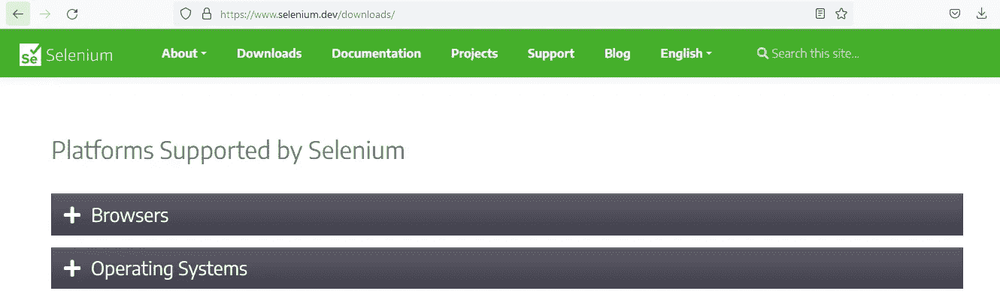

**第 2 步:**点击浏览器选项，然后选择浏览器。

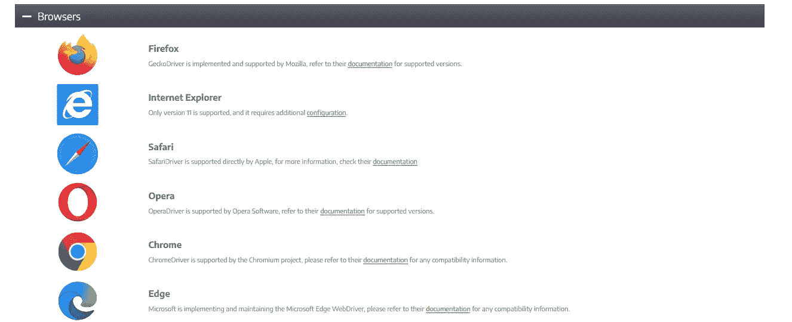

第三步:点击文档选项，它会引导你到下载页面。你会看到最新的稳定版本，点击该选项。为 64 位系统下载 win32 选项没有问题，它会工作得很好。

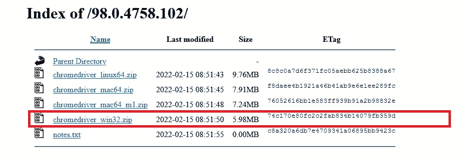

## 对于 Mozilla

1.  点击文档后，它会直接指向 gecko 驱动程序页面。然后点击壁虎驱动器释放。

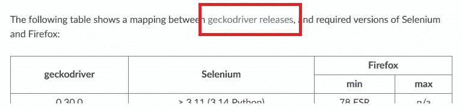

2.然后向下滚动，根据系统规格选择版本。

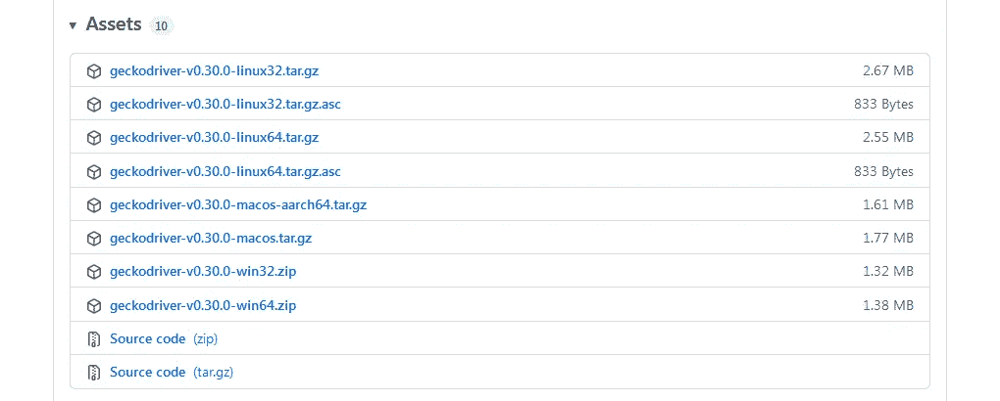

下载 web 驱动程序后，转到 c:驱动器并创建一个名为 web drivers 的文件夹。

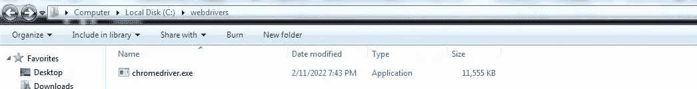

现在，您已经准备好从代码中使用 we 驱动程序了。

> ***硒设置指南***

打开终端，通过下面的命令安装 selenium。

```
pip install -U selenium
```

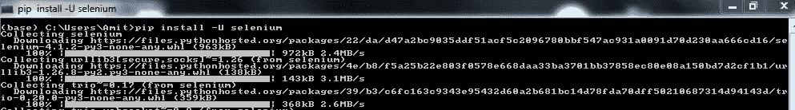[](https://medium.com/pythoneers/nlp-roadmap-of-algorithms-from-bow-to-bert-762527ac1a19) [## NLP:从 BOW 到 Bert 的算法路线图

### 理解深度学习中自然语言处理的概念

medium.com](https://medium.com/pythoneers/nlp-roadmap-of-algorithms-from-bow-to-bert-762527ac1a19) [](https://medium.com/pythoneers/how-to-create-a-virtual-environment-in-python-9c243ed3a54c) [## 如何用 Python 创建虚拟环境

### 具有特定 python 版本和一些附加包的环境

medium.com](https://medium.com/pythoneers/how-to-create-a-virtual-environment-in-python-9c243ed3a54c) 

> ***XPaths 定位器***

我们使用定位器来定位特定的元素或元素列表。有不同类型的定位器，如 ID 定位器、类定位器、链接定位器等。

除了这些定位器，我们还有另一个定位器，即 Xpath 定位器来查找唯一值定位器的元素。

Xpath 是 XML path 的缩写，它用于浏览 HTML 结构的网站，主要使用 DOM。

Xpath 定位器的语法如下所示:

```
//tag[@attribute="value"]Example:<div class = "name"> Rocky </div>Tag ---> div
Attribute ---> class
Value ---> name
Element ---> Rocky
```

实际例子

**第一步:**假设我们要提取 Flipkart 网站上笔记本电脑的价格。然后打开笔记本电脑的部分，如下图所示。


现在，我们想在 chrome 浏览器中提取这个网页上的 1，83990 价格。首先，我们需要找到这个价格的 Xpath 位置。

**第二步:**按下鼠标右键，点击 inspect 元素。

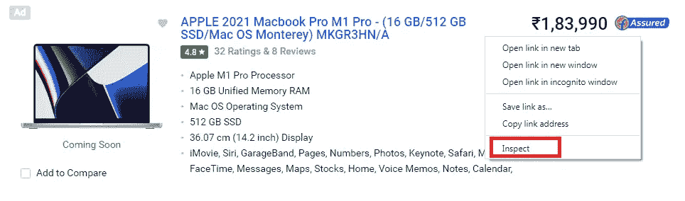

将打开“检查元素”页面，如下所示。

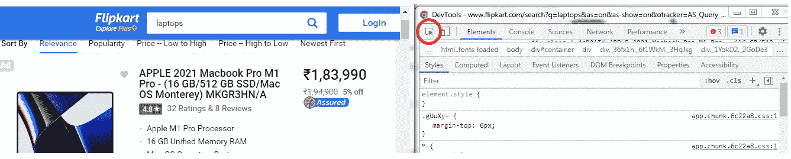

现在，单击左上角的 inspect element 按钮来选择目标元素。当我们在价格上放一个箭头时，它会高亮显示它的 div 标签，如下所示。

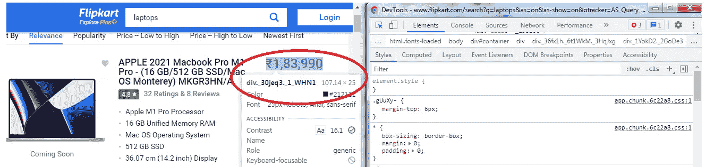

单击价格后，inspect 部分将在 HTML 页面部分显示这个 div 标记，如下所示。

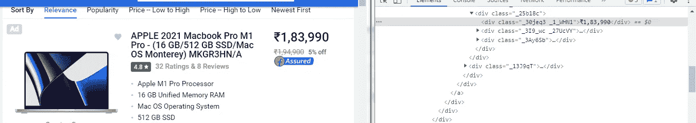

**第三步:**现在，是时候找到这个 div 标签的 Xpath 位置了。要搜索标签，请按键盘上的 ctrl+f，我们将在页面上看到搜索选项。

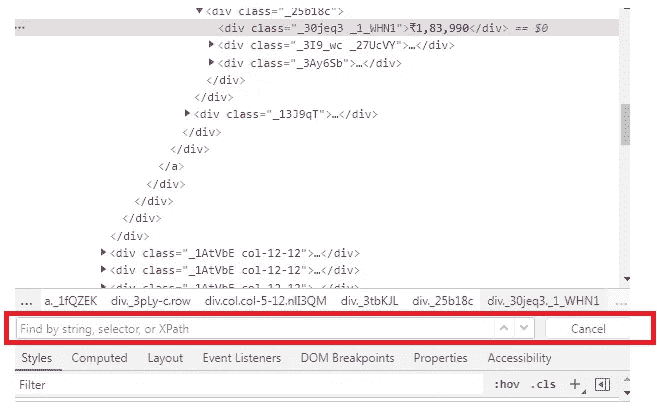

按照语法写下 Xpath 的位置，并将类及其值粘贴到该位置。

```
//div[@class = "_30jeq3 _1_WHN1"]
```

在写入 Xpath 位置后，div 标记被突出显示，并显示该页面上的所有价格。

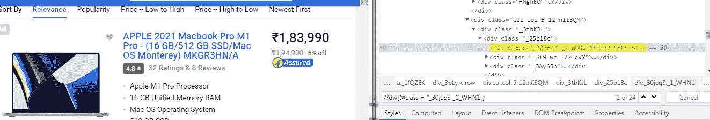

> ***父子路径***

这是一个逻辑表达式，用于在 HTML 页面中从父路径导航到同级路径，以获取同级中的元素，如下图所示。

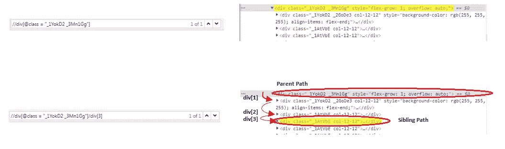

> ***数据提取***

是时候从网页中提取数据了。我们以 Flipkart 网站为例，用 python 处理价格元素。

首先，我们需要必要的库来抓取网页。

```
**from** selenium **import** webdriver
```

现在，我们将把 URL 粘贴到变量中。网址很大，我把网址做得很短，但要确保你把整个网址粘贴到变量中。

```
website_1 **=** 'https://www.flipkart.com/search?q=laptops"
```

是时候使用 web 驱动程序获取 web 报废的 URL 了。

```
#It is used to initialize the web driver for chrome browser
driver **=** webdriver**.**Chrome('C:/webdrivers/chromedriver.exe')

#It will open the website automatically
driver**.**get(website_1)

#It is used to maximize the website page after opening
driver**.**maximize_window()
```

现在，我们想使用 Xpath 位置来获取网页中的目标元素。它可能会不时地改变，但是在实际操作时粘贴当前的类值。[1]的索引用于获取页面的第一个价格。

```
price **=** driver**.**find_element_by_xpath('(//div[@class="_30jeq3
                                        _1_WHN1"])[1]')
```

我们希望 Xpath 定位器的 div 标签中的文本元素获取价格。

```
# text is used to get the element of the tag i.e. price value
print(price**.**text)output:
1,83,990
```

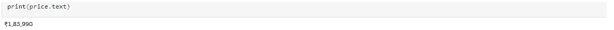

我们可以使用 for 循环来提取网页上的所有价格。

```
prices **=** driver**.**find_elements_by_xpath('//div[@class="_30jeq3
                                                        _1_WHN1"]')len(prices)output:
24# to get all the prices
**for** p **in** prices:
    print(p**.**text)
```

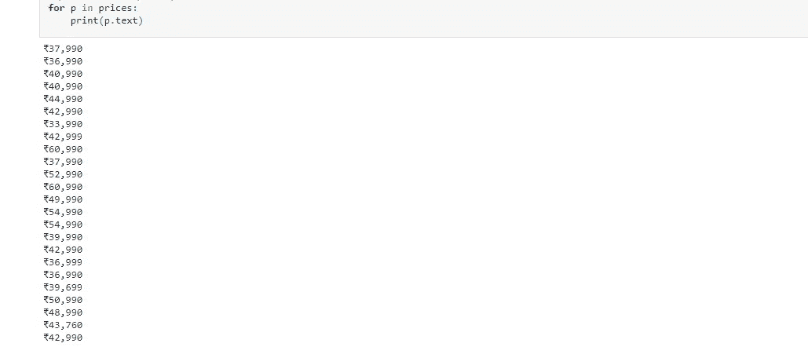

我们取消了第一页上的所有价格，我们可以从接下来的页面中获得价格，为此我们编写了代码，并将多个页面的 URL 放在 for 循环中。

> ***结论:***

Selenium 对于数据科学和机器学习工程师来说是一个很棒的 web 抓取工具，可以从网页中获取信息。

我希望你喜欢这篇文章。通过我的 [LinkedIn](https://www.linkedin.com/in/data-scientist-95040a1ab/) 和 [twitter](https://twitter.com/amitprius) 联系我。

# 推荐文章

1. [8 主动学习 Python 见解收集模块](/8-active-learning-insights-of-python-collection-module-6c9e0cc16f6b)
2。 [NumPy:图像上的线性代数](/numpy-linear-algebra-on-images-ed3180978cdb?source=friends_link&sk=d9afa4a1206971f9b1f64862f6291ac0)
3。[Python 中的异常处理概念](/exception-handling-concepts-in-python-4d5116decac3?source=friends_link&sk=a0ed49d9fdeaa67925eac34ecb55ea30)
4。[熊猫:处理分类数据](/pandas-dealing-with-categorical-data-7547305582ff?source=friends_link&sk=11c6809f6623dd4f6dd74d43727297cf)
5。[超参数:机器学习中的 RandomSeachCV 和 GridSearchCV](/hyper-parameters-randomseachcv-and-gridsearchcv-in-machine-learning-b7d091cf56f4?source=friends_link&sk=cab337083fb09601114a6e466ec59689)
6。[用 Python 充分解释了线性回归](https://medium.com/towards-artificial-intelligence/fully-explained-linear-regression-with-python-fe2b313f32f3?source=friends_link&sk=53c91a2a51347ec2d93f8222c0e06402)
7。[用 Python](https://medium.com/towards-artificial-intelligence/fully-explained-logistic-regression-with-python-f4a16413ddcd?source=friends_link&sk=528181f15a44e48ea38fdd9579241a78)
充分解释了 Logistic 回归 8。[使用 Numpy 与 Python](/data-distribution-using-numpy-with-python-3b64aae6f9d6?source=friends_link&sk=809e75802cbd25ddceb5f0f6496c9803)
9 进行数据分发。[机器学习中的决策树 vs 随机森林](/decision-trees-vs-random-forests-in-machine-learning-be56c093b0f?source=friends_link&sk=91377248a43b62fe7aeb89a69e590860)
10。[用 Python 实现数据预处理的标准化](/standardization-in-data-preprocessing-with-python-96ae89d2f658?source=friends_link&sk=f348435582e8fbb47407e9b359787e41)