# Python 中使用 Scrapy 的 Web 抓取分步指南

> 原文：<https://pub.towardsai.net/web-scraping-in-scrapy-c2d87796f677?source=collection_archive---------0----------------------->

## 如何检索新加坡的二手车信息


泰勒·弗兰塔在 [Unsplash](https://unsplash.com/s/photos/web?utm_source=unsplash&utm_medium=referral&utm_content=creditCopyText) 上的照片

在我以前的一篇文章中，我介绍了使用请求& BeautifulSoup/website API 的 web 抓取策略。在这篇文章中，我想介绍一个更先进的应用程序框架，用于抓取网站内容和提取结构化数据，称为 Scrapy。

# Scrapy 的利弊

与美人汤等其他刮痧方式相比，刺痒有以下**优势:**

1.  代码更加**可扩展和灵活**，更容易改变为更大规模的抓取或者迎合网站结构的变化。
2.  Scrapy 有一个标准的代码结构和可以遵循的最佳实践
3.  刺儿头有一个**快**的爬行速度

**缺点:**

1.  对于初学者来说，Scrapy 的学习曲线稍微陡峭一些
2.  您不能像普通的 Jupyter 笔记本解决方案那样看到每一步的输出(但是，有一个终端测试功能可用)

> 正如你所看到的，Scrapy 解决方案的唯一主要缺点是陡峭的学习，但是一旦你实现了这个解决方案，你就可以很容易地将它应用到任何其他的 Scrapy 网站。

# 网站的哪个部分可以抓取？

我们不允许自由抓取所有网站。这是因为过多的网站流量可能会导致服务器崩溃，公司可能希望保护自己的数据。怎么知道能不能刮到这个网站？只需在**主目录**后添加 **/robots.txt** 即可查看该信息。

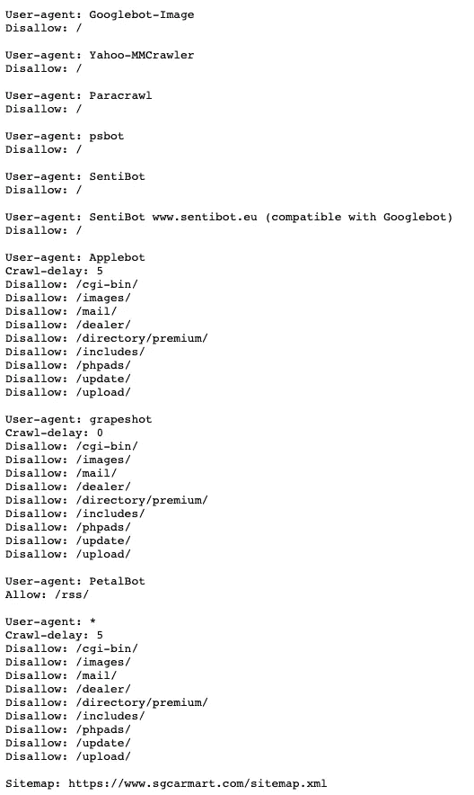

sgcarmart.com 的 robots.txt 文件—[https://www.sgcarmart.com/robots.txt](https://www.sgcarmart.com/robots.txt)

正如你从上面的截图中看到的，以 sgcarmart.com 为例，有些用户代理不允许抓取这个网站的任何子目录，如“Googlebot-Image”。但是，如果您使用“Applebot”作为您的用户代理，您可以使用超时 5 来**抓取某些子目录(不允许抓取那些不允许的目录)。如果你使用 grapeshot，你可以在没有超时的情况下抓取子目录(更快的抓取速度)。**

# 使用 Scrapy 进行网页抓取的步骤

Scrapy 的官方文档/教程可以在 https://docs.scrapy.org/en/latest/的[找到](https://docs.scrapy.org/en/latest/)

**第一步:安装 Scrapy 包**

```
# install at terminal
pip install Scrapy
```

或者可以参考安装指南:【https://docs.scrapy.org/en/latest/intro/install.html 

**第二步:创建 Scrapy 项目**

在终端中，找到要存储抓取代码的文件夹，然后键入

```
scrapy startproject <project_name>
```

在这里，您应该用您的项目名称替换<project_name>。在这里，我创建了一个名为“scraping_demo”的新项目</project_name>

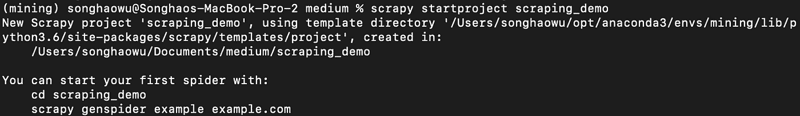

Scrapy startproject

它将创建一个如下所示结构的文件夹

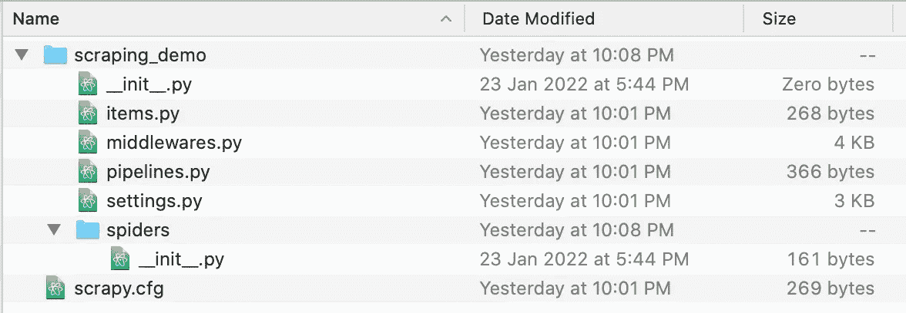

Scrapy 项目的文件夹结构

这里的大多数文件都是预先配置好的，你不需要接触它们。您可以签出的第一个文件是 settings.py

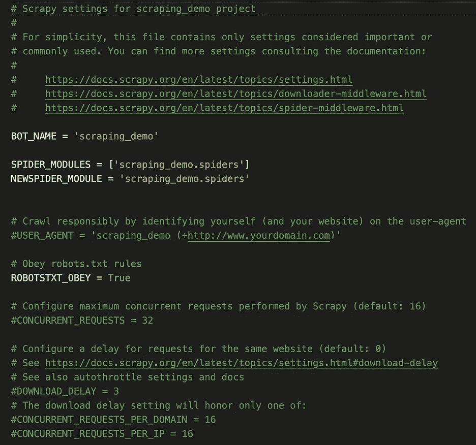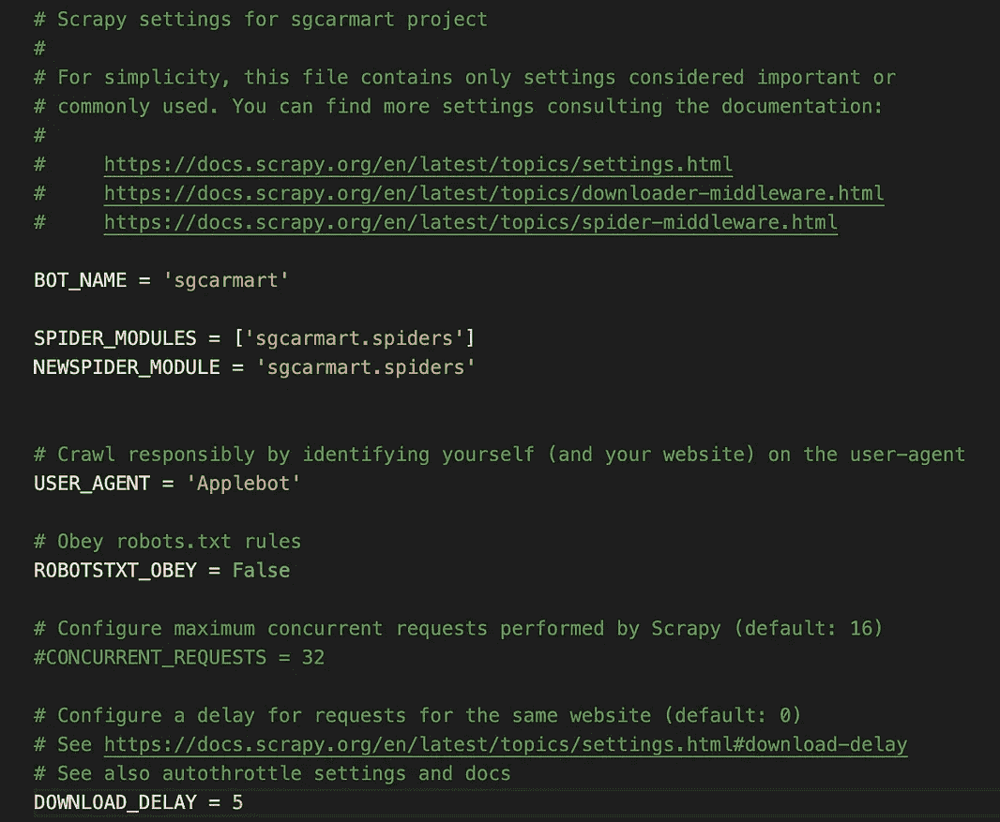

左(原始 settings.py) —右(我的修改版 settings.py)

从上面的截图可以看出，最初创建的 settings.py 将只是遵循 robots.txt 规则，没有任何设置或用户代理。您可以通过定义您的用户代理和设置 download_delay 来修改它(根据网站规则的规定)

您应该修改的另一个文件是**在 spiders 文件夹**中创建 scraper python 代码。目前，该文件夹中只有一个 init.py 文件，您可以在该文件夹中创建多个 scrapers 文件，并在不同的场景中使用它们，这将是我们的第 3 步。

## 步骤 3:在 spiders 文件夹下创建 scraper 代码

这一步是你写刮刀的主要步骤。首先需要在 spiders 文件夹下创建一个 py 文件。之后，你可以参考下面的例子(来自 Scrapy 主网站)获得一个基本的代码结构。

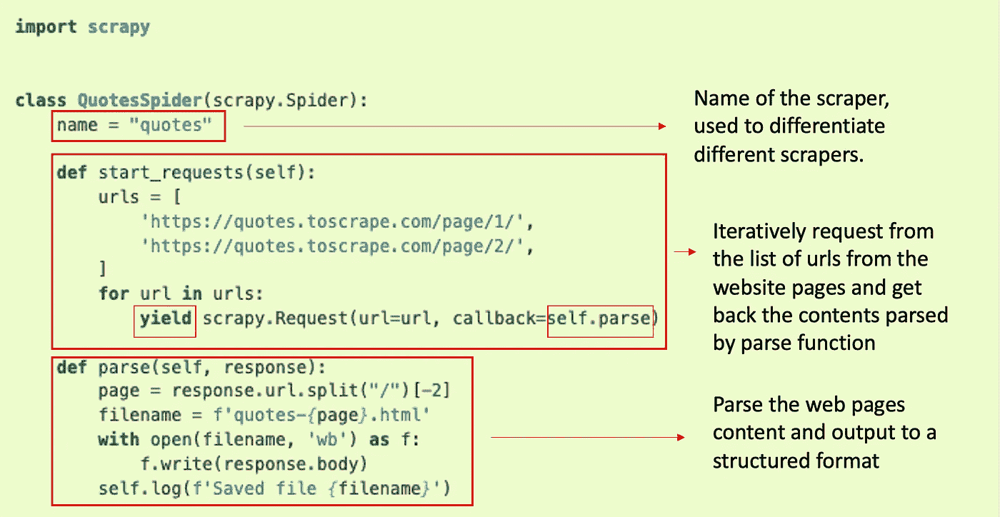

Scrapy 代码示例—修改自 https://docs.scrapy.org/en/latest/intro/tutorial.html[的示例](https://docs.scrapy.org/en/latest/intro/tutorial.html)

在您创建的新 py 文件中，您需要定义 scraper 类，然后定义 Scrapy scraper 的名称。这是因为您可以在 spiders 文件夹中创建多个刮刀。当你运行刮刀时，你应该使用名称来区分，所以你需要确保不同刮刀中的**名称是不同的**。

之后，基本结构需要两个函数‘start _ requests’和‘parse’。“start_requests”类似于 Python 中请求库的角色，它会向您定义的网站 URL 发出请求。请注意两件事，这里你没有在函数中返回，而是 **yield，这意味着你继续这个步骤**。在请求函数中，您需要定义 URL 和**回调函数**，该函数将网站信息转换为结构化内容并返回到该函数。

最后一个函数 parse 函数类似于 BeautifulSoup 的作用，就是解析网站内容。您可以通过 CSS 或 XPath 解析内容。你可以参考更多关于 https://docs.scrapy.org/en/latest/topics/selectors.html 的选择器的信息。在这里，您可以直接输出数据，或者稍后使用命令行输出。

> 你可以使用 scrapy shell 函数来测试刮刀选择器。首先，你应该在终端中定位到你的项目文件夹，放入**‘scrapy shell<你想要抓取的 URL>’**。
> 
> 之后，如果状态为成功，可以使用 response 对象来测试您的解析，比如' response.xpath('//title/text()')。get()'是否获得了您期望的正确输出。更多细节可以参考[https://docs.scrapy.org/en/latest/topics/shell.html](https://docs.scrapy.org/en/latest/topics/shell.html)

## 最后一步:在终端运行 Scrapy 刮刀

最后一步很简单，只需在终端中找到你的项目文件夹，并写下你为 scraper > ' 定义的名字 **'scrapy crawl <。如果您正在抓取大量页面，该步骤可能会花费相当长的时间，并且抓取速度也**很大程度上由您在 settings.py 文件中定义的超时**决定。**

# 案例研究:抓取新加坡汽车信息

## 数据源

我们使用 sgcarmart.com 作为数据源进行抓取。正如我之前展示的，sgCarMart 允许一些用户代理抓取网站的某些部分。

## 问题陈述

我们想找到目前平台上卖的二手车有哪些。它们的价格、标题和其他信息是什么？根据这些信息，我们可以发现目前影响二手车价格的重要因素是什么，以及市场上现有汽车的总体趋势是什么。

## 解决办法

1.  首先，我们将使用“scrapy startproject sgcarmart”命令来设置项目文件夹
2.  我们查看 settings.py 文件，并根据 robots.txt 相应地更改 user_agent 和 download_delay。

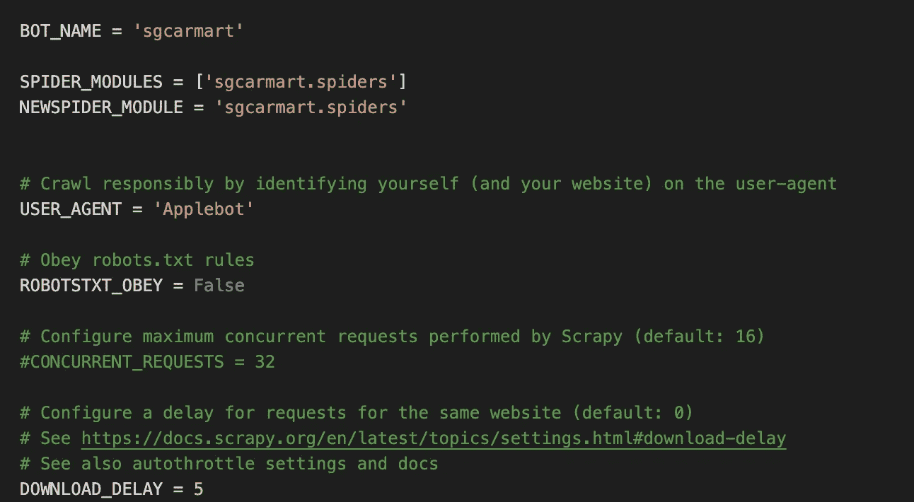

sgcarmart 的 settings.py

3.让我们打开网页，看看我们如何抓取

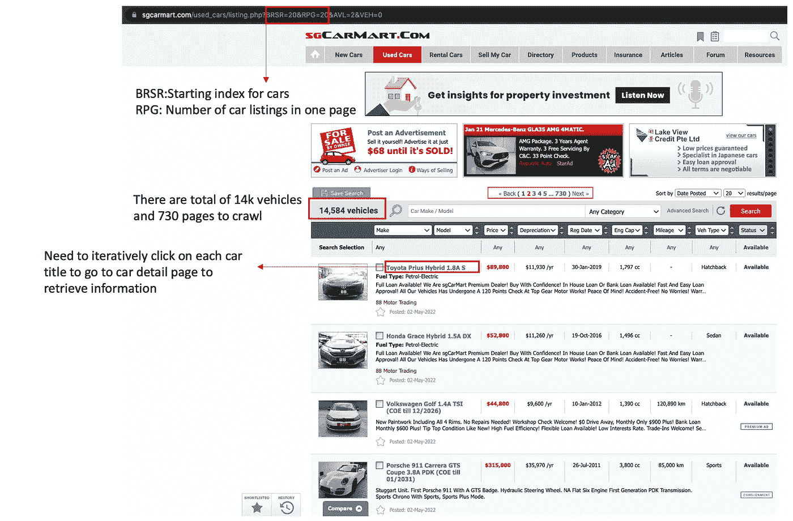

sgcarmart.com 所有可用的汽车

以上是所有可用二手车的 sgcarmart 列表页面。在检查页面之前，我们可以获得一些有用的信息。

*   URL 会告诉你什么是汽车的过滤标准，以及它正在爬哪个页面。例如，BRSR 表示当前页面索引，RPG 表示该页面上汽车列表的数量，我们可以迭代地将 BRSR 增加 20 来抓取所有页面。你可以在不同页面的一些探索之后得到这个。
*   有 14k 个汽车列表和 730 个页面要抓取，这意味着我们将基于 BRSR 值迭代检索所有 730 个页面的 URL

```
def generate_urls(self):
  urls = []
  #730 pages to crawl
  for i in range(0, 731):
    urls.append(f'https://www.sgcarmart.com/used_cars/listing.php?AVL=2&BRSR={i * 20}&RPG=20&VEH=0')
    return urls#making requests to all 730 page url
def start_requests(self):
  for url in self.generate_urls():
    yield scrapy.Request(url=url, callback=self.parse)
```

*   每个汽车列表在主页上都有一些信息，如价格或折旧，但我们需要反复点击每个汽车列表以了解更多细节。

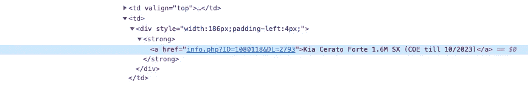

检查每个列表 url 的页面

如果您检查页面，您可以看到单个 URL 存储在强括号的 href 属性中。让我们用 Scrapy shell 方法来测试我们是否能得到正确的元素。

首先，我们将输入到下面的终端，记住在您想要测试的 URL 之外添加“”

```
scrapy shell '[https://www.sgcarmart.com/used_cars/listing.php?BRSR=40&RPG=20&AVL=2&VEH=0](https://www.sgcarmart.com/used_cars/listing.php?BRSR=40&RPG=20&AVL=2&VEH=0)'
```

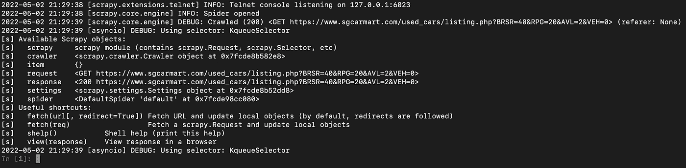

scrapy shell 后的成功页面

如果成功，您可以看到上面的页面，您可以看到状态为 200。之后可以尝试使用 CSS 或者 XPath 来获取想要的信息。在我的例子中，我想获得所有需要的 URL。

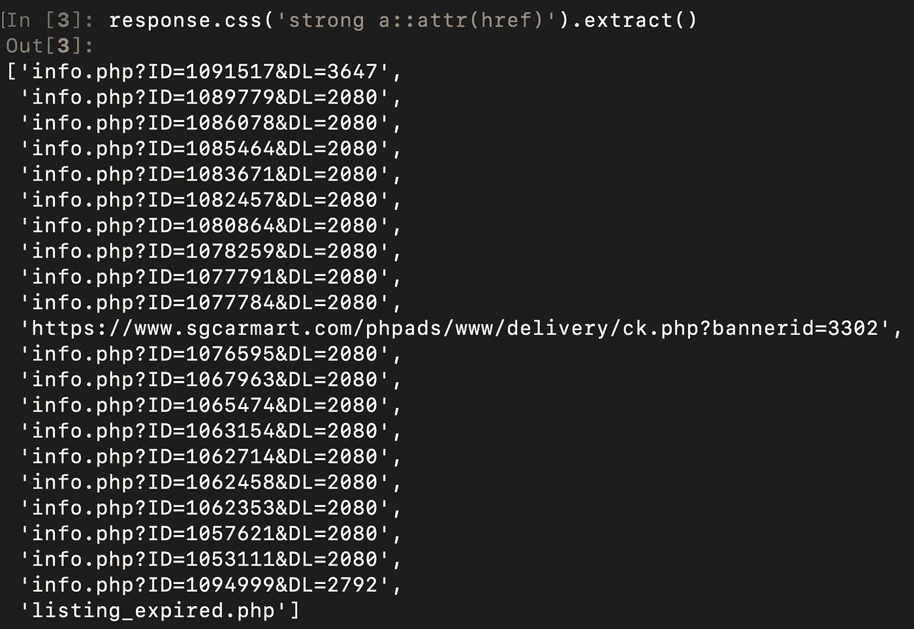

应用 CSS 选择器后的结果

你可以从上面的截图中看到，一旦你应用了 CSS，你就可以得到所有的 URL。由于广告列表或过期的 URL，会有一些干扰数据，但是您可以使用一个简单的 if 语句来删除它们。

```
#parse all main page information and go to each car detail page
def parse(self, response):
  # follow links to car listings
  for href in response.css('strong a::attr(href)'):
    # filter out the advertisement links
    if 'info.php' in href.extract():
      url = response.urljoin(href.extract())
      yield scrapy.Request(url, callback=self.parse_car)
```

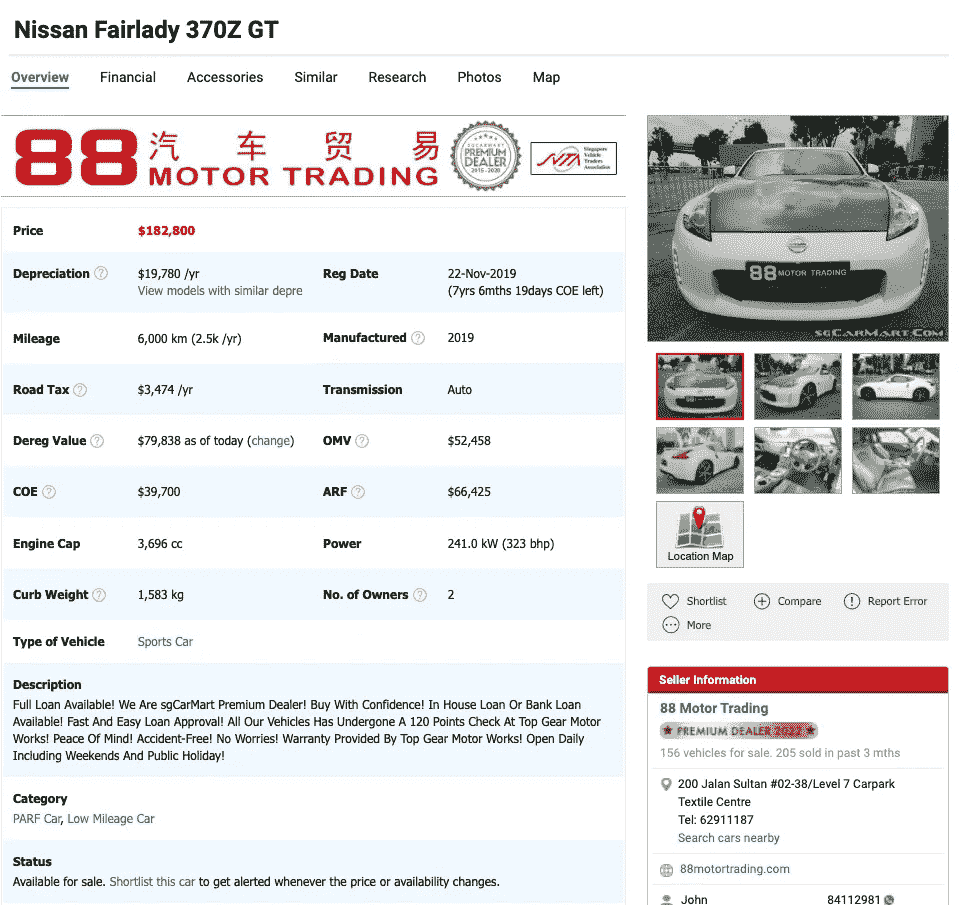

汽车详细信息页面

如果您打开任何汽车详细信息页面，您可以看到所有信息都以表格格式存储，您可以使用相同的 scrapy shell 方法测试并获得正确的数据元素。这里我使用一个字典来存储所有需要的数据字段，并一起输出整个字典。

```
#parse each car detail page information and retrieve all necessary information
def parse_car(self, response):
  result = dict()
  result['title'] = response.css('#toMap a::text').extract()[0].strip()
  result['price'] = response.css('.font_red a strong::text').extract()
  result['depreciation']= response.css('#carInfo tr')[1].css('td')[1].css('::text')[0].extract().strip()
  result['mileage']=response.css('#carInfo tr')[2].css('td')[0].css('div.eachInfo')[0].css('div.row_info::text').extract()[0].strip()
  result['road_tax']=response.css('#carInfo tr')[2].css('td')[0].css('div.eachInfo')[1].css('div.row_info::text').extract()[0].strip()
  result['dereg_value']=response.css('#carInfo tr')[2].css('td')[0].css('div.eachInfo')[2].css('div.row_info::text').extract()[0].strip()
  result['coe']=response.css('#carInfo tr')[2].css('td')[0].css('div.eachInfo')[3].css('div.row_info::text').extract()[0].strip()
  result['engine_cap']=response.css('#carInfo tr')[2].css('td')[0].css('div.eachInfo')[4].css('div.row_info::text').extract()[0].strip()
  result['curb_weight']=response.css('#carInfo tr')[2].css('td')[0].css('div.eachInfo')[5].css('div.row_info::text').extract()[0].strip()
  if len(response.css('#carInfo tr')[2].css('td')[0].css('div.eachInfo'))>6:
    result['vehicle_type']=response.css('#carInfo tr')[2].css('td')[0].css('div.eachInfo')[6].css('div.row_info a::text').extract()[0].strip()
  else:
    result['vehicle_type']=response.css('#carInfo tr')[3].css('td a::text').extract()[0].strip()
  result['url'] = response.url
  yield result
```

4.在我们理解了页面结构和元素之后，让我们享受编写 scraper 的乐趣

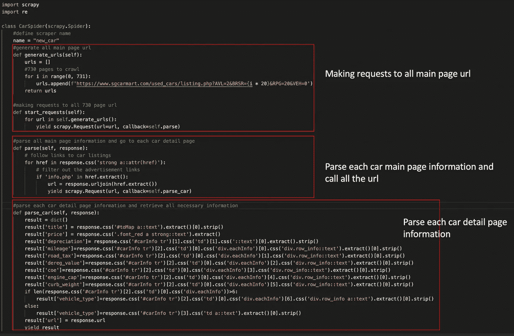

spiders 文件夹下 sgcarmart.py 的代码

5.最后，在终端中，我们定位到项目文件夹，然后键入

```
scrapy crawl new_car -t csv -O ./output/result.csv
```

这里，我们希望将所有结果保存到同一目录下 output 文件夹下的 CSV 文件中。“t csv”表示我们希望将结果转换为 csv 格式，-o 会覆盖现有文件，而-O 只会将数据追加到底部。你也可以直接在 scraper 代码中定义输出文件格式。

如果你抓取了所有的页面，运行起来将会花费相当长的时间。在这里，我只是测试运行抓取 2 个页面，它将生成结构化的 CSV 文件如下

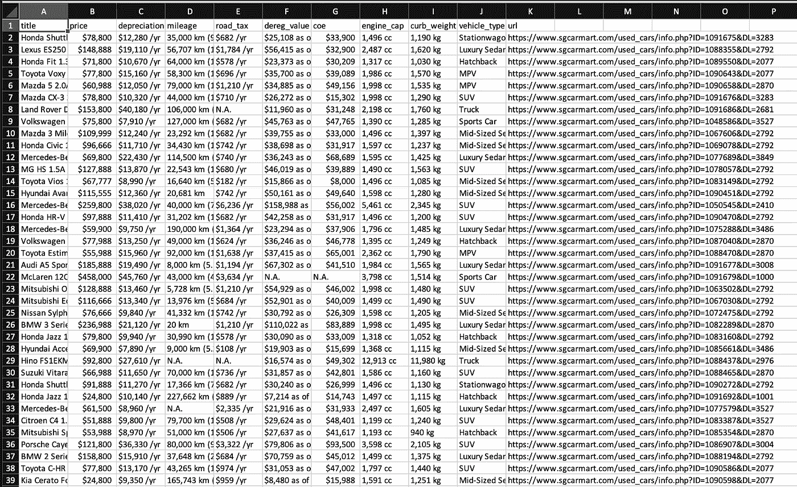

result.csv —搜索结果

# 最后建议和结论

这篇文章旨在介绍 Scrapy 作为网络爬行的最佳实践之一。爬行代码格式通常很标准，但更重要的是，在开始编码之前，我们应该理解网站的结构。该结构包括诸如要抓取哪些 URL、要抓取哪些数据字段、不同页面上的网站布局是否有变化等信息。

在网站元素发生变化的情况下，您需要使用 case when 语句或其他一些方法来确保最终的输出是结构化的和准确的。此外，**大多数数据字段还需要经过另一轮数据清理，然后才能真正使用**，就像您需要将道路税$959/yr 转换为数值 959。

*吨感谢朋友们* [*叶*](https://medium.com/u/b9b791def441?source=post_page-----c2d87796f677--------------------------------) *和* [*刘政*](https://medium.com/u/9ae06bd367f?source=post_page-----c2d87796f677--------------------------------) *对代码的帮助！*

如果你是网络抓取的新手，想学习更多关于 CSS 选择器或 XPath 选择器的知识，你可以从一些在线课程如 datacamp 学习，或者直接参考下面的 w3school 链接:

[https://www.w3schools.com/cssref/css_selectors.asp](https://www.w3schools.com/cssref/css_selectors.asp)

[https://www.w3schools.com/xml/xpath_intro.asp](https://www.w3schools.com/xml/xpath_intro.asp)

如果你对使用 BeautifulSoup 或 direct API(如果有的话)进行网络抓取感兴趣，你也可以参考我下面的另一篇文章。感谢您的阅读，祝您有美好的一天！

[](https://towardsdatascience.com/web-scraping-basics-82f8b5acd45c) [## 网页抓取基础知识

### 如何用 Python 从网站上抓取数据

towardsdatascience.com](https://towardsdatascience.com/web-scraping-basics-82f8b5acd45c)