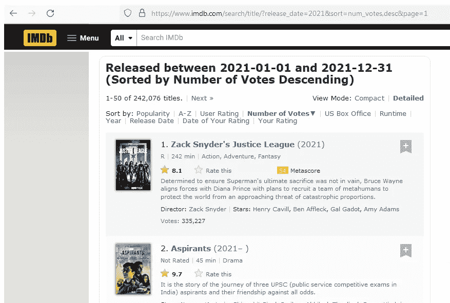
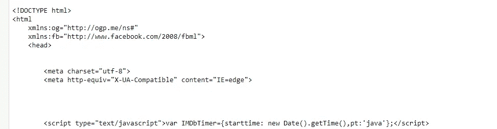
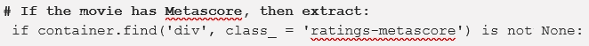
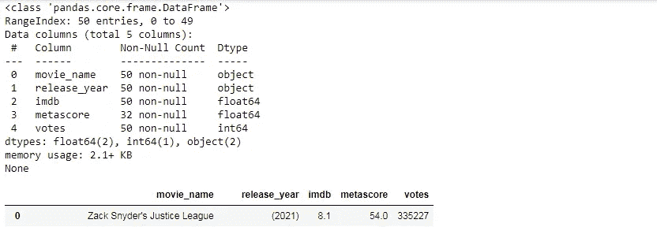

# 用 python 中漂亮的汤库进行电影数据的 Web 抓取

> 原文：<https://pub.towardsai.net/web-scraping-movie-data-with-beautiful-soup-library-in-python-b51ae9206ea8?source=collection_archive---------2----------------------->

## [网页抓取](https://towardsai.net/p/category/web-scraping)

## 从电影网站提取数据



> ***简介***

在本文中，我们将尝试借助一个漂亮的汤库来删除电影的细节。这个库对于从 HTML 页面抓取数据和解析器非常有用。

下面显示了我们将收集到的电影细节的链接:

```
[http://www.imdb.com/search/title?release_date=2021&sort=num_votes,desc&page=1](http://www.imdb.com/search/title?release_date=2021&sort=num_votes,desc&page=1)
```

我们将从这个页面中抓取的内容是`movie_name`、`release_year`、`imdb`评分、`metascore`和`total_users`投票。

首先，我们需要使用请求库来获取页面细节。

```
from requests import get
url = 'http://www.imdb.com/search/title?release_date=2021&
       sort=num_votes,desc&page=1'response = get(url)
print(response.text[:500])
```



现在，我们将使用漂亮的汤从数据中提取文本。

```
from bs4 import BeautifulSoup
html_soup = BeautifulSoup(response.text, 'html.parser')
type(html_soup)#output:
bs4.BeautifulSoup
```

HTML 页面包含一个带有 class 属性的“div”标记。因此，我们将创建一个变量来保存所有具有特定类值的 div 类。

```
movie_containers = html_soup.find_all('div', class_ = 'lister-item
                                                    mode-advanced')
print(type(movie_containers))
print(len(movie_containers))#output:
<class 'bs4.element.ResultSet'>
50
```

所以，一个页面上的电影评论数量是 50。开始提取 2021 年第一部电影的数据。

```
first_movie = movie_containers[0]
first_movie.div#output:
<div class="lister-top-right">
<div class="ribbonize" data-caller="filmosearch" data-tconst="tt12361974"></div>
</div>-------------------------------------------------------------first_movie.a#output:
<a href="/title/tt12361974/"> 
</a>-------------------------------------------------------------first_movie.h3#output:
<h3 class="lister-item-header">
<span class="lister-item-index unbold text-primary">1.</span>
<a href="/title/tt12361974/">Zack Snyder's Justice League</a>
<span class="lister-item-year text-muted unbold">(2021)</span>
</h3>
```

如果我们在上面的代码中看到，h3 标题标签包含了锚标签中的电影名称。因此，我们需要从锚标签中获取电影名称。

```
first_movie.h3.a#output:
<a href="/title/tt12361974/">Zack Snyder's Justice League</a>-------------------------------------------------------------first_name = first_movie.h3.a.text
first_name#output:
"Zack Snyder's Justice League"
```

我们得到了第一部电影的名字，现在我们将试着找到上映的年份。h3 标题标记内的年份是 span 标记。

```
first_year = first_movie.h3.find('span', class_ = 'lister-item-year 
                                                 text-muted unbold')
first_year#output:
<span class="lister-item-year text-muted unbold">(2021)</span>-------------------------------------------------------------first_year = first_year.text
first_year = first_year.replace('(','')
first_year = first_year.replace(')','')
first_year#output:
'2021'
```

是时候获得这部电影的 IMDb 评分了。

```
first_imdb = float(first_movie.strong.text)
first_imdb#output:
81
```

为了找到电影的投票，我们需要检查 span 属性。

```
first_votes = first_movie.find('span', attrs = {'name':'nv'})
first_votes#output:
<span data-value="335227" name="nv">335,227</span>-------------------------------------------------------------first_votes = int(first_votes['data-value'])
first_votes#output:
335227
```

[](/introduction-to-mlops-for-data-science-e2ca5a759f68) [## 面向数据科学的 MLOps 简介

### 持续集成、持续开发和持续测试的一部分

pub.towardsai.net](/introduction-to-mlops-for-data-science-e2ca5a759f68) [](https://medium.com/pythoneers/forget-html-and-flask-start-using-streamlit-1b394cfe4595) [## 忘记 HTML 和 Flask，开始使用 Streamlit

### 数据科学和机器学习的 WebApp 框架

medium.com](https://medium.com/pythoneers/forget-html-and-flask-start-using-streamlit-1b394cfe4595) 

是时候获取这一页所有电影的所有信息了。

```
**#Make a empty list of all variables**
names = []
years = []
imdb_ratings = []
metascores = []
votes = []**# Extract data from individual movie container**
for container in movie_containers:
```



```
**# The name**
   name = container.h3.a.text
 names.append(name)**# The year**
 year = container.h3.find('span', class_ = 'lister-item-year').text
 years.append(year)**# The IMDB rating**
 imdb = float(container.strong.text)
 imdb_ratings.append(imdb)**# The Metascore**
 m_score = container.find('span', class_ = 'metascore')
 if m_score is not None:
   metascores.append(int(m_score.text))
 else:
   metascores.append(None)**# The number of votes**
 vote = container.find('span', attrs = {'name':'nv'})['data-value']
 votes.append(int(vote))
```

现在，我们将制作从电影页面收集的信息的数据框架。

```
import pandas as pd
test_df = pd.DataFrame({'movie_name': names,
                        'release_year': years,
                        'imdb': imdb_ratings,
                        'metascore': metascores,
                        'votes': votes
                      })
print(test_df.info())
test_df
```



这个电影网站的第一页包含了这部电影的 50 个条目，我们从第一页中提取了这些信息。

> ***结论***

网页抓取对于数据科学和机器学习的人来说是一个非常有用的工具。

我希望你喜欢这篇文章。通过我的 [LinkedIn](https://www.linkedin.com/in/data-scientist-95040a1ab/) 和 [twitter](https://twitter.com/amitprius) 联系我。

# 推荐文章

1.[8 Python 的主动学习见解收集模块](/8-active-learning-insights-of-python-collection-module-6c9e0cc16f6b?source=friends_link&sk=4a5c9f9ad552005636ae720a658281b1)
2。 [NumPy:图像上的线性代数](/numpy-linear-algebra-on-images-ed3180978cdb?source=friends_link&sk=d9afa4a1206971f9b1f64862f6291ac0)3。[Python 中的异常处理概念](/exception-handling-concepts-in-python-4d5116decac3?source=friends_link&sk=a0ed49d9fdeaa67925eac34ecb55ea30)
4。[熊猫:处理分类数据](/pandas-dealing-with-categorical-data-7547305582ff?source=friends_link&sk=11c6809f6623dd4f6dd74d43727297cf)
5。[超参数:机器学习中的 RandomSeachCV 和 GridSearchCV](/hyper-parameters-randomseachcv-and-gridsearchcv-in-machine-learning-b7d091cf56f4?source=friends_link&sk=cab337083fb09601114a6e466ec59689)
6。[用 Python](https://medium.com/towards-artificial-intelligence/fully-explained-linear-regression-with-python-fe2b313f32f3?source=friends_link&sk=53c91a2a51347ec2d93f8222c0e06402)
7 全面讲解了线性回归。[用 Python](https://medium.com/towards-artificial-intelligence/fully-explained-logistic-regression-with-python-f4a16413ddcd?source=friends_link&sk=528181f15a44e48ea38fdd9579241a78)
充分解释了 Logistic 回归 8。[数据分发使用 Numpy 与 Python](/data-distribution-using-numpy-with-python-3b64aae6f9d6?source=friends_link&sk=809e75802cbd25ddceb5f0f6496c9803)
9。[机器学习中的决策树 vs 随机森林](/decision-trees-vs-random-forests-in-machine-learning-be56c093b0f?source=friends_link&sk=91377248a43b62fe7aeb89a69e590860)
10。[用 Python 实现数据预处理的标准化](/standardization-in-data-preprocessing-with-python-96ae89d2f658?source=friends_link&sk=f348435582e8fbb47407e9b359787e41)