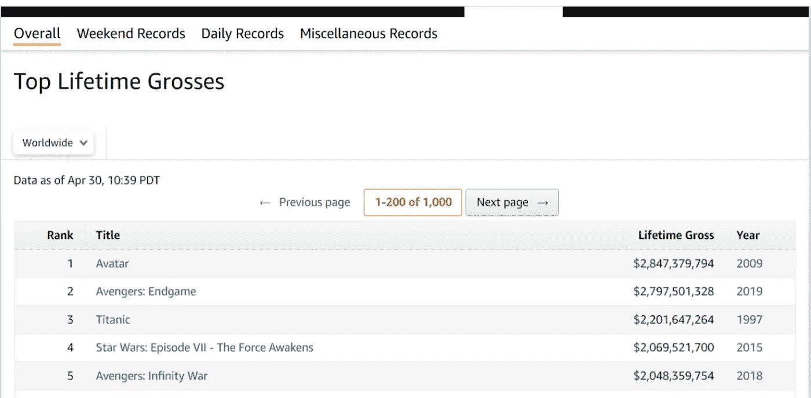
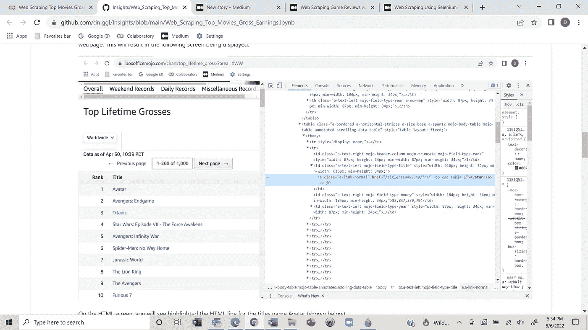
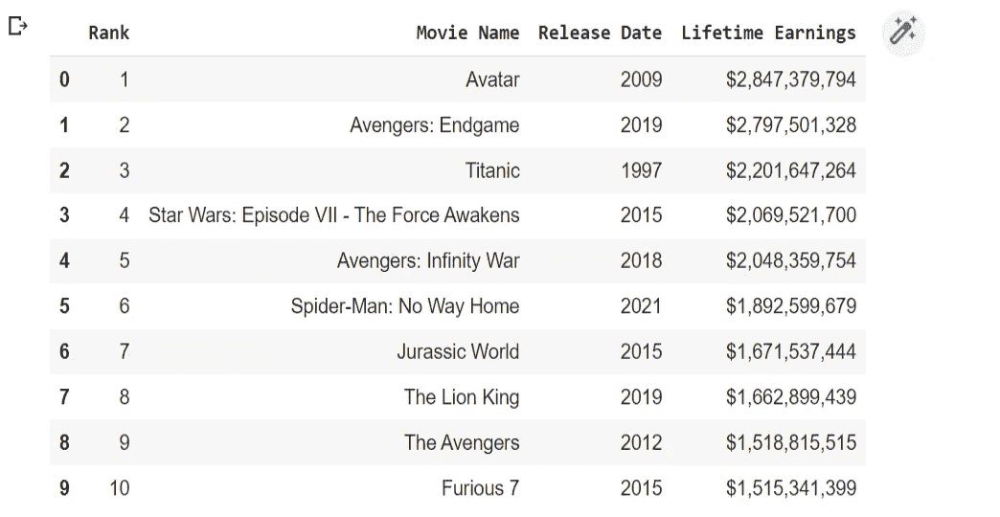

# 用 Python 和 Selenium 抓取热门电影

> 原文：<https://pub.towardsai.net/web-scraping-top-movies-with-python-and-selenium-8c2f0c6a1d69?source=collection_archive---------0----------------------->

如何抓取网站并创建数据集？


Claudio Schwarz 在 Unsplash 上拍摄的照片

**什么是网页抓取？**

Web 抓取是访问网页、提取数据并以结构化格式存储数据以供进一步分析的过程。

**如何使用网页抓取？**

网络刮擦可用于多种目的，包括:

*   价格比较:用于从在线购物网站收集数据，并比较产品和定价。
*   房地产:用于收集和建立房地产列表的数据库，以便进行市场分析。
*   社交媒体:用于从社交媒体网站收集数据，以找出哪些话题是热门话题。
*   潜在客户生成:用于收集联系信息，包括姓名、电话号码和电子邮件地址，以便与潜在客户沟通。
*   电影评论:用于收集有关电影的信息，以帮助决定哪些电影受欢迎和评级高。

**网络抓取合法吗？**

2019 年，美国上诉法院驳回了 LinkedIn 阻止分析公司 HiQ 抓取其数据的请求。该决定在数据隐私和数据监管领域非常重要。它表明，任何公开可用的且没有版权的数据都可以被网络爬虫获取。

一些网站允许网络抓取，一些网站禁止访问他们的网站。您可以通过将“/robots.txt”附加到您想要抓取的 URL 来找到网站的访问权限。要查看有关 robots.txt 规则的更多信息，请选择此[链接](https://developers.google.com/search/docs/advanced/robots/create-robots-txt)

在抓取之前，您可能需要查看网站的服务条款。如果过于频繁地抓取网站，您的 IP 地址可能会被禁止，您将无法访问该网站。有一些方法可以通过使用代理服务来解决这个问题。

**路线图**

本文的其余部分将介绍一个程序，该程序将通过解析页面的 HTML 并提取数据集所需的信息来抓取电影的最高收入网页。下面的步骤将使用 Python 和 Selenium 来执行。

1.安装软件包和库。

2.安装 Web 驱动程序。

3.查看网页的 HTML 结构。

4.硒概述。

5.找到并提取数据元素。

6.创建并显示数据框。

7.将数据帧转换为 CSV 文件。

**程序**

目标:找到并提取网页上的数据元素，并将数据存储到数据集中。

**安装软件包和库**

```
# Install the package.
!pip install selenium# Import the required libraries.
**from** selenium **import** webdriver
**from** selenium.webdriver.common.keys **import** Keys
**from** selenium.webdriver.common.by **import** By
**import** pandas **as** pd
```

**安装网络驱动**

```
# Install the chrome web driver from selenium.
!apt**-**get update 
!apt install chromium**-**chromedriver

chrome_options **=** webdriver**.**ChromeOptions()
chrome_options**.**add_argument('--headless')
chrome_options**.**add_argument('--no-sandbox')
chrome_options**.**add_argument('--disable-dev-shm-usage')
driver **=** webdriver**.**Chrome('chromedriver',chrome_options**=**chrome_options)
```

web 驱动程序是 selenium 的关键组件。web 驱动程序是一个浏览器自动化框架，使用开源 API。该框架通过接受命令、将这些命令发送到浏览器以及与应用程序交互来运行。

Selenium 支持多种 web 浏览器，并为每种浏览器提供 web 驱动程序。我已经从 selenium 导入了 chrome web 驱动程序。或者，您可以下载特定浏览器的 web 驱动程序，并将其存储在易于访问的位置(C:\ users \ web driver \ chrome driver . exe)。您可以在此[站点](https://selenium-python.readthedocs.io/installation.html#:~:text=Selenium%20requires%20a-,driver,-to%20interface%20with)下载浏览器的网络驱动程序。

**查看网页的 HTML 结构**

我们需要理解网页中 HTML 标签的结构和内容。对于这个项目，我们将使用 Box Office Mojo 网站，其中包含 200 部票房最高的电影(如下所示)。选择这个[链接](https://www.boxofficemojo.com/chart/top_lifetime_gross/?area=XWW)就可以找到这个网页。



我们可以通过解析页面的 HTML 并提取数据集所需的信息来抓取这个网页。要从该网页中抓取一些数据，右键单击网页上的任意位置，单击带有 HTML 的屏幕左上角的箭头图标，然后单击网页第一行上的标题名称(头像)。这将导致显示以下屏幕。



在 HTML 屏幕上，你会看到突出显示的标题名称头像的 HTML 行(如下所示)。

```
**<**a class**=**"a-link-normal" href**=**"/title/tt0499549/?ref_=bo_cso_table_1"**>**Avatar**</**a**>**
```

If you move up one line from this tag you will find the tag td with a class of “a-text-left mojo-field-type-title” (shown below). This is the parent of the

```
**<**td class**=**"a-text-left mojo-field-type-title" style**=**"width: 616px; height: 34px; min-width: 616px; min-height: 34px;"**>**
```

So, if you wanted to find, extract and capture all the movie title names on the web page you would follow these steps.

1.  Find all the HTML lines for a specific parent (td tag with a class of “a-text-left mojo-field-type-title”).
2.  Find all the HTML lines for (a tag with a class of “a-link-normal”) within the parent in step 1.
3.  Extract the data elements and build a list containing the movie title names.

The code for finding, extracting, and capturing movie title names is shown below. I will explain this code in detail in the next section below.

```
movies_names **=** driver**.**find_elements_by_xpath('//td[@class="a-text-left mojo-field-type-title"]/a[@class="a-link-normal"]') 

movie_name_list **=** [] 
**for** movie **in** range(len(movies_names)):
    movie_name_list**.**append(movies_names[movie]**.**text)
```

We will find, extract and store the other data elements on the web page following a similar procedure.

**硒概述**

我们需要回顾一些关于硒的基本信息。将使用 Selenium 解析和抓取网页的 HTML 内容。Selenium 是一个 python 库，可以动态抓取网站上的数据。它也可以用于 web 自动化和测试。从 web 上抓取数据只是 selenium 库的一小部分。硒的一些特性包括:

*   多浏览器兼容性
*   多语言支持
*   动态 Web 元素的处理
*   易于识别 Web 元素
*   速度和性能
*   开源和便携

如果您想了解更多关于 Selenium 的信息，请点击此[链接](https://selenium-python.readthedocs.io/)。

Selenium web driver 提供了各种定位器函数来定位 web 页面上的元素。对于这个项目，我们将使用 XPath 函数定位数据元素。XPath 是一种用于在 HTML 标记和属性(如类、id 和名称)中定位数据值的语言。

XPath 函数的语法如下所示。

```
Xpath **=** **//**tagname[@Attribute**=**'Value']
**//**       ➡ Select Current Node
tagname  ➡ Tagname like div, td, tr
**@**        ➡ Selects attribute
Attribute➡ Attribute name (class,id,name,etc)
value    ➡ value of the attribute

# Let's look at some examples.
# This will return the HTML with tag div and class movie in a list.
Xpath **=** **//**div[@class**=**'movie']

# This will return all the links with class drama inside the div tag that has a class of movie.
Xpath **=** **//**div[@class**=**'movie']**/**a[@class**=**'drama']

# HTML looks like this:
HTML
**<**div class**=**'movie'**>**
    **<**a class**=**'drama' href**=**'IMDB.com'**>** IMDB**</**a**>**
**</**div**>**
```

对于这个项目，我们将使用票房 Mojo 网站，其中包含了 200 部票房最高的电影。选择此[链接](https://www.boxofficemojo.com/chart/top_lifetime_gross/?area=XWW)即可找到该网页。

在查看了票房 Mojo 网页后，我决定为每部电影提取以下数据元素。

*   军阶
*   标题
*   终生毛收入
*   年

**查找并提取数据元素**

对于我们想要提取的每个数据元素，我们将找到特定标签和类中的所有 HTML 行。然后，我们将提取数据元素并将数据存储在一个列表中。

get 命令启动浏览器并在 web 驱动程序中打开指定的 URL。

```
driver**.**get('https://www.boxofficemojo.com/chart/top_lifetime_gross/?area=XWW')
```

在列表中查找、提取和捕获电影排名。

```
movies_rankings **=** driver**.**find_elements(By**.**XPATH, "(//td[@class='a-text-right mojo-header-column mojo-truncate mojo-field-type-rank'])")
movie_rank_list **=** [] 
**for** movie **in** range(len(movies_rankings)):
    movie_rank_list**.**append(movies_rankings[movie]**.**text)
```

在列表中查找、提取和捕获电影名称。

```
movies_names **=** driver**.**find_elements(By**.**XPATH, "(//td[@class='a-text-left mojo-field-type-title']/a[@class='a-link-normal'])") 
movie_name_list **=** [] 
**for** movie **in** range(len(movies_names)):
    movie_name_list**.**append(movies_names[movie]**.**text)
```

在列表中查找、提取和捕获电影发行年份。

```
release_year **=** driver**.**find_elements(By**.**XPATH, "(//td[@class='a-text-left mojo-field-type-year']/a[@class='a-link-normal'])")
release_year_list **=** []
**for** year **in** range(len(release_year)):
    release_year_list**.**append(release_year[year]**.**text)
```

在列表中查找、提取和获取终生总收入。

```
lifetime_gross **=** driver**.**find_elements(By**.**XPATH, "(//td[@class='a-text-right mojo-field-type-money'])")
lifetime_gross_list **=** []
**for** i **in** range(len(lifetime_gross)):
    lifetime_gross_list**.**append(lifetime_gross[i]**.**text)
```

**创建并显示数据帧**

```
# Combine the lists.
data **=**list( zip(movie_rank_list, movie_name_list, release_year_list, lifetime_gross_list))# Create the data frame.
df **=** pd**.**DataFrame(data,columns**=**['Rank', 'Movie Name', 'Release Date','Lifetime Earnings'])
```

打印新的数据框。

```
df**.**head(10)
```



**将数据帧转换为 CSV 文件**

如果需要，我们可以从上一步中创建的数据框创建一个 CSV 文件。

```
df**.**to_csv('top_200_movies_with_lifetime_gross.csv',index**=False**)
reviews **=** pd**.**read_csv('top_200_movies_with_lifetime_gross.csv', lineterminator**=**'\n') 
reviews
```


非常感谢你阅读我的文章！如果您有任何意见或反馈，请在下面添加。

如果你喜欢阅读这样的故事，并想支持我成为一名作家，可以考虑报名成为一名媒体成员。会员资格使你可以无限制地访问媒体上的所有文章。你可以使用此链接[https://medium.com/@dniggl/membership](https://medium.com/@dniggl/membership)注册