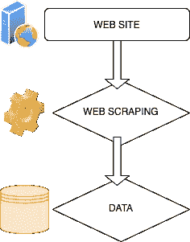
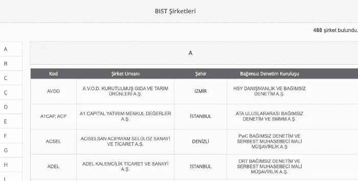
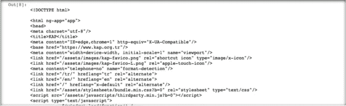
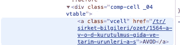
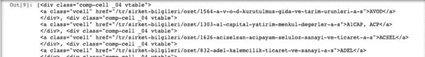
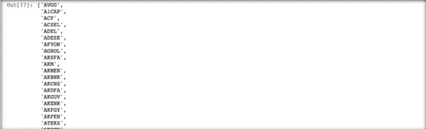

# 使用 Python 进行网络搜集:股票市场示例

> 原文：<https://pub.towardsai.net/web-scraping-using-python-stock-market-example-b50e787c2d08?source=collection_archive---------1----------------------->

## [数据挖掘](https://towardsai.net/p/category/data-mining)，[编程](https://towardsai.net/p/category/programming)， [Python](https://towardsai.net/p/category/programming/python)

## 有了 BeautifulSoup 库，你可以从任何网站获取任何数据。


照片由[公路旅行与 Raj](https://unsplash.com/@roadtripwithraj?utm_source=medium&utm_medium=referral) 在 [Unsplash](https://unsplash.com/?utm_source=medium&utm_medium=referral) 上拍摄

# 什么是网页抓取？

网站大多是用 HTML 或 XML 构建的，这些标记语言有一定的顺序。从该布局中提取数据的过程称为**数据抓取**。在某些来源中，它可以被称为**网收获**或**网提取**。

**我们为什么要刮数据？**

这有很多原因。主要目标是找到、编辑和制作对我们网站有益的数据。如果我们需要持续地这样做，那么我们**需要自动化**数据搜集。

**刮取数据的步骤**

在我们开始收集数据之前，确定我们的目的是非常重要的。

*   我们想要提取什么数据？
*   数据的格式是什么？我如何能到达它？
*   我将从哪些来源获得数据？我的资源固定吗？他们能改变吗？
*   在我得到数据后，我需要清理和处理这些数据吗？
*   我要把数据保存在哪里？

如果能给我们很好的回答这些问题，有工具和流程会在某种程度上帮助我们，很容易克服。需要采取的步骤简单如下:

**第一步:**识别**网站**抓取数据，找到有你想要的数据的页面。

第二步:为网页抓取创建你的**机器人**。编码哪个代码块进入页面的哪个部分。

**第三步:** **处理、清理、隐藏**你提取的数据。



# Python BeautifulSoup 库的一个例子

Python BeautifulSoup 库是一个为数据抓取而创建的实用工具。在我们将要进行的研究中使用这个库，我们将采取我在文章的前一部分提到的前两个步骤。

> 我们的项目:通过访问 **KAP** 网站，获取在 **Borsa 伊斯坦布尔—土耳其股票市场**交易的公司的股票代码。(Kod 列→ AVOD，A1CAP)

```
[https://www.kap.org.tr/tr/bist-sirketler](https://www.kap.org.tr/tr/bist-sirketler')
```



**开始编码吧！**

1-让我们下载我们的库。

```
import requests
from bs4 import BeautifulSoup
import re
```

**请求** =发送一个**请求**到一个网页，就像点击一个网站。我们将使用它向我们确定的网站发送请求。

**re**= Python 中为**正则表达式**创建的模块。我们将使用它来获得我们想要的文本中的某些表达式。

**2-有了请求，让我们将请求发送到我们的网站并连接。**

我们将请求的答案嵌入到页面变量中。

```
URL = ‘[https://www.kap.org.tr/tr/bist-sirketler'](https://www.kap.org.tr/tr/bist-sirketler')
page = requests.get(URL)
```

我们用 HTML 解析器解析页面变量中的内容。

```
soup = BeautifulSoup(page.content, ‘html.parser’)
```

当我们看一看我们的 Soup 变量时，我们可以看到，到目前为止，我们完成的过程下载了页面的整个 HTML 代码。

```
print(soup)
```



我们只是用我们想要的数据来解析这个块。

```
results = soup.findAll(“div”, {“class”: “comp-cell _04 vtable”})
```

我们要取的块在名为" **comp-cell _04** "的类中。我们来到相关网站，在浏览器中说“ **review** ”，在正确的区域或通过查看下面的 HTML 代码找到了它。



当我们看结果变量时，我们分配结果；我们看到，我们正在采取进一步措施，以获得正确的公司股票代码。但是**数据还是喜忧参半**。

```
print(results)
```



让我们开始数据清理过程。

在我们想要的代码周围有许多我们不想要的 HTML 字符，例如 AVOD、ADEL。我们需要**消灭**他们。

为此，我们在代码中分别做了以下工作；

a-我们将结果转换成**字符串**。处理这个文本对我们来说很重要。

b-我们移除**缺口**。

c-我们提取正则表达式和**></a>**之间的共享代码，我们把它扔给单词变量。

我们创建一个空列表。我们以后会用到这个。

e-我们创建的 for 循环帮助我们丢弃字符**、>、< / a】和“、**”。它通过扫描每个元素来工作。

f-有些公司的股票代码是以 **A1CAP** 、 **ACP** 的形式并排的。为了提取它，我们将它一个接一个地添加到包含多个代码的行(元素)的列表中。

```
results = str(results)
results = results.replace(‘ ‘,’’)
words = re.findall(r’>\S+</a>’,results)
list1=[]
for i in words:
 i = i.replace(‘>’,’’)
 i = i.replace(‘</a’,’’)
 i = i.split(“,”)
 if len(i)>1:
 for x in range(len(i)):
 list1.append(i[x])
 else:
 list1.append(i[0])
```

让我们看看我们准备的数据。

现在股票代码上下波动。已经完全腐烂了。

```
print(list1)
```



# 结论

通过 **Beautifulsoup，**我们从一个样本网站上获得了我们想要的数据。我们的目标是**提取公司的股票代码**。我们先去了网站。我们下载了 HTML 格式的内容。我们发现了我们想要的区域所在的 HTML 块。然后，我们完成了数据删除步骤，这比提取数据更具挑战性。

我打算在另一个项目中使用这些共享代码作为**参数**。Python **yfinance** 库能够吸引指定份额的每日即时库存值。我们可以通过 KAP 中不断更新的共享代码，将 yfinance 模块中的数据自动化，而不是指定一个手动的共享代码。通过一个简单的循环，我们可以从 BIST 中的所有共享中提取数据。

我希望我们用 **beautifulsoup** 做的这个例子有所帮助。

感谢阅读！