# 使用 Python 进行 Web 抓取

> 原文：<https://pub.towardsai.net/web-scraping-with-python-6d01f5e9378f?source=collection_archive---------0----------------------->

## [编程](https://towardsai.net/p/category/programming)，[网页抓取](https://towardsai.net/p/category/web-scraping)

## 如何在 Python 中使用漂亮的 soup 和请求库进行网页抓取


照片由[马库斯·斯皮斯克](https://unsplash.com/@markusspiske?utm_source=medium&utm_medium=referral)在 [Unsplash](https://unsplash.com?utm_source=medium&utm_medium=referral) 拍摄

***免责声明:*** *本文仅出于教育目的。我们不鼓励任何人抓取网站，尤其是那些可能有条款和条件反对此类行为的网站。*

网上有大量的数据可供访问。知道如何检索和分析这些数据是一项非常有用的技能。在本教程中，我们将使用 python 请求和漂亮的 Soup 库来快速抓取这些数据。在本教程结束时，您将能够使用请求库请求一个网页，使用漂亮的 Soup 库解析它，然后使用 pandas 的库创建一个包含抓取数据的 dataframe。我们将使用 jupyter 笔记本记录代码。

## 什么是网页抓取？

Web 抓取是从网站收集或提取数据的过程。这个过程可以分为两个主要步骤:使用 requests 库从指定的源(比如网站)发出 HTTP 请求，然后使用 Beautiful Soup 库解析这个请求。在本教程中，我们将通过这个[链接](https://stats.espncricinfo.com/ci/engine/records/averages/batting.html?class=2;current=2;id=6;type=team)收集印度国际板球队的击球率。

## 发出 HTTP 请求

首先，我们将使用 requests 库从一个网站发出一个 HTTP 请求，目的是从一个网页获取数据，比如它的源代码。

首先，我们需要确保安装了请求库。您可以使用以下命令来完成此操作:

```
pip install requests
```

然后，我们必须在您的代码中导入请求模块:

```
import requests
```

接下来，我们将使用 get 方法获取一个网页。对于这种方法，我们必须包括我们想要从其请求网页的任何内容的 URL:

```
source = requests.get('[https://stats.espncricinfo.com/ci/engine/records/averages/batting.html?class=2;current=2;id=6;type=team](https://stats.espncricinfo.com/ci/engine/records/averages/batting.html?class=2;current=2;id=6;type=team)')
```

get 方法返回一个我们保存到源变量的响应对象。这个响应对象是服务器对我们的 HTTP 请求的响应。

如果我们只是打印这个对象，我们得到这个输出:<response>。这告诉我们它是一个 HTTP 状态代码为 200 的响应对象。HTTP 状态代码 200 告诉我们这个 HTTP 请求是成功的。</response>

要查看该对象(或任何 python 对象)的不同属性和方法，可以使用 dir 函数。help 函数为我们提供了关于这些属性和方法的更多信息。

```
dir(source)
```

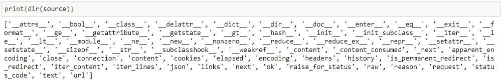

```
help(source)
```

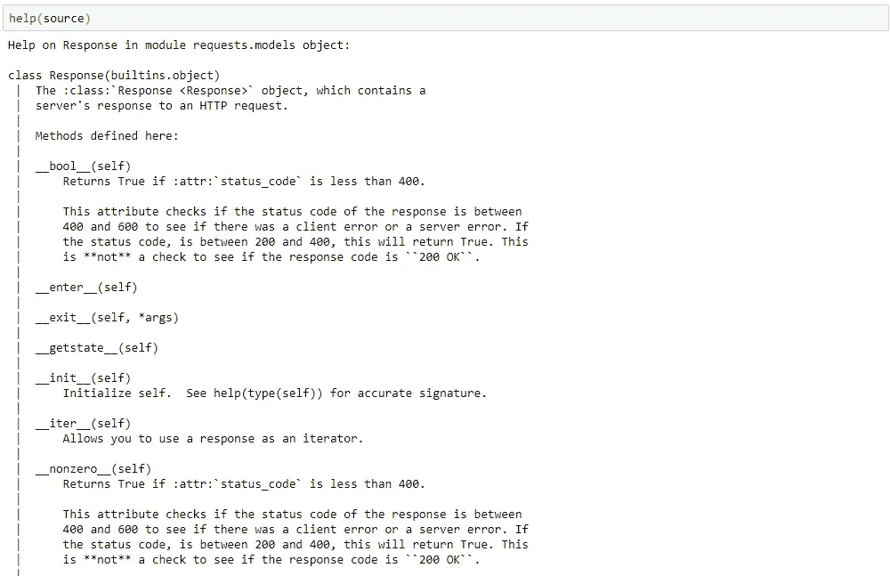

我们的源对象的一些方法

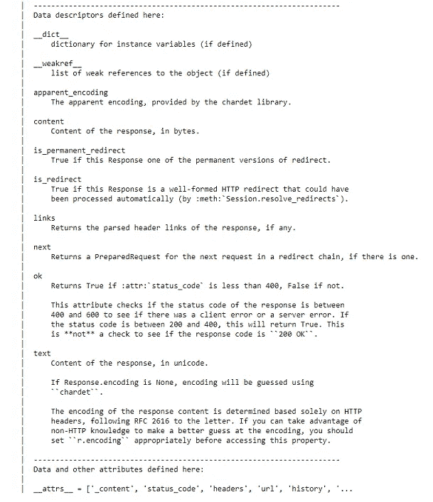

我们的源对象的属性

如您所见，status_code 是这个对象的属性之一。与任何对象一样，可以使用点运算符来访问属性。

```
source.status_code
```

同样，由于这个 HTTP 请求成功，我们得到状态代码 200。我们还可以使用 ok 属性来确保这个 HTTP 请求是成功的。如果我们的请求返回一个小于 400 的状态代码，那么它返回 True，因为一个 400 或 500 的状态代码分别意味着我们有一个客户端错误或服务器错误。否则，它返回 False。

要访问这个对象的内容(Unicode 格式)，我们可以访问这个响应对象的 text 属性:

```
source.text
```

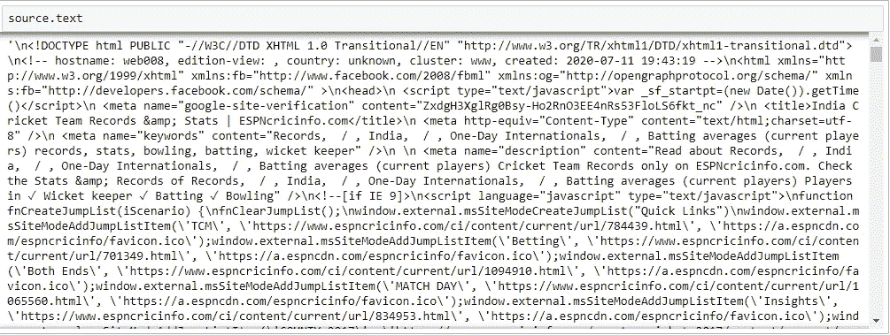

*注意，响应对象也有一个内容属性。这将返回以字节而不是 Unicode 表示的响应内容。因为在这个例子中，我们的响应对象是由文本组成的，所以我们将使用 text 属性。但是，如果我们的响应对象包含非文本内容，比如图像，那么我们将使用 content 属性。*

请注意，我们可以结合上述步骤来获取响应对象的文本属性，并使用以下代码将其保存到源变量中:

```
source = requests.get('[https://stats.espncricinfo.com/ci/engine/records/averages/batting.html?class=2;current=2;id=6;type=team](https://stats.espncricinfo.com/ci/engine/records/averages/batting.html?class=2;current=2;id=6;type=team)').text
```

你可以认为这是我们网页的源代码。它是服务器用 Unicode 对我们的 HTTP 请求的响应内容。

## 美味的汤

现在，我们将使用漂亮的 Soup 库来解析来自 HTTP 请求的响应，并检索板球运动员的击球率。然后，我们将根据这些信息制作一个熊猫数据帧，然后将数据帧保存到一个 CSV 文件中。

## 安装漂亮的汤库:

在我们继续之前，我们必须用下面的命令安装漂亮的汤库:

```
pip install beautifulsoup4
```

## 安装 HTML 解析器:

然后，我们必须安装一个解析器来解析从 HTTP 请求中获取的 HTML。我们将使用以下命令安装 LXML 解析器:

```
pip install lxml
```

## 导入漂亮的汤库:

然后，我们将导入漂亮的汤库:

```
from bs4 import BeautifulSoup
```

## 创建一个漂亮的汤对象:

现在我们已经有了上面的源变量，我们可以将它传递给我们的 BeautifulSoup 构造函数来创建下面的 BeautifulSoup 对象:

```
soup = BeautifulSoup(source, 'lxml')
```

*注意:我们传入了从响应对象的文本属性中获取的 HTML 和 HTML 解析器。然后，我们将这个 BeautifulSoup 实例分配给变量 Soup。*

如果我们打印这个 soup 对象，我们将从网页上看到 HTML。但是，要将其格式化为可读性更强的格式，我们可以使用 prettify 方法:

```
print(soup.prettify())
```

*注意，我们现在可以清楚地看到哪些 HTML 标签相互嵌套。*

## 访问漂亮的 Soup 对象中的标签:

HTML 被组织成标签。有两种方法可以从我们创建的 soup 对象中访问标记及其内容:1)使用点运算符(类似于访问对象的属性)，或者 2)使用 find 方法。

*使用点运算符:* 例如，如果我们想从我们的网页中访问 body 标签中的所有内容，我们将使用以下内容:

```
soup.body
```

*注意:这将返回标签和标签中的内容。*

然而，使用点操作符的问题是，它只会返回它在 HTML 中遇到的第一个带有指定标记名的标记。例如，如果我们使用 soup.div，它将返回第一个 div 标签及其内容。因此，在使用点运算符后，很难指定我们是哪个标签及其内容。这就是 find 方法的用武之地。

*使用 find 方法:* 对于 find 方法，我们能够传递多个参数，这些参数将通过使用标签属性(如 id 或 class)来准确指定我们要查找的标签。我们首先传入标签的名称，然后我们可以指定标签的属性，比如 HTML 标签的特定类或 id。例如，如果我们想要网页中包含击球平均数表的标签，我们可以右键单击该表，单击 inspect，然后看到我们的表包含在 class 属性等于 engineTable 的表标签中。

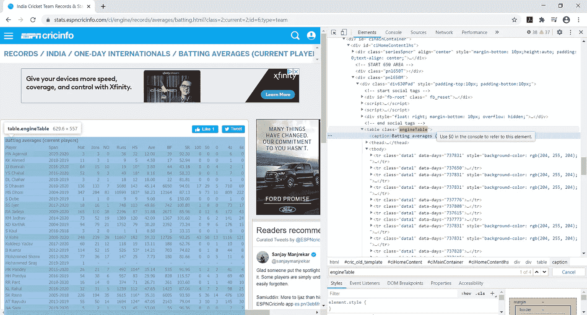

因此，要访问第一次出现的带有 engineTable 类的表标记，我们可以使用:

```
soup.find('table', class_='engineTable')
```

*这将返回第一个出现的带有 engineTable 类的表标签及其所有内容。注意，我们使用了 class_ parameter(而不是 class ),因为 class 是一个 python 关键字。*

为了找到具有指定属性的标签的所有实例，而不仅仅是第一次出现，我们需要使用 find_all 方法。find_all 方法将返回与我们的参数匹配的所有标签的列表。然后我们可以遍历列表，从中提取特定的信息。然而，在我们的例子中，find 方法是有效的，因为我们只对带有特定类的标签的第一个实例感兴趣。

## 正在检索信息:

对于本教程，我们将改为以 tbody 标记为目标来检索击球率，因为这样会更清楚一些。


```
table_body = soup.find('tbody').text
```

*注意:我们使用 text 属性只提取没有 HTML 标签的文本，并将其赋给变量 table_body。*

## 清理我们的字符串:

如果我们查看我们的 table_body 变量，我们可以看到它是一个非常大的字符串，包含了来自 soup 对象的第一个 tbody 标记的内容。至此，我们基本上完成了网页抓取过程。我们将使用我们的字符串方法知识把这个字符串对象转换成我们可以输入到熊猫数据帧中的东西。

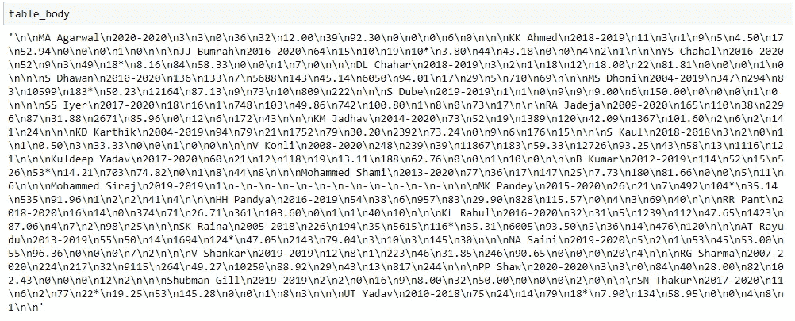

\n 表示换行符。我们可以看到，在字符串的开头和结尾有两个换行符，即\n\n。我们还可以看到，表中每一行的条目都由一个换行符分隔，即\n。最后，我们可以看到每一行都由三个换行符分隔，即\n\n\n。使用这一知识，我们将能够将此字符串对象转换为另一个对象，然后我们可以将该对象输入到 pandas dataframe 方法中，以创建 pandas dataframe。这个对象可以是一个列表列表，每个内部列表代表数据帧中的一行。

首先，让我们使用切片符号删除字符串开头和结尾的两个换行符。

```
table_body = table_body[2:-2]
```

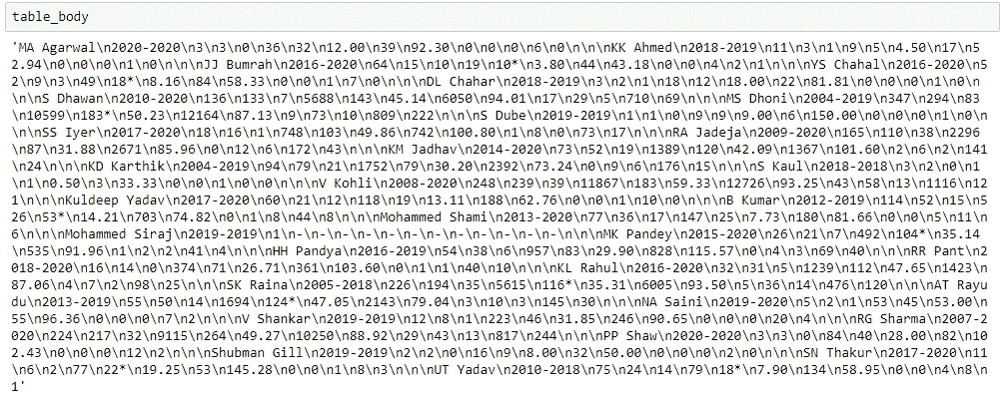

然后，我们将使用 string split 方法并在三个换行符处进行拆分(\n\n\n)以将我们的字符串分成一个字符串列表，列表中的每个字符串或元素对应一行中的条目。我们将把这个列表赋给变量 table_list。

```
table_list = table_body.split('\n\n\n')
```

table_list 的输出现在是一个字符串列表:

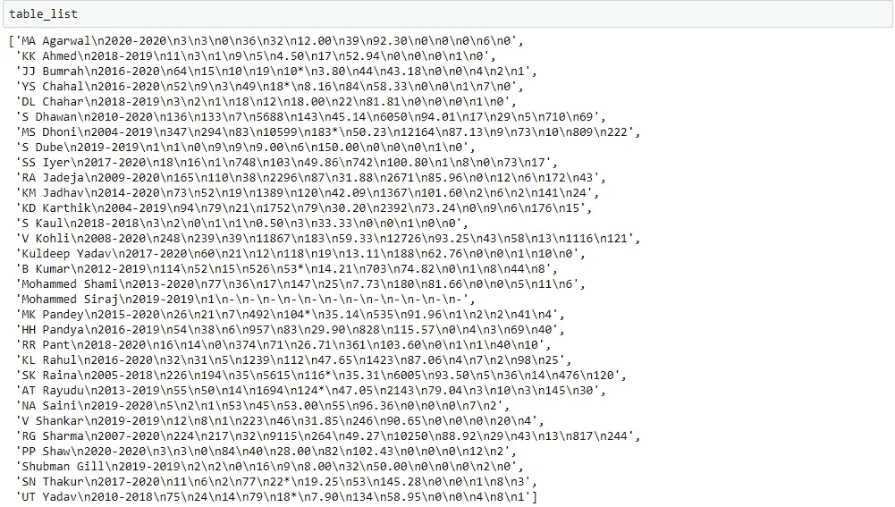

我们现在可以遍历这个字符串列表，并对列表中的每个元素/字符串应用 split 方法，在一个换行符(\n)处进行拆分，创建一个列表列表。每个列表将包含一整行的值，每个元素对应一列的条目。

```
for index, element in enumerate(table_list):
 table_list[index] = element.split('\n')
```

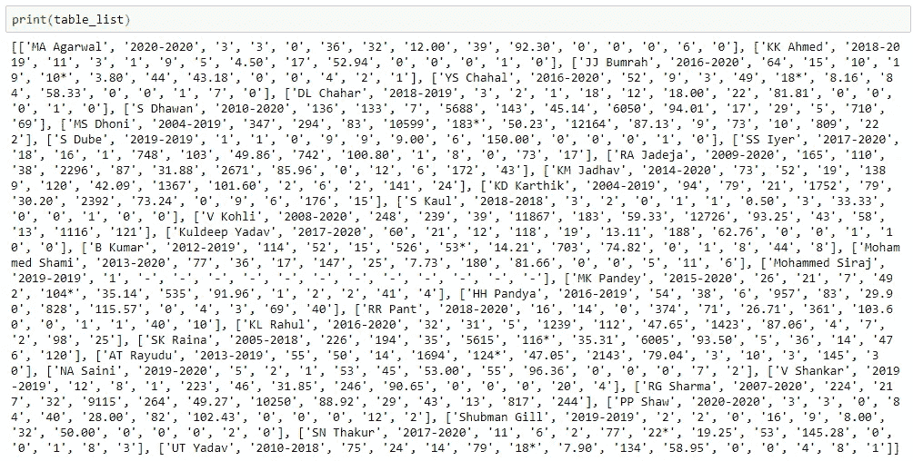[](https://towardsdatascience.com/json-and-apis-with-python-fba329ef6ef0) [## 使用 Python 的 JSON 和 API

### 使用 Python 的 JSON 和 API 介绍

towardsdatascience.com](https://towardsdatascience.com/json-and-apis-with-python-fba329ef6ef0) 

## 创建熊猫数据框架

我们的 table_list 现在是一个列表的列表，每个列表的元素包含一行的条目。我们现在可以将这个列表传递给我们的 pandas dataframe 构造函数，以创建一个包含这些信息的 dataframe。我们还将指定列名作为参数，因为我们的 table_list 从第一行开始，而不是从列名开始。

```
batting_avg_df = pd.DataFrame(data=table_list, columns=['Player', 'Span', 'Mat', 'Inns', 'NO', 'Runs', 'HS', 'Ave', 'BF', 'SR', '100', '50', '0', '4s', '6s'])
```

然后，我们可以使用 head 方法查看该数据帧的前 10 行:

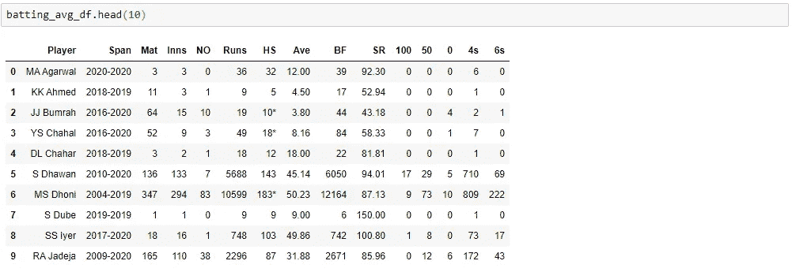

注意我们的指数是如何从 0 开始的。如果我们希望索引从 1 开始而不是从 0 开始，我们可以在上面的 DataFrame 构造函数中使用 index 参数来指定，或者我们可以在代码的不同行中将索引设置为从 1 开始:

```
batting_avg_df.index += 1
```

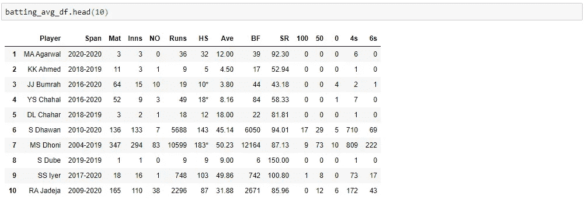

现在我们的指数从 1 开始。

## 拯救我们的熊猫数据框架

如果我们想将数据帧保存到 csv 文件，我们可以使用 dataframe to_csv 方法，如下所示:

```
batting_avg_df.to_csv('batting_avg_csv')
```

这将在 python 代码所在的目录下创建一个名为 batting_avg_csv 的 csv 文件。

如果你喜欢阅读这样的故事，并想支持我成为一名作家，考虑注册成为一名媒体会员。每月 5 美元，你可以无限制地阅读媒体上的故事。如果你用我的 [*链接*](https://lmatalka90.medium.com/membership) *注册，我会赚一小笔佣金。*

[](https://lmatalka90.medium.com/membership) [## 通过我的推荐链接加入媒体——卢艾·马塔尔卡

### 阅读卢艾·马塔尔卡的每一个故事(以及媒体上成千上万的其他作家)。您的会员费直接支持…

lmatalka90.medium.com](https://lmatalka90.medium.com/membership) 

## 结论

所以在本教程中，我们学习了如何使用请求和漂亮的汤库用 python 来抓取网页。然后，我们使用 pandas 库创建了一个 pandas 数据帧，其中包含了我们搜集的信息，然后将我们的数据帧保存到一个 csv 文件中。