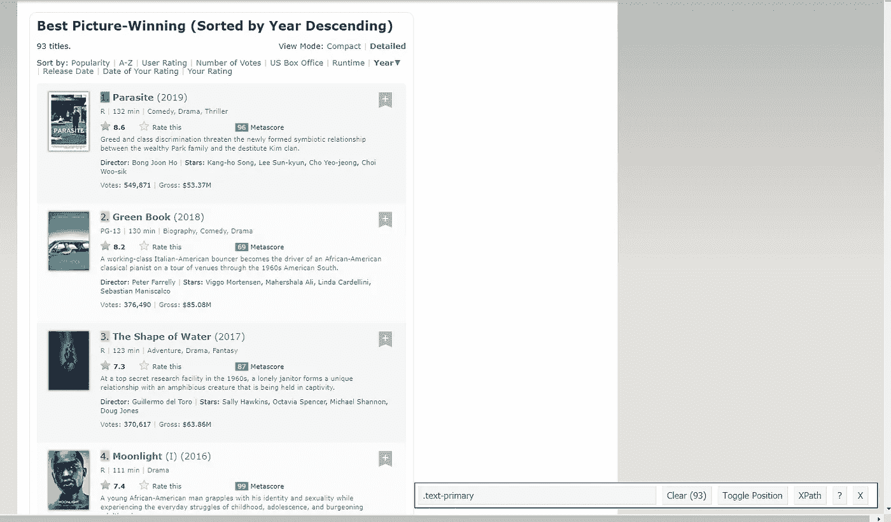
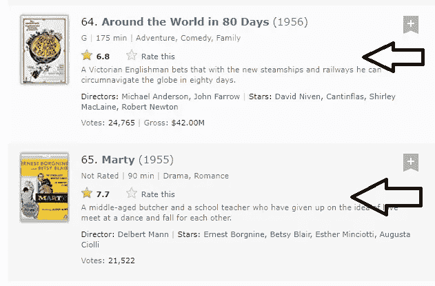
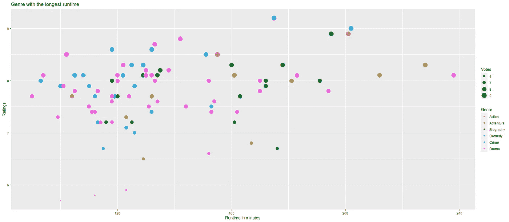
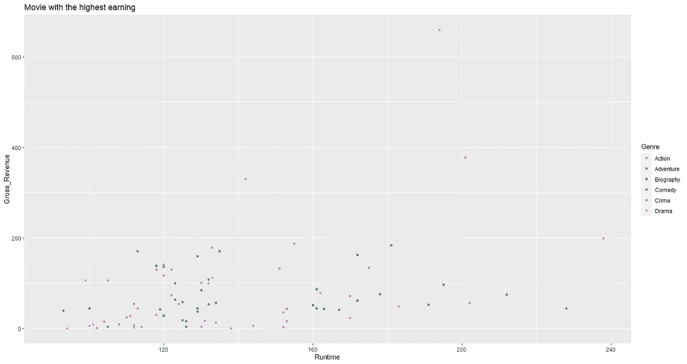
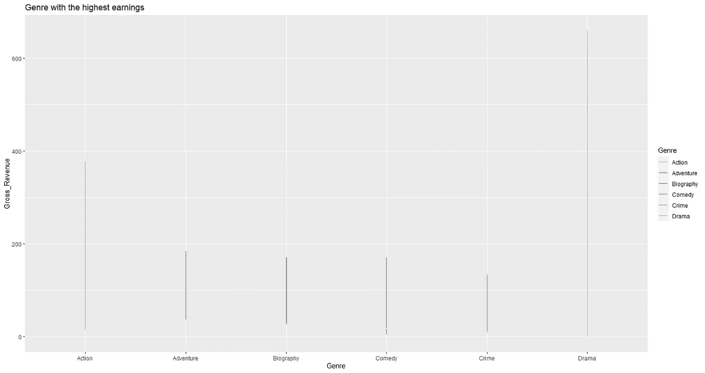

# R 项目—使用 R 进行 Web 抓取—使用 R 和 rvest

> 原文：<https://pub.towardsai.net/web-scraping-with-r-using-r-and-rvest-7e717eff694c?source=collection_archive---------1----------------------->

## [R](https://towardsai.net/p/category/programming/r) ，[网页抓取](https://towardsai.net/p/category/web-scraping)

## 了解如何使用 R 从互联网上抓取数据并将其导出为 CSV 格式！

***免责声明:*** *本文仅出于教育目的。我们不鼓励任何人抓取网站，尤其是那些可能有条款和条件反对此类行为的网站。*

信息无处不在。互联网上的信息流是连续不断的。随着技术的进步，收集、记录、存储和访问数据变得更加容易。因此，互联网上充斥着大量的数据集，您可以将其用于您的个人项目。有时，你可能足够幸运，可以获得一个完整、整洁、干净的数据集。其他时候，你就没那么幸运了，你将无法访问一个完整的数据集。在这种情况下，你将不得不做网页抓取。在本文中，我将告诉您如何使用 R 编程语言以简单的步骤从互联网上收集数据。

在本文中，我们将涵盖以下内容—

1.  什么是网页抓取？
2.  网页抓取方法
3.  用 R 抓取数据的先决条件
4.  用 R 进行网页抓取
5.  用 R 分析数据


[奥斯汀·陈](https://unsplash.com/@austinchan?utm_source=unsplash&utm_medium=referral&utm_content=creditCopyText)在 [Unsplash](https://unsplash.com/s/photos/website?utm_source=unsplash&utm_medium=referral&utm_content=creditCopyText) 上的照片

# 1.什么是网页抓取？

Web 抓取或 web 采集是从不同网站收集数据的过程。它是一种用于将非结构化数据(HTML 格式)转换为结构化格式的方法，可以方便地进一步访问和使用。在这种技术中，数据可以很容易地收集并存储在数据库或电子表格中，以供进一步分析。总的来说，世界各地的人、组织和企业都使用 web 采集，他们希望使用大量公开可用的数据来做出更好、更有见地的决策。

# 2.网页抓取方法

有各种各样的方法从互联网上搜集数据。一些方法是—

1.  文本模式匹配
2.  人类复制粘贴
3.  HTTP 编程
4.  HTML 解析
5.  DOM 解析

# 3.用 R 抓取数据的先决条件

要开始使用 web 抓取，您应该具备 R 编程语言的工作知识。r 非常容易学习和使用。在本文中，我们将使用由著名的 Hadley Wickham 创建的 *rvest* 包。您首先需要安装这个软件包。你可以在这里查看文档[。此外，增加 HTML 和 CSS 的知识会有所帮助。互联网上有很多学习这两种语言的资源。](https://cran.r-project.org/web/packages/rvest/rvest.pdf)

由于 HTML 和 CSS 不是成为数据科学家所必需的基本技能，我们将在这里使用选择器小工具扩展来收集数据。Selector Gadget 是一个免费的开源 CSS 选择器扩展，可以在 Google Chrome 网络商店中找到。你可以在这里下载并安装[。请确保您在开始网页抓取之前已经安装了它。通过使用这个扩展，您可以选择网站的任何部分，并获得相关的标签，只需点击网站的这一部分即可访问该部分。但是，如果你真的想掌握网页抓取的艺术，我建议你学习 HTML 和 CSS。](https://chrome.google.com/webstore/detail/selectorgadget/mhjhnkcfbdhnjickkkdbjoemdmbfginb?utm_source=chrome-ntp-icon)

# 4.用 R 进行网页抓取

现在，让我们开始在 IMDB 网站上搜索 1927 年至 2019 年的最佳图片获奖者。你可以点击访问网站[。](https://www.imdb.com/search/title/?count=100&groups=oscar_best_picture_winners&sort=year%2Cdesc&ref_=nv_ch_osc)

```
# Lets fist install rvest package for parsing of HTML and / or XML filesinstall.packages("rvest")
```

现在，让我们安装其他软件包—

```
#lets install lubridate and tidyverse package for date and time manipulationinstall.packages(c("lubridate", "tidyverse"))
```

我们已经安装了必要的软件包。让我们装载它们。

```
# load all the necessary packageslibrary(tidyverse)
library(lubridate)
library(rvest)
```

加载完包后，就该指定要抓取的网站的 URL 了。

```
# now specify the url for desired website to be scrapedlink <- "[https://www.imdb.com/search/title/?count=100&groups=oscar_best_picture_winners&sort=year%2Cdesc&ref_=nv_ch_osc](https://www.imdb.com/search/title/?count=100&groups=oscar_best_picture_winners&sort=year%2Cdesc&ref_=nv_ch_osc)"#Read the HTML code from the websitewebsite <- read_html(link)website
str(website)
```

您将获得以下输出—

```
{html_document}
<html xmlns:og="[http://ogp.me/ns#](http://ogp.me/ns#)" xmlns:fb="[http://www.facebook.com/2008/fbml](http://www.facebook.com/2008/fbml)">
[1] <head>\n<meta http-equiv="Content-Type" content="text/html; charset=UTF-8">\n<script type="text/javascript">var ue ...
[2] <body id="styleguide-v2" class="fixed">\n             str(website)
List of 2
 $ node:<externalptr> 
 $ doc :<externalptr> 
 - attr(*, "class")= chr [1:2] "xml_document" "xml_node"
```

我们将从网站上收集以下数据-

1.  军阶
2.  标题
3.  描述
4.  运行时间
5.  类型
6.  评级
7.  Metascore
8.  投票
9.  总收入
10.  行动者
11.  导演

我们将从清除等级字段开始。为此，我们将使用选择器小工具扩展。使用此扩展来指定包含网页排名部分的 CSS 选择器。只需点击浏览器中的扩展，用光标选择排名字段。这看起来会像这样—



按作者

请确保所有排名都选对了。一旦你选择了所有的排名，复制底部给出的相应的 CSS 选择器。在这种情况下，其*。文本-主要。*

## 现在我们知道了 CSS 选择器。我们将使用这个简单的 R 代码来获得所有的排名—

```
# using CSS selectors to scrape the rankings selectionrankings_html <- html_nodes(website, ".text-primary")#converting the rankings data to the text formatranks_data <- html_text(rankings_html)#now lets have a look at our dataView(ranks_data)#lets view some top elementshead(ranks_data)
```

运行此代码后，您将获得如下输出—

```
[1] "1." "2." "3." "4." "5." "6."
```

一旦获得了数据，请确保它是所需的格式。所以，让我们把数据转换成数字格式—

```
# lets convert rankings data to numerical formatranks_data <- as.numeric(ranks_data)head(ranks_data)
```

现在，我们的输出看起来像这样—

```
[1] 1 2 3 4 5 6
```

现在，我们将清除之前的选择并选择所有标题。

```
# using CSS selectors to scrape the title selectiontitle_html <- html_nodes(website, ".lister-item-header a")#converting the title data to the text formattitle_data <- html_text(title_html)#now lets have a look at our dataView(title_data)# lets look at some top elementshead(title_data)
```

输出会是这样的—

```
[1] "Gisaengchung"                                    "Green Book"                                     
[3] "The Shape of Water"                              "Moonlight"                                      
[5] "Spotlight"                                       "Birdman or (The Unexpected Virtue of Ignorance)"
```

## 现在让我们对描述数据这样做—

```
# using CSS selectors to scrape the description selectiondescription_html <- html_nodes(website, ".ratings-bar+ .text-muted")#converting the description data to the text formatdescription_data <- html_text(description_html)# lets look at some top elementshead(description_data)
```

你会得到这样的输出—

```
[1] "\n    Greed and class discrimination threaten the newly formed symbiotic relationship between the wealthy Park family and the destitute Kim clan."                                                  
[2] "\n    A working-class Italian-American bouncer becomes the driver of an African-American classical pianist on a tour of venues through the 1960s American South."                                   
[3] "\n    At a top secret research facility in the 1960s, a lonely janitor forms a unique relationship with an amphibious creature that is being held in captivity."                                    
[4] "\n    A young African-American man grapples with his identity and sexuality while experiencing the everyday struggles of childhood, adolescence, and burgeoning adulthood."                         
[5] "\n    The true story of how the Boston Globe uncovered the massive scandal of child molestation and cover-up within the local Catholic Archdiocese, shaking the entire Catholic Church to its core."
[6] "\n    A washed-up superhero actor attempts to revive his fading career by writing, directing, and starring in a Broadway production."
```

现在，让我们清理数据—

```
#lets process this data and remove "\n"description_data <- gsub("\n", "", description_data)#lets have another look at description datahead(description_data)
```

你会得到这样的输出—

```
[1] "Greed and class discrimination threaten the newly formed symbiotic relationship between the wealthy Park family and the destitute Kim clan."                                                  
[2] "A working-class Italian-American bouncer becomes the driver of an African-American classical pianist on a tour of venues through the 1960s American South."                                   
[3] "At a top secret research facility in the 1960s, a lonely janitor forms a unique relationship with an amphibious creature that is being held in captivity."                                    
[4] "A young African-American man grapples with his identity and sexuality while experiencing the everyday struggles of childhood, adolescence, and burgeoning adulthood."                         
[5] "The true story of how the Boston Globe uncovered the massive scandal of child molestation and cover-up within the local Catholic Archdiocese, shaking the entire Catholic Church to its core."
[6] "A washed-up superhero actor attempts to revive his fading career by writing, directing, and starring in a Broadway production."
```

## 让我们执行这段代码来进行运行时选择—

```
#using CSS selectors to scrape the movie run time section**runtime_html** <**- html_nodes(website, ".runtime")**#converting the run time data to text formatruntime_data <- html_text(runtime_html)#lets look at some of the top elementshead(runtime_data)
```

您将获得如下输出—

```
[1] "132 min" "130 min" "123 min" "111 min" "129 min" "119 min"
```

现在，让我们清理数据—

```
#lets remove the min and convert it to numerical valueruntime_data <- gsub("min", "", runtime_data)
runtime_data <- as.numeric(runtime_data)#lets have another look at the datahead(runtime_data)
```

你会得到这样的输出—

```
[1] 132 130 123 111 129 119
```

## 现在，让我们看看流派选择—

```
##Using CSS selectors to scrape the Movie genre sectiongenre_html <- html_nodes(website, ".genre")#lets convert genre data to text formatgenre_data <- html_text(genre_html)#lets look at some of the top elements of the datahead(genre_data)
```

你会得到这样的输出—

```
[1] "\nComedy, Drama, Thriller            "   "\nBiography, Comedy, Drama            " 
[3] "\nAdventure, Drama, Fantasy            " "\nDrama            "                    
[5] "\nBiography, Crime, Drama            "   "\nComedy, Drama
```

现在，让我们清理数据—

```
#lets process this data and remove "\n", excess spaces and keeping only first genre of the datagenre_data <- gsub("\n", "", genre_data)
genre_data<-gsub(" ","",genre_data)
genre_data<-gsub(",.*","",genre_data)#Converting each genre from text to factorgenre_data <- as.factor(genre_data)#lets have another look at the datahead(genre_data)
```

你会得到这样的输出—

```
[1] Comedy    Biography Adventure Drama     Biography Comedy
```

## 现在，让我们看看 IMDB 评级选择—

```
#Using CSS selectors to scrape the IMDB rating sectionIMDB_ratings_html <- html_nodes(website, ".ratings-imdb-rating")#lets convert html data to text dataIMDB_ratings_data <- html_text(IMDB_ratings_html)#lets look at some of the top elements of the datahead(IMDB_ratings_data)
```

你会得到这样的输出—

```
[1] "\n        \n        8.6\n    " "\n        \n        8.2\n    " "\n        \n        7.3\n    "
[4] "\n        \n        7.4\n    " "\n        \n        8.1\n    " "\n        \n        7.7\n    "
```

现在，让我们清理数据—

```
#lets convert the strings data to numerical data and convert it to numericIMDB_ratings_data <- gsub("\n", "", IMDB_ratings_data)IMDB_ratings_data <- as.numeric(IMDB_ratings_data)#lets look at some of the top elements of the datahead(IMDB_ratings_data)
```

你会得到这样的输出—

```
[1] 8.6 8.2 7.3 7.4 8.1 7.7
```

## 现在，让我们看看投票的选择—

```
#Using CSS selectors to scrape the votes sectionvotes_html <- html_nodes(website, ".sort-num_votes-visible span:nth-child(2)")#lets convert votes data to text datavotes_data <- html_text(votes_html)#lets look at some of the top elements of the datahead(votes_data)
```

你会得到这样的输出—

```
[1] "550,381" "376,701" "370,690" "273,379" "419,883" "579,887"
```

现在，让我们清理数据—

```
#lets remove the commas and convert votes to numericalvotes_data <- gsub(",", "", votes_data)
votes_data <- as.numeric(votes_data)#lets look at some of the top elements of the datahead(votes_data)
```

你会得到这样的输出—

```
[1] 550381 376701 370690 273379 419883 579887
```

## 现在，让我们看看导演的选择—

```
#Using CSS selectors to scrape the directors namesdirectors_html <- html_nodes(website, ".text-muted+ p a:nth-child(1)")#lets convert directors data to textdirectors_data <- html_text(directors_html)#lets look a some of the top elementshead(directors_data)
```

你会得到这样的输出—

```
[1] "Bong Joon Ho"          "Peter Farrelly"        "Guillermo del Toro"    "Barry Jenkins"        
[5] "Tom McCarthy"          "Alejandro G. Iñárritu"
```

现在，让我们清理数据—

```
#lets convert directors data into factorsdirectors_data <- as.factor(directors_data)#lets look a some of the top elementshead(directors_data)
```

你会得到这样的输出—

```
[1] Bong Joon Ho          Peter Farrelly        Guillermo del Toro    Barry Jenkins         Tom McCarthy         
[6] Alejandro G. Iñárritu
```

## 现在，让我们看看演员的选择—

```
#Using CSS selectors to scrape the actors sectionactors_html <- html_nodes(website, ".lister-item-content .ghost+ a")#lets convert actors data to text dataactors_data <- html_text(actors_html)#lets look at some of the top elementshead(actors_data)
```

你会得到这样的输出—

```
[1] "Kang-ho Song"    "Viggo Mortensen" "Sally Hawkins"   "Mahershala Ali"  "Mark Ruffalo"    "Michael Keaton"
```

现在，让我们清理数据—

```
#lets convert data to factorsactors_data <- as.factor(actors_data)#lets look at some of the top elements againhead(actors_data)
```

你会得到这样的输出—

```
[1] Kang-ho Song    Viggo Mortensen Sally Hawkins   Mahershala Ali  Mark Ruffalo    Michael Keaton
```

## 现在，让我们看看 Metascore 选择—

我希望大家仔细看看 Metascore 数据。

```
#Using CSS selectors to scrape the meta score sectionmetascore_html <- html_nodes(website, ".metascore")#lets convert meta score data to text datametascore_data <- html_text(metascore_html)#lets look at some of the top elementshead(metascore_data)
```

你会得到这样的输出—

```
[1] "96        " "69        " "87        " "99        " "93        " "87        "
```

现在，让我们清理数据—

```
#lets remove the extra space from the data and convert them as factorsmetascore_data<-gsub(" ","",metascore_data)metascore_data <- as.factor(metascore_data)#lets look at some of the top elementshead(metascore_data)
```

你会得到这样的输出—

```
[1] 96 69 87 99 93 87
```

现在，仔细看—

```
# lets view the metascore dataView(metascore_data)# after looking at the data, you will see that this section has only 76 rows wile we are scraping the data for 93 movies#lets check the length of the meta score datalength(metascore_data)
```

您将获得如下输出—

```
[1] 76
```

发生这种情况是因为一些电影没有相应的 Metascore 字段，如下面的屏幕截图所示，因此，我们将 NAs 放入其余的条目中，并继续进行



按作者

这是你应该做的—

```
# from the output we can see that the length of metascore data is only 76 while we are scarping data for 93 movies.
#This is because some of the movies do not have the metascore fields as shown in the screen shot below.# so lets put NAs into the rest of the field.for (i in c(64,65,68,71,73,75,76,77,79,82,83,84,87,88,91,92,93)){
  a <- metascore_data[1:(i-1)]
  b <- metascore_data[i:length(metascore_data)]
  metascore_data <- append(a, list("NA"))
  metascore_data <- append(metascore_data, b)
}metascore_data <- as.numeric(unlist(metascore_data))# lets check the length againlength(metascore_data)# we can see that it has 94 entries now. so lets remove extra onemetascore_data <- metascore_data[-94]#lets check the length againlength(metascore_data)
```

完成这一步后，您将获得 93 个条目的输出。

```
#lets look at some of the top elements againhead(metascore_data)# lets look at the summary statisticssummary(metascore_data)
```

您将获得如下输出—

```
[1] 31  7 22 34 28 22Min. 1st Qu.  Median    Mean 3rd Qu.    Max.    NA's 
   1.00   12.75   20.00   18.62   25.25   34.00      17
```

## 现在，让我们看看总收入选择—

总收入数据也是如此。

```
#Using CSS selectors to scrape the gross revenue sectiongross_revenue_html <- html_nodes(website, ".ghost~ .text-muted+ span")# lets convert gross revenue data to text datagross_revenue_data <- html_text(gross_revenue_html)# lets look at some of the top elementshead(gross_revenue_data)
```

您将获得如下输出—

```
[1] "$53.37M" "$85.08M" "$63.86M" "$27.85M" "$45.06M" "$42.34M"
```

现在，让我们清理数据—

```
# lets remove the $ and M signsgross_revenue_data <- gsub("M", "", gross_revenue_data)gross_revenue_data <- substring(gross_revenue_data, 2,6)head(gross_revenue_data)
```

让我们再次清理数据——

```
# lets check the length of the datalength(gross_revenue_data)#after checking the lenght of the data, you will notice the same thing which happened with metascore data.#so lets put NAs into all the missing values# lets fill missing values with NAfor (i in c(62,65,71,72,73,79,83,84,85,89)){
  s <- gross_revenue_data[1:(i-1)]
  d <- gross_revenue_data[i:length(gross_revenue_data)]
  gross_revenue_data <- append(s, list("NA"))
  gross_revenue_data <- append(gross_revenue_data, d)
}#lets convert gross data to numericalgross_revenue_data <- as.numeric(gross_revenue_data)head(gross_revenue_data)#Let's have another look at the length of gross revenue datalength(gross_revenue_data)summary(gross_revenue_data)
```

您将获得如下输出—

```
[1] 93Min. 1st Qu.  Median    Mean 3rd Qu.    Max.    NA's 
   0.01   24.02   54.58   81.70  110.20  659.30      10
```

我们现在已经成功地刮出了 1927 年至 2019 年的 93 部最佳影片的所有 11 个元素。现在，让我们创建连接上述要素的数据框。

```
# combining all the lists to form the new data framebest_movies_data <- data.frame(Rank = ranks_data, Title = title_data, Description = description_data, Runtime = runtime_data, Genre = genre_data, IMDB_Ratings = IMDB_ratings_data, Votes = votes_data, Directors = directors_data, Actors = actors_data, Metascore = metascore_data, Gross_Revenue = gross_revenue_data)View(best_movies_data)# lets look at structure of the data framestr(best_movies_data)
```

您将获得如下输出—

```
'data.frame': 93 obs. of  11 variables:
 $ Rank         : num  1 2 3 4 5 6 7 8 9 10 ...
 $ Title        : chr  "Gisaengchung" "Green Book" "The Shape of Water" "Moonlight" ...
 $ Description  : chr  "     Greed and class discrimination threaten the newly formed symbiotic relationship between the wealthy Park f"| __truncated__ "     A working-class Italian-American bouncer becomes the driver of an African-American classical pianist on a "| __truncated__ "     At a top secret research facility in the 1960s, a lonely janitor forms a unique relationship with an amphi"| __truncated__ "     A young African-American man grapples with his identity and sexuality while experiencing the everyday stru"| __truncated__ ...
 $ Runtime      : num  132 130 123 111 129 119 134 120 100 118 ...
 $ Genre        : Factor w/ 6 levels "Action","Adventure",..: 4 3 2 6 3 4 3 3 4 3 ...
 $ IMDB_Ratings : num  8.6 8.2 7.3 7.4 8.1 7.7 8.1 7.7 7.9 8 ...
 $ Votes        : num  550381 376701 370690 273379 419883 ...
 $ Directors    : Factor w/ 81 levels "Alejandro G. Iñárritu",..: 9 55 28 4 72 1 68 6 50 71 ...
 $ Actors       : Factor w/ 86 levels "Al Pacino","Albert Finney",..: 48 82 76 56 58 62 15 4 43 19 ...
 $ Metascore    : num  31 7 22 34 28 22 31 21 24 23 ...
 $ Gross_Revenue: num  53.4 85.1 63.9 27.9 45.1 ...
```

现在，最重要的一步。让我们将数据帧从 R 导出为 CSV 格式。我们会这样做—

```
# lets export this data to a csv filewrite.csv(best_movies_data, "C:\\Users\\Kunal Kulkarni\\Desktop\\R data\\bestmoviesdata.csv", row.names = FALSE)
```

**我们来看看平均运行时间是多少—**

```
# average runtimeprint(avg <- mean(best_movies_data$Runtime))
```

您将获得如下输出—

```
[1] 137.6129
```

**我们来看看摘要—**

```
summary(best_movies_data)
```

您将得到如下输出—

```
Rank       Title           Description           Runtime            Genre     IMDB_Ratings       Votes        
 Min.   : 1   Length:93          Length:93          Min.   : 90.0   Action   : 3   Min.   :5.700   Min.   :   4584  
 1st Qu.:24   Class :character   Class :character   1st Qu.:118.0   Adventure: 8   1st Qu.:7.500   1st Qu.:  34774  
 Median :47   Mode  :character   Mode  :character   Median :129.0   Biography:18   Median :7.900   Median : 178591  
 Mean   :47                                         Mean   :137.6   Comedy   :13   Mean   :7.788   Mean   : 343034  
 3rd Qu.:70                                         3rd Qu.:155.0   Crime    : 9   3rd Qu.:8.100   3rd Qu.: 472817  
 Max.   :93                                         Max.   :238.0   Drama    :42   Max.   :9.200   Max.   :1807653  

                Directors                Actors     Metascore     Gross_Revenue   
 William Wyler       : 3   Dustin Hoffman   : 3   Min.   : 1.00   Min.   :  0.01  
 Billy Wilder        : 2   Clark Gable      : 2   1st Qu.:12.75   1st Qu.: 24.02  
 Clint Eastwood      : 2   Laurence Olivier : 2   Median :20.00   Median : 54.58  
 David Lean          : 2   Leonardo DiCaprio: 2   Mean   :18.62   Mean   : 81.70  
 Elia Kazan          : 2   Marlon Brando    : 2   3rd Qu.:25.25   3rd Qu.:110.20  
 Francis Ford Coppola: 2   Russell Crowe    : 2   Max.   :34.00   Max.   :659.30  
 (Other)             :80   (Other)          :80   NA's   :17      NA's   :10
```

# **让我们分析一下从网上搜集来的数据—**

一旦您获得了想要的数据，您就可以执行各种任务，例如分析数据、清理数据、可视化数据以及从中得出重要的见解。因此，让我们分析我们刚刚收集的数据，并通过可视化这些数据从中得出一些有意义的见解。

我们将从安装和加载 *ggplot2* 包开始。ggplot2 包是 Tidyverse 包家族的一部分，它是一个为数据可视化而构建的非常强大的包。它通常被认为是图形的语法。点击阅读更多关于 ggplot2 包[的信息。另外，您可以使用 ggplot2 备忘单作为参考。它可以在 RStudio 中免费下载，或者您也可以在](https://ggplot2.tidyverse.org/reference/)[这里](https://rstudio.com/wp-content/uploads/2015/03/ggplot2-cheatsheet.pdf)下载。所以，让我们开始吧—

```
# The easiest way to install ggplot2 package is to install the whole tidyverse package:install.packages("tidyverse")# Alternatively, you can just install just ggplot2 package from CRAN :install.packages("ggplot2")# load the librarylibrary(tidyverse)#orlibrary(ggplot2)
```

基于这些数据，我们只是粗略地看了一下，让我们看看哪个流派的哪部电影播放时间最长

```
# now lets analyze our data#lets check which genre has the the longest runtime by plotting a graph of itbest_movies_data %>% ggplot(aes(Runtime, IMDB_Ratings, color = Genre, size = Votes, bins = 50)) + geom_point(aes(size = IMDB_Ratings)) + xlab("Runtime in minutes") + ylab("Ratings") + ggtitle("Genre with the longest runtime")
```

您将获得如下输出—



按作者

让我们看看哪部电影赚得最多—

```
best_movies_data %>% ggplot(aes(Runtime, Gross_Revenue, color = Genre)) + geom_point() + ggtitle("Movie with the highest earning")
```

您将获得如下输出—



根据数据，我们刚刚刮，让我们看看哪种类型的收入最高，以百万计—

```
# lets plot the graph of gross revenue and genrebest_movies_data %>% ggplot(aes(Genre, Gross_Revenue, color = Genre)) + geom_line() + ggtitle("Genre with the highest earnings")
```

您将获得如下输出—



按作者

# 结论

我希望这篇文章能让你对如何用 R 从网上刮下数据以及如何分析数据有一个基本的了解。由于互联网上的大部分数据都是非结构化格式的，因此网络抓取对于任何数据科学家来说都是一项非常重要的必备技能。如果你对这篇文章有任何疑问，请在下面的评论区告诉我。

谢谢大家！