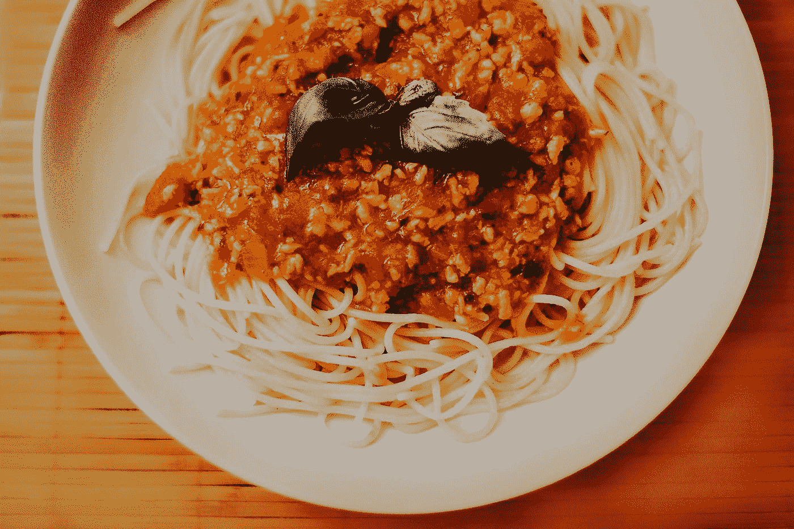

# 第 2 部分:缩放 Yelp 下载算法

> 原文：<https://pub.towardsai.net/web-scraping-yelp-part-2-scaling-the-yelp-downloading-algorithm-909356d206b8?source=collection_archive---------2----------------------->

## [网页抓取](https://towardsai.net/p/category/web-scraping)

## 改进我之前写的关于如何下载 Yelp 评论的算法。完整的算法[可在我的回购](https://github.com/arditoibryan/Projects/blob/master/20210813_yelp_webscraping/web_scraping_yelp_advanced.ipynb)。

在[的上一期文章](/part-1-scraping-yelp-reviews-with-pyhton-using-beautifulsoup-a014867a1d2c?source=your_stories_page-------------------------------------)中，我花了一些时间解释如何对 Yelp 网站上一家餐馆的评论进行基本的网络搜集。然而，因为 Yelp 的网站上列出了无数的餐馆，我将创建一个算法，给出我们想要搜索的餐馆的信息，能够到达无限的页面并下载他们主持的所有评论。



照片由 [Joice Kelly](https://unsplash.com/@joicekelly?utm_source=medium&utm_medium=referral) 在 [Unsplash](https://unsplash.com?utm_source=medium&utm_medium=referral) 上拍摄

我想用第二部分来详细解释这个算法是如何工作的，因为它太复杂了，无法用一个单独的算法来管理。我的意图是让你知道构建结构化算法的步骤。构建复杂的算法通常需要以下步骤:

*   我们从一个简单的算法开始，这个算法处理一个可管理的问题
*   我们将它扩展到应用于同一问题的多个实例
*   我们增加了算法的复杂性

当这些步骤完成后，您可以逐渐添加内容，甚至可以添加其他工具，如机器学习、探索性数据分析或洞察力提取以及可视化。

## 基本算法

为了让你知道我用什么算法在 Yelp 的一个页面上抓取所有评论，这是我一直使用的代码。

```
import requests
from bs4 import BeautifulSoup
import timecomment_list = list()
for pag in range(1, 29):
  time.sleep(5)
URL = "[https://www.yelp.com/biz/the-cortez-raleigh?osq=Restaurants&start=](https://www.yelp.com/biz/the-cortez-raleigh?osq=Restaurants&start=)"+str(pag*10)+"&sort_by=rating_asc"
  print('downloading page ', pag*10)
  page = requests.get(URL)
#next step: parsing
  soup = BeautifulSoup(page.content, 'lxml')
  soupfor comm in soup.find("yelp-react-root").find_all("p", {"class" : "comment__373c0__Nsutg css-n6i4z7"}):
    comment_list.append(comm.find("span").decode_contents())
    print(comm.find("span").decode_contents())
```

正如您所注意到的，如果您对 Python 和它的一些库至少有一些经验的话，它非常小而且容易理解。

## 指导算法

如上所述，我想建立一个控制面板，能够从一个窗口控制整个过程。以这种方式构建代码，我需要什么？

*   算法将尝试连接的链接列表
*   控制算法参数的函数

同时，算法本身必须按照最佳编程实践编写:

*   导入库
*   添加变量
*   设置功能
*   运行算法
*   分析/导出结果

## 导入库

我们要采取的第一步，就像在每一个值得尊敬的算法中一样，是将一小部分代码专用于我们将在整个代码中使用的库。我不需要用 pip 安装任何东西，因为代码中的所有库都已经在 Python 包中提供了。

```
import requests
from bs4 import BeautifulSoup
import time
from textblob import TextBlob
import pandas as pd
```

## 添加变量

有了这组变量，我就可以控制使用 beautifulsoup 下载哪些网站。为了提供一个简单的例子，我只用了两个。正如你注意到的，我需要使用大量的信息来正确地指挥我的铲运机。我需要每家餐厅的链接来建立连接，我想要抓取的评论页面的数量，以及要放入数据集中的餐厅名称。

存储这些信息的最佳方式是通过嵌套列表或字典(相当于一个 javascript 对象，如果你愿意，可以称之为 NoSQL)。一旦你习惯了使用字典，它们可以简化你的大部分工作，让你的代码更容易理解。总的来说，我将有一个字典列表。

```
rest_dict = [
              {  "name"   : "the-cortez-raleigh",
                  "link"  : "[https://www.yelp.com/biz/the-cortez-raleigh?osq=Restaurants&start=](https://www.yelp.com/biz/the-cortez-raleigh?osq=Restaurants&start=)",
                  "pages" : 3
              },
              {  "name"   : "rosewater-kitchen-and-bar-raleigh",
                  "link"  : "[https://www.yelp.com/biz/rosewater-kitchen-and-bar-raleigh?osq=Restaurants&start=](https://www.yelp.com/biz/rosewater-kitchen-and-bar-raleigh?osq=Restaurants&start=)",
                  "pages" : 3
              }
]
```

## 设置功能

因为我希望解释这个函数的每一个细节，如果你只是想访问代码，我建议你直接从我的 repo 中获取代码[，当你点击一下就可以完成的时候，将这些单独的代码行组合并粘贴到你的 IDE 中将是一种折磨。](https://github.com/arditoibryan/Projects/blob/master/20210813_yelp_webscraping/web_scraping_yelp_advanced.ipynb)

现在我已经有了所有的信息，我可以设置我的算法，我将 cape **刮刀**。逻辑很简单，因为代码将经历一系列步骤:

```
def scraper(rest_list):
  all_comment_list = list()
  for rest in rest_list:
    comment_list = list()
```

它将首先遍历列表中的每一个字典。

```
 for pag in range(1, rest['pages']):
```

我还添加了一个 try 语句，以便在代码中出现错误或连接故障导致算法停止时，我们不必从头开始。因为在网页抓取过程中错误是很常见的，因为它们非常依赖于我们自己没有建立的网站的结构，所以我们需要采取措施来防止我们的算法停止。如果发生这种情况，我们要么需要花更多的时间来了解算法在哪里停止并调整抓取参数，因为我们到目前为止已经能够保存信息，要么从头开始。相信我，没有一种选择是令人愉快的。

```
 try:
```

我会在开始请求前强制等待 5 秒钟，以避免我们的 IP 被拒绝。通常，当运行太多查询时，网站理解我们不可能是人类，并决定阻止连接请求。除非我们有 try 语句，否则算法会抛出错误。

```
 time.sleep(5)
```

连接到 Yelp 并提取 HTML，然后按照指定的页数重复这个过程。

```
[osq=Restaurants&start=](https://www.yelp.com/biz/the-cortez-raleigh?osq=Restaurants&start=)"+str(pag*10)+"&sort_by=rating_asc"
        URL = rest['link']+str(pag*10)
        print(rest['name'], 'downloading page ', pag*10)
        page = requests.get(URL)
```

将 HTML 解析成可以被 beautifulsoup 读取的代码。这是最相关的工作程序，因为这是我们可以使用本库提供的方法提取信息的唯一方式。

```
#next step: parsing
        soup = BeautifulSoup(page.content, 'lxml')
        soup
```

从这千行字符串中提取评论。经过对代码的深入研究，我能够理解哪些 HTML 元素驻留在评论中。这段代码将准确提取这些元素的内容。

```
for comm in soup.find("yelp-react-root").find_all("p", {"class" : "comment__373c0__Nsutg css-n6i4z7"}):
```

我现在将把单个餐馆的内容保存在一个列表中，该列表包含与餐馆名称匹配的每个评论，名为 **comment_list** 。

```
 comment_list.append(comm.find("span").decode_contents())
          print(comm.find("span").decode_contents())
      except:
        print("could not work properly!")
```

在抓取下一页之前，我会将保存在 **comment_list** 中的评论保存到一个总列表中，该列表将包含所有名为 **all_comment_list** 的评论。从下一次迭代开始， **comment_list** 将被重置。

```
 all_comment_list.append([comment_list, rest['name']])
  return all_comment_list
```

最后，我可以用一行代码运行该算法，并将其所有值存储在一个名为 reviews 的列表中。

```
reviews = scraper(rest_dict)
```

在下一部分中，我将从评论中生成一个结构化数据集，并应用自然语言处理技术来更好地理解我下载的内容。