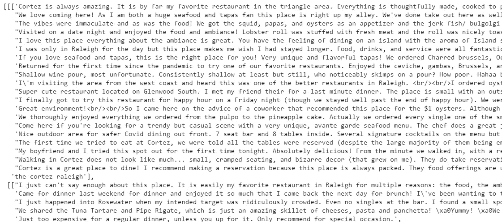
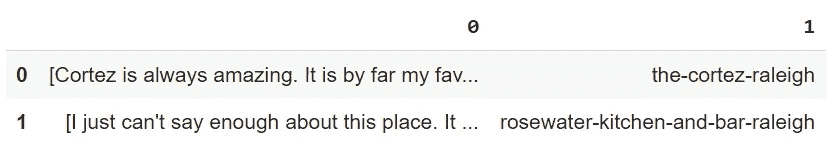
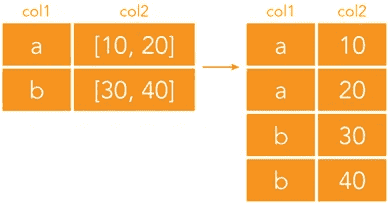
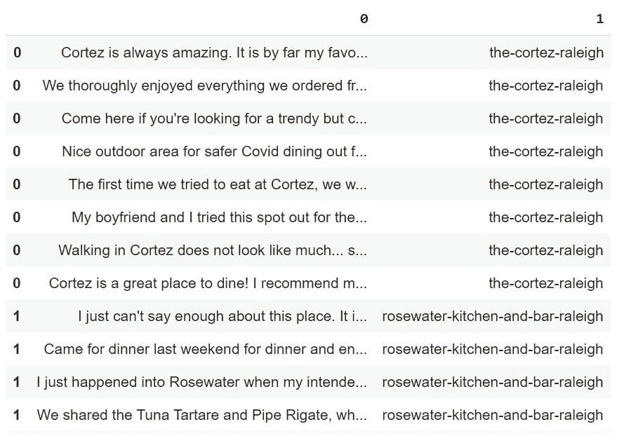
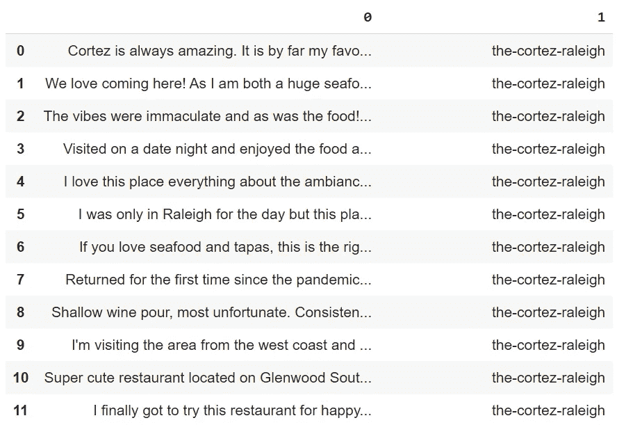
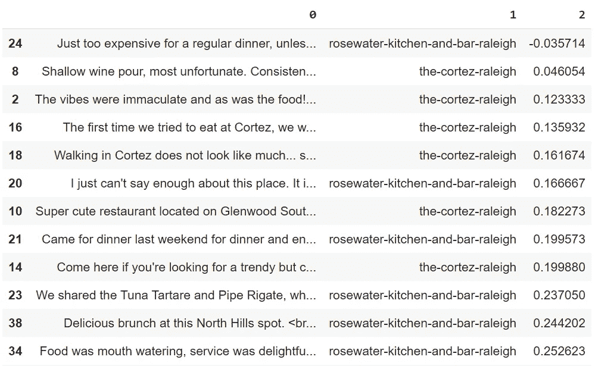

# Web 抓取 Yelp，第 3 部分:对 Yelp 抓取的数据执行 EDA

> 原文：<https://pub.towardsai.net/web-scraping-yelp-part-3-performing-an-eda-on-yelp-scraped-data-176d38fee302?source=collection_archive---------3----------------------->

## [自然语言处理](https://towardsai.net/p/category/nlp)

## 使用自然语言处理从餐馆评论中提取相关信息。完整的代码[可在我的回购](https://github.com/arditoibryan/Projects/blob/master/20210813_yelp_webscraping/web_scraping_yelp_advanced.ipynb)。

这是一系列文章的第三篇(这里是[第一部分](/part-1-scraping-yelp-reviews-with-pyhton-using-beautifulsoup-a014867a1d2c)、[第二部分](/web-scraping-yelp-part-2-scaling-the-yelp-downloading-algorithm-909356d206b8))，这些文章使用 beautifulsoup 从 Yelp 中抓取餐馆评论，然后应用机器学习，目的是从数据中提取洞察力。


照片由[雷切尔·帕克](https://unsplash.com/@therachelstory?utm_source=medium&utm_medium=referral)在 [Unsplash](https://unsplash.com?utm_source=medium&utm_medium=referral) 上拍摄

在上一篇文章中，我一直使用这段代码将所有评论提取到一个嵌套列表中。这篇文章深入解释了这些代码。

```
import requests
from bs4 import BeautifulSoup
import time
from textblob import TextBlob
import pandas as pd#we use these argument to scrape the website
rest_dict = [
              {  "name"   : "the-cortez-raleigh",
                  "link"  : "[https://www.yelp.com/biz/the-cortez-raleigh?osq=Restaurants&start=](https://www.yelp.com/biz/the-cortez-raleigh?osq=Restaurants&start=)",
                  "pages" : 3
              },
              {  "name"   : "rosewater-kitchen-and-bar-raleigh",
                  "link"  : "[https://www.yelp.com/biz/rosewater-kitchen-and-bar-raleigh?osq=Restaurants&start=](https://www.yelp.com/biz/rosewater-kitchen-and-bar-raleigh?osq=Restaurants&start=)",
                  "pages" : 3
              }
]#scraping function
def scrape(rest_list):
  all_comment_list = list()
  for rest in rest_list:
    comment_list = list()
    for pag in range(1, rest['pages']):
      try:
        time.sleep(5)#URL = "[https://www.yelp.com/biz/the-cortez-raleigh?osq=Restaurants&start=](https://www.yelp.com/biz/the-cortez-raleigh?osq=Restaurants&start=)"+str(pag*10)+"&sort_by=rating_asc"
        URL = rest['link']+str(pag*10)
        print(rest['name'], 'downloading page ', pag*10)
        page = requests.get(URL)#next step: parsing
        soup = BeautifulSoup(page.content, 'lxml')
        soupfor comm in soup.find("yelp-react-root").find_all("p", {"class" : "comment__373c0__Nsutg css-n6i4z7"}):
          comment_list.append(comm.find("span").decode_contents())
          print(comm.find("span").decode_contents())
      except:
        print("could not work properly!")
    all_comment_list.append([comment_list, rest['name']])
  return all_comment_list#store all reviews in a list
reviews = scrape(rest_dict)
```

正如您在代码的列表行中看到的，函数的输出已经存储在一个名为 reviews 的变量中。打印变量时，结果如下。



输出的屏幕截图

嵌套列表的结构遵循以下模式:

```
[[[review1, review2], restaurant1], [[review1, review2], restaurant2]]
```

我现在将使用熊猫将其转换成数据帧。

## 将数据转换成数据帧

现在我已经创建了一个包含评论及其对应餐馆的列表，我需要创建一个适当的数据框架来保存所有信息。

```
df = pd.DataFrame(reviews)
```



从评论到 df 的直接转换的输出

但是，正如您所看到的，如果我试图将这个嵌套列表直接转换成 DataFrame，我将得到一列完整的列表，另一列只有一个餐馆名称。为了正确地编辑数据，我将使用一个名为 explode 的函数，该函数将为应用该函数的列表中的每个元素指定一行，在本例中是第 0 列。



explode 如何工作，有关数据转换的完整列表[请参见此链接](/complete-list-of-data-manipulation-or-data-transformation-techniques-e1f693508083)

```
df = df.explode(0)
```

正如您从图像中看到的，数据集现在结构正确。每个评论都有对应的餐厅。



使用分解功能后的数据帧

剩下要做的唯一事情是重置索引，因为当前样本仅用 0 和 1 编号。

```
df = df.reset_index(drop=True)
df[0:10]
```



最终数据集的屏幕截图

## 执行情感分析以对评论进行分类

网站上的每一篇评论都已经有了一些星级来量化它，但是，我没能刮到它。为了找到丢失数据的解决方案，我将尝试执行情感分析。NLP 模型的值推断将作为每次评论的星级数的替代。当然，这是一个对数据进行处理的实验，情感分析高度依赖于我们使用的模型，因为它并不总是准确的。

我将使用一个名为 TextBlob 的简单库，它已经有了一个针对该场合的预训练算法。因为我需要将它应用到每个评论中，所以我将首先创建一个函数，给定一个文本，它将返回从-1 到 1 的估计情感。

```
def perform_sentiment(x):
  testimonial = TextBlob(x)
  #testimonial.sentiment (polarity, subjectvity)
  testimonial.sentiment.polarity
  #sentiment_list.append([sentence, testimonial.sentiment.polarity, testimonial.subjectivity])
  return testimonial.sentiment.polarity
```

一旦构建了函数，我就可以使用 pandas 上可用的 apply 方法来创建数据集的新列，其中包含情感分析的结果。然后，我将使用 sort_values 方法从负面评论开始对所有评论进行排序。

```
df[2] = df[0].apply(lambda x : perform_sentiment(x))
df = df.sort_values(2, ascending=False)
df
```

如你所见，这是最终的数据集。



带有相应情绪的所有评论的屏幕截图

## 提取词频

为了继续我的实验，我现在将提取在数据集的一个分区中使用最频繁的单词。然而，有一个问题。有些单词有相同的词根，比如“吃”和“吃了”，但算法不会自动把它们放在同一个类别下，因为转换成二进制时它们是不同的。作为这个问题的解决方案，我将使用一种叫做词汇化的 NLP 预处理技术。

词汇化可以提取每个现有单词的词根，排除可能的变化，并允许标准化数据。旅鼠是简单的模型，你不能自己建立，他们必须预先训练。我将使用 spacy 库来导入一个 lemmatizer。

```
!pip install spacy
```

Spacy 是一个开源的 NLP 库，可以包含几个预训练的模型，包括一个 lemmatizer。该函数将对单个文本中出现的所有单词进行词条排序，并返回文本中所有单词的频率(它们被使用的次数)。我将按升序对结果进行排序，以显示哪些词在评论集中使用得最多。

```
def top_frequent(text, num_words):
  #frequency of most common words
  import spacy
  from collections import Counternlp = spacy.load("en")
  text = text

  #lemmatization
  doc = nlp(text)
  token_list = list()
  for token in doc:
    #print(token, token.lemma_)
    token_list.append(token.lemma_)
  token_list
  lemmatized = ''
  for _ in token_list:
    lemmatized = lemmatized + ' ' + _
  lemmatized#remove stopwords and punctuations
  doc = nlp(lemmatized)
  words = [token.text for token in doc if token.is_stop != True and token.is_punct != True]
  word_freq = Counter(words)
  common_words = word_freq.most_common(num_words)
  return common_words
```

我不会从整个评论列表中提取最常用的词，而是只从最差的评论中提取。数据库已经排序，将最差的评论放在最上面，所以剩下要做的唯一事情就是创建一个包含所有评论的唯一字符串。我将使用一个连接函数将评论列表转换成一个字符串。

```
text = ' '.join(list(df[0].values[0:20]))
texttop_frequent(text, 100)[('great', 22),
 ('<', 21),
 ('come', 16),
 ('order', 16),
 ('place', 14),
 ('little', 10),
 ('try', 10),
 ('nice', 10),
 ('food', 10),
 ('restaurant', 10),
 ('menu', 10),
 ('day', 10),
 ('butter', 9),
 ('drink', 9),
 ('dinner', 8),
 ...
```