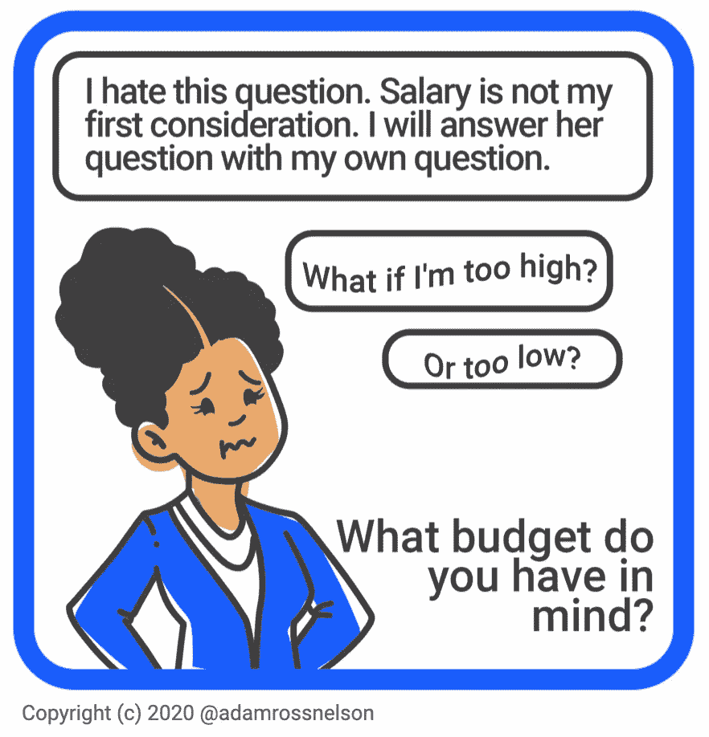

# 帮助数据科学家准备薪资谈判的网站

> 原文：<https://pub.towardsai.net/websites-that-help-data-scientists-prepare-for-salary-negotiations-33e57cca9f7d?source=collection_archive---------2----------------------->

## [职业生涯](https://towardsai.net/p/category/careers)

## 可以帮助形成客观合理的薪资预期的网站集合。

在今天的就业环境中，寻找新工作的数据科学家通常在工作机会和谈判中占据上风。提供工作的雇主正面临劳动力供应不足的问题。许多公司已经加快了招聘速度。供不应求。

浏览第一个标题下方，找到每个网站的描述及其评级！

鸣谢:作者插画。

即使天平向求职者倾斜，仍有一个症结让许多人纠结:谈判的薪水是多少。我应该问多少？

知道要求什么样的薪水，无论你在什么行业，都是一个普遍的问题。对于数据科学领域的专业人员来说，这是一项极具挑战性的任务。

一些就业专家说，要求比你目前的收入高出 10%到 20%是合适的。这一基准的一个问题是，它可能会延续和加剧薪酬差距中的种族和性别偏见。我建议求职者和雇主不要让求职者的薪资历史驱动薪资谈判，而是应该有其他因素驱动薪资。雇主的预算很重要。雇主付给其他类似员工的工资也很重要。雇主如何以及在多大程度上提供非工资报酬也很重要。

考虑到影响薪资谈判的诸多因素，许多员工现在选择在第一次谈判时加大筹码。当方法正确时，做大不会是一个错误。希望跳槽到新雇主会带来丰厚的经济回报，这并非没有道理。相关的，在谈判的某个阶段，候选人需要知道如何设定一个期望值，这个期望值既要考虑到候选人的价值，又要考虑到其他外在因素。这篇文章指出了可以帮助候选人找到那个数字的资源。

有几个网站可以让你找到薪水研究的基准。这些信息可以帮助你为具有经济吸引力的职业转变(跳槽)做好准备。这里有四个例子，每个例子都有一个排名，表明它有多有用:

# 劳工统计局

(【https://www.bls.gov/】T4)

这个全面的网站充满了求职各方面的宝贵建议——不仅仅是薪水信息。这个联邦组织有许多调查和计划，不断更新有关薪酬和福利的信息。薪资和福利数据不仅可以按职业和行业获得，还可以按地理区域和工人的人口特征获得。

然而，这个复杂的网站可能很难导航和使用——如果你走进了死胡同，请确保查看扩展的帮助和教程页面。这些教程本身就是一个关于报酬、福利、薪水和职业的有用信息来源。

我的评价是:对所有人都有帮助——不要错过。

# 薪金开放数据

([https://govsalaries.com/](https://govsalaries.com/))。

这个网站是另一个非常全面的资源，可以让你通过多种雇主属性进行搜索。在这里，您还可以按位置搜索，包括州、县、市和联邦。您也可以按雇主、员工或职位进行搜索。

搜索特定人员工资的能力特别有用，也很有启发性。这是一个很受欢迎的网站，政府雇主(城市、州和联邦政府部门)在确定他们的工资基准时会使用这个网站。一些用户发现发布的关于特定个人的工资信息不正确，无法删除或补救。另一个潜在的缺点是信息可能已经过时。

我的评价是:对某些人有帮助——值得一看。

# 联邦薪酬:公务员的资源

(【https://www.federalpay.org/】T2)。

虽然这个网站自称为“美国政府雇员的免费公共资源”，但对于其他部门的雇员来说还有更多。

该网站提供了特定于美国联邦政府的就业信息，其有用的功能集包括多个计算器。然而，该网站主要关注军事和执法职位，似乎没有每个州的全面工资信息。它还夹杂着广告，甚至一些弹出窗口。

我的评价是:对少数人有帮助——记住。

# 特定州的工资信息网站

有些州有优秀的薪资信息网站。最好的两个是**透明加州**([https://transparentcalifornia.com/](https://transparentcalifornia.com/))和**德克萨斯论坛报**([https://salaries.texastribune.org/](https://salaries.texastribune.org/))。这两个网站都是进行薪资调查的必去之地。这些网站对德克萨斯州和加利福尼亚州的居民非常有帮助。这两个特定于州的站点都提供了有用的粒度细节。这些加利福尼亚和德克萨斯的特定站点对于那些发现自己的州特定数据很难获得的其他州的居民也很有用。德克萨斯州和加利福尼亚州有用的另一个原因是这两个州的人口非常多。在各州的许多城市或农村地区，它们可以被视为美国许多地方的代表。

我的评价是:对大多数人有帮助——不要错过。

 [## 加入我的介绍链接媒体-亚当罗斯纳尔逊

### 作为一个媒体会员，你的会员费的一部分会给你阅读的作家，你可以完全接触到每一个故事…

adamrossnelson.medium.com](https://adamrossnelson.medium.com/membership) 

# 结论

虽然这些网站是查找薪资信息的首选网站，但它们绝不是唯一的网站。网上充斥着汇编和提供薪水信息的网站。其他值得一看的网站可能包括:

Glassdoor: Glassdoor 不仅提供薪资信息，还提供公司评论和员工反馈(值得注意的是，其中一些是前员工留下的)。

Salary.com:这是另一个流行的专门针对薪水的工作网站，列出了广泛的领域，并提供免费的薪水信息。

LinkedIn:顶级的专业社交媒体网站拥有大量的工作信息，并且独特的是，它允许任何创建帐户的人向几乎所有拥有帐户的人发送消息。用它来建立关系网，了解具体的角色。

想了解更多数据科学家的薪资信息？两个资源:一个是如何与招聘人员谈论薪水。二— [我如何帮助他人准备薪资谈判:调查、调查、调查](https://betterhumans.pub/how-i-help-others-prepare-for-salary-negotiations-research-research-research-6fadbf8e7174)。

# 感谢阅读

你准备好了解更多关于数据科学职业的信息了吗？我进行一对一的职业辅导，并有一份每周电子邮件列表，帮助专业求职者获取数据。请立即联系我，了解更多信息。

感谢阅读。把你的想法和主意发给我。你可以写信只是为了说声嗨。如果你真的需要告诉我是怎么错的，我期待着尽快和你聊天。推特:[@ adamrossnelson](https://twitter.com/adamrossnelson)LinkedIn:[亚当罗斯尼尔森](https://www.linkedin.com/in/arnelson/)。