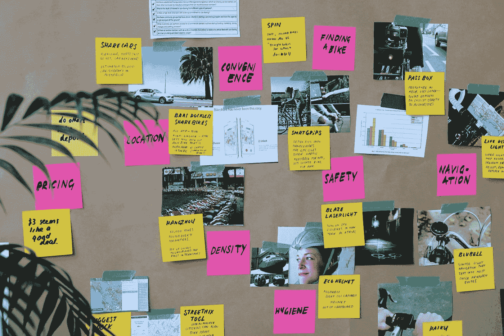

# 每周机器学习研究论文阅读清单— #8

> 原文：<https://pub.towardsai.net/weekly-machine-learning-research-paper-reading-list-8-f6415645685e?source=collection_archive---------5----------------------->

## [机器学习](https://towardsai.net/p/category/machine-learning)，[研究](https://towardsai.net/p/category/research)

## 本周(2020 年 9 月 21 日–2020 年 9 月 27 日)，请查阅以下三篇研究论文。

照片由[乔·什切潘斯卡](https://unsplash.com/@joszczepanska?utm_source=medium&utm_medium=referral)在 [Unsplash](https://unsplash.com?utm_source=medium&utm_medium=referral) 拍摄

# 基于密度比的聚类发现不同密度的聚类

作者:叶朱，明凯·丁，马克·J·卡门

地点:模式识别

论文:[网址](https://www.sciencedirect.com/science/article/abs/pii/S0031320316301571)

摘要:

> 基于密度的聚类算法能够在包含噪声的数据集中识别任意形状和大小的聚类。众所周知，使用全局密度阈值的这些算法中的大多数难以识别具有密度变化很大的聚类的数据集中的所有聚类。本文确定并分析了基于密度的聚类算法在这种情况下失败的条件。它提出了一种基于密度比的方法来克服这一弱点，并揭示了它可以在两种方法中实现。一种方法是修改基于密度的聚类算法，通过使用其密度估计器来计算密度比，从而进行基于密度比的聚类。另一种方法只涉及给定数据集的重新缩放。应用于重新缩放的数据集的现有的基于密度的聚类算法可以找到具有不同密度的所有聚类，而如果将相同的算法应用于未缩放的数据集，这是不可能的。我们提供了一个使用 DBSCAN，OPTICS 和 SNN 的实证评估，以显示这两种方法的有效性。

# 不确定数据聚类框架

作者:埃里希·舒伯特、亚历山大·库斯、托比亚斯·埃姆里奇、安德烈亚斯·苏夫勒、克劳斯·阿瑟·施密德和阿瑟·齐梅克

地点:VLDB 基金会会议录

论文:[网址](http://www.vldb.org/pvldb/vol8/p1976-schubert.pdf)

摘要:

> 与处理不确定数据相关联的挑战，特别是与查询和挖掘相关联的挑战，在研究社区中得到越来越多的关注。在这里，我们将重点放在不确定数据的聚类上，并为此描述一个通用框架，该框架还允许可视化和理解不确定性(使用不同的不确定性模型)对数据挖掘结果的影响。我们的框架由 ELKI(http://elki.dbs.ifi.lmu.de/)的 0.7 版组成，因此伴随着大量算法、距离测量、索引技术、评估测量和可视化组件的实现。

# 隔离集核及其在多示例学习中的应用

作者:毕，婷，

地点:KDD 19:第 25 届 ACM SIGKDD 知识发现和数据挖掘国际会议论文集

论文:[网址](https://dl.acm.org/doi/abs/10.1145/3292500.3330830)

摘要:

> 集合级问题和实例级问题一样重要。解决集合级问题的核心是:如何度量两个集合之间的相似性。本文研究直接从数据中导出的数据相关核。我们引入了独立集核，它完全依赖于数据分布，既不需要类信息，也不需要显式学习。相比之下，大多数当前的集合相似性不依赖于底层数据分布。我们从理论上分析了隔离集核的特性。由于集合核有一个有限的特征映射，我们证明了它可以用来加速集合核的计算。我们使用 SVM 分类器将隔离集核应用于多示例学习，并证明它优于其他集核或其他多示例学习问题的解决方案。

前几周阅读清单:

[每周阅读清单#1](https://medium.com/the-innovation/weekly-machine-learning-research-paper-reading-list-1-780a5ffac7d7)

[每周阅读清单#2](https://medium.com/the-innovation/weekly-machine-learning-research-paper-reading-list-2-c9ed61b76462)

[每周阅读清单#3](https://medium.com/towards-artificial-intelligence/weekly-machine-learning-research-paper-reading-list-3-61d9c86c2538)

[每周阅读清单#4](https://medium.com/towards-artificial-intelligence/weekly-machine-learning-research-paper-reading-list-4-64442005324d)

[每周阅读清单#5](https://medium.com/towards-artificial-intelligence/weekly-machine-learning-research-paper-reading-list-5-7dc6740b9505)

[每周阅读清单#6](https://medium.com/towards-artificial-intelligence/weekly-machine-learning-research-paper-reading-list-6-828a5bb1b3a5)

[每周阅读清单#7](https://medium.com/towards-artificial-intelligence/weekly-machine-learning-research-paper-reading-list-7-e01c9db52fcd)

# 关于我:

我是 [Durgesh Samariya](https://durgeshsamariya.com/) ，澳大利亚费杜尼大学的三年级机器学习博士生。在网上，我被称为学生。

[订阅我的时事通讯，获取我每周的片段](http://eepurl.com/hampwT)。

# 在互联网上:

在 [Instagram](https://www.instagram.com/themlphdstudent/) 、 [Kaggle](https://www.kaggle.com/themlphdstudent) 、 [GitHub](https://github.com/themlphdstudent) 和 [Medium](https://medium.com/@themlphdstudent) 上关注我。

**感谢阅读。**