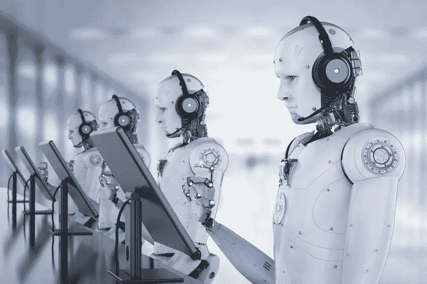

# 欢迎来到扩充时代

> 原文：<https://pub.towardsai.net/welcome-to-the-augmented-age-16503b405010?source=collection_archive---------1----------------------->

## 年龄| [朝向 AI](https://towardsai.net) 的增大

下一次经济革命是思想的革命。

我们以前经历过这些革命。一万多年前农业的发明，为现代性树立了新的标杆。蒸汽动力的发明引发了工业革命，永远改变了 18 至 19 世纪的人类劳动。在此期间，科学成熟了，装配线的发展使制造复杂产品的工作变得简单。

这让我们想到了 20 世纪 90 年代的数字革命，现代互联网的普及和个人电脑的严重主流化。快进到今天，我们正处于一个增强时代的尖端，将看到人们结合人工智能技术工作，以最大限度地提高他们的工作和个人生活质量。用人工智能技术增强我们的认知能力将很快成为常态，它将定义一个生活和商业的新时代！

这项技术是关于自动化低水平的认知任务，这些任务通常代表了我们工作日中最糟糕的事情。从短期来看，这意味着你将有更多的时间呆在办公室里，可以自由地解决更高质量的问题。从长远来看，人工智能将永久改变我们的思维方式。地平线上隐约出现了截然不同的“之前”和“之后”——我们今天是传统的人类，但我们正在慢慢地把自己变成明天的超人。

以下是我们正在接近扩展时代的转折点的迹象:

**人工智能商业环境从未如此有利。**

这是一个制造人工智能产品或进行人工智能研究的好时机。无论你想谈论政府预算还是对科技初创公司的风险投资，这些天人工智能都有一条资金河流在流动。这意味着经济正在将真正的价值放在将使我们成为超人的技术上——我们正在激励自己实现改变世界的技术。

我们将记住这个风险投资时代，这是一场投资狭义人工智能的淘金热，狭义人工智能是在一件事情上做得非常好，但在其他操作上却步履蹒跚的专家级应用程序。无论谁将足够多的狭义应用捆绑在一起，都将向我们展示[高级通用智能](https://en.wikipedia.org/wiki/Artificial_general_intelligence)的开端。扩增时代不会太远了。

人工智能太空竞赛开始了。

20 世纪 60 年代，民族国家争夺外层空间的主导权。今天他们在人工智能领域竞争。

中国、俄罗斯、以色列和美国可能没有太多共同点，但四个世界强国都同意人工智能发展是一个国家安全问题——每个国家都有自己的团队从事我们可能知道或可能不知道的项目。这场技术优势的竞争可能会在地缘政治焦虑的背景下发生，但它将导致大规模的创新。当一个国家成功地开发和利用人工智能技术时，这不仅是一个巨大的公共关系胜利，而且还允许获得其他人没有的新工具。

无论是为了吹嘘的权利还是意识形态的统治，民族国家都在不顾回报地投资人工智能。这只会加速扩张时代的到来。

作家已经预言了几代人的未来。乔治·奥威尔暗示这部电影将以一个暴虐的政治政权为特色。阿尔多斯·赫胥黎提供了一个反乌托邦的噩梦，在这个噩梦中，我们对糖丸和性意象感到厌倦，并被告知不要去看幕后。但目前这都是推测性的虚构。现实是，增强时代将为人类带来一个新的共同标准:我们中有大约 75 亿人准备超越我们的局限性，成为超人。我们将不再痴迷于产权和其他零和问题，因为我们将转向后稀缺思维。

这就是为什么下一次经济革命是思想的革命。