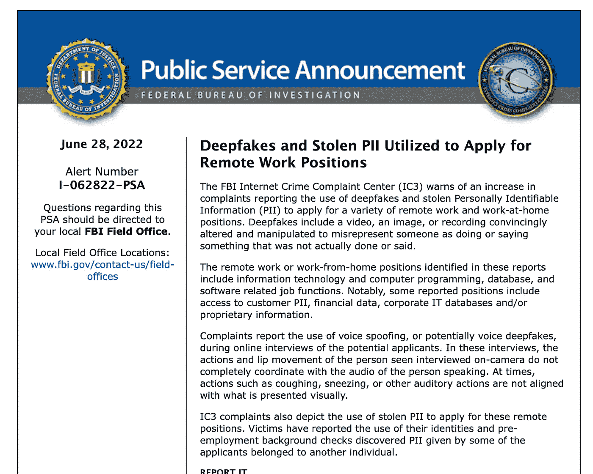
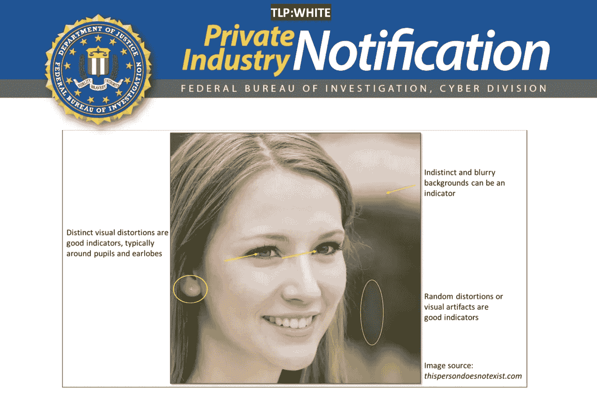

# 欢迎来到由 Deepfakes 驱动的网络欺诈新时代

> 原文：<https://pub.towardsai.net/welcome-to-the-new-era-of-cyber-fraud-powered-by-deepfakes-46682ad9f942?source=collection_archive---------1----------------------->

## deepfakes 对网络欺诈意味着什么，以及它将如何加强网络欺诈

亚历山大·格雷在 [Unsplash](https://unsplash.com?utm_source=medium&utm_medium=referral) 上拍摄的照片

想象一下，通过 Zoom 或 Google Meets 采访你的新数据库管理员(让我们称他为 John)。

他的资料已经核实了，而且他已经通过了所有的背景调查。

由于他的职位，他将有机会接触高度敏感的客户数据，但他的个人资料是无懈可击的，他的经验是惊人的。

他看起来很适合这个新的远程位置，除了…

**你采访的那个人根本不是约翰，而是一名网络罪犯，他利用 Deepfake 技术假冒了约翰的身份。**

他不需要侵入您的组织并访问客户数据，而是直接获得了进入前门的钥匙！

随着人工智能的采用在全球范围内持续上升，恶意使用**人工智能**来引入新类型的攻击是我广泛撰写[的一个主题。](https://www.amazon.com/Artificial-Intelligence-Governance-Cyber-Security-beginners-ebook/dp/B09Y9G7JXB/)

今天的网络罪犯是一群有创造力的人，他们总是在寻找新的载体来尝试攻击公司的防御系统，他们似乎已经找到了一个带有 **Deepfakes** 的载体。

**定义为:**

> [合成媒体](https://en.wikipedia.org/wiki/Synthetic_media)[【2】](https://en.wikipedia.org/wiki/Deepfake#cite_note-2)将现有图像或视频中的一个人替换成另一个人的肖像。虽然创建虚假内容的行为并不新鲜，但 deepfakes 利用来自[机器学习](https://en.wikipedia.org/wiki/Machine_learning)和[人工智能](https://en.wikipedia.org/wiki/Artificial_intelligence)的强大技术来操纵或生成更容易欺骗的视频和音频内容。

多年来，人们一直在玩 Deepfake，在他们自己的视频上叠加政客和演员的脸，产生了不可思议的效果(汤姆·克鲁斯的那张是我个人最喜欢的)

来源:https://www.youtube.com/watch?v=nwOywe7xLhs

然而， **Deepfake** 不仅仅是人们创建病毒式 YouTube 视频的有趣消遣，如果被滥用，还会产生严重的信任问题。

> 人们通常相信他们所看到的，特别是如果它来自一个处于权威地位的人，Deepfake 技术传播错误信息的潜力可能会非常严重。

# 对远程工作位置恶意使用 Deepfakes

如今，远程/混合工作已经成为大多数公司的现实，这些职位的面试也在远程进行。

正如我们将看到的，这没有逃过网络罪犯的注意。

**FBI 互联网犯罪投诉中心(IC3)** 于 2022 年 6 月 28 日发布[警告](https://www.ic3.gov/Media/Y2022/PSA220628)，警告犯罪分子申请敏感远程职位的 Deepfakes 增加，这将授予他们进入 PII 的权限。

来源:[https://www.ic3.gov/Media/Y2022/PSA220628](https://www.ic3.gov/Media/Y2022/PSA220628)

这些工作包括**编程、数据库管理、**和其他敏感职位，攻击者使用偷来的 PII 让他们的申请看起来更有说服力，例如，在公司不知情的情况下，使用偷来的身份通过就业前的背景调查。

这些公司通常会发现一些可疑的东西。)当他们在采访和/或其他听觉线索中观察到这个人的嘴唇与他们的讲话不完全同步时。

然而，人工智能发展的速度使得这对于网络罪犯来说只是一个需要克服的小问题。犯罪分子拥有工具和知识来继续改进这种攻击，直到它变得几乎不可检测，以及获取敏感的 PII 数据库、公司报告等的诱惑。，可以是相当的激励因素！

联邦调查局去年发布了一份私人行业通知(此处可访问)，其中他们警告 deepfakes 正被用于一种被称为**商业身份妥协(BIC)** 的新型攻击。

根据通知

> 通过利用先进的技术和新的工具，BIC 将代表着**商务电子邮件妥协(BEC)** 贸易技术的演变。BEC 主要包括危害公司电子邮件帐户以进行欺诈性金融活动， **BIC 将涉及使用内容生成和操纵工具来开发合成的公司角色或创建对现有员工的复杂模仿**。这种新兴的攻击媒介可能会对受害企业和组织造成非常严重的财务和声誉影响。

来源:[https://S3 . document cloud . org/documents/20509703/FBI pin-3102021 . pdf](https://s3.documentcloud.org/documents/20509703/fbipin-3102021.pdf)

# 以毒攻毒(或人工智能与人工智能)

随着这些类型的攻击不断演变，应对它们的最佳方式将不是不信任地看待人工智能技术，而是让公司采用人工智能和机器学习来进行身份认证。

对敏感位置的简单缩放呼叫可能不再管用，公司需要投资于机器学习解决方案，这些解决方案利用自动化和"**活性检测**"来捕捉攻击者冒充他人的企图。随着 deepfakes 变得越来越逼真，人眼可以忽略的内容可以通过由机器学习提供支持的人工智能系统检测出来。

**除了投资人工智能实现网络安全，企业还应遵循以下最佳实践:**

🛡️ **风险评估**你目前对敏感职位的面试程序是如何进行的。看看可以用来验证申请人身份的其他认证技术。

🛡️ **将深度伪装意识**加入到你的网络安全计划中，以确保所有层面都意识到这些风险(尤其是人力资源)。使用[和](https://detectfakes.media.mit.edu/)等网站培训你的员工如何检测 deepfake，这些网站会突出 deep fake 视频中明显的视觉不一致，如眩光、嘴唇运动、面部毛发等。

🛡️更新您的**事件响应流程**以整合 deepfakes，攻击者可以在 deepfake 视频中冒充潜在申请人甚至是一名高管，并确保您的法律和媒体团队也参与其中

基于人工智能的攻击让我们真正进入了未知领域，公司及其网络安全团队需要加快步伐，跟上攻击者的步伐。

似乎简单的基于电子邮件的社会工程时代已经成为过去，网络安全团队将需要适应或被人工智能攻击抛在后面。

祝你的人工智能之旅好运！

> 我希望你喜欢读这篇文章。如果你觉得这个话题有趣，可以看看我关于 [**人工智能治理和网络安全**](https://cloudsecguy.gumroad.com/l/aigovernance/1tojq7p?_gl=1*14yiflk*_ga*NzkyMjgyNDkyLjE2NjQxNzQ0MDc.*_ga_6LJN6D94N6*MTY2NTU1NDIxMC4xNjcuMS4xNjY1NTU0MjIxLjAuMC4w) **的打折课程，该课程讲述了新型人工智能风险以及如何减轻它们。**

 [## 通过我的推荐链接加入 Medium—tai mur Ijlal

### 阅读 Taimur Ijlal(以及媒体上成千上万的其他作家)的每一个故事。您的会员费直接支持…

taimurcloud123.medium.com](https://taimurcloud123.medium.com/membership)