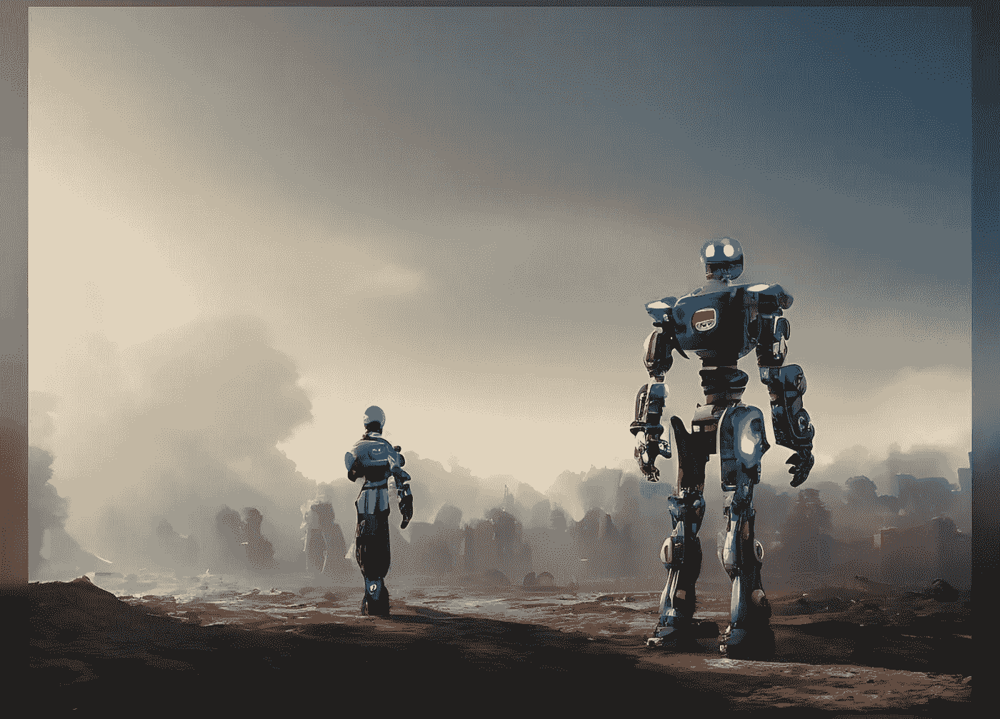
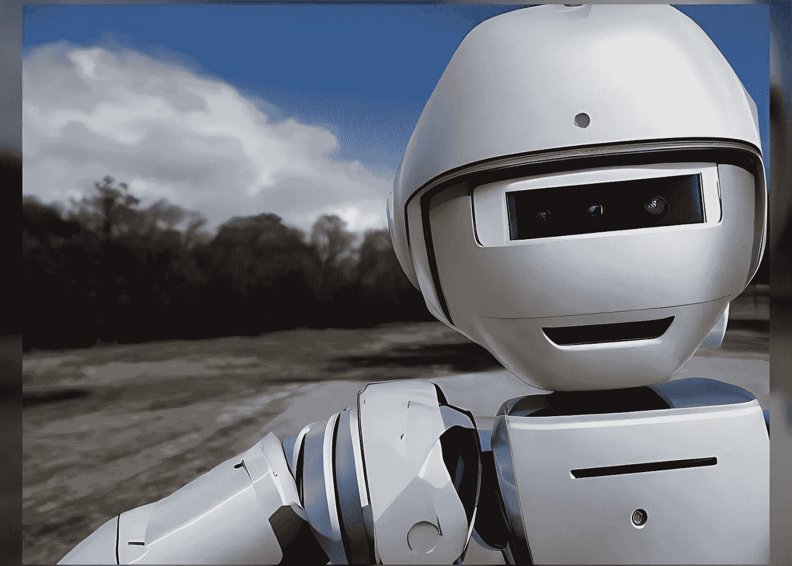

# AI 还做不到的#003

> 原文：<https://pub.towardsai.net/what-ai-still-cant-do-003-c2123837dd90?source=collection_archive---------1----------------------->

这是我在“人工智能还不能做什么”系列中的第三篇文章。如果你还没有读过前两本书，这个[链接](https://medium.com/@realaiseeker/list/what-ai-still-cant-do-0ff44fc3af09?source=user_lists---------1-------0ff44fc3af09---------------------)会把你带到我为此创建的阅读列表。请注意，我文章中的所有观点完全是我的，可能不反映其他作者/专家的观点。

现在，让我们来看看人工智能的新极限。

**# 003——理解因果仍然是个大问题**

事实上，人工智能(AI)系统旨在分析数据，识别模式，并基于该分析做出预测或决策。然而，理解因果的概念——一个事件或行为导致另一个事件或行为发生的想法——对人工智能系统来说可能是一个挑战。对于智人来说，理解因果是人类认知的一个基本方面。它包括认识到一个事件或行为(原因)可以导致另一个事件或结果(结果)的能力。这有助于我们理解周围的世界，并预测未来可能发生的事情。

有几个因素有助于我们理解因果关系。**一个**是我们感知和记住发生在我们周围的事件的能力。这包括我们看、听、触摸和感知世界的能力，以及我们记忆和回忆这些经历的能力。另一个因素是我们对事件之间的关系进行逻辑推理的能力。例如，如果我们看到一个孩子在玩玩具，然后玩具坏了，我们可以推断孩子的行为是玩具坏的原因。我们通过考虑事件的顺序并运用我们对世界如何运作的知识来得出结论。

我们对因果的理解也受到我们的社会和文化经历的影响。我们通过与他人的互动，以及通过观察和参与发生在我们周围的事件来了解因果关系。例如，我们可能知道打开电灯开关会导致电灯打开，或者播种和浇水会导致植物生长。

因此，我可以说，我们对因果关系的理解是一个复杂的过程，涉及感知、记忆、逻辑推理以及社会和文化经验的结合。

如果这对我们人类来说是可能的，为什么人工智能系统要努力跟上自然智能？我只能想到几个原因:

1.  有限的数据:AI 系统依靠数据进行学习和预测。然而，如果系统可用的数据不包括因果关系的示例，则系统可能很难了解它们。
2.  复杂关系:因果关系可能很复杂，可能涉及多个因素或变量。对于人工智能系统来说，准确识别和理解促成特定结果的所有因素可能是一项挑战。
3.  缺乏背景:理解原因和结果通常需要理解事件或行为发生的背景。人工智能系统可能难以理解事件发生的背景，这可能使它们难以准确识别因果关系。
4.  有限的推理能力:早些时候，我谈到了我们记忆事件的能力以及使用某些器官来感知和得出结论的能力。人工智能系统从数据中推理和得出逻辑结论的能力非常有限。这可能会使他们难以理解因果关系的概念，这需要他们有能力识别模式并从这些模式中得出逻辑结论。

理解因果关系是一项复杂的任务，需要深入理解不同事件和行为之间的关系。虽然人工智能系统在许多领域取得了重大进展，但这对他们来说仍然是一个挑战。

我们能找到解决这个难题的方法吗？可以教 AI 理解因果吗？是的，人工智能系统有可能被训练成理解和识别因果关系。某些 NLP 系统已经被训练来识别某些单词或短语更可能出现在描述因果关系的句子中。这可能涉及在包含因果关系的大型句子数据集上训练人工智能系统，然后使用这种训练来识别人工智能系统以前没有见过的新句子中的这些关系。

类似地，为决策或预测建模设计的人工智能系统可能会被训练成识别某些事件或行为可能会导致某些结果。这可能涉及在因果关系实例的大型数据集上训练人工智能系统，然后使用这种训练根据新的输入对未来可能发生的事情进行预测。

我不会大胆地说，人工智能系统完全不可能被训练成理解和识别因果关系。这是可能的，但需要大量的数据和人工智能系统的精心设计和训练。图形神经网络可用于表示不同事件或动作及其相应结果之间的关系。

一个经典的方法是基于知识的系统，我仍然相信专家们会回到这个方法。基于知识的系统是经典的人工智能系统，依赖于明确的知识表示和推理。在这种情况下，该系统可用于通过明确定义控制因果关系的规则和原则来匹配不同事件及其相应结果之间的关系，然后利用这一知识对新情况进行推断。

此外，因果推理研究，尤其是使用反事实推理，可能是这场斗争的长期解决方案。我只能希望我们能想出更简单的方法来完成我们的主要任务，让人工智能变成“人类”。

如果你喜欢读这篇文章，请给它一个赞并关注它。如有疑问，请使用评论部分。如果你想聊天，可以通过 LinkedIn 或 T2 Twitter 联系我。