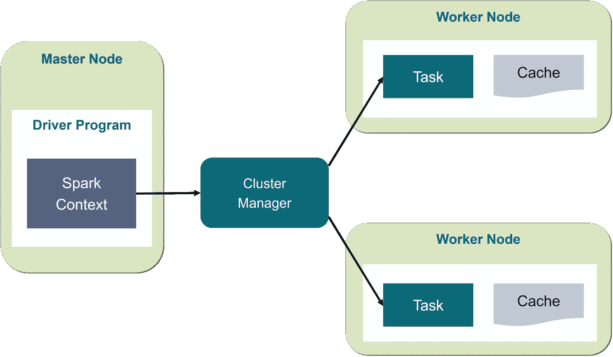
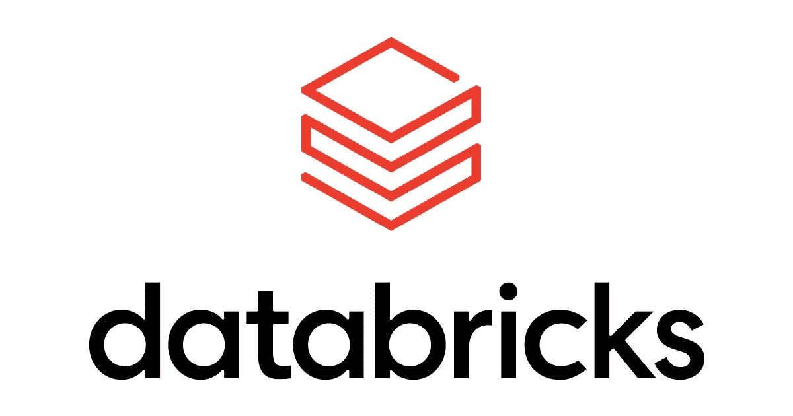

# 什么是 Apache Spark 和分布式计算？

> 原文：<https://pub.towardsai.net/what-are-apache-spark-and-distributed-computing-53ac52760182?source=collection_archive---------0----------------------->

## [数据科学](https://towardsai.net/p/category/data-science)

## Apache Spark 库简介

在这篇文章中，我将谈论最有用和最突出的工具之一，即名为 Apache Spark 的大数据分析工具。我使用这个工具已经有 3-4 个月了，就在几天前，我参加了通过使用 Python 的 Spark 开发人员认证的考试。我对这个工具越熟悉，就越了解 Spark 用例及其作为大数据软件的潜力。在本文中，我不会向您展示几行代码。这需要太多的复杂性。相反，我将向您解释这是什么软件，它的优势是什么，以及为什么作为数据科学家，您应该开始使用它。

## 什么是阿帕奇火花？

spark 是一款能够对大数据进行数据分析的软件。它擅长流处理，这意味着它可以实时处理数据。是财富 500 强公司中使用最多的软件之一。Spark 之所以如此强大，是因为它不是运行在单台计算机上，而是运行在一个集群(计算机的网络)上。这被称为分布式计算，我将详细解释它的含义。

阿帕奇火花标志

Spark 是由一个名为 Apache Software Foundation 的开发人员社区开发的。这个社区致力于为软件行业中的一些应用程序开发一套软件。其中一些解决方案用于大数据，特别是 Spark 和 Hadoop。

## 我们所说的大数据是指什么？

在详细解释什么是 Spark 之前，您需要了解我们所说的大数据是什么意思。使用术语“大数据”,我们确定了一种需要大量计算能力和时间来分析的数据。这就是为什么使用大数据进行分析总是存在问题。你首先需要一个能够处理大数据的专家，其次，你需要巨大的计算能力，这非常昂贵，可以在云上租用。只有少数专家知道如何使用大数据进行像样的分析，因为你只能通过经验和努力学习来获得技能，而不是通过实验。这个技能越来越值钱了。

# 分布式计算

为了理解 Spark 是如何工作的，您首先需要掌握分布式计算。

## 水平缩放

执行任何类型的数据分析的最常见方式是使用您自己的机器。如果数据很小，这不会造成问题，但当数据非常大，它可能会花费太多时间，因为您的硬件处理能力有限。例如，即使以目前的技术，在创建机器学习模型时，几 GB 的数据集也需要几个小时来处理。但是如果你有 100 千兆字节的文件呢？pc 需要太多的时间、天、甚至几个月才能完成。这是不可行的。一个可能的解决方案是水平扩展，这意味着增加 GPU 的能力，以更快地执行任务。多亏了云提供商，现在你可以在网上租到 GPU。这项技术被称为云计算，它仍然是分析大数据的最佳选择之一。

## 使用集群

然而，仅仅增加计算能力并不能保证执行分析的方式是最佳的。这意味着您租用的一些机器可能会浪费大量的处理能力。简而言之，可以优化执行分析的流程。这就是分布式计算有用的地方。分布式计算不是使用一台简单的计算机或者一组 GPU，而是使用几台不同的机器以及它们对应的 GPU 和 CPU。为了执行分析，数据被分割到不同的分区中，以便集群中的所有机器可以并行使用这些数据，目的是最大化该过程的效率。这意味着程序的执行将尽可能高效，尽可能节省计算能力。创建集群是一件复杂的事情，需要复杂的软件。Spark 是可能的选择之一。

## 火花簇

现在您已经知道了分布式计算是如何工作的，我们可以更详细地讨论 Apache Spark 库了。这个库是开源的，这意味着你不需要付费就可以使用它。简而言之，这个库允许您实现一个集群，这个集群可以是现实世界中存在的机器网络，甚至可以是在您自己的计算机上模拟的(正如您所想象的，出于实验目的)，并处理不同分区中的数据。通过使用 Spark，您可以用一种符合分布式计算要求的方式来管理您的程序，这样它就可以尽可能高效地运行。你可能已经明白了，每当你拥有海量数据的时候，这个软件就变得无比有用，因为每一个操作都会让你节省宝贵的时间，甚至是处理能力。

Spark 架构概述

Spark architecture 概述了这一过程:驱动程序将数据分割成分区，然后在不同的工作节点中发送和处理，每个节点包含一个或多个执行计算的执行器。

# 数据砖

能够实现 Spark 的最佳解决方案之一叫做 Databricks。Databricks 是一家由开发 Spark 的同一批程序员创建的公司，并建立在它的基础之上。这意味着，虽然 Spark 为您提供了能够管理集群和执行分析的软件，但您仍然需要处理能力、正常运行的集群，甚至是能够为您管理一切的平台。答案就在 Databricks 中，它提供了几种使用 Apache Spark 的解决方案。例如，一些主要的云平台，如 Azure，已经通过将数据块集成到他们的一些工具中来实现数据块。Azure Databricks 是 Azure 生态系统中用来处理 Spark 的最常用工具之一。

数据砖块标志

如果您有任何编程知识，您可能已经理解 Spark 是一个比市场上现有的解决方案复杂得多的库。即使是最常见的，也是开源的。一个例子是熊猫。这个库在你处理很少的数据集时很有用，因为你只需要一台机器来运行所有的东西。然而，如前所述，在处理集群时，您不能使用 pandas。如果您有 100GB 的数据，您需要几台计算机来运行您的应用程序。因为 pandas 肯定不是正确的答案，这应该让您了解使用简单工具和更复杂工具之间的区别。

# 结论

Spark 仍然是市场上最先进的软件之一，如果你希望提高自己作为数据科学家的技能，你可能希望在职业生涯的某一时刻开始学习它。一些世界顶级公司要求数据科学家知道如何使用 Spark 或替代工具进行大数据分析。我自己可以证实，火花是我课程中的一个有价值的工具。