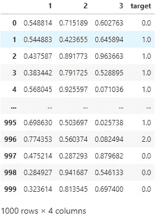
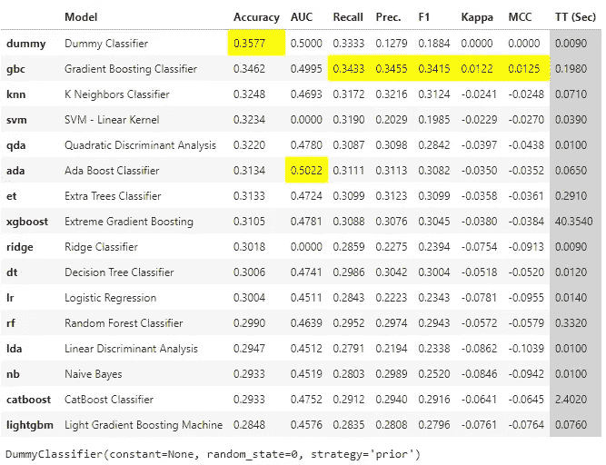
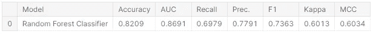
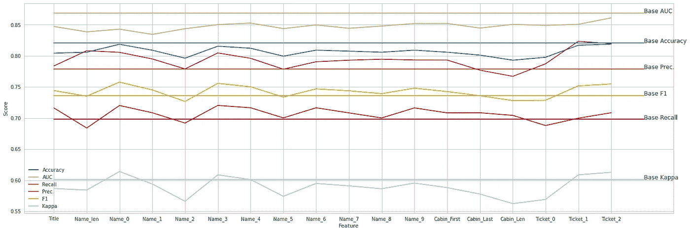
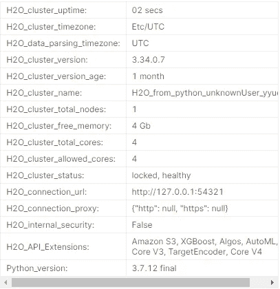
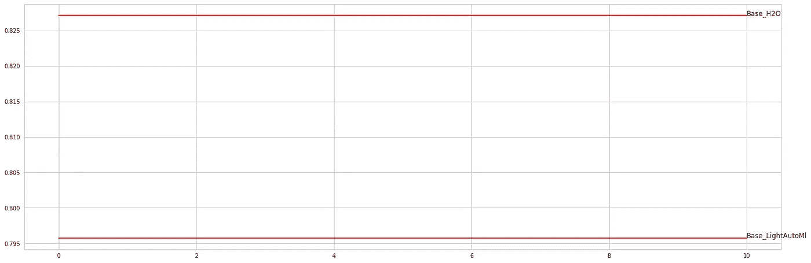

# 什么是机器学习的基线模型和基准，为什么我们需要它们？第 1 部分分类

> 原文：<https://pub.towardsai.net/what-are-baseline-models-and-benchmarking-for-machine-learning-why-we-need-them-affe0714cd07?source=collection_archive---------1----------------------->

## [机器学习](https://towardsai.net/p/category/machine-learning)

随机、机器学习、自动化 ML 基线模型和 ML 基准测试…


跳高奥运——来源[此处](https://www.worldathletics.org/disciplines/jumps/high-jump)

我们可以用任何准备好的数据来训练机器学习模型，但我们如何确定从训练数据中学习到的机器学习模型？本文的目的是解释数据科学中的基线模型。

你可以在这里看到数据集，你可以在文章末尾看到完整的 python 代码。

# 什么是基线模型？

基线模型是我们训练的 ML 模型的参考。对于基线模型，数据科学家试图解释他们训练的模型如何好，基线模型的分数是数据科学家的阈值。

# 基线模型有哪些类型？

有三种类型的基线模型，即随机基线模型、ML 基线模型和自动化 ML 基线模型。

## 随机基线模型

在现实世界中，数据并不总是可以预测的。在这些问题中，最好的基线模型是虚拟分类器或虚拟回归器。基线模型显示你的 ml 模型是否在学习。你可以在下面看到如何使用随机基线模型。

首先，我们创建一个随机数据集进行分类。

```
import pandas as pd
import numpy as npnp.random.seed(0)
random_dim = (1000,3)
random_X = np.random.random(random_dim)
random_reg_y = np.random.random(random_dim[0])
random_clf_y = np.random.randint(random_dim[1], size=random_dim[0])train_clf = np.concatenate((random_X, random_clf_y.reshape(random_dim[0], 1)), axis=1)
col_list = [str(i +1) for i in range(random_dim[1])]
col_list.append('target')
train_clf = pd.DataFrame(train_clf, columns=col_list)train_clf['target'] = train_clf['target'].astype('str')
train_clf
```



随机分类数据集-按作者分类的影像

然后我们通过使用 pycaret compare_models 函数来比较机器学习模型。根据结果，最好的模型是**虚拟分类器**，因为特征和目标之间没有关系。

```
from pycaret.classification import *clf = setup(data=train_clf, 
            target='target', 
            numeric_features=col_list[:-1], 
            silent=True)compare_models(sort='Accuracy')
```



虚拟分类器—按作者分类的图像

## 机器学习基线模型

如果数据是可预测的，第二步是创建一个 ml 基线模型。这个基线模型向我们展示了哪些特征对于预测是重要的，哪些是不重要的。通常，ml 基线模型与特征工程一起使用。

## 1.基线分数

第一步是基线 ml 模型的分数计算。

```
from pycaret.classification import *

CAT_FEATURES = ['Sex', 'Embarked']
NUM_FEATURES = ['Pclass', 'Age', 'SibSp', 'Parch', 'Fare']
IGN_FEATURES = ['PassengerId', 'Name', 'Ticket', 'Cabin']

clf = setup(data=titanic_train, 
            target='Survived',
            categorical_features = CAT_FEATURES,
            numeric_features = NUM_FEATURES,
            ignore_features = IGN_FEATURES)baseline_model = create_model('rf')

baseline_preds = predict_model(baseline_model, raw_score=True)
baseline_preds
```



基线模型(随机森林)得分-作者提供的图片

## 2.特征工程

在这一部分中，我们向数据集添加新要素。

```
import re
from sklearn.feature_extraction.text import TfidfVectorizer
from sklearn.decomposition import TruncatedSVD

*# Name*
titanic_train_FeaEng = titanic_train.copy()
name_last = titanic_train_FeaEng['Name'].str.split(' ', n=1, expand=True)[1]
title = name_last.str.split(' ', n=1, expand=True)[0]
titanic_train_FeaEng['Title'] = title

name_len = titanic_train_FeaEng['Name'].str.len()
titanic_train_FeaEng['Name_len'] = name_len

*# Cabin*
cabin_first = []
cabin_last = []
cabin_len = []

for cabin **in** titanic_train_FeaEng['Cabin']:
    try:
        re_list = re.split('(\d+)',cabin)
        if len(re_list) > 1:
            cabin_first.append(re_list[0])
            cabin_last.append(int(re_list[-2]))
            cabin_len.append(len(re_list))
        else:
            cabin_first.append('None')
            cabin_last.append(0)
            cabin_len.append(0)
    except:
        cabin_first.append('None')
        cabin_last.append(0)
        cabin_len.append(0)

titanic_train_FeaEng['Cabin_First'] = cabin_first
titanic_train_FeaEng['Cabin_Last'] = cabin_last
titanic_train_FeaEng['Cabin_Len'] = cabin_len

*...*
```

## 3.特征重要性

在特征工程之后，我们将一个接一个地向数据集添加新特征，并且我们查看基线机器学习的分数。如果我们有一个更好的分数，这意味着新的特征有利于预测。

```
feature_score_dict = {}

for index, feature **in** enumerate(new_features):
    old_features_temp = old_features.copy()
    old_features_temp.append(feature)
    titanic_train_FeaEng_temp = titanic_train_FeaEng[
old_features_temp].copy()

    clf = setup(data=titanic_train_FeaEng_temp, 
            target='Survived')

    baseline_model = create_model('rf')
    scores = pull()
    feature_score_dict[feature] = scores
```

## 4.分数数据准备

在这一部分中，我们准备包括用于可视化的分数的数据集。

```
metric_list = []
feature_list = []
score_list = []

for key **in** feature_score_dict.keys():
    metric_list.extend(list(feature_score_dict[key].columns))
    score_list.extend(list(feature_score_dict[key].loc['Mean', :]))
    feature_list.extend([key for i **in** range(len(feature_score_dict[key].columns))])

all_scores_pd = pd.DataFrame()
all_scores_pd['Metric'] = metric_list
all_scores_pd['Feature'] = feature_list
all_scores_pd['Score'] = score_list
```

## 5.形象化

```
import matplotlib.pyplot as plt
import seaborn as sns

col_list = ['Accuracy', 'AUC', 'Recall', 'Prec.', 'F1', 'Kappa']
score_color = {'Accuracy':'C0', 'AUC':'C1', 'Recall':'C2', 'Prec.':'C3', 'F1':'C4', 'Kappa':'C5'}...
```



新特征对预测的重要性—作者提供的图片

## 自动化机器学习基线模型

最终的基线模型是自动化的 ml 基线模型。这是一个非常好的模型，可以作为你的 ml 模型的基准。如果你的 ml 模型比自动化基线模型更好，这是模型可以成为产品的一个非常强烈的信号。

## 1.LightAutoML

首先，我们安装并导入 lightautoml 库。

```
%%capture
!pip install -U lightautoml*# Imports from our package*
from lightautoml.automl.presets.tabular_presets import TabularAutoML, TabularUtilizedAutoML
from lightautoml.dataset.roles import DatetimeRole
from lightautoml.tasks import Task

import torch
```

之后，我们为 lightautoml 库准备任务、角色和度量。

```
from sklearn.metrics import accuracy_score
from sklearn.metrics import f1_score

N_THREADS = 4 *# threads cnt for lgbm and linear models*
N_FOLDS = 5 *# folds cnt for AutoML*
RANDOM_STATE = 42 *# fixed random state for various reasons*
TEST_SIZE = 0.2 *# Test size for metric check*
TIMEOUT = 300 *# Time in seconds for automl run*

np.random.seed(RANDOM_STATE)
torch.set_num_threads(N_THREADS)

def acc_score(y_true, y_pred, **kwargs):
    return accuracy_score(y_true, (y_pred > 0.5).astype(int), **kwargs)

def f1_metric(y_true, y_pred, **kwargs):
    return f1_score(y_true, (y_pred > 0.5).astype(int), **kwargs)

task = Task('binary', metric = acc_score)

roles = {
    'target': 'Survived',
    'drop': ['Passengerid', 'Name', 'Ticket'],
}
```

现在，我们可以使用下面的代码来计算交叉验证分数。

```
%%time 
from sklearn.model_selection import StratifiedKFold

n_fold = 3
skf = StratifiedKFold(n_splits=n_fold)
skf.get_n_splits(titanic_train)

...print('lightautoml_acc_score: ', lightautoml_acc_score)lightautoml_acc_score:  0.7957351290684626
```

## 2.H2O 汽车公司

首先，我们导入 h2o 库。

```
import h2o
from h2o.automl import H2OAutoMLh2o.init()
```



H2O Init —作者图片

现在，我们可以使用下面的代码来计算交叉验证分数。

```
%%time
acc_list = []
for train_index, test_index **in** skf.split(titanic_train, titanic_train['Survived']):
    X_train, X_test = titanic_train.loc[train_index, :], titanic_train.loc[test_index, :]
    y = X_test['Survived'].astype(int)
    X_test.drop(['Survived'], axis=1, inplace=True)...print('h2o_tautoml_acc_score: ', h2o_tautoml_acc_score)h2o_tautoml_acc_score:  0.8271604938271605
```

## 3.形象化

在计算自动 ml 模型的分数之后。现在，你可以在下面看到你应该通过的强力 ml 生产的分数。

```
fig, ax = plt.subplots(figsize=(24, 8))
ax.plot([0, 10], [h2o_tautoml_acc_score, h2o_tautoml_acc_score], color='r')
ax.text(10, h2o_tautoml_acc_score, 'Base_H2O')
ax.plot([0, 10], [lightautoml_acc_score, lightautoml_acc_score], color='r')
ax.text(10, lightautoml_acc_score, 'Base_LightAutoMl');
```



自动 ML 分数-按作者排序的图片

在文章的这一部分，我们讨论了分类问题中的基线模型类型。在文章的第二部分，我们将讨论回归问题中的基线模型。

从这里你可以看到完整的 python 代码和所有的情节👉 [Kaggle 笔记本](https://www.kaggle.com/hasanbasriakcay/baseline-models-clf-random-ml-automl)。

👋感谢阅读。如果你喜欢我的作品，别忘了喜欢它，在 Medium 和 [LinkedIn](https://www.linkedin.com/in/hasan-basri-akcay/) 上关注我[。这将激励我为媒体社区提供更多的内容！😊](https://medium.com/@hasan.basri.akcay)

# 参考资料:

[1]:[https://www . ka ggle . com/hasanbasriakcay/baseline-models-clf-random-ml-automl](https://www.kaggle.com/hasanbasriakcay/baseline-models-clf-random-ml-automl)
【2】:[https://www.kaggle.com/c/titanic/data](https://www.kaggle.com/c/titanic/data)
【3】:[https://pycaret.gitbook.io/docs/](https://pycaret.gitbook.io/docs/)
【4】:[https://lightautoml.readthedocs.io/en/latest/index.html](https://lightautoml.readthedocs.io/en/latest/index.html)
【5】:[https://docs.h2o.ai/h2o/latest-stable/h2o-docs/automl.html](https://docs.h2o.ai/h2o/latest-stable/h2o-docs/automl.html)

# 更多…

[](https://medium.com/databulls/welcome-2022-what-has-changed-in-data-science-in-2021-dac24bd37929) [## 欢迎，2022🎉。2021 年数据科学发生了什么变化？

### 最好的数据科学工具、方法和技术，如云计算产品、自动化 ML 工具、课程、IDEs…

medium.com](https://medium.com/databulls/welcome-2022-what-has-changed-in-data-science-in-2021-dac24bd37929) [](https://medium.com/databulls/what-are-the-differences-between-data-scientists-that-earn-500-and-225-000-yearly-ea60ccdf03d7) [## 挣 500 的数据科学家有什么区别💲和 225.000💲每年？

### 这篇文章是关于重要的人才，工具，国家的特点，和公司的特点，为高收入在…

medium.com](https://medium.com/databulls/what-are-the-differences-between-data-scientists-that-earn-500-and-225-000-yearly-ea60ccdf03d7) [](https://medium.com/databulls/5-important-python-libraries-and-methods-for-data-scientists-491186e9f999) [## 数据科学家的 5 个重要 Python 库和方法！

### 大多数 python 库都是为数据科学编写的，但是数据科学和机器领域的新手…

medium.com](https://medium.com/databulls/5-important-python-libraries-and-methods-for-data-scientists-491186e9f999) [](https://medium.com/databulls/olympic-medal-numbers-predictions-with-timeseries-part-2-data-analysis-5d5d7e38fc37) [## 用时间序列预测奥运奖牌数，第 2 部分:数据分析

### Fbprophet、Darts、AutoTS、Arima、Sarimax 和蒙特卡洛模拟

medium.com](https://medium.com/databulls/olympic-medal-numbers-predictions-with-timeseries-part-2-data-analysis-5d5d7e38fc37)