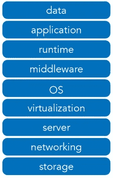
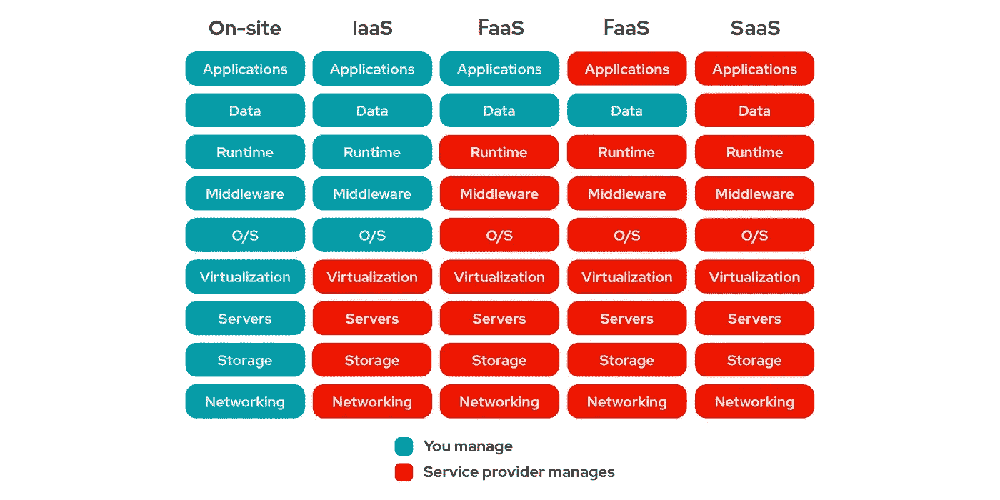

# 什么是云 IAAS、PAAS、SAAS、FAAS，我们为什么使用它们

> 原文：<https://pub.towardsai.net/what-are-cloud-iaas-paas-saas-faas-and-why-we-use-them-8af979dad141?source=collection_archive---------2----------------------->

## [云计算](https://towardsai.net/p/category/cloud-computing)

## 对服务模型的解释，以及为什么它们是以这种方式构建的

[**点击这里了解我，我的项目，我的最新文章。**](http://www.michelangiolo.best/)

您第一次接触云可能会非常困惑。云是巨大的，市场上不只有一种云，而是有许多可行的选择。迟早，如果你决定成为一名程序员，你将需要开始学习如何在一个云中工作，或者，如果你运气不好，根据你的客户的要求，在许多不同的云中工作。

在这篇文章中，甚至在解释什么是四种主要的服务模型(IAAS、PAAS、FAAS、SAAS)之前，我将首先从低分辨率的角度解释什么是云，它是如何构造的，以及它为什么以这种方式构造；只有这样，我才能最终以一种你能容易理解的方式解释什么是**服务模型**。然而，如果你渴望了解它们，你可以滚动到文章的末尾。

# 云

不仅仅是数据科学家，云是每个程序员课程中必不可少的工具。预计每次面试都会被问到至少一种云及其工具的使用体验。云是属于一家公司(通常是一家科技巨头)的市场，在这里你可以使用无数的服务来完成你需要的几乎每一项编程任务。虽然你的第一年订阅可能是免费的(取决于你选择的云)，但你需要在到期后支付每月订阅。最大的云是:

云的美丽抽象:[来源](https://www.google.com/url?sa=i&url=https%3A%2F%2Fmedium.com%2Fmeet-lima%2Fwhats-the-cloud-what-s-a-private-cloud-7fcdd8b535d1&psig=AOvVaw2YG6d8HEsklHEzvheS5khD&ust=1618843352715000&source=images&cd=vfe&ved=0CAMQjB1qFwoTCJDElsqDiPACFQAAAAAdAAAAABAV)

*   AWS _ 亚马逊网络服务
*   GCP _ 谷歌云平台
*   甲骨文云
*   Azure 云(微软)
*   IBM 云
*   阿里云

## 即现即付制度

使用云的好处在于，根据应用程序的大小，你可以以每月几美分甚至几百万美元的价格租用服务。通俗地说，这意味着你可以将它用于非常小的应用程序(甚至托管个人投资组合网站)，甚至与你的公司一起管理巨型社交媒体。

您需要使用云的原因是，作为个人，您负担不起购买基础架构来执行任务所需的所有服务。例如，创建网站时，您需要有人为您托管网站。你不能指望你的基础设施总是连接到互联网，有自己的安全系统、协议、DNS…这就是为什么你使用网络托管服务，如 WordPress、Wix、Heroku、AZ App Service (Azure Cloud)。

当公司变得非常大并且能够负担得起时，他们不再租用所有这些服务，而是决定自己建设基础设施。但这需要数百万美元的投资和一个或多个专家团队来使其运行。然而，从长远来看，这为公司节省了大量资金。

## 云服务

云确实有各种各样的服务。如果你想训练一个人工智能，你需要可以租用的计算能力。如前所述，您可以托管您的 web 应用程序，进行财务分析，使用预制工具进行分析甚至绘图…这就是为什么任何会编码的人都对云感兴趣。每一家拥有云的受人尊敬的公司都会提供自己的认证，程序员可以通过这些认证来提升自己的职业生涯。

## 服务类别

这就是事情变得有趣的地方。因为它的规模，**我们有多种方法来组织云**。这意味着有几种方法可以将他们的服务分成不同的类别，从而对云是如何组织的有一个高层次的概念。

将云中所有可用的服务组织成类别的标准模型如下:

9 个标准服务类别

这 9 个类别根据基础设施级别对服务进行分组。这是组织云的最简单方式，因为您通常会基于基础设施级别选择服务(如果您正在构建相当大规模的东西)。

## 不同的群体

但是，请注意，我们还有其他几种方式来组织云。掌握这个概念非常重要，因为上面的方案只是代表了可能的组织方案之一。我们可以决定根据任务对服务进行分组:物联网服务、机器学习服务、市场……我们也可以决定根据成本、年龄……我们决定选择的任何指标。

# 服务模式

现在您已经知道了什么是服务类别，我可以向您解释什么是服务模型。因为每个云本质上都遵循相同的结构(根据基础设施级别对其服务进行分组)，所以他们有一种标准化的方式来提出模型。一个**服务模型**表示您决定租用的基础架构级别的数量，以及您决定管理的级别。有 4 种服务模式:

云服务模型的结构差异

## (现场)

这不是一个服务模型(写在这里是为了让你清楚地理解什么是服务模型)。本质上，您决定不租赁任何基础架构，因为您的公司控制了所有基础架构，并且不需要云。

## IAAS _ 基础设施即服务

对于 IAAS，您只需决定租用前 4 类服务。所有执行计算、存储、服务器的机器(高成本)。云本身是一种 IAAS，是一种你可以租用的整体服务。

## PAAS _ 平台即服务

有了 PAAS，你决定租更多。因为你只需要提供数据和应用程序，你就可以构建你自己的软件并在网络上发布，让数百万人都可以使用它。PAAS 是你可以租用来托管你的网络应用的平台。

## FAAS _ 功能即服务

有了 FAAS，你可以运行一个无服务器的应用程序。你的网站后端不需要一个 24/7 的服务器，后端是用功能运行的，独立的代码片段作为后端。尤其是在你小的时候，这个选择会让你省下一大笔钱。

## SAAS _ 软件即服务

有了 SAAS，您就可以使用在线提供的预制工具。你不仅要租用基础设施，还要租用预制的应用程序:分析和图形服务就是很好的例子。