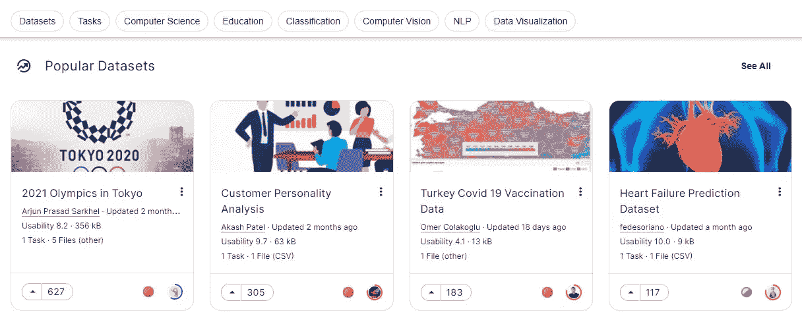
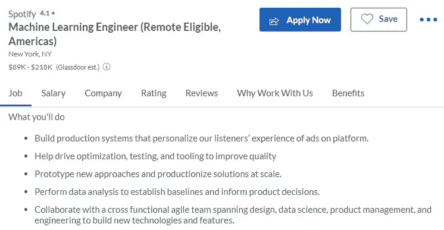

# 对机器学习有哪些常见的误解？

> 原文：<https://pub.towardsai.net/what-are-the-common-misconceptions-about-machine-learning-2f43bfd40002?source=collection_archive---------2----------------------->

## [观点](https://towardsai.net/p/category/opinion)，[职业](https://towardsai.net/p/category/careers)

## 学习一项新技能并最终作为机器学习工程师在一家公司工作的基本现实。

照片由[哈维尔·阿莱格·巴罗斯](https://unsplash.com/@soymeraki?utm_source=medium&utm_medium=referral)在 [Unsplash](https://unsplash.com?utm_source=medium&utm_medium=referral) 拍摄

# 介绍

有一个关于机器学习的炒作列车正在进行，大多数初学者都是这种炒作的受害者，因为他们进入的原因是错误的。你的教授将解释如果你想在机器学习方面变得更好，或者你的同龄人正在告诉你如何获得更好的 GPU 和 IDE(集成开发环境)将帮助你获得更好的结果，那么获得博士学位是多么必要。当你开始学习在线课程时，你意识到你需要更大的数据集和 Python 方面的专业知识。在学习了求职所需的技能后，你意识到你需要的不仅仅是一些课程或证书。最后，在得到这份工作后，你意识到这是一份要求很高的工作，有时这些工作在最初阶段的报酬并不高。

这篇文章将帮助你度过那些失望，让你准备好面对这些问题。我们将会学到很多关于进入机器学习领域的初学者所面临的现实问题。

> 有明确的经验证据表明，你不需要大量的**数学**，不需要大量的**数据**，也不需要大量的**昂贵的计算机**。— [杰瑞米·霍华德](https://www.linkedin.com/in/howardjeremy/) ( [程序员实用深度学习](https://course.fast.ai/))

# 学编码？

是的，如果你要进入 ML 领域，尤其是深度学习，编码是必要的。这并不意味着你先花时间学习 Python、C++或 R，然后再开始学习 ML。当你在学习基础知识时，编码部分会自然而然地出现。你不需要记住语法或模型架构，你可以从一个简单的谷歌搜索中搜索它们，就这么简单。世界正在走向无代码机器学习和 [AutoML](https://docs.microsoft.com/en-us/azure/machine-learning/concept-automated-ml) 。AutoML 是一个强大的工具，它将为您执行所有任务，并为您提供一个有效的机器学习模型。有时候你只需要写两行代码而不是两百行代码就可以得到类似的结果。

# ML 需要数学还是博士？

是的，你需要一些数学，但为了从事研究和拓展深度学习的边界。如果你打算训练你的模型并把它们部署到生产中，那么你可能需要学习 MLOPs 而不是数学。

> 应用机器学习不需要数学，但是任何研究和拓展边界都需要学习高级统计学。— [雅各布·伊特恩](https://www.linkedin.com/in/zitny/)

你还需要学习模型架构是如何工作的，以及各种矩阵函数。这些可以在 8 小时的课程中考虑，有时你甚至不需要学习所有模型的架构来解决问题。我是 Jeremy 的超级粉丝，在他的书《Fastai 和 PyTorch 的程序员深度学习》中，他解释了在深度学习领域有很多守门人。学术机构会要求你学习高等微积分，学习所有的数学模型，并最终获得特定领域的博士学位，以使其成为现实。但是你不需要这些。我见过很多没有学位，有商业背景的人，现在都是该领域的专家。所以，请专注于基本面，学习整个课程，并通过从事任何投资组合项目来开始成长。

# 需要庞大的数据集吗？

是的，但只是在少数情况下。现代深度学习模型现在能够在有限数量的样本下产生高精度。随着 Kaggle 这样的平台的引入，甚至获取数据集也变得更加容易，ka ggle 有数千个开源数据集可供下载和用于商业目的。我们还可以在 [GitHub](https://github.com/jbrownlee/Datasets) 、 [DAGsHub](https://dagshub.com/explore/datasets) 、 [HuggingFace](https://huggingface.co/datasets) 、 [Knoema](https://knoema.com/atlas/sources) 和 [Google Dataset Search](https://datasetsearch.research.google.com/) 上找到数据集来训练我们的模型，并最终将其用于生产。

[图片来自 Kaggle](https://www.kaggle.com/datasets)

# 需要学位或者认证吗？

一些工作需要机器学习学位或 TensorFlow 证书，但如果你在 GitHub 和 Kaggle 上有很强的投资组合，这些事情就变得次要了。许多开发人员正在向机器学习过渡，他们没有专门的学位或证书可以展示，但他们确实有处理深度学习模型并将其部署到生产中的经验。如果你能以某种方式向雇主证明你可以完成机器学习生命周期中的每一项任务，那么你就是完美的候选人。总的来说，如果你有一个强大的机器学习组合，那么获得证书或学位应该不是你的想法。要获得强大的 ML 组合，请阅读:[如何作为初学者构建强大的数据科学组合— KDnuggets](https://www.kdnuggets.com/2021/10/strong-data-science-portfolio-as-beginner.html)

[谷歌云上 TensorFlow 的机器学习| Coursera](https://www.coursera.org/specializations/machine-learning-tensorflow-gcp?ranMID=40328&ranEAID=jU79Zysihs4&ranSiteID=jU79Zysihs4-1DFWDxcnbqCtsY4mCUi.jw&siteID=jU79Zysihs4-1DFWDxcnbqCtsY4mCUi.jw&utm_content=10&utm_medium=partners&utm_source=linkshare&utm_campaign=jU79Zysihs4)

# 需要昂贵的计算还是 IDE？

不，我有一台旧笔记本电脑，我可以在 Kaggle 平台的帮助下，在云 GPU 和 TPU 上训练这些庞大的模型。世界正从个人电脑转向云电脑。你可以从 Kaggle 和 [Google Colab](https://colab.research.google.com/) 获得免费的 CPU、GPU 和 TPU。还有其他平台也可以帮助你进行数据分析和创建完整的项目，如 [Deepnote](https://deepnote.com/) 、 [JetBrains Datalore](https://datalore.jetbrains.com/notebooks) 和 [Paperspace](https://console.paperspace.com/) 。这些平台为您提供了一个免费的工作空间，通过添加协作工具来构建您的机器学习产品。在我的日常工作中，我使用 Deepnote 进行新的研究或项目，如果我需要更好的 GPU 或 TPU，我会切换到 Kaggle 或 [Colab](https://colab.research.google.com/) 。

*你不需要购买昂贵的 IDE 或计算来构建你的产品，现在你有了这些免费的云工具。*

[2021 年数据科学五大免费云 IDEs 作者 Abid Ali Awan | toward AI](/top-5-free-cloud-ide-for-data-science-2021-9c129745590b)

# 就业市场的基本事实

获得所需技能后，你开始在市场上找工作，但很快你就会意识到公司想要更多。他们希望你了解数据工程、数据分析和 MLOPs。在面试阶段，他们会问你最近的项目以及你在部署模型方面的工作经验。

[机器学习工作| Glassdoor](https://www.glassdoor.com/Job/machine-learning-jobs-SRCH_KO0,16.htm)

即使学习了关键的技能，你也会感到非常失望。这是因为大多数公司都在寻找有经验的个人或拥有多种技能的人。你能提高机会的唯一方法就是不断学习一项新技能，不断参加机器学习竞赛。这也会提高你的 ML 作品集，最终让你脱颖而出。如果你刚开始工作，很难找到工作，继续努力，最终你会得到你梦想的工作。

# ML 工程师的生活

正如我上面提到的，它需要擅长各种技能:显然，一个好的机器学习工程师需要的一切，如好奇心、分析技能、算法知识、理解业务需求的能力以及有效沟通的需要。除此之外，你还需要擅长构建需要机器学习操作经验的软件解决方案。[机器学习工程师的一天|作者 Shanif Dhanani](https://medium.com/@shanif/a-day-in-the-life-of-a-machine-learning-engineer-fa73c18ef705)

除此之外，有时您必须执行迭代任务，如标注数据集。你可能不会得到一份高薪的工作，但你最终会得到一份需要你全部时间和精力的工作。如果你进入这个领域只是因为它提供了一份高薪工作，那么你应该开始考虑其他选择。你在职业生涯中取得成功的唯一途径是对人工智能技术有一份死忠的爱。

# 结论

最后，我会一直建议你不断学习新技能，开始参加 Kaggle 比赛。对于你的职业生涯，继续寻找新的工作，准备你的技术面试。我只是想向你们展示这个领域的现实，它并不美好，也不是每个人都能通过。只有通过努力工作和学习的心态，你才能获得一份高薪的舒适工作。

我们还讨论了机器学习如何不需要大量的数学、专业学位或博士学位。它不需要大量的计算能力或庞大的数据集。它只需要你的时间和努力。你可以在网上找到很棒的课程，在学习了一些技能后，开始将这些技能应用到你的作品集项目中。

# 关于作者

[阿比德·阿里·阿万](https://www.polywork.com/kingabzpro) ( [@1abidaliawan](https://twitter.com/1abidaliawan) )是一名认证数据科学家专业人士，热爱构建机器学习模型和研究最新的人工智能技术。目前，在 PEC-PITC 测试人工智能产品，他们的工作后来获得批准进行人体试验，如乳腺癌分类器。他的愿景是建立一个人工智能产品，该产品将识别患有精神疾病的学生。

> 最初的博客发表在 KDnuggets