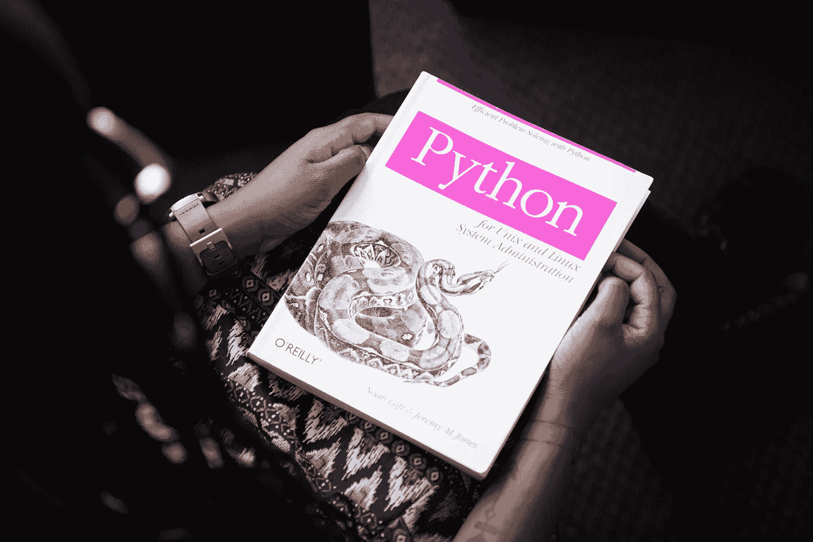
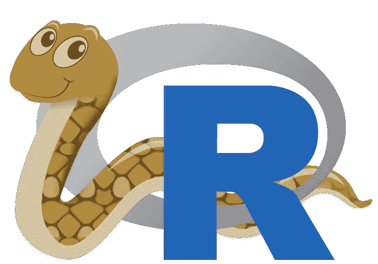

# 你喜欢什么？Python 还是 R？为什么不两者都要？

> 原文：<https://pub.towardsai.net/what-do-you-prefer-python-or-r-why-not-both-13115de402b4?source=collection_archive---------5----------------------->

## [编程](https://towardsai.net/p/category/programming)

D ata 随处可见。我们每天生成的数据量是巨大的。根据福布斯的一份报告，我们每天产生 2.5 万亿字节的数据。这背后的主要原因是，每天有超过 37 亿人在使用互联网。因此，数据科学&机器学习被认为是本世纪最先进和最受欢迎的两项技术。

这种对数据科学家和机器学习工程师不断增长的需求，迫使每个人都要学习这些技术所需的编程语言。无论是推荐网飞电影、垃圾邮件过滤、关键商业决策，还是天气预报。所有这些情况都涉及计算机科学、统计学、算法和系统的多学科领域，以便从数据中提取有意义的见解。因此，我们需要能够轻松满足数据科学和机器学习所有这些需求的编程语言。

尽管有许多编程语言来实现给定的目的，Python 和 R 一直被用作数据科学和机器学习操作的首选工具。这篇博客文章介绍了如何使用这两种语言在数据科学和机器学习领域取得成功。此外，我们将查看一些最广泛使用的库来执行数据科学和机器学习任务。为了在数据科学和机器学习领域取得成功，这些语言是你想要学习的。

由[大卫·普帕扎](https://unsplash.com/@willy420?utm_source=unsplash&utm_medium=referral&utm_content=creditCopyText)在 [Unsplash](https://unsplash.com/s/photos/data-science?utm_source=unsplash&utm_medium=referral&utm_content=creditCopyText) 上拍摄的照片

## 这是我们将在本文中涉及的主题列表—

1.  数据科学和机器学习导论
2.  为什么 Python 和 R 对于学习数据科学和机器学习必不可少？
3.  用于数据科学和机器学习的 Python 库
4.  r 数据科学和机器学习库

照片由[克里斯蒂娜@ wocintechchat.com](https://unsplash.com/@wocintechchat?utm_source=unsplash&utm_medium=referral&utm_content=creditCopyText)在 [Unsplash](https://unsplash.com/s/photos/machine-learning?utm_source=unsplash&utm_medium=referral&utm_content=creditCopyText) 上拍摄

## *数据科学和机器学习简介*

当我刚开始研究数据科学和机器学习时，我想到的第一个问题是，为什么围绕机器学习和数据科学有这么多炒作？

在研究和浏览了互联网上的大量文章后，我意识到这与网民每天产生的数据量有很大关系。数据是驱动机器学习模型所需的燃料，因为我们生活在这个大数据时代，所以数据科学为什么是 21 世纪最热门的[工作](https://hbr.org/2012/10/data-scientist-the-sexiest-job-of-the-21st-century)是显而易见的！

我会说，数据科学和机器学习是两项最重要的技能，而不仅仅是技术。需要这些技能来从大量数据中提取有意义的见解，以获得竞争优势。

> 数据科学是一个涉及从大量数据中提取有意义的信息以解决现实世界挑战的领域。机器学习是计算机科学的一个分支，它赋予机器在没有明确编程的情况下进行学习的能力。

# 为什么 Python 和 R 对于学习数据科学和机器学习必不可少？

## **巨蟒** —

作为初学者，你知道你学习数据科学和 ML 的旅程是从你需要学习的编程语言开始的。在所有可用的语言中，Python 是数据科学家的首选。Python 是全世界大多数程序员使用的最流行的编程语言。那么是什么让 Python 如此受欢迎呢？让我们首先理解为什么 Python 是大多数数据科学家和机器学习工程师的首选。

Python 是一种通用编程语言，这意味着它可以用于 web 和桌面应用程序的开发。它在各种数字和科学应用程序的开发中也很有用。有了这种多功能性，Python 成为世界上发展最快、使用最广泛的编程语言就不足为奇了。

此外，Python 易于学习，并且使用简单的语法。它是作为数据科学家或 MLE 开始您的旅程的最容易的语言之一。与其他语言相比，有多种因素赋予 Python 这种灵活性，例如

1.  Python 是开源的，可以在所有操作系统上免费使用
2.  它需要更少的代码
3.  Python 是生产率最高的语言
4.  使用 Python 可以做的事情是无限的
5.  它有一个庞大的社区
6.  Python 可以很容易地在 Windows、Linux、Unix、macOS 等多个独立的操作系统上运行。

Python 有数百个内置的库和框架，可以成功开发、测试、训练和实现各种复杂的机器学习和深度学习算法。所以，如果你想训练一个数据集，你可以用一个简单的命令来安装它们，这样可以节省很多时间。这些库主要专注于机器学习、大数据和数据科学。一些例子是*熊猫*、 *NumPy* 、 *Matplotlib* 、 *Seaborn* 、 *SciPy* 、 *Keras* 、 *TensorFlow* 、 *PyTorch* 等等。

选择 Python 的另一个原因是它有一个庞大而活跃的社区。它有多个群，论坛，如 [StackOverflow](https://stackoverflow.com/) 、 [Slack](https://slack.com/intl/en-in/) 和 [Kaggle](https://www.kaggle.com/) 如果你有任何问题。如果你在旅途中被困在任何地方，你都可以在这些平台上寻求帮助。

现在你知道了为什么 Python 是数据科学和机器学习最流行的语言，让我们看看 R 编程语言。

照片由 [Hitesh Choudhary](https://unsplash.com/@hiteshchoudhary?utm_source=unsplash&utm_medium=referral&utm_content=creditCopyText) 在 [Unsplash](https://unsplash.com/s/photos/machine-learning?utm_source=unsplash&utm_medium=referral&utm_content=creditCopyText) 上拍摄

## r–

我们都知道，数据的指数级增长导致全球对熟练数据科学家的需求呈指数级增长。所以，那些对学习数据科学和 ML 感兴趣的人可能会对学习 R 编程语言感兴趣。r 是数据科学和 ML 最重要的工具之一。它是一种非常流行的编程语言，是许多统计学家和数据科学家的首选。但是是什么让 R 这么受欢迎，要求这么高呢？为什么以及如何使用 R 进行数据科学？

## **让我们来看看 R 编程语言的一些显著特征—**

1.  R 编程语言是由 Ross Ihaka 和 Robert Gentleman 于 1995 年在新西兰的奥克兰大学开发的，其中“R”这个名字来源于他们名字的第一个字母。
2.  r 是免费的开源软件。它的开放接口允许用户与其他应用程序和系统集成。
3.  作为一种编程语言，R 是面向对象的，它有各种各样的操作符和函数，允许用户探索和可视化数据。
4.  r 用于收集、存储、清理、分析和可视化数据。它还可以用于数据分析和统计计算。
5.  r 具有各种图形和统计能力。它可用于分类、聚类以及线性和非线性建模。
6.  r 在其 [CRAN](https://cran.r-project.org/) 仓库中收集了超过 10，000 个软件包。
7.  和 Python 一样，R 也有一个很大的社区。它有多个小组，论坛，如堆栈溢出，松弛，和 Kaggle，如果你有任何问题。如果你在旅途中被困在任何地方，你都可以在这些平台上寻求帮助。

r 主要关注它的统计和图形用途。当您学习数据科学的 R 时，您将学习如何使用该语言来执行统计分析和开发令人惊叹的数据可视化。r 的统计功能也让用户可以轻松地清理、导入和分析数据。

r 配备了一个[集成开发环境(IDE)](https://rstudio.com/) 。根据 [GitHub](https://github.com/) 的说法，拥有一个 IDE 可以更容易地编写和使用软件包。[*R studio*](https://rstudio.com/)*是一个简单而独特的 IDE，它提高了图形的可访问性，并包括一个语法高亮编辑器，有助于代码执行。当您开始学习数据科学的 R 时，这可能会派上用场。*

**

*[图像来源](https://blog.rstudio.com/2019/12/17/r-vs-python-what-s-the-best-for-language-for-data-science/)*

## ***那么，Python 和 R 的主要区别是什么？***

*正如我们所知，Python 和 R 都有大型的软件生态系统和充满活力的社区，因此这两种语言都适合几乎任何数据科学和机器学习任务。但是，有时一种语言比另一种语言更合适或更有力。*

# ***Python 优于 R 的地方—***

*Python 经常因其易于理解的语法而被誉为通用语言。大多数机器学习和深度学习算法都是用 Python 开发的，使用的工具有 *TensorFlow* 、 *Keras* 和 *PyTorch* 。互联网上有多种资源可以学习如何做到这一点。Python 在将 ML 模型和算法部署到其他软件方面比 R 有优势。它是机器学习工作流的主要语言。*

# ***其中 R 优于 Python—***

*r 是一种编程语言，它提供了一个 [IDE](https://rstudio.com/) 来收集、存储、操作、分析和可视化数据。它是许多想要设计复杂统计模型来解决复杂问题的统计学家的首要选择。许多统计计算都是在 R 中完成的，因此有各种各样的模型可供选择。如果您想知道如何以最佳方式对数据建模，R 是更好的选择。*

*与 Python 相比，R 的另一个优势是它能够使用 R Shiny 创建 web 应用程序。这有助于人们在没有多少技术经验的情况下开发 web 应用程序。Python 确实有 Dash 作为替代，但这仍是一项正在进行的工作。*

*上面的列表永无止境，人们无休止地争论哪些任务用哪种语言比用另一种语言更好。此外，Python 程序员和 R 程序员总是倾向于互相借鉴一些好的想法。比如 Python 的 *plotnine* 数据可视化包的灵感来源于 R 的 *ggplot2* 包，R 的 *rvest* 网页抓取包的灵感来源于 Python 的 *BeautifulSoup* 包。*

*此外，Python 和 R 之间有很好的语言互操作性。这意味着，您可以使用 *reticulate* 从 R 运行您的 Python 代码，使用 *rpy2* 包从 Python 运行您的 R 代码。这意味着一种语言中的所有特性都可以从另一种语言中访问。即深度学习包 *Keras* 的 R 版本其实用的是 Python。同样， *rTorch* 使用 *PyTorch* 。*

**

*蒂姆·莫斯霍尔德在 [Unsplash](https://unsplash.com/s/photos/education?utm_source=unsplash&utm_medium=referral&utm_content=creditCopyText) 上拍摄的照片*

## *一些用于数据科学和机器学习的著名 Python 库——*

1.  *熊猫(见[文档](https://pandas.pydata.org/docs/)*
2.  *NumPy(参见[文档](https://numpy.org/doc/stable/)*
3.  *SciPy(参见[文档](https://www.scipy.org/docs.html)*
4.  *Matplotlib(参见[文档](https://matplotlib.org/stable/contents.html))*
5.  *Seaborn(参见[文档](https://seaborn.pydata.org/))*
6.  *Scikit 学习(参见[文档](https://scikit-learn.org/stable/user_guide.html)*
7.  *Statsmodels(参见[文档](https://www.statsmodels.org/v0.10.2/)*

## ***用于数据科学和机器学习的著名 R 库—***

1.  *Dplyr(参见[文档](https://www.rdocumentation.org/packages/dplyr/versions/0.7.8))*
2.  *Ggplot2(参见[文档](https://ggplot2.tidyverse.org/))*
3.  *Tidyverse(参见[文档](https://www.tidyverse.org/))*
4.  *润滑(见[文件](https://www.rdocumentation.org/packages/lubridate/versions/1.7.10)*
5.  *闪亮(参见[文档](https://docs.rstudio.com/resources/shiny/)*
6.  *编织器(参见[文档](https://www.rdocumentation.org/packages/knitr/versions/1.31)*
7.  *Rvest(参见[文档](https://www.rdocumentation.org/packages/rvest/versions/0.3.6))*
8.  *数据表(见[文件](https://rstudio.github.io/DT/)*
9.  *插入符号(参见[文档](https://www.rdocumentation.org/packages/caret/versions/6.0-86)*
10.  *r 降价(参见[文档](https://rmarkdown.rstudio.com/)*
11.  *RMySQL(参见[文档](https://www.rdocumentation.org/packages/RMySQL/versions/0.10.13))*
12.  *RSQLite(参见[文档](https://www.rdocumentation.org/packages/RSQLite/versions/2.2.3)*

## ***结论—***

*总结一下，R 和 Python 都是免费的开源编程语言，已经被全世界的程序员和软件开发人员所使用。虽然可能很难知道在数据科学和机器学习中是使用 Python 还是 R，但我们可以说两者都是很好的选择。一种语言并不比另一种更好——这完全取决于用户的观点和他或她的需求。这些语言有时由不同的个人和企业根据他们的需求来使用。*

*就 R 和 Python IDEs 而言，R 的 IDE 是数据操作、绘图和统计计算的理想选择。一些 Python 应用包括 web 开发、数值计算和软件开发。此外，尽管 R 有许多包，Python 有许多专门用于机器学习的库。*

*哪种语言更好并不重要，精通两种语言在数据科学和 ML 中都非常有用。事实上，RStudio 注意到，世界上许多数据科学团队都是“*双语*”，同时使用 R 和 Python。*

**感谢阅读！**